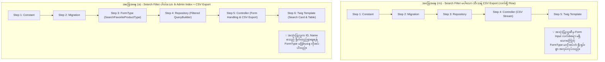
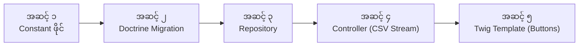

# EC-CUBE 4.3.1 - CSV Creation, Architecture & Migration Deep-Dive Guide
## (CSV စနစ် တည်ဆောက်ခြင်း၊ Architecture မေးခွန်းများ၏ အဖြေ၊ Migration ဖိုင် ဖန်တီးပုံနှင့် တစ်ကြောင်းချင်း အသေးစိတ် ရှင်းလင်းချက် လက်စွဲ)

---

## ၁။ အမေးများသော နည်းပညာ မေးခွန်းများနှင့် အဖြေများ (Core Architectural Q&A)

---

### မေးခွန်း (၁) - Repository File မှ Data ရယူခြင်းသည် အမှားလော?
#### (Is getting data from the repository file a mistake?)

> **တိုတိုနှင့် လိုရင်း အဖြေ:**  
> **လုံးဝ (လုံးဝ) အမှားမဟုတ်ပါ။** ၎င်းသည် Symfony နှင့် EC-CUBE ၏ အကောင်းဆုံး စံနှုန်းဖြစ်သော **Repository Design Pattern (Separation of Concerns)** ဖြစ်ပါသည်။

#### အဘယ်ကြောင့် Repository ကို သုံးရသနည်း?
1. **တာဝန်ခွဲဝေမှု (Separation of Responsibilities):**
   * **Controller ၏ တာဝန်:** User ဆီမှ HTTP Request ကို လက်ခံခြင်း၊ Response (HTML/CSV) ပြန်ပို့ခြင်းကိုသာ အဓိက လုပ်ဆောင်ရပါမည်။ Controller ထဲတွင် ရှုပ်ထွေးသော Database SQL / DQL Query များကို မရေးရပါ။
   * **Repository ၏ တာဝန်:** Database မှ Data ဆွဲထုတ်ခြင်း၊ QueryBuilder တည်ဆောက်ခြင်း၊ JOINs နှင့် Aggregations (COUNT, GROUP BY) များကို သီးသန့် တာဝန်ယူရပါမည်။

2. **`CsvExportService` နှင့် ချိတ်ဆက်ရာတွင် အလွန်အရေးကြီးသော အချက်:**
   * အကယ်၍ သင်သည် Repository ထဲတွင် `$qb->getQuery()->getResult()` ဟုရေးပြီး Product Entity Object ထောင်ပေါင်းများစွာကို Array အနေဖြင့် Controller ဆီသို့ return ပေးလိုက်ပါက **PHP Memory Exhausted (Memory ပြည့်ပြီး Server Crash ဖြစ်သည့် Error)** တက်သွားပါမည်။
   * ထို့ကြောင့် Repository သည် Array ဒေတာကို မပေးဘဲ **`QueryBuilder ($qb)` ကိုသာ return ပေးရပါသည်**။
   * Controller က ထို `$qb` ကို `CsvExportService::setExportQueryBuilder($qb)` ထဲသို့ ထည့်ပေးလိုက်သောအခါ `CsvExportService` သည်:
     * ဒေတာ အခု (၁၀၀) စီ ခွဲယူခြင်း (Chunking/Pagination)
     * တစ်သုတ်ပြီးတိုင်း Doctrine Cache ကို ရှင်းလင်းပေးခြင်း (`$em->clear()`)
     တို့ကို နောက်ကွယ်မှ အလိုအလျောက် ပြုလုပ်ပေးသဖြင့် Record သောင်းချီရှိသော်လည်း Memory အနည်းငယ်သာ သုံးစွဲပြီး လျင်မြန်စွာ Download ဆွဲနိုင်ခြင်း ဖြစ်ပါသည်။

---

### မေးခွန်း (၂) - Form မှ Data ယူခြင်း နှင့် Repository မှ Data ယူခြင်း ခြားနားချက် (Old Code vs New Code)
#### (SearchForm vs Repository: Why did the old code use SearchForm?)

ယခင် Old Code တွင် တွေ့ခဲ့ရသော အောက်ပါ code သည် **Database မှ Data ဆွဲထုတ်ခြင်း မဟုတ်ပါ**:

```php
// ၁။ Search Form တည်ဆောက်ခြင်း
$searchForm = $this->createForm(SearchFavoriteProductType::class);
$searchData = [];
```

#### သဘောတရား အမှန်ကို နားလည်စေရန် ရှင်းလင်းချက်:

| Component | အဓိက တာဝန် (Role) | ရှင်းလင်းချက် |
| :--- | :--- | :--- |
| **`SearchForm`** | **User Input (လက်ခံခြင်း)** | Database ကို လုံးဝ မထိပါ။ User က UI တွင် ရိုက်ထည့်လိုက်သော စာသားများ (ဥပမာ- Product ID `10`၊ နာမည် `T-shirt`) ကို Form အနေဖြင့် parse လုပ်ပြီး PHP Array `$searchData` အဖြစ် ပြောင်းပေးရုံသာ ဖြစ်သည်။ |
| **`Repository`** | **Database Query (ဒေတာဆွဲခြင်း)** | `$searchData` ထဲမှ တန်ဖိုးများကို ယူ၍ Database သို့ တကယ့် SQL/DQL query မေးပြီး Product များကို ရှာဖွေဆွဲထုတ်ပေးသော နေရာ ဖြစ်သည်။ |

* **EC-CUBE Core စံနှုန်း:** EC-CUBE ၏ Product List (`ProductController`) သို့မဟုတ် Order List (`OrderController`) တွင် Admin က Filter ဖြင့် ရှာနိုင်စေရန် `$searchForm` ကို အသုံးပြုလေ့ရှိပါသည်။
* **ယခု Code တွင် ဖြုတ်လိုက်ရသည့် အကြောင်းရင်း:** ကျွန်ုပ်တို့ Feature တွင် Search Box မလိုအပ်ဘဲ Favorite Products အားလုံးကို တိုက်ရိုက်ပြသပြီး CSV ထုတ်ယူရန်သာ လိုအပ်သောကြောင့် `$searchForm` မလိုတော့ဘဲ **Repository မှ `getFavouriteDb()` ကို တိုက်ရိုက်ခေါ်ယူလိုက်ခြင်း** ဖြစ်ပါသည်။

---

### မေးခွန်း (၃) - Session ကို ဘာကြောင့် သုံးရသလဲ? `$page_no = $this->session->get(..., 1);` ရှင်းလင်းချက်
#### (Why use session for page_no?)

```php
$page_no = $this->session->get('eccube.admin.product.favourite.page_no', 1);
```

#### ကုဒ်၏ အဓိပ္ပာယ်:
* **`session->get(key, default)`:** Session ထဲတွင် `'eccube.admin.product.favourite.page_no'` ဟူသော key ဖြင့် သိမ်းထားသော စာမျက်နှာနံပါတ်ကို ဆွဲယူသည်။
* **`1` (ဒုတိယ parameter):** အကယ်၍ Session ထဲတွင် ဘာမှ မရှိသေးပါက (ပထမဆုံးအကြိမ် ဝင်လာခြင်းဖြစ်ပါက) Default အနေဖြင့် **Page 1** ဟု သတ်မှတ်ပေးသည်။

#### Session သုံးရသည့် UX အကြောင်းရင်း (အလွန်အရေးကြီးပါသည်):
1. Admin သည် Favourite Products စာရင်း၏ **Page 5 (စာမျက်နှာ ၅)** သို့ ရောက်ရှိနေသည် ဆိုပါစို့။
2. Admin က ထိုစာမျက်နှာ ၅ ရှိ ကုန်ပစ္စည်းတစ်ခု၏ အသေးစိတ်ကို ပြင်ဆင်ရန် Edit Link ကို နှိပ်ပြီး Product Edit စာမျက်နှာသို့ သွားရောက်ပြင်ဆင်လိုက်သည်။
3. ပြင်ဆင်ပြီးနောက် Admin သည် Favourite List စာမျက်နှာသို့ **ပြန်လည် Back ဆုတ်လာသည့်အခါ**:
   * Session မသုံးထားပါက Page 1 သို့ ပြန်လည် ပြုတ်ကျသွားမည် ဖြစ်သဖြင့် User Experience အလွန်ဆိုးရွားစေပါသည်။
   * **Session သုံးထားပါက:** Controller သည် Session ထဲမှ `page_no = 5` ကို ပြန်လည်ဖတ်ယူပေးသဖြင့် Admin သည် မူလ ရောက်ရှိနေခဲ့သော **Page 5 သို့ အတိအကျ ပြန်လည် ရောက်ရှိနေမည်** ဖြစ်ပါသည်။

---

### မေးခွန်း (၄) - EC-CUBE တွင် အဘယ်ကြောင့် CSV Type Format ကို အသုံးပြုရသနည်း?
#### (Why do we get from CSV Type in this format in EC-CUBE?)

> **တိုတိုနှင့် လိုရင်း အဖြေ:**  
> EC-CUBE သည် CSV Columns များကို PHP Code ထဲတွင် Hardcode မရေးဘဲ **Admin UI မှ စိတ်ကြိုက် ပြင်ဆင်နိုင်စေရန် Database-Driven Architecture** ဖြင့် တည်ဆောက်ထားသောကြောင့် ဖြစ်ပါသည်။

#### EC-CUBE ၏ Standard CSV Types စာရင်း:
EC-CUBE Core (`Eccube\Entity\Master\CsvType`) တွင် အောက်ပါ ID များကို မူရင်းအတိုင်း သတ်မှတ်ထားပါသည်:
* **ID: 1** -> Product CSV (`CSV_TYPE_PRODUCT`)
* **ID: 2** -> Customer CSV (`CSV_TYPE_CUSTOMER`)
* **ID: 3** -> Order CSV (`CSV_TYPE_ORDER`)
* **ID: 4** -> Shipping CSV (`CSV_TYPE_SHIPPING`)
* **ID: 5** -> Category CSV (`CSV_TYPE_CATEGORY`)

ကျွန်ုပ်တို့သည် ဝယ်ယူသူ အကြိုက်ဆုံး ကုန်ပစ္စည်းများအတွက်:
* **ID: 20** -> Favourite Product CSV (`CustomCsvType::CSV_TYPE_FAVOURITE_PRODUCT = 20`)

#### ဤ Format ၏ အကျိုးကျေးဇူး:
Controller တွင် `$this->csvExportService->initCsvType(20);` ဟု ရေးလိုက်သည်နှင့် တစ်ပြိုင်နက်:
1. `CsvExportService` သည် Database ၏ `dtb_csv` table ထဲမှ `csv_type_id = 20` ဖြစ်ပြီး `enabled = 1` ဖြစ်သော columns များကိုသာ `sort_no` အစဉ်အတိုင်း အလိုအလျောက် query ဆွဲထုတ်ပေးသည်။
2. ဆိုင်ပိုင်ရှင် Admin သည် Code ပြင်စရာမလိုဘဲ Admin Panel ရှိ **設定 (Settings) -> 店舗設定 (Shop Settings) -> CSV設定 (CSV Settings)** (`/admin/setting/shop/csv/20`) မှနေ၍ ကော်လံအမည် ပြောင်းခြင်း၊ မလိုချင်သော ကော်လံကို မျက်စိမှိတ်ပိတ်ခြင်း၊ အစီအစဉ် နေရာရွှေ့ခြင်းတို့ကို ပြုလုပ်နိုင်သွားမည် ဖြစ်ပါသည်။

---

### မေးခွန်း (၅) - အဘယ်ကြောင့် Route (၂) ခု ခွဲခြား ရေးသားရသနည်း?
#### (Why does it create two routes for the Favourite Products List Page?)

Controller တွင် အောက်ပါအတိုင်း Route (၂) ခုကို တွေ့မြင်ရပါမည်:
```php
/**
 * @Route("/%eccube_admin_route%/product/favourite", name="admin_product_favourite", methods={"GET"})
 * @Route("/%eccube_admin_route%/product/favourite/page/{page_no}", requirements={"page_no" = "\d+"}, name="admin_product_favourite_page", methods={"GET"})
 */
```

#### အကြောင်းရင်း ရှင်းလင်းချက်:
1. **Route (၁) - `admin_product_favourite` (`/admin/product/favourite`):**
   * Sidebar Menu မှ စတင်နှိပ်လိုက်ချိန်တွင် ပထမဆုံး စာမျက်နှာ (Page 1) ကို ဖွင့်လှစ်ပေးသည့် Base URL ဖြစ်ပါသည်။ ဤ Route တွင် `page_no` ပါဝင်ခြင်း မရှိပါ။
2. **Route (၂) - `admin_product_favourite_page` (`/admin/product/favourite/page/{page_no}`):**
   * စာမျက်နှာ အောက်ခြေရှိ Pagination ခလုတ်များ (Page 2, Page 3, ...) ကို နှိပ်သည့်အခါ အသုံးပြုသည့် URL ဖြစ်ပါသည်။
   * `requirements={"page_no" = "\d+"}` သည် `page_no` နေရာတွင် ဂဏန်းသီးသန့် (0-9) သာ လက်ခံမည်ဟု ကန့်သတ်ထားခြင်း ဖြစ်ပါသည်။

> [!WARNING]
> **အကယ်၍ Route (၂) ကို မထည့်သွင်းပါက ဘာဖြစ်မည်နည်း?**  
> Twig Template ထဲရှိ Pagination Pager Component (`@admin/pager.twig`) သည် ဒုတိယ စာမျက်နှာသို့ သွားရန် Link ဆောက်သည့်အခါ `admin_product_favourite_page` route ကို အသုံးပြုပါသည်။ ထိုအခါ Route မရှိသဖြင့် **`404 Route Not Found` Error** တက်သွားမည် ဖြစ်ပါသည်။ ထို့ကြောင့် Route နှစ်ခု ခွဲရေးခြင်းသည် Symfony/EC-CUBE ၏ စံနည်းလမ်း ဖြစ်ပါသည်။

---

### မေးခွန်း (၆) - Search Filter နှင့် Customer Name Search များကို အဘယ်ကြောင့် ဖြုတ်ပယ်လိုက်သနည်း?
#### (Why were Search Filters removed?)

* မူလက Admin List Page များတွင် Search Filter ထည့်သွင်းလေ့ရှိသောကြောင့် ထည့်သွင်းထားခဲ့သော်လည်း User ၏ တိုက်ရိုက် လိုအပ်ချက်မှာ **"Search Filter မပါဘဲ Favorite Product List နှင့် CSV Export + CSV Setting သီးသန့်သာ လိုအပ်သည်"** ဟု ညွှန်ကြားထားသောကြောင့် ဖြစ်ပါသည်။
* ယခုအခါ ရှုပ်ထွေးသော Search Form (`SearchFavoriteProductType`)၊ Customer Name Search နှင့် Like filter များကို **လုံးဝ ဖယ်ရှား (Remove) သန့်စင်ပြီး ဖြစ်ပါသည်**။
* Controller, Repository နှင့် Twig UI တို့တွင် Favorite Products စာရင်းပြသခြင်း၊ Pagination နှင့် CSV Download/Settings ခလုတ်များသာ ပါဝင်သော **အလွန်ရိုးရှင်းပြီး သန့်ရှင်းသော Core Standard Code** အဖြစ် ပြင်ဆင်ပြီး ဖြစ်ပါသည်။

---

## ၂။ Doctrine Migration ဖိုင်ကို Command ဖြင့် မည်သို့ ဖန်တီးရမည်နည်း?
### (How to create migration file by command? Is Version<timestamp>.php automatic?)

> **ဟုတ်ကဲ့၊ ဖိုင်နာမည်ကို Command က ၁၀၀% အလိုအလျောက် ပေးခြင်း ဖြစ်ပါသည်။**

Terminal တွင် အောက်ပါ Symfony/Doctrine command ဖြင့် အလွယ်တကူ generate လုပ်နိုင်ပါသည်:

```bash
docker compose exec ec-cube php bin/console doctrine:migrations:generate
```

#### ဖိုင်အမည် ဖွဲ့စည်းပုံ သဘောတရား:
အထက်ပါ command ကို run လိုက်ပါက `app/DoctrineMigrations/` အောက်တွင် ဖိုင်အသစ်တစ်ခု အလိုအလျောက် ထွက်ပေါ်လာမည် ဖြစ်သည်:
* ဥပမာ ဖိုင်အမည် - **`Version20260917083632.php`**
* `Version` + **`2026`** (ခုနှစ်) + **`09`** (လ) + **`17`** (ရက်) + **`08`** (နာရီ) + **`36`** (မိနစ်) + **`32`** (စက္ကန့်)
* Doctrine သည် PHP ၏ `date('YmdHis')` function ဖြင့် လက်ရှိ အချိန်အတိုင်း အလိုအလျောက် နာမည်ပေးခြင်း ဖြစ်ပြီး၊ ဤ Timestamp ကို ကြည့်၍ မည်သည့် Migration ကို အရင် run ရမည်၊ မည်သည့် Migration ကို နောက်မှ run ရမည်ဟူသော အစဉ်အတိုင်း (Execution Order) ကို ဆုံးဖြတ်ပါသည်။

---

## ၃။ `Version20260917083632.php` ၏ အလုပ်လုပ်ပုံကို တစ်ကြောင်းချင်း အသေးစိတ် ရှင်းလင်းချက်
### (Line-by-Line Code Breakdown of Migration File)

```php
1:  <?php
2:  
3:  declare(strict_types=1);
4:  
5:  namespace DoctrineMigrations;
6:  
7:  use Customize\Constant\CustomCsvType;
8:  use Doctrine\DBAL\Schema\Schema;
9:  use Doctrine\Migrations\AbstractMigration;
10: 
11: final class Version20260917083632 extends AbstractMigration
12: {
13:     public function getDescription(): string
14:     {
15:         return 'Add Favorite Product CSV type (ID: 20) and default columns into mtb_csv_type and dtb_csv';
16:     }
17: 
18:     public function up(Schema $schema): void
19:     {
20:         $csvTypeId = CustomCsvType::CSV_TYPE_FAVOURITE_PRODUCT;
21: 
22:         // ၁။ mtb_csv_type တွင် Custom CSV Type (ID: 20) ထည့်သွင်းခြင်း
23:         if ($schema->hasTable('mtb_csv_type')) {
24:             $typeExists = (int) $this->connection->fetchOne(
25:                 "SELECT COUNT(*) FROM mtb_csv_type WHERE id = ?",
26:                 [$csvTypeId]
27:             );
28: 
29:             if ($typeExists === 0) {
30:                 $this->addSql(
31:                     "INSERT INTO mtb_csv_type (id, name, sort_no, discriminator_type) VALUES (?, 'お気に入り商品CSV', (SELECT COALESCE(MAX(t.sort_no), 0) + 1 FROM (SELECT sort_no FROM mtb_csv_type) AS t), 'csvtype')",
32:                     [$csvTypeId]
33:                 );
34:             }
35:         }
36: 
37:         // ၂။ dtb_csv တွင် Default Output Columns (၆) ခု ထည့်သွင်းခြင်း
38:         if ($schema->hasTable('dtb_csv')) {
39:             $csvColsExists = (int) $this->connection->fetchOne(
40:                 "SELECT COUNT(*) FROM dtb_csv WHERE csv_type_id = ?",
41:                 [$csvTypeId]
42:             );
43: 
44:             if ($csvColsExists === 0) {
45:                 $items = [
46:                     ['id',             '商品ID',         1],
47:                     ['name',           '商品名',         2],
48:                     ['price02_min',    '販売価格(下限)', 3],
49:                     ['price02_max',    '販売価格(上限)', 4],
50:                     ['Status',         '公開状態',       5],
51:                     ['favorite_count', 'お気に入り数',   6],
52:                 ];
53: 
54:                 foreach ($items as [$fieldName, $dispName, $sortNo]) {
55:                     $this->addSql(
56:                         "INSERT INTO dtb_csv (csv_type_id, entity_name, field_name, reference_field_name, disp_name, sort_no, enabled, create_date, update_date, discriminator_type) VALUES (?, 'Eccube\\\\Entity\\\\Product', ?, NULL, ?, ?, 1, CURRENT_TIMESTAMP, CURRENT_TIMESTAMP, 'csv')",
57:                         [$csvTypeId, $fieldName, $dispName, $sortNo]
58:                     );
59:                 }
60:             }
61:         }
62:     }
63: 
64:     public function down(Schema $schema): void
65:     {
66:         $csvTypeId = CustomCsvType::CSV_TYPE_FAVOURITE_PRODUCT;
67: 
68:         if ($schema->hasTable('dtb_csv')) {
69:             $this->addSql("DELETE FROM dtb_csv WHERE csv_type_id = ?", [$csvTypeId]);
70:         }
71: 
72:         if ($schema->hasTable('mtb_csv_type')) {
73:             $this->addSql("DELETE FROM mtb_csv_type WHERE id = ?", [$csvTypeId]);
74:         }
75:     }
76: }
```

---

### တစ်ကြောင်းချင်း ရှင်းလင်းချက် (Line-by-Line Explanation):

* **Line 3 (`declare(strict_types=1);`):** PHP တွင် Data types များကို တင်းကြပ်စွာ စစ်ဆေးစေခြင်း။
* **Line 5 (`namespace DoctrineMigrations;`):** Migration ဖိုင်အားလုံး ထားရှိရမည့် စံ Namespace ဖြစ်သည်။
* **Line 7-9 (`use ...;`):** အသုံးပြုမည့် Class များကို Import လုပ်ခြင်း:
  * `CustomCsvType`: ကျွန်ုပ်တို့ သတ်မှတ်ထားသော Constant Class (ID: 20)။
  * `Schema`: Database ဇယားများ၊ ကော်လံများ ရှိမရှိ စစ်ဆေးပေးသည့် Doctrine DBAL Object။
  * `AbstractMigration`: Doctrine Migration တိုင်း အမွေဆက်ခံ (Inherit) ရမည့် Core Base Class။
* **Line 11 (`final class Version... extends AbstractMigration`):** Migration Class အမည် ဖြစ်သည်။ Class နာမည်သည် ဖိုင်အမည်နှင့် အတိအကျ တူညီရပါမည်။
* **Line 13-16 (`getDescription()`):** ဤ Migration ဖိုင်သည် ဘာအတွက် ရေးထားသနည်းဟူသော ဖော်ပြချက် (Description) ကို ပြန်ပေးသည်။ `bin/console doctrine:migrations:status` တွင် ဤစာသားကို မြင်တွေ့ရမည်။
* **Line 18 (`public function up(Schema $schema): void`):**
  * **`up()` Method သည် အဓိက အသက် ဖြစ်သည်!**
  * Terminal တွင် `bin/console doctrine:migrations:migrate` ဟု run သည့်အခါ ဤ `up()` method ထဲရှိ ကုဒ်များ အလုပ်လုပ်ပြီး Database ထဲသို့ Data သွင်းခြင်း/ဇယားဆောက်ခြင်း ပြုလုပ်သည်။
  * **`Schema $schema` ဆိုတာ ဘာလဲ?** လက်ရှိ Database ၏ ဖွဲ့စည်းပုံ (Structure) ကို ကိုယ်စားပြုသော Object ဖြစ်သည်။
* **Line 20 (`$csvTypeId = CustomCsvType::CSV_TYPE_FAVOURITE_PRODUCT;`):** ID နံပါတ် ၂၀ ကို variable ထဲ ထည့်ယူသည်။
* **Line 23 (`if ($schema->hasTable('mtb_csv_type'))`):** Database ထဲတွင် `mtb_csv_type` ဇယား အမှန်တကယ် ရှိမရှိ စစ်ဆေးခြင်း။
* **Line 24-27 (`fetchOne(...)`):** ID: 20 ရှိပြီးသား ဟုတ်မဟုတ် စစ်ဆေးခြင်း (Duplicate Key Error မဖြစ်စေရန်)။
* **Line 30-33 (`$this->addSql(...)` for `mtb_csv_type`):**
  * `INSERT INTO mtb_csv_type (id, name, sort_no, discriminator_type) VALUES (?, 'お気に入り商品CSV', ..., 'csvtype')`
  * **`id`:** ၂၀ (Custom Type ID)
  * **`name`:** Admin Dropdown တွင် ပေါ်မည့် အမည် ('お気に入り商品CSV')
  * **`sort_no`:** နောက်ဆုံး နံပါတ်၏ နောက်တွင် အလိုအလျောက် +1 ပေါင်းထည့်ပေးခြင်း
  * **`discriminator_type`:** Doctrine Single Table Inheritance အတွက် EC-CUBE စံတန်ဖိုး `'csvtype'`။
* **Line 38 (`if ($schema->hasTable('dtb_csv'))`):** `dtb_csv` table ရှိမရှိ စစ်ဆေးခြင်း။
* **Line 39-42:** ID: 20 အတွက် Columns များ သွင်းပြီးသား ဟုတ်မဟုတ် စစ်ဆေးခြင်း။
* **Line 45-52 (`$items` Array):** CSV တွင် ပေါ်စေလိုသော မူလ Default Columns (၆) ခု:
  1. `id` -> '商品ID'
  2. `name` -> '商品名'
  3. `price02_min` -> '販売価格(下限)'
  4. `price02_max` -> '販売価格(上限)'
  5. `Status` -> '公開状態'
  6. `favorite_count` -> 'お気に入り数'
* **Line 54-59 (`foreach ... addSql` for `dtb_csv`):**
  * ကော်လံ (၆) ခုကို Loop ပတ်၍ `dtb_csv` ထဲသို့ တန်းစီထည့်သွင်းပေးခြင်း:
    * `csv_type_id`: ၂၀
    * `entity_name`: `'Eccube\Entity\Product'`
    * `field_name`: Entity ၏ Property အမည် (`id`, `name`, `Status`, `favorite_count`)
    * `disp_name`: CSV Header တန်းတွင် ဖော်ပြမည့် ဂျပန်အမည်
    * `sort_no`: ကော်လံ အစီအစဉ် (1, 2, 3, 4, 5, 6)
    * `enabled`: ၁ (Default အနေဖြင့် Output ထုတ်ပေးမည်)
    * `discriminator_type`: `'csv'`
* **Line 64 (`public function down(Schema $schema): void`):**
  * **`down()` Method:** အကယ်၍ migration ကို ပြန်ဖျက်လိုပါက (Rollback လုပ်လိုပါက) run မည့် ကုဒ် ဖြစ်သည်။
  * ထည့်ထားသော `dtb_csv` နှင့် `mtb_csv_type` မှ ID: 20 ဒေတာများကို သန့်ရှင်းစွာ ပြန်လည် `DELETE` လုပ်ပေးသည်။

---

## ၄။ FormType အမှန်တကယ် လိုအပ်ပါသလား? EC-CUBE Core Standard အရ စိစစ်ချက်
### (Does it not require FormType? When is FormType needed vs not needed?)

> **အနှစ်ချုပ် တိုတိုရှင်းရှင်း အဖြေ:**  
> **(၁) CSV Download/Export သီးသန့် လုပ်ဆောင်ချက်အတွက်:** FormType လုံးဝ **မလိုအပ်ပါ** (EC-CUBE Core Product Export / Order Export တို့တွင်လည်း FormType မသုံးပါ)။  
> **(၂) အကယ်၍ List Page တွင် Search Filter Box ထည့်သွင်းလိုပါက:** FormType **မဖြစ်မနေ လိုအပ်ပါသည်**။

EC-CUBE Core စံနှုန်းအရ အောက်ပါ အခြေအနေ (၂) ရပ်ကို ရှင်းလင်းစွာ ခွဲခြား နားလည်ထားရပါမည်:



#### EC-CUBE Core Source Code သက်သေ (Core Standards Verification):
* `src/Eccube/Controller/Admin/Product/ProductController.php` ၏ `export()` method ကို ကြည့်ပါက CSV Export အတွက် မည်သည့် FormType ကိုမျှ မသုံးဘဲ `CsvExportService` နှင့် `StreamedResponse` ဖြင့်သာ တိုက်ရိုက် ရေးသားထားသည်ကို တွေ့မြင်နိုင်ပါသည်။
* အကယ်၍ သင်သည် ကုန်ပစ္စည်းစာရင်းတွင် Search Filter ထည့်လိုပါက `SearchFavoriteProductType.php` ကို ပြန်လည်အသုံးပြုနိုင်ပြီး၊ အကယ်၍ Search Filter မပါဘဲ Favorite စာရင်းပြသ၍ CSV ဒေါင်းလုဒ် ဆွဲရန်သာဆိုလျှင် FormType မလိုဘဲ အထက်ပါ ၅ ဆင့်ဖြင့် လုံလောက်စွာ အလုပ်လုပ်နိုင်ပါသည်။

---

## ၅။ Custom CSV နှင့် CSV Setting ချိတ်ဆက်ခြင်း အဆင့်ဆင့် ဖန်တီးနည်း (Clean Step-by-Step)

အနာဂတ်တွင် မိမိကိုယ်တိုင် CSV အသစ်တစ်ခုခု ထပ်မံဖန်တီးလိုပါက အောက်ပါ စံအဆင့် (၅) ဆင့်အတိုင်း ဖိုင်လမ်းကြောင်း အတိအကျဖြင့် လုပ်ဆောင်နိုင်ပါသည်:



---

### အဆင့် (၁) - CSV Type ID အား Constant အဖြစ် သတ်မှတ်ခြင်း
နံပါတ်များကို Hardcode မဖြစ်စေရန် Constant ဖိုင်တစ်ခုတွင် ကြေညာပေးရပါမည်။

📁 **ဖိုင်လမ်းကြောင်း:** [app/Customize/Constant/CustomCsvType.php](file:///Users/kyawwaiyan/Documents/my-Home-tech/eccube-4.3.1/app/Customize/Constant/CustomCsvType.php)
```php
<?php

namespace Customize\Constant;

class CustomCsvType
{
    /**
     * mtb_csv_type တွင် သုံးမည့် ID အသစ်
     */
    public const CSV_TYPE_FAVOURITE_PRODUCT = 20;
}
```

---

### အဆင့် (၂) - Doctrine Migration ဖြင့် Database ထဲသို့ Type နှင့် Columns များ ထည့်သွင်းခြင်း
Admin CSV Settings စာမျက်နှာ (`/admin/setting/shop/csv`) တွင် Dropdown ပေါ်လာစေရန်နှင့် Default Columns များ ပါဝင်စေရန် Migration ပြုလုပ်ရပါမည်။

* **Command Run ရန်:**
  ```bash
  docker compose exec ec-cube php bin/console doctrine:migrations:generate
  ```
* ထွက်လာသော ဖိုင်တွင် `up()` method ကို ရေးသားပါ။

📁 **ဖိုင်လမ်းကြောင်း:** `app/DoctrineMigrations/Version<TIMESTAMP>.php` (ဥပမာ- [Version20260917083632.php](file:///Users/kyawwaiyan/Documents/my-Home-tech/eccube-4.3.1/app/DoctrineMigrations/Version20260917083632.php))
```php
public function up(Schema $schema): void
{
    $csvTypeId = CustomCsvType::CSV_TYPE_FAVOURITE_PRODUCT; // ID: 20

    // ၁။ mtb_csv_type ထဲသို့ Type အသစ် ထည့်သွင်းခြင်း (Dropdown တွင် ပေါ်လာမည်)
    $this->addSql(
        "INSERT INTO mtb_csv_type (id, name, sort_no, discriminator_type) VALUES (?, 'お気に入り商品CSV', 20, 'csvtype')",
        [$csvTypeId]
    );

    // ၂။ dtb_csv ထဲသို့ Output ထွက်မည့် Default Columns များ ထည့်သွင်းခြင်း
    $items = [
        ['id',             '商品ID',         1],
        ['name',           '商品名',         2],
        ['price02_min',    '販売価格(下限)', 3],
        ['Status',         '公開状態',       4],
        ['favorite_count', 'お気に入り数',   5],
    ];

    foreach ($items as [$fieldName, $dispName, $sortNo]) {
        $this->addSql(
            "INSERT INTO dtb_csv (csv_type_id, entity_name, field_name, reference_field_name, disp_name, sort_no, enabled, create_date, update_date, discriminator_type) VALUES (?, 'Eccube\\\\Entity\\\\Product', ?, NULL, ?, ?, 1, CURRENT_TIMESTAMP, CURRENT_TIMESTAMP, 'csv')",
            [$csvTypeId, $fieldName, $dispName, $sortNo]
        );
    }
}
```

---

### အဆင့် (၃) - Repository တွင် QueryBuilder တည်ဆောက်ခြင်း
Memory အကုန်သက်သာစေရန် Array အစား `QueryBuilder` ကို return ပြန်ပေးရပါမည်။

📁 **ဖိုင်လမ်းကြောင်း:** [app/Customize/Repository/FavouriteProductRepository.php](file:///Users/kyawwaiyan/Documents/my-Home-tech/eccube-4.3.1/app/Customize/Repository/FavouriteProductRepository.php)
```php
public function getFavouriteDb(): QueryBuilder
{
    $qb = $this->createQueryBuilder('p');
    $qb->addSelect('(SELECT COUNT(cfp.id) FROM ' . CustomerFavoriteProduct::class . ' cfp WHERE cfp.Product = p) AS HIDDEN favorite_count')
       ->where('(SELECT COUNT(cfp2.id) FROM ' . CustomerFavoriteProduct::class . ' cfp2 WHERE cfp2.Product = p) > 0')
       ->orderBy('favorite_count', 'DESC')
       ->addOrderBy('p.id', 'DESC');

    return $qb;
}
```

---

### အဆင့် (၄) - Controller တွင် CSV Streaming Export Action ရေးသားခြင်း
`CsvExportService` ကို အသုံးပြု၍ Memory မပြည့်စေဘဲ Stream ဒေါင်းလုဒ် ဆွဲပေးခြင်း ဖြစ်ပါသည်။

📁 **ဖိုင်လမ်းကြောင်း:** [app/Customize/Controller/Admin/Product/FavouriteProductController.php](file:///Users/kyawwaiyan/Documents/my-Home-tech/eccube-4.3.1/app/Customize/Controller/Admin/Product/FavouriteProductController.php)
```php
/**
 * @Route("/%eccube_admin_route%/product/favourite/export", name="admin_product_favourite_export", methods={"GET"})
 */
public function export(Request $request): StreamedResponse
{
    set_time_limit(0);
    $this->entityManager->getConfiguration()->setSQLLogger(null);

    $response = new StreamedResponse();
    $response->setCallback(function () {
        // ၁။ CSV Type ID: 20 ဖြင့် CsvExportService ကို စတင်ခြင်း
        $this->csvExportService->initCsvType(CustomCsvType::CSV_TYPE_FAVOURITE_PRODUCT);

        // ၂။ QueryBuilder ချိတ်ဆက်ခြင်း
        $qb = $this->favouriteProductRepository->getFavouriteDb();
        $this->csvExportService->setExportQueryBuilder($qb);

        // ၃။ UTF-8 BOM ထည့်သွင်းခြင်း (Excel စာလုံးမပျက်စေရန်)
        $fp = fopen('php://output', 'w');
        fwrite($fp, "\xEF\xBB\xBF");
        fclose($fp);

        // ၄။ Header ခေါင်းစဉ်တန်း ထုတ်ပေးခြင်း
        $this->csvExportService->exportHeader();

        // ၅။ Data Rows များကို Stream ထုတ်ပေးခြင်း
        $this->csvExportService->exportData(function (Product $Product, CsvExportService $csvService) {
            $Csvs = $csvService->getCsvs();
            $ExportCsvRow = new ExportCsvRow();

            foreach ($Csvs as $Csv) {
                $fieldName = $Csv->getFieldName();

                if ($fieldName === 'favorite_count') {
                    $ExportCsvRow->setData(count($Product->getCustomerFavoriteProducts()));
                } elseif ($fieldName === 'Status') {
                    $ExportCsvRow->setData($Product->getStatus() ? $Product->getStatus()->getName() : '');
                } else {
                    $ExportCsvRow->setData($csvService->getData($Csv, $Product));
                }
                $ExportCsvRow->pushData();
            }

            $csvService->fputcsv($ExportCsvRow->getRow());
        });
    });

    $now = new \DateTime();
    $filename = 'favourite_products_' . $now->format('YmdHis') . '.csv';
    $response->headers->set('Content-Type', 'text/csv; charset=UTF-8');
    $response->headers->set('Content-Disposition', 'attachment; filename="' . $filename . '"');

    return $response;
}
```

---

### အဆင့် (၅) - Twig UI တွင် CSV Download နှင့် Setting ခလုတ်များ ချိတ်ဆက်ခြင်း
Admin Page တွင် CSV Download ခလုတ် နှင့် Shop CSV Setting သို့ သွားမည့် ခလုတ် (၂) ခုကို ထည့်သွင်းပေးပါမည်။

📁 **ဖိုင်လမ်းကြောင်း:** [app/template/admin/Product/product_favourite.twig](file:///Users/kyawwaiyan/Documents/my-Home-tech/eccube-4.3.1/app/template/admin/Product/product_favourite.twig)
```twig
<div class="btn-group" role="group">
    <!-- CSV Download ခလုတ် -->
    <a href="{{ url('admin_product_favourite_export') }}" class="btn btn-ec-regular">
        <i class="fa fa-cloud-download me-1 text-secondary"></i><span>{{ 'admin.common.csv_download'|trans }}</span>
    </a>
    <!-- CSV Output Setting သို့ တိုက်ရိုက်သွားမည့် ခလုတ် (ID: 20 သို့ ချိတ်ဆက်ထားသည်) -->
    <a href="{{ url('admin_setting_shop_csv', { id: constant('\\Customize\\Constant\\CustomCsvType::CSV_TYPE_FAVOURITE_PRODUCT') }) }}" class="btn btn-ec-regular">
        <i class="fa fa-cog me-1 text-secondary"></i><span>{{ 'admin.setting.shop.csv_setting'|trans }}</span>
    </a>
</div>
```

---

### အဆင့် (၆) - Terminal Commands များ Run ခြင်း

ဖိုင်များ ဖန်တီးပြီးပါက အောက်ပါ command များကို အစဉ်လိုက် run ပေးရုံဖြင့် အရာအားလုံး အသင့်ဖြစ်သွားပါမည်:

```bash
# ၁။ Migration Run ၍ Database သို့ CSV Type နှင့် Columns သွင်းခြင်း
docker compose exec -T ec-cube php bin/console doctrine:migrations:migrate --no-interaction

# ၂။ Symfony Cache အား ရှင်းလင်းခြင်း
docker compose exec -T -u www-data ec-cube php bin/console cache:clear --no-warmup

# ၃။ Proxy Classes များ Generate လုပ်ခြင်း
docker compose exec -T -u root ec-cube php bin/console eccube:generate:proxies

# ၄။ Docker Cache Permissions ပြင်ဆင်ခြင်း
docker compose exec -T -u root ec-cube chown -R www-data:www-data var/cache var/log
docker compose exec -T -u root ec-cube chmod -R 777 var/cache var/log
```
