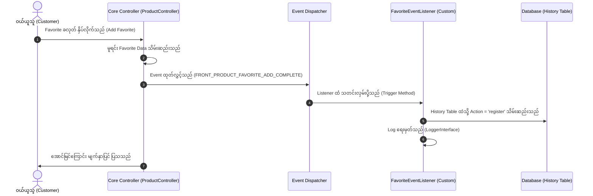
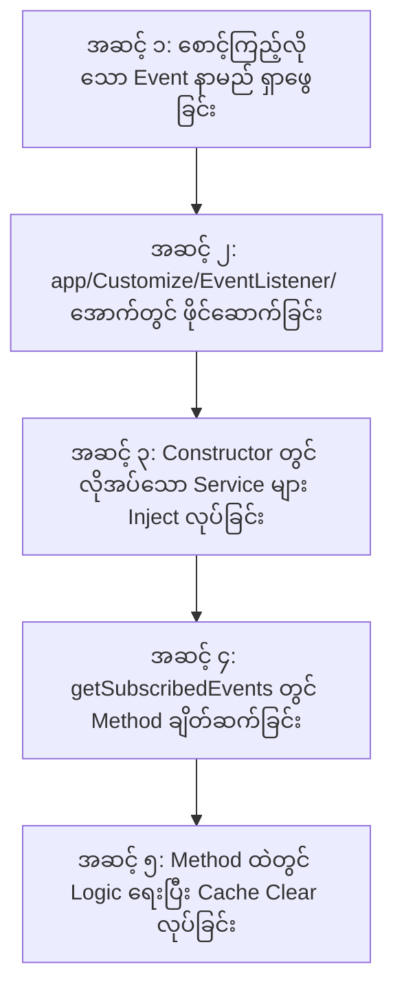

# EC-CUBE 4.3.1 - EventListener & EventSubscriber အသုံးပြုနည်း ပြည့်စုံသော လက်စွဲလမ်းညွှန်
## (Complete Guide to Using EventListener & EventSubscriber in EC-CUBE 4.3)

ဤလက်စွဲစာအုပ်သည် EC-CUBE 4.3.1 တွင် Core Files (`src/` နှင့် `vendor/`) များကို လုံးဝ မထိခိုက်စေဘဲ စနစ်လှုပ်ရှားမှုများကို စောင့်ကြည့်ဖမ်းယူကာ မိမိတို့ လိုလားသော Custom Business Logic များကို လုံခြုံစိတ်ချစွာ ထည့်သွင်းရေးသားနိုင်သည့် **EventListener / EventSubscriber** နည်းပညာကို လုပ်ငန်းအတွေ့အကြုံ (၆) လခန့်ရှိသော Junior Developer များ အခြေခံမှစ၍ လက်တွေ့လုပ်ငန်းခွင်အထိ ကျွမ်းကျင်စွာ အသုံးချနိုင်စေရန် **မြန်မာဘာသာ** ဖြင့် ပြည့်စုံစွာ ရှင်းလင်းထားသော လမ်းညွှန်ဖြစ်ပါသည်။

---

## မာတိကာ (Table of Contents)
1. [EventListener / EventSubscriber အခြေခံ သဘောတရား (Concept & Analogy)](#၁-eventlistener--eventsubscriber-အခြေခံ-သဘောတရား-concept--analogy)
2. [မည်သည့်အချိန်တွင် EventListener ကို အသုံးပြုရမည်နည်း? (When to Use)](#၂-မည်သည့်အချိန်တွင်-eventlistener-ကို-အသုံးပြုရမည်နည်း-when-to-use)
3. [EventListener တည်ဆောက်ရန် လိုအပ်ချက်များနှင့် ဖိုင်လမ်းကြောင်း (Directory & File Standard)](#၃-eventlistener-တည်ဆောက်ရန်-လိုအပ်ချက်များနှင့်-ဖိုင်လမ်းကြောင်း-directory--file-standard)
4. [EventListener တစ်ခု၏ အစိတ်အပိုင်းများ အသေးစိတ် ခွဲခြမ်းစိတ်ဖြာချက် (Anatomy of EventListener)](#၄-eventlistener-တစ်ခု၏-အစိတ်အပိုင်းများ-အသေးစိတ်-ခွဲခြမ်းစိတ်ဖြာချက်-anatomy-of-eventlistener)
5. [Logger နှင့် Security ကို အဘယ်ကြောင့် အသုံးပြုရသနည်း? (Why Logger & Security)](#၅-logger-နှင့်-security-ကို-အဘယ်ကြောင့်-အသုံးပြုရသနည်း-why-logger--security)
6. [EventListener အသစ်တစ်ခု တည်ဆောက်ရန် စံနှုန်းပြည့် အဆင့် (၅) ဆင့် (Standard 5-Step Implementation)](#၆-eventlistener-အသစ်တစ်ခု-တည်ဆောက်ရန်-စံနှုန်းပြည့်-အဆင့်-၅-ဆင့်-standard-5-step-implementation)
7. [အသုံးအများဆုံး EC-CUBE Events စာရင်း (Popular EC-CUBE Events Cheat Sheet)](#၇-အသုံးအများဆုံး-ec-cube-events-စာရင်း-popular-ec-cube-events-cheat-sheet)
8. [Junior Developer များ မကြာခဏ မှားတတ်သော အချက်များနှင့် ဖြေရှင်းနည်းများ (Common Pitfalls & Best Practices)](#၈-junior-developer-များ-မကြာခဏ-မှားတတ်သော-အချက်များနှင့်-ဖြေရှင်းနည်းများ-common-pitfalls--best-practices)

---

## ၁။ EventListener / EventSubscriber အခြေခံ သဘောတရား (Concept & Analogy)

### EventListener ဆိုတာ ဘာလဲ? (What is an EventListener?)
Software Engineering တွင် **Event-Driven Architecture (အဖြစ်အပျက်ကို အခြေခံသော စနစ်)** ဟူ၍ ရှိပါသည်။ စနစ်ထဲတွင် တစ်စုံတစ်ခု ဖြစ်ပျက်သွားသည့်အခါ (ဥပမာ- ကုန်ပစ္စည်းကို Favorite လုပ်လိုက်ခြင်း၊ အော်ဒါ တင်လိုက်ခြင်း၊ ဝယ်ယူသူ အကောင့်ဖွင့်လိုက်ခြင်း) စနစ်က **"ဒီအလုပ် ပြီးသွားပြီနော်!"** ဟု အချက်ပြ Signal (Event) တစ်ခု ထုတ်လွှင့် (Dispatch) ပေးလိုက်ပါသည်။ 

ထိုအခါ ထို Signal ကို လှမ်းယူပြီး မိမိ လိုချင်သော နောက်ဆက်တွဲအလုပ်များ (ဥပမာ- မှတ်တမ်းသိမ်းခြင်း၊ Email ပို့ခြင်း၊ Points ပေးခြင်း) ကို ဆက်လက်လုပ်ဆောင်ပေးသော အရာကို **EventListener** (သို့မဟုတ် **EventSubscriber**) ဟု ခေါ်ပါသည်။



### Real-World ဥပမာဖြင့် နားလည်စေရန်:
* **မီးလန့်ခေါင်းလောင်း စနစ် (Fire Alarm Analogy):**
  * မီးစတင်လောင်ကျွမ်းခြင်း = **Event (အဖြစ်အပျက်)**
  * မီးအာရုံခံ အချက်ပေးစက် = **Event Dispatcher**
  * ရေဖြန်းပိုက်များ အလိုအလျောက် ပွင့်လာခြင်း၊ မီးသတ်ဌာနသို့ ဖုန်းဆက်သွယ်ခြင်း = **EventListeners**
* မီးစတင်လောင်ကျွမ်းသည့် မူရင်းအကြောင်းအရာကို ပြုပြင်စရာ မလိုဘဲ အချက်ပေးခေါင်းလောင်း မြည်လာချိန်တွင် မည်သည့် အလုပ်များကို အလိုအလျောက် ဆက်လုပ်မည်နည်း ဆိုသည်ကို သီးခြား ချိတ်ဆက်ထားခြင်း ဖြစ်ပါသည်။

---

## ၂။ မည်သည့်အချိန်တွင် EventListener ကို အသုံးပြုရမည်နည်း? (When to Use)

EC-CUBE တွင် အောက်ပါ အခြေအနေများနှင့် ကြုံတွေ့ရပါက EventListener ကို မဖြစ်မနေ အသုံးပြုရပါမည်:

1. **EC-CUBE Core File များကို လုံးဝ မထိခိုက်စေလိုသည့်အခါ (Never Modify Core Files):**
   * EC-CUBE ၏ အဓိက ဥပဒေသအရ `src/Eccube/` အောက်ရှိ Controller များ၊ Service များကို တိုက်ရိုက် ပြင်ဆင်ခွင့် မရှိပါ။ ထို့ကြောင့် Core Logic များ ပြီးဆုံးချိန်တွင် မိမိတို့ Custom Logic များ ဝင်ရောက် အလုပ်လုပ်စေရန် EventListener ကို အသုံးပြုရပါသည်။
2. **သမိုင်းမှတ်တမ်းနှင့် စာရင်းအင်း သိမ်းဆည်းလိုသည့်အခါ (Audit Trails & History):**
   * Customer က Favorite ထည့်ခြင်း/ဖျက်ခြင်း မှတ်တမ်း (Favorite History)
   * Admin က ကုန်ပစ္စည်း ဈေးနှုန်း ပြောင်းလဲခြင်း မှတ်တမ်း
   * Customer က Login ဝင်ရောက်ခြင်း မှတ်တမ်း (Login History)
3. **အလိုအလျောက် အကြောင်းကြားစာနှင့် အီးမေးလ် ပေးပို့လိုသည့်အခါ (Notifications & Emails):**
   * ဝယ်ယူသူက အော်ဒါ တင်လိုက်သည့်အခါ Admin ထံ Slack / LINE သို့ Webhook အကြောင်းကြားစာ ပို့ခြင်း။
   * ကုန်ပစ္စည်းကို Favorite လုပ်ထားသော ဝယ်ယူသူများထံ ဈေးလျှော့ပေးကြောင်း Email ပို့ခြင်း။
4. **Point နှင့် Promotion များ အလိုအလျောက် ပေးလိုသည့်အခါ (Bonus & Points):**
   * Customer အသစ် စတင် Register လုပ်ချိန်တွင် Welcome Point ပေးခြင်း။
5. **Twig UI Template ထဲသို့ HTML အပိုင်းအစများ အလိုအလျောက် ထိုးသွင်းလိုသည့်အခါ (Hook Points / Template Injection):**
   * ကုန်ပစ္စည်း Detail စာမျက်နှာတွင် Banner ကြော်ငြာ အလိုအလျောက် ပေါ်စေခြင်း။

---

## ၃။ EventListener တည်ဆောက်ရန် လိုအပ်ချက်များနှင့် ဖိုင်လမ်းကြောင်း (Directory & File Standard)

### ဖိုင်တည်နေရာ စံနှုန်း (Directory Path):
EC-CUBE 4.3 တွင် Custom EventListener များကို အောက်ပါ လမ်းကြောင်းတွင်သာ တည်ဆောက်ရပါမည်:
* **လမ်းကြောင်း:** `app/Customize/EventListener/`
* **ဖိုင်အမည် ပေးပုံစံနှုန်း:** လုပ်ဆောင်မည့် အလုပ်နောက်တွင် `EventListener.php` သို့မဟုတ် `Subscriber.php` ထည့်သွင်းရပါမည်။
  * ဥပမာ- `FavoriteEventListener.php`
  * ဥပမာ- `OrderNotificationSubscriber.php`
  * ဥပမာ- `CustomerRegisterListener.php`

### Namespace စံနှုန်း:
```php
namespace Customize\EventListener;
```

### Symfony Service Autowiring (စနစ်က အလိုအလျောက် သိရှိပုံ):
EC-CUBE 4 တွင် `Symfony Dependency Injection` ပါဝင်သောကြောင့် `app/Customize/EventListener/` အောက်တွင် ဖိုင်အသစ် ရေးသားလိုက်ရုံဖြင့် `services.yaml` ထဲတွင် configuration သီးခြား သွားရေးစရာ မလိုဘဲ စနစ်က **EventListener အသစ်အဖြစ် အလိုအလျောက် Register လုပ်ပေးပါသည် (Auto-registration)**။

---

## ၄။ EventListener တစ်ခု၏ အစိတ်အပိုင်းများ အသေးစိတ် ခွဲခြမ်းစိတ်ဖြာချက် (Anatomy of EventListener)

ပြည့်စုံသော EventListener တစ်ခုတွင် အောက်ပါ အဓိက အစိတ်အပိုင်း (၅) ခု ပါဝင်ပါသည်:

```php
<?php

namespace Customize\EventListener;

// ၁။ မဖြစ်မနေ လိုအပ်သော Namespace Imports
use Eccube\Event\EccubeEvents;
use Eccube\Event\EventArgs;
use Psr\Log\LoggerInterface;
use Symfony\Component\EventDispatcher\EventSubscriberInterface;
use Symfony\Component\Security\Core\Security;

// ၂။ EventSubscriberInterface ကို Implement လုပ်ခြင်း
class SampleEventListener implements EventSubscriberInterface
{
    // ၃။ Dependency Injection Properties (Protected)
    protected $logger;
    protected $security;

    // ၄။ Constructor Dependency Injection
    public function __construct(LoggerInterface $logger, Security $security)
    {
        $this->logger = $logger;
        $this->security = $security;
    }

    // ၅။ စောင့်ကြည့်မည့် Event များကို စာရင်းသွင်းခြင်း (Subscribed Events Map)
    public static function getSubscribedEvents()
    {
        return [
            EccubeEvents::FRONT_PRODUCT_FAVORITE_ADD_COMPLETE => 'onFavoriteAddComplete',
        ];
    }

    // ၆။ Event ဖြစ်ပေါ်လာသည့်အခါ အမှန်တကယ် အလုပ်လုပ်မည့် Callback Method
    public function onFavoriteAddComplete(EventArgs $event)
    {
        $Product = $event->getArgument('Product');
        $Customer = $this->security->getUser();

        if ($Product && $Customer) {
            $this->logger->info(sprintf('Product %d favorited by Customer %d', $Product->getId(), $Customer->getId()));
        }
    }
}
```

### အစိတ်အပိုင်းတစ်ခုချင်းစီ၏ ရှင်းလင်းချက်:

| အစိတ်အပိုင်း | ရည်ရွယ်ချက်နှင့် အခန်းကဏ္ဍ | မဖြစ်မနေ လို/မလို |
|:---|:---|:---:|
| **`implements EventSubscriberInterface`** | ဤ Class သည် Symfony/EC-CUBE စနစ်၏ Event များကို စောင့်ကြည့်မည့် Subscriber ဖြစ်ကြောင်း ကြေညာခြင်း။ | **မဖြစ်မနေ လိုအပ်သည်** |
| **`public static function getSubscribedEvents()`** | စနစ်အား မိမိက မည်သည့် Event များကို စောင့်ကြည့်ပြီး မည်သည့် Method ကို ခေါ်ခိုင်းမည် ဖြစ်ကြောင်း ညွှန်ကြားသည့် စာရင်းသွင်းဇယား။ | **မဖြစ်မနေ လိုအပ်သည်** |
| **`EventArgs $event`** | Event စတင်ဖြစ်ပေါ်သည့်အခါ Core Controller မှ ပေးပို့လိုက်သော Data များ (Product, Order, Customer) ပါဝင်သော Container Box။ | **မဖြစ်မနေ လိုအပ်သည်** |
| **`$event->getArgument('Key')`** | Container Box ထဲမှ သက်ဆိုင်ရာ Data Object ကို Key နာမည်ဖြင့် ဆွဲထုတ်ယူခြင်း။ | **လိုအပ်သလို သုံးသည်** |

---

## ၅။ Logger နှင့် Security ကို အဘယ်ကြောင့် အသုံးပြုရသနည်း? (Why Logger & Security)

### (က) `LoggerInterface` ကို အဘယ်ကြောင့် သုံးရသလဲ?
* **စနစ်လှုပ်ရှားမှု စောင့်ကြည့်ခြင်း (Audit Trail):**  
  Background တွင် အလုပ်လုပ်နေသော EventListener သည် UI မျက်နှာပြင်တွင် စာသားများ print ထုတ်ပြ၍ မရပါ။ ထို့ကြောင့် Event ကောင်းမွန်စွာ အလုပ်လုပ်သွားသလား၊ မည်သည့်အချိန်တွင် မည်သူက လုပ်ဆောင်သွားသလဲ ဆိုသည်ကို သိရှိနိုင်ရန် Log ဖိုင်ထဲသို့ ရေးမှတ်ရပါသည်။
* **Log ဖိုင် တည်နေရာ:**  
  * `var/log/prod/site_yyyy-mm-dd.log` (Production Mode)
  * `var/log/dev/site_yyyy-mm-dd.log` (Development Mode)
* **Log ရေးနည်း အဆင့်များ:**
  ```php
  $this->logger->info('သာမန် အချက်အလက် မှတ်တမ်း');
  $this->logger->warning('သတိပြုရန် လိုအပ်သော မှတ်တမ်း');
  $this->logger->error('စနစ် အမှားအယွင်း ဖြစ်ပေါ်မှု မှတ်တမ်း');
  ```

### (ခ) `Security` ကို အဘယ်ကြောင့် သုံးရသလဲ?
* **လက်ရှိ Login ဝင်ထားသော အသုံးပြုသူကို သိရှိနိုင်ရန်:**  
  ဝယ်ယူသူ Customer သို့မဟုတ် ဆိုင်ရှင် Admin Member သည် Website တွင် Login ဝင်ရောက်ထားပါက Symfony ၏ `Security` Service က အဆိုပါ အကောင့်ကို အလိုအလျောက် မှတ်သားထားပါသည်။
* **ရယူပုံ နမူနာ:**
  ```php
  // လက်ရှိ Login ဝင်ထားသော Customer Object ကို ရယူခြင်း
  $Customer = $this->security->getUser();

  if ($Customer instanceof \Eccube\Entity\Customer) {
      // ဝယ်ယူသူ ဖြစ်သည်
      $customerId = $Customer->getId();
  }
  ```

### (ဂ) အဘယ်ကြောင့် `protected` အဖြစ် ကြေညာရသနည်း?
* အကယ်၍ `private $logger;` ဟု ရေးပါက ဤဖိုင်တစ်ခုတည်းတွင်သာ သုံးနိုင်မည် ဖြစ်သည်။
* `protected $logger;` ဟု ရေးထားပါက နောင်တစ်ချိန်တွင် ဤ Listener အား အခြား Sub-class သို့မဟုတ် Plugin တစ်ခုခုက Extend (အမွေဆက်ခံ) လုပ်ပြီး ချဲ့ထွင်ရေးသားလိုပါက `$this->logger` ကို ဆက်လက် အသုံးပြုနိုင်စေရန် ဖြစ်ပါသည်။ EC-CUBE Core စံနှုန်းအတိုင်း ရေးသားထားခြင်း ဖြစ်ပါသည်။

---

## ၆။ EventListener အသစ်တစ်ခု တည်ဆောက်ရန် စံနှုန်းပြည့် အဆင့် (၅) ဆင့် (Standard 5-Step Implementation)

နောင်တွင် အခြား Feature အသစ်တစ်ခုအတွက် EventListener ဖန်တီးလိုပါက အောက်ပါ အဆင့် (၅) ဆင့်အတိုင်း လုပ်ဆောင်ပါ:



### အဆင့် (၁) - စောင့်ကြည့်လိုသော Event အမည် ရှာဖွေခြင်း
EC-CUBE ၏ Core Event အမည်များ အားလုံးကို `src/Eccube/Event/EccubeEvents.php` ဖိုင်ထဲတွင် ကြေညာထားပါသည်။  
ဥပမာ- 
* ကုန်ပစ္စည်း Favorite လုပ်ခြင်း = `EccubeEvents::FRONT_PRODUCT_FAVORITE_ADD_COMPLETE`
* အော်ဒါ တင်ပြီးသွားခြင်း = `EccubeEvents::FRONT_SHOPPING_CONFIRM_COMPLETE`
* အကောင့် အသစ်ဖွင့်ခြင်း = `EccubeEvents::FRONT_ENTRY_COMPLETE`

### အဆင့် (၂) - `app/Customize/EventListener/` တွင် ဖိုင်အသစ် ဖန်တီးခြင်း
ဥပမာ- `OrderNotificationSubscriber.php` ဖိုင်အသစ် ဆောက်ပြီး `EventSubscriberInterface` ကို implement လုပ်ပါ။

### အဆင့် (၃) - Constructor တွင် လိုအပ်သော Service များကို ထည့်သွင်းခြင်း
Database သွင်းလိုပါက Repository၊ Email ပို့လိုပါက MailService၊ Log ရေးလိုပါက LoggerInterface ကို Constructor ထဲ ထည့်ပါ။

### အဆင့် (၄) - `getSubscribedEvents()` တွင် ချိတ်ဆက်ခြင်း
```php
public static function getSubscribedEvents()
{
    return [
        EccubeEvents::FRONT_SHOPPING_CONFIRM_COMPLETE => 'onOrderComplete',
    ];
}
```

### အဆင့် (၅) - Method ရေးသားခြင်းနှင့် Cache Clear ပြုလုပ်ခြင်း
Method ရေးသားပြီးပါက Terminal တွင် Cache Clear မဖြစ်မနေ ပြုလုပ်ပေးပါ:
```bash
docker compose exec ec-cube bin/console cache:clear --no-warmup
```

---

## ၇။ အသုံးအများဆုံး EC-CUBE Events စာရင်း (Popular EC-CUBE Events Cheat Sheet)

Junior Developer များ လက်တွေ့ လုပ်ငန်းခွင်တွင် အသုံးအများဆုံး Core Events များကို အောက်ပါအတိုင်း စုစည်းဖော်ပြပေးထားပါသည်:

### ၁။ Front Store (ဝယ်ယူသူဘက်ခြမ်း) Events:

| Event အမည် (Constant) | ဖြစ်ပေါ်သည့် အချိန် (Trigger Timing) | ပါဝင်သော Argument Data |
|:---|:---|:---|
| `EccubeEvents::FRONT_PRODUCT_FAVORITE_ADD_COMPLETE` | ကုန်ပစ္စည်း Favorite အဖြစ် ထည့်သွင်းပြီးချိန် | `'Product'` |
| `EccubeEvents::FRONT_MYPAGE_MYPAGE_DELETE_COMPLETE` | Mypage မှ Favorite ပစ္စည်း ဖျက်ထုတ်ပြီးချိန် | `'Customer'`, `'CustomerFavoriteProduct'` |
| `EccubeEvents::FRONT_PRODUCT_CART_ADD_COMPLETE` | ကုန်ပစ္စည်းကို Cart ထဲသို့ ထည့်သွင်းပြီးချိန် | `'Product'`, `'ProductClass'` |
| `EccubeEvents::FRONT_SHOPPING_CONFIRM_COMPLETE` | ဝယ်ယူသူက အော်ဒါ အောင်မြင်စွာ တင်ပြီးချိန် | `'Order'` |
| `EccubeEvents::FRONT_ENTRY_COMPLETE` | ဝယ်ယူသူ အကောင့်အသစ် အောင်မြင်စွာ ဖွင့်ပြီးချိန် | `'Customer'` |
| `EccubeEvents::FRONT_CONTACT_COMPLETE` | ဝယ်ယူသူက Contact Form မေးမြန်းချက် ပို့ပြီးချိန် | `'form'` |

### ၂။ Admin Panel (စီမံခန့်ခွဲသူဘက်ခြမ်း) Events:

| Event အမည် (Constant) | ဖြစ်ပေါ်သည့် အချိန် (Trigger Timing) | ပါဝင်သော Argument Data |
|:---|:---|:---|
| `EccubeEvents::ADMIN_PRODUCT_EDIT_COMPLETE` | Admin က ကုန်ပစ္စည်း အသစ်ဆောက်/ပြင်ဆင်ပြီးချိန် | `'Product'` |
| `EccubeEvents::ADMIN_ORDER_EDIT_COMPLETE` | Admin က အော်ဒါ အချက်အလက် ပြင်ဆင်ပြီးချိန် | `'Order'` |
| `EccubeEvents::ADMIN_CUSTOMER_EDIT_COMPLETE` | Admin က ဝယ်ယူသူ အချက်အလက် ပြင်ဆင်ပြီးချိန် | `'Customer'` |

---

## ၈။ Junior Developer များ မကြာခဏ မှားတတ်သော အချက်များနှင့် ဖြေရှင်းနည်းများ (Common Pitfalls & Best Practices)

### ၁။ Null Check ပြုလုပ်ရန် မေ့လျော့ခြင်း (Missing Null Check)
* **အမှား:** `$Product = $event->getArgument('Product');` ဟု ယူပြီးနောက် `$Product->getId();` ဟု တိုက်ရိုက် ခေါ်ယူခြင်း။ အကယ်၍ ကုန်ပစ္စည်း မရှိခဲ့ပါက `Call to a member function getId() on null` Fatal Error တက်ပါမည်။
* **မှန်ကန်သော နည်းလမ်း:**
  ```php
  $Product = $event->getArgument('Product');
  if ($Product instanceof Product) {
      // ကုန်ပစ္စည်း အမှန်တကယ် ရှိမှသာ ဆက်လုပ်ပါ
  }
  ```

### ၂။ Cache Clear ပြုလုပ်ရန် မေ့ကျန်ခဲ့ခြင်း (Forgot Cache Clear)
* **ပြဿနာ:** Listener အသစ် ရေးပြီးသော်လည်း စနစ်က လုံးဝ အလုပ်မလုပ်ခြင်း။
* **အကြောင်းရင်း:** Symfony သည် Event Subscribers စာရင်းကို Cache ပြုလုပ်ထားသောကြောင့် ဖြစ်သည်။ Listener အသစ် ရေးပြီးတိုင်း သို့မဟုတ် `getSubscribedEvents()` ပြင်ပြီးတိုင်း `bin/console cache:clear --no-warmup` ကို မဖြစ်မနေ run ပေးရပါမည်။

### ၃။ Infinite Loop (အဆုံးမရှိ သံသရာလည်ခြင်း)
* **သတိပြုရန်:** Order Edit Event ထဲတွင် Order အား ပြန်လည် Update ပြုလုပ်ပြီး ထပ်မံ Save ပါက အဆိုပါ Order Edit Event ကို ထပ်မံ Trigger ဖြစ်စေပြီး Infinite Loop ပတ်သွားတတ်ပါသည်။ EventListener ထဲတွင် Data Update ပြုလုပ်ရာ၌ ဂရုပြုရပါမည်။

---

> **နိဂုံးချုပ် စည်းမျဉ်း:**  
> EC-CUBE တွင် မည်သည့် Custom Logic ကိုမဆို တည်ဆောက်သည့်အခါ **"Core Controller ကို လုံးဝ မပြင်ရ၊ EventListener / EventSubscriber ဖြင့်သာ ချိတ်ဆက်ဆောင်ရွက်ရမည်"** ဟူသော စည်းမျဉ်းကို အမြဲတစေ လိုက်နာကျင့်သုံးရမည် ဖြစ်ပါသည်။
