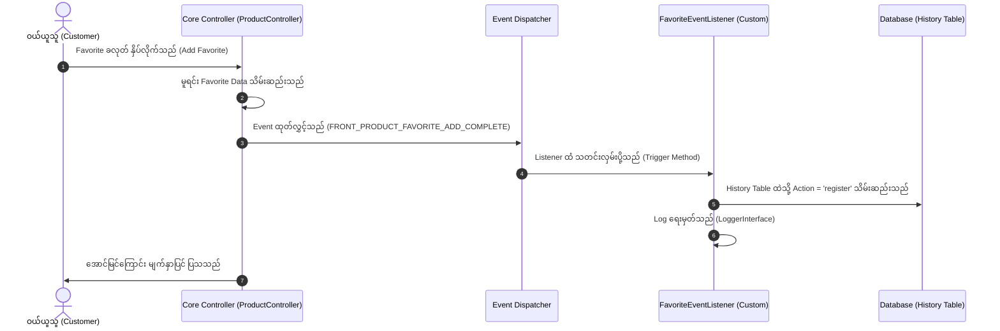
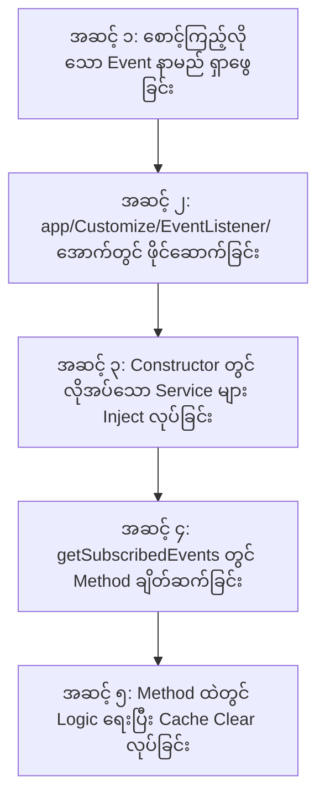
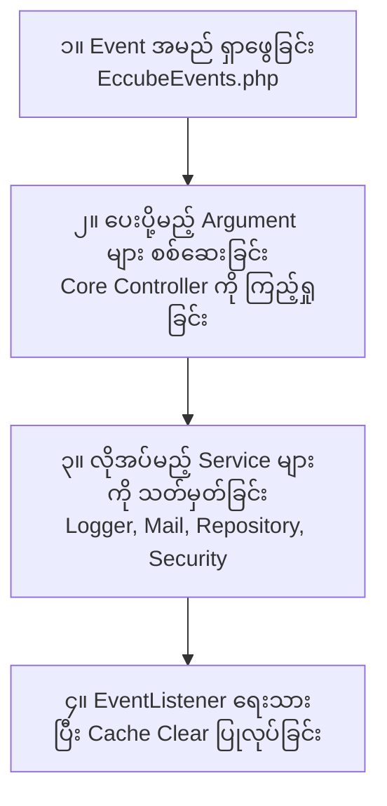
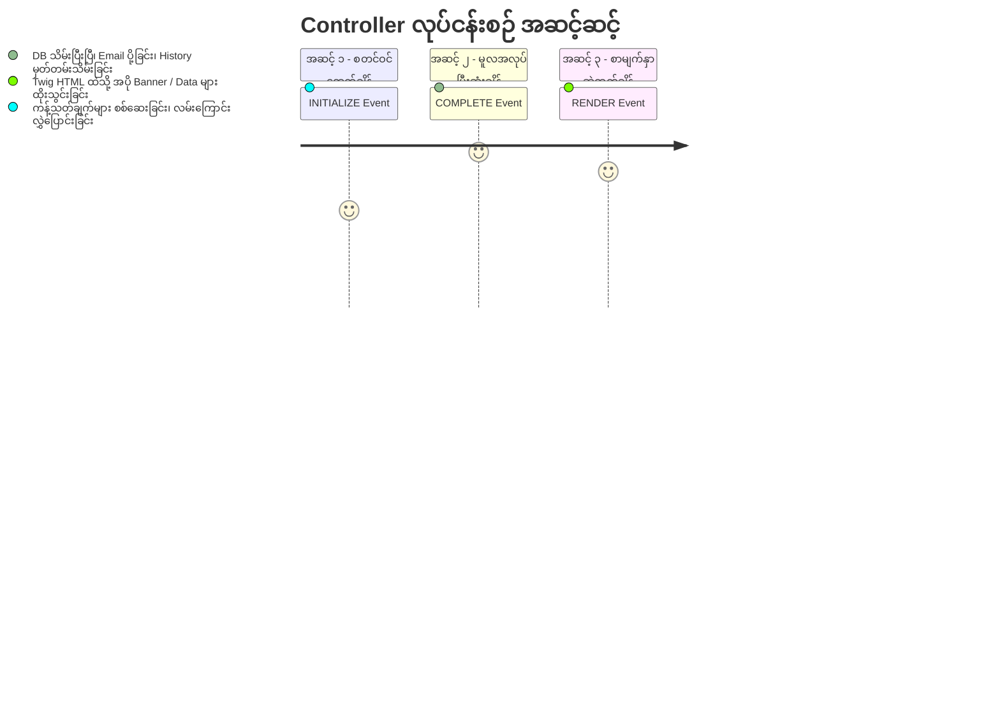

# EC-CUBE 4.3.1 - EventListener & EventSubscriber အသုံးပြုနည်း ပြည့်စုံသော လက်စွဲလမ်းညွှန်
## (Complete Guide to Using EventListener & EventSubscriber in EC-CUBE 4.3)

ဤလက်စွဲစာအုပ်သည် EC-CUBE 4.3.1 တွင် Core Files (`src/` နှင့် `vendor/`) များကို လုံးဝ မထိခိုက်စေဘဲ စနစ်လှုပ်ရှားမှုများကို စောင့်ကြည့်ဖမ်းယူကာ မိမိတို့ လိုလားသော Custom Business Logic များကို လုံခြုံစိတ်ချစွာ ထည့်သွင်းရေးသားနိုင်သည့် **EventListener / EventSubscriber** နည်းပညာကို လုပ်ငန်းအတွေ့အကြုံ (၆) လခန့်ရှိသော Junior Developer များ အခြေခံမှစ၍ လက်တွေ့လုပ်ငန်းခွင်အထိ ကျွမ်းကျင်စွာ အသုံးချနိုင်စေရန် **မြန်မာဘာသာ** ဖြင့် ပြည့်စုံစွာ ရှင်းလင်းထားသော လမ်းညွှန်ဖြစ်ပါသည်။

---

## မာတိကာ (Table of Contents)
1. [EventListener / EventSubscriber အခြေခံ သဘောတရား (Concept & Analogy)](#၁-eventlistener--eventsubscriber-အခြေခံ-သဘောတရား-concept--analogy)
2. [မည်သည့်အချိန်တွင် EventListener ကို အသုံးပြုရမည်နည်း? (When to Use)](#၂-မည်သည့်အချိန်တွင်-eventlistener-ကို-အသုံးပြုရမည်နည်း-when-to-use)
3. [EventListener တည်ဆောက်ရန် လိုအပ်ချက်များနှင့် ဖိုင်လမ်းကြောင်း (Directory & File Standard)](#၃-eventlistener-တည်ဆောက်ရန်-လိုအပ်ချက်များနှင့်-ဖိုင်လမ်းကြောင်း-directory--file-standard)
4. [EventListener တစ်ခု၏ အစိတ်အပိုင်းများ အသေးစိတ် ခွဲခြမ်းစိတ်ဖြာချက် (Anatomy of EventListener)](#၄-eventlistener-တစ်ခု၏-အစိတ်အပိုင်းများ-အသေးစိတ်-ခွဲခြမ်းစိတ်ဖြာချက်-anatomy-of-eventlistener)
5. [Logger နှင့် Security ကို အဘယ်ကြောင့် အသုံးပြုရသနည်း? (Why Logger & Security)](#၅-logger-နှင့်-security-ကို-အဘယ်ကြောင့်-အသုံးပြုရသနည်း-why-logger--security)
6. [EventListener အသစ်တစ်ခု တည်ဆောက်ရန် စံနှုန်းပြည့် အဆင့် (၅) ဆင့် (Standard 5-Step Implementation)](#၆-eventlistener-အသစ်တစ်ခု-တည်ဆောက်ရန်-စံနှုန်းပြည့်-အဆင့်-၅-ဆင့်-standard-5-step-implementation)
7. [အသုံးအများဆုံး EC-CUBE Events စာရင်း (Popular EC-CUBE Events Cheat Sheet)](#၇-အသုံးအများဆုံး-ec-cube-events-စာရင်း-popular-ec-cube-events-cheat-sheet)
8. [Junior Developer များ မကြာခဏ မှားတတ်သော အချက်များနှင့် ဖြေရှင်းနည်းများ (Common Pitfalls & Best Practices)](#၈-junior-developer-များ-မကြာခဏ-မှားတတ်သော-အချက်များနှင့်-ဖြေရှင်းနည်းများ-common-pitfalls--best-practices)
9. [ကဏ္ဍအသီးသီး (Different Sectors) တွင် အသုံးပြုပုံ လက်တွေ့ ဥပမာများ (Real-world Sector Usages)](#၉-ကဏ္ဍအသီးသီး-different-sectors-တွင်-အသုံးပြုပုံ-လက်တွေ့-ဥပမာများ-real-world-sector-usages)
10. [အခြားကဏ္ဍ (Different Sectors) များတွင် အသုံးပြုပါက ဖန်တီးပုံ လုပ်ငန်းစဉ် အတူတူပဲလား? (Is the Process the Same Across Different Sectors?)](#၁၀-အခြားကဏ္ဍ-different-sectors-များတွင်-အသုံးပြုပါက-ဖန်တီးပုံ-လုပ်ငန်းစဉ်-အတူတူပဲလား-is-the-process-the-same-across-different-sectors)
11. [EventListener ဖန်တီးရာတွင် မဖြစ်မနေ လိုအပ်သည့် ကြိုတင်ပြင်ဆင်မှုများ (Prerequisites & Discovery Checklist)](#၁၁-eventlistener-ဖန်တီးရာတွင်-မဖြစ်မနေ-လိုအပ်သည့်-ကြိုတင်ပြင်ဆင်မှုများ-prerequisites--discovery-checklist)
12. [Event Lifecycle Timing နားလည်ခြင်း (INITIALIZE vs COMPLETE vs RENDER)](#၁၂-event-lifecycle-timing-နားလည်ခြင်း-initialize-vs-complete-vs-render)
13. [$event->setResponse() ဖြင့် စနစ်လမ်းကြောင်း လွှဲပြောင်းထိန်းချုပ်ခြင်း (Flow Redirection & Guards)](#၁၃-eventsetresponse-ဖြင့်-စနစ်လမ်းကြောင်း-လွှဲပြောင်းထိန်းချုပ်ခြင်း-flow-redirection--guards)
14. [EC-CUBE စတင်လေ့လာသူများ မဖြစ်မနေ သိရှိရမည့် ရွှေစည်းမျဉ်း (၁၀) ချက် (10 Must-Know Golden Rules for Beginners)](#၁၄-ec-cube-စတင်လေ့လာသူများ-မဖြစ်မနေ-သိရှိရမည့်-ရွှေစည်းမျဉ်း-၁၀-ချက်-10-must-know-golden-rules-for-beginners)

---

## ၁။ EventListener / EventSubscriber အခြေခံ သဘောတရား (Concept & Analogy)

### EventListener ဆိုတာ ဘာလဲ? (What is an EventListener?)
Software Engineering တွင် **Event-Driven Architecture (အဖြစ်အပျက်ကို အခြေခံသော စနစ်)** ဟူ၍ ရှိပါသည်။ စနစ်ထဲတွင် တစ်စုံတစ်ခု ဖြစ်ပျက်သွားသည့်အခါ (ဥပမာ- ကုန်ပစ္စည်းကို Favorite လုပ်လိုက်ခြင်း၊ အော်ဒါ တင်လိုက်ခြင်း၊ ဝယ်ယူသူ အကောင့်ဖွင့်လိုက်ခြင်း) စနစ်က **"ဒီအလုပ် ပြီးသွားပြီနော်!"** ဟု အချက်ပြ Signal (Event) တစ်ခု ထုတ်လွှင့် (Dispatch) ပေးလိုက်ပါသည်။ 

ထိုအခါ ထို Signal ကို လှမ်းယူပြီး မိမိ လိုချင်သော နောက်ဆက်တွဲအလုပ်များ (ဥပမာ- မှတ်တမ်းသိမ်းခြင်း၊ Email ပို့ခြင်း၊ Points ပေးခြင်း) ကို ဆက်လက်လုပ်ဆောင်ပေးသော အရာကို **EventListener** (သို့မဟုတ် **EventSubscriber**) ဟု ခေါ်ပါသည်။



### Real-World ဥပမာဖြင့် နားလည်စေရန်:
* **မီးလန့်ခေါင်းလောင်း စနစ် (Fire Alarm Analogy):**
  * မီးစတင်လောင်ကျွမ်းခြင်း = **Event (အဖြစ်အပျက်)**
  * မီးအာရုံခံ အချက်ပေးစက် = **Event Dispatcher**
  * ရေဖြန်းပိုက်များ အလိုအလျောက် ပွင့်လာခြင်း၊ မီးသတ်ဌာနသို့ ဖုန်းဆက်သွယ်ခြင်း = **EventListeners**
* မီးစတင်လောင်ကျွမ်းသည့် မူရင်းအကြောင်းအရာကို ပြုပြင်စရာ မလိုဘဲ အချက်ပေးခေါင်းလောင်း မြည်လာချိန်တွင် မည်သည့် အလုပ်များကို အလိုအလျောက် ဆက်လုပ်မည်နည်း ဆိုသည်ကို သီးခြား ချိတ်ဆက်ထားခြင်း ဖြစ်ပါသည်။

---

## ၂။ မည်သည့်အချိန်တွင် EventListener ကို အသုံးပြုရမည်နည်း? (When to Use)

EC-CUBE တွင် အောက်ပါ အခြေအနေများနှင့် ကြုံတွေ့ရပါက EventListener ကို မဖြစ်မနေ အသုံးပြုရပါမည်:

1. **EC-CUBE Core File များကို လုံးဝ မထိခိုက်စေလိုသည့်အခါ (Never Modify Core Files):**
   * EC-CUBE ၏ အဓိက ဥပဒေသအရ `src/Eccube/` အောက်ရှိ Controller များ၊ Service များကို တိုက်ရိုက် ပြင်ဆင်ခွင့် မရှိပါ။ ထို့ကြောင့် Core Logic များ ပြီးဆုံးချိန်တွင် မိမိတို့ Custom Logic များ ဝင်ရောက် အလုပ်လုပ်စေရန် EventListener ကို အသုံးပြုရပါသည်။
2. **သမိုင်းမှတ်တမ်းနှင့် စာရင်းအင်း သိမ်းဆည်းလိုသည့်အခါ (Audit Trails & History):**
   * Customer က Favorite ထည့်ခြင်း/ဖျက်ခြင်း မှတ်တမ်း (Favorite History)
   * Admin က ကုန်ပစ္စည်း ဈေးနှုန်း ပြောင်းလဲခြင်း မှတ်တမ်း
   * Customer က Login ဝင်ရောက်ခြင်း မှတ်တမ်း (Login History)
3. **အလိုအလျောက် အကြောင်းကြားစာနှင့် အီးမေးလ် ပေးပို့လိုသည့်အခါ (Notifications & Emails):**
   * ဝယ်ယူသူက အော်ဒါ တင်လိုက်သည့်အခါ Admin ထံ Slack / LINE သို့ Webhook အကြောင်းကြားစာ ပို့ခြင်း။
   * ကုန်ပစ္စည်းကို Favorite လုပ်ထားသော ဝယ်ယူသူများထံ ဈေးလျှော့ပေးကြောင်း Email ပို့ခြင်း။
4. **Point နှင့် Promotion များ အလိုအလျောက် ပေးလိုသည့်အခါ (Bonus & Points):**
   * Customer အသစ် စတင် Register လုပ်ချိန်တွင် Welcome Point ပေးခြင်း။
5. **Twig UI Template ထဲသို့ HTML အပိုင်းအစများ အလိုအလျောက် ထိုးသွင်းလိုသည့်အခါ (Hook Points / Template Injection):**
   * ကုန်ပစ္စည်း Detail စာမျက်နှာတွင် Banner ကြော်ငြာ အလိုအလျောက် ပေါ်စေခြင်း။

---

## ၃။ EventListener တည်ဆောက်ရန် လိုအပ်ချက်များနှင့် ဖိုင်လမ်းကြောင်း (Directory & File Standard)

### ဖိုင်တည်နေရာ စံနှုန်း (Directory Path):
EC-CUBE 4.3 တွင် Custom EventListener များကို အောက်ပါ လမ်းကြောင်းတွင်သာ တည်ဆောက်ရပါမည်:
* **လမ်းကြောင်း:** `app/Customize/EventListener/`
* **ဖိုင်အမည် ပေးပုံစံနှုန်း:** လုပ်ဆောင်မည့် အလုပ်နောက်တွင် `EventListener.php` သို့မဟုတ် `Subscriber.php` ထည့်သွင်းရပါမည်။
  * ဥပမာ- `FavoriteEventListener.php`
  * ဥပမာ- `OrderNotificationSubscriber.php`
  * ဥပမာ- `CustomerRegisterListener.php`

### Namespace စံနှုန်း:
```php
namespace Customize\EventListener;
```

### Symfony Service Autowiring (စနစ်က အလိုအလျောက် သိရှိပုံ):
EC-CUBE 4 တွင် `Symfony Dependency Injection` ပါဝင်သောကြောင့် `app/Customize/EventListener/` အောက်တွင် ဖိုင်အသစ် ရေးသားလိုက်ရုံဖြင့် `services.yaml` ထဲတွင် configuration သီးခြား သွားရေးစရာ မလိုဘဲ စနစ်က **EventListener အသစ်အဖြစ် အလိုအလျောက် Register လုပ်ပေးပါသည် (Auto-registration)**။

---

## ၄။ EventListener တစ်ခု၏ အစိတ်အပိုင်းများ အသေးစိတ် ခွဲခြမ်းစိတ်ဖြာချက် (Anatomy of EventListener)

ပြည့်စုံသော EventListener တစ်ခုတွင် အောက်ပါ အဓိက အစိတ်အပိုင်း (၅) ခု ပါဝင်ပါသည်:

```php
<?php

namespace Customize\EventListener;

// ၁။ မဖြစ်မနေ လိုအပ်သော Namespace Imports
use Eccube\Event\EccubeEvents;
use Eccube\Event\EventArgs;
use Psr\Log\LoggerInterface;
use Symfony\Component\EventDispatcher\EventSubscriberInterface;
use Symfony\Component\Security\Core\Security;

// ၂။ EventSubscriberInterface ကို Implement လုပ်ခြင်း
class SampleEventListener implements EventSubscriberInterface
{
    // ၃။ Dependency Injection Properties (Protected)
    protected $logger;
    protected $security;

    // ၄။ Constructor Dependency Injection
    public function __construct(LoggerInterface $logger, Security $security)
    {
        $this->logger = $logger;
        $this->security = $security;
    }

    // ၅။ စောင့်ကြည့်မည့် Event များကို စာရင်းသွင်းခြင်း (Subscribed Events Map)
    public static function getSubscribedEvents()
    {
        return [
            EccubeEvents::FRONT_PRODUCT_FAVORITE_ADD_COMPLETE => 'onFavoriteAddComplete',
        ];
    }

    // ၆။ Event ဖြစ်ပေါ်လာသည့်အခါ အမှန်တကယ် အလုပ်လုပ်မည့် Callback Method
    public function onFavoriteAddComplete(EventArgs $event)
    {
        $Product = $event->getArgument('Product');
        $Customer = $this->security->getUser();

        if ($Product && $Customer) {
            $this->logger->info(sprintf('Product %d favorited by Customer %d', $Product->getId(), $Customer->getId()));
        }
    }
}
```

### အစိတ်အပိုင်းတစ်ခုချင်းစီ၏ ရှင်းလင်းချက်:

| အစိတ်အပိုင်း | ရည်ရွယ်ချက်နှင့် အခန်းကဏ္ဍ | မဖြစ်မနေ လို/မလို |
|:---|:---|:---:|
| **`implements EventSubscriberInterface`** | ဤ Class သည် Symfony/EC-CUBE စနစ်၏ Event များကို စောင့်ကြည့်မည့် Subscriber ဖြစ်ကြောင်း ကြေညာခြင်း။ | **မဖြစ်မနေ လိုအပ်သည်** |
| **`public static function getSubscribedEvents()`** | စနစ်အား မိမိက မည်သည့် Event များကို စောင့်ကြည့်ပြီး မည်သည့် Method ကို ခေါ်ခိုင်းမည် ဖြစ်ကြောင်း ညွှန်ကြားသည့် စာရင်းသွင်းဇယား။ | **မဖြစ်မနေ လိုအပ်သည်** |
| **`EventArgs $event`** | Event စတင်ဖြစ်ပေါ်သည့်အခါ Core Controller မှ ပေးပို့လိုက်သော Data များ (Product, Order, Customer) ပါဝင်သော Container Box။ | **မဖြစ်မနေ လိုအပ်သည်** |
| **`$event->getArgument('Key')`** | Container Box ထဲမှ သက်ဆိုင်ရာ Data Object ကို Key နာမည်ဖြင့် ဆွဲထုတ်ယူခြင်း။ | **လိုအပ်သလို သုံးသည်** |

---

## ၅။ Logger နှင့် Security ကို အဘယ်ကြောင့် အသုံးပြုရသနည်း? (Why Logger & Security)

### (က) `LoggerInterface` ကို အဘယ်ကြောင့် သုံးရသလဲ?
* **စနစ်လှုပ်ရှားမှု စောင့်ကြည့်ခြင်း (Audit Trail):**  
  Background တွင် အလုပ်လုပ်နေသော EventListener သည် UI မျက်နှာပြင်တွင် စာသားများ print ထုတ်ပြ၍ မရပါ။ ထို့ကြောင့် Event ကောင်းမွန်စွာ အလုပ်လုပ်သွားသလား၊ မည်သည့်အချိန်တွင် မည်သူက လုပ်ဆောင်သွားသလဲ ဆိုသည်ကို သိရှိနိုင်ရန် Log ဖိုင်ထဲသို့ ရေးမှတ်ရပါသည်။
* **Log ဖိုင် တည်နေရာ:**  
  * `var/log/prod/site_yyyy-mm-dd.log` (Production Mode)
  * `var/log/dev/site_yyyy-mm-dd.log` (Development Mode)
* **Log ရေးနည်း အဆင့်များ:**
  ```php
  $this->logger->info('သာမန် အချက်အလက် မှတ်တမ်း');
  $this->logger->warning('သတိပြုရန် လိုအပ်သော မှတ်တမ်း');
  $this->logger->error('စနစ် အမှားအယွင်း ဖြစ်ပေါ်မှု မှတ်တမ်း');
  ```

### (ခ) `Security` ကို အဘယ်ကြောင့် သုံးရသလဲ?
* **လက်ရှိ Login ဝင်ထားသော အသုံးပြုသူကို သိရှိနိုင်ရန်:**  
  ဝယ်ယူသူ Customer သို့မဟုတ် ဆိုင်ရှင် Admin Member သည် Website တွင် Login ဝင်ရောက်ထားပါက Symfony ၏ `Security` Service က အဆိုပါ အကောင့်ကို အလိုအလျောက် မှတ်သားထားပါသည်။
* **ရယူပုံ နမူနာ:**
  ```php
  // လက်ရှိ Login ဝင်ထားသော Customer Object ကို ရယူခြင်း
  $Customer = $this->security->getUser();

  if ($Customer instanceof \Eccube\Entity\Customer) {
      // ဝယ်ယူသူ ဖြစ်သည်
      $customerId = $Customer->getId();
  }
  ```

### (ဂ) အဘယ်ကြောင့် `protected` အဖြစ် ကြေညာရသနည်း?
* အကယ်၍ `private $logger;` ဟု ရေးပါက ဤဖိုင်တစ်ခုတည်းတွင်သာ သုံးနိုင်မည် ဖြစ်သည်။
* `protected $logger;` ဟု ရေးထားပါက နောင်တစ်ချိန်တွင် ဤ Listener အား အခြား Sub-class သို့မဟုတ် Plugin တစ်ခုခုက Extend (အမွေဆက်ခံ) လုပ်ပြီး ချဲ့ထွင်ရေးသားလိုပါက `$this->logger` ကို ဆက်လက် အသုံးပြုနိုင်စေရန် ဖြစ်ပါသည်။ EC-CUBE Core စံနှုန်းအတိုင်း ရေးသားထားခြင်း ဖြစ်ပါသည်။

---

## ၆။ EventListener အသစ်တစ်ခု တည်ဆောက်ရန် စံနှုန်းပြည့် အဆင့် (၅) ဆင့် (Standard 5-Step Implementation)

နောင်တွင် အခြား Feature အသစ်တစ်ခုအတွက် EventListener ဖန်တီးလိုပါက အောက်ပါ အဆင့် (၅) ဆင့်အတိုင်း လုပ်ဆောင်ပါ:



### အဆင့် (၁) - စောင့်ကြည့်လိုသော Event အမည် ရှာဖွေခြင်း
EC-CUBE ၏ Core Event အမည်များ အားလုံးကို `src/Eccube/Event/EccubeEvents.php` ဖိုင်ထဲတွင် ကြေညာထားပါသည်။  
ဥပမာ- 
* ကုန်ပစ္စည်း Favorite လုပ်ခြင်း = `EccubeEvents::FRONT_PRODUCT_FAVORITE_ADD_COMPLETE`
* အော်ဒါ တင်ပြီးသွားခြင်း = `EccubeEvents::FRONT_SHOPPING_CONFIRM_COMPLETE`
* အကောင့် အသစ်ဖွင့်ခြင်း = `EccubeEvents::FRONT_ENTRY_COMPLETE`

### အဆင့် (၂) - `app/Customize/EventListener/` တွင် ဖိုင်အသစ် ဖန်တီးခြင်း
ဥပမာ- `OrderNotificationSubscriber.php` ဖိုင်အသစ် ဆောက်ပြီး `EventSubscriberInterface` ကို implement လုပ်ပါ။

### အဆင့် (၃) - Constructor တွင် လိုအပ်သော Service များကို ထည့်သွင်းခြင်း
Database သွင်းလိုပါက Repository၊ Email ပို့လိုပါက MailService၊ Log ရေးလိုပါက LoggerInterface ကို Constructor ထဲ ထည့်ပါ။

### အဆင့် (၄) - `getSubscribedEvents()` တွင် ချိတ်ဆက်ခြင်း
```php
public static function getSubscribedEvents()
{
    return [
        EccubeEvents::FRONT_SHOPPING_CONFIRM_COMPLETE => 'onOrderComplete',
    ];
}
```

### အဆင့် (၅) - Method ရေးသားခြင်းနှင့် Cache Clear ပြုလုပ်ခြင်း
Method ရေးသားပြီးပါက Terminal တွင် Cache Clear မဖြစ်မနေ ပြုလုပ်ပေးပါ:
```bash
docker compose exec ec-cube bin/console cache:clear --no-warmup
```

---

## ၇။ အသုံးအများဆုံး EC-CUBE Events စာရင်း (Popular EC-CUBE Events Cheat Sheet)

Junior Developer များ လက်တွေ့ လုပ်ငန်းခွင်တွင် အသုံးအများဆုံး Core Events များကို အောက်ပါအတိုင်း စုစည်းဖော်ပြပေးထားပါသည်:

### ၁။ Front Store (ဝယ်ယူသူဘက်ခြမ်း) Events:

| Event အမည် (Constant) | ဖြစ်ပေါ်သည့် အချိန် (Trigger Timing) | ပါဝင်သော Argument Data |
|:---|:---|:---|
| `EccubeEvents::FRONT_PRODUCT_FAVORITE_ADD_COMPLETE` | ကုန်ပစ္စည်း Favorite အဖြစ် ထည့်သွင်းပြီးချိန် | `'Product'` |
| `EccubeEvents::FRONT_MYPAGE_MYPAGE_DELETE_COMPLETE` | Mypage မှ Favorite ပစ္စည်း ဖျက်ထုတ်ပြီးချိန် | `'Customer'`, `'CustomerFavoriteProduct'` |
| `EccubeEvents::FRONT_PRODUCT_CART_ADD_COMPLETE` | ကုန်ပစ္စည်းကို Cart ထဲသို့ ထည့်သွင်းပြီးချိန် | `'Product'`, `'ProductClass'` |
| `EccubeEvents::FRONT_SHOPPING_CONFIRM_COMPLETE` | ဝယ်ယူသူက အော်ဒါ အောင်မြင်စွာ တင်ပြီးချိန် | `'Order'` |
| `EccubeEvents::FRONT_ENTRY_COMPLETE` | ဝယ်ယူသူ အကောင့်အသစ် အောင်မြင်စွာ ဖွင့်ပြီးချိန် | `'Customer'` |
| `EccubeEvents::FRONT_CONTACT_COMPLETE` | ဝယ်ယူသူက Contact Form မေးမြန်းချက် ပို့ပြီးချိန် | `'form'` |

### ၂။ Admin Panel (စီမံခန့်ခွဲသူဘက်ခြမ်း) Events:

| Event အမည် (Constant) | ဖြစ်ပေါ်သည့် အချိန် (Trigger Timing) | ပါဝင်သော Argument Data |
|:---|:---|:---|
| `EccubeEvents::ADMIN_PRODUCT_EDIT_COMPLETE` | Admin က ကုန်ပစ္စည်း အသစ်ဆောက်/ပြင်ဆင်ပြီးချိန် | `'Product'` |
| `EccubeEvents::ADMIN_ORDER_EDIT_COMPLETE` | Admin က အော်ဒါ အချက်အလက် ပြင်ဆင်ပြီးချိန် | `'Order'` |
| `EccubeEvents::ADMIN_CUSTOMER_EDIT_COMPLETE` | Admin က ဝယ်ယူသူ အချက်အလက် ပြင်ဆင်ပြီးချိန် | `'Customer'` |

---

## ၈။ Junior Developer များ မကြာခဏ မှားတတ်သော အချက်များနှင့် ဖြေရှင်းနည်းများ (Common Pitfalls & Best Practices)

### ၁။ Null Check ပြုလုပ်ရန် မေ့လျော့ခြင်း (Missing Null Check)
* **အမှား:** `$Product = $event->getArgument('Product');` ဟု ယူပြီးနောက် `$Product->getId();` ဟု တိုက်ရိုက် ခေါ်ယူခြင်း။ အကယ်၍ ကုန်ပစ္စည်း မရှိခဲ့ပါက သို့မဟုတ် Argument နာမည် စာလုံးပေါင်း မှားယွင်းပါက `Call to a member function getId() on null` Fatal Error တက်ပါမည်။
* **မှန်ကန်သော နည်းလမ်း:**
  ```php
  $Product = $event->getArgument('Product');
  if ($Product instanceof \Eccube\Entity\Product) {
      // ကုန်ပစ္စည်း အမှန်တကယ် ရှိမှသာ ဆက်လုပ်ပါ
      $productId = $Product->getId();
  }
  ```

### ၂။ Cache Clear ပြုလုပ်ရန် မေ့ကျန်ခဲ့ခြင်း (Forgot Cache Clear)
* **ပြဿနာ:** Listener အသစ် ရေးပြီးသော်လည်း စနစ်က လုံးဝ အလုပ်မလုပ်ခြင်း။
* **အကြောင်းရင်း:** Symfony သည် Event Subscribers စာရင်းကို Cache ပြုလုပ်ထားသောကြောင့် ဖြစ်သည်။ Listener အသစ် ရေးပြီးတိုင်း သို့မဟုတ် `getSubscribedEvents()` ပြင်ပြီးတိုင်း အောက်ပါ Command ကို မဖြစ်မနေ run ပေးရပါမည်:
  ```bash
  docker compose exec ec-cube bin/console cache:clear --no-warmup
  ```

### ၃။ Infinite Loop (အဆုံးမရှိ သံသရာလည်ခြင်း)
* **သတိပြုရန်:** Order Edit Event ထဲတွင် Order အား ပြန်လည် Update ပြုလုပ်ပြီး ထပ်မံ Save ပါက အဆိုပါ Order Edit Event ကို ထပ်မံ Trigger ဖြစ်စေပြီး Infinite Loop ပတ်သွားတတ်ပါသည်။ EventListener ထဲတွင် Data Update ပြုလုပ်ရာ၌ Event အမည်နှင့် Trigger ဖြစ်မည့် အခြေအနေကို သေချာစွာ စိစစ်ရပါမည်။

### ၄။ Guest User (Login မဝင်ထားသူ) ကို ထည့်မတွက်မိခြင်း
* **အမှား:** `$Customer = $this->security->getUser();` ဟု ယူပြီးနောက် `$Customer->getId()` ဟု ချက်ချင်း သုံးစွဲခြင်း။
* **သတိပြုရန်:** ဝယ်ယူသူသည် Guest အဖြစ် Login မဝင်ဘဲ ဈေးဝယ်နေပါက `$this->security->getUser()` သည် `null` သာ ဖြစ်ပါမည်။ ထို့ကြောင့် `if ($Customer instanceof \Eccube\Entity\Customer)` ဟု အမြဲတမ်း စစ်ဆေးပေးရပါမည်။

---

## ၉။ ကဏ္ဍအသီးသီး (Different Sectors) တွင် အသုံးပြုပုံ လက်တွေ့ ဥပမာများ (Real-world Sector Usages)

EC-CUBE စနစ်ကြီးတစ်ခုလုံးတွင် လုပ်ငန်းကဏ္ဍ (Sectors) အလိုက် EventListener များကို မည်သို့ အသုံးချနိုင်သည်ကို အောက်ပါ လက်တွေ့ နမူနာများဖြင့် လေ့လာနိုင်ပါသည်:

### (က) Shopping / Checkout Sector (အော်ဒါတင်ခြင်းနှင့် ငွေချေခြင်း ကဏ္ဍ)
* **မည်သည့်အချိန်တွင် သုံးသနည်း:** ဝယ်ယူသူက ကုန်ပစ္စည်းများ ရွေးချယ်ပြီးနောက် "အော်ဒါ အတည်ပြုသည်" ခလုတ်ကို နှိပ်လိုက်ချိန် (`FRONT_SHOPPING_CONFIRM_COMPLETE`)။
* **လက်တွေ့ အသုံးချမှုများ:**
  1. အော်ဒါအသစ် ရောက်ရှိလာကြောင်း ဆိုင်မန်နေဂျာထံ LINE / Telegram / Slack သို့ Webhook အလိုအလျောက် ပို့ခြင်း။
  2. ဝယ်ယူသူ၏ စုစုပေါင်း ကျသင့်ငွေပေါ် မူတည်၍ ၅% Loyalty Points အလိုအလျောက် တွက်ချက် ထည့်ပေးခြင်း။
  3. ပြင်ပ သိုလှောင်ရုံစနစ် (Third-party WMS / ERP) သို့ အော်ဒါဒေတာကို API ဖြင့် အလိုအလျောက် ပေးပို့ခြင်း။

```php
// app/Customize/EventListener/OrderCompleteSubscriber.php
namespace Customize\EventListener;

use Eccube\Event\EccubeEvents;
use Eccube\Event\EventArgs;
use Psr\Log\LoggerInterface;
use Symfony\Component\EventDispatcher\EventSubscriberInterface;

class OrderCompleteSubscriber implements EventSubscriberInterface
{
    protected $logger;

    public function __construct(LoggerInterface $logger)
    {
        $this->logger = $logger;
    }

    public static function getSubscribedEvents()
    {
        return [
            EccubeEvents::FRONT_SHOPPING_CONFIRM_COMPLETE => 'onOrderComplete',
        ];
    }

    public function onOrderComplete(EventArgs $event)
    {
        /** @var \Eccube\Entity\Order $Order */
        $Order = $event->getArgument('Order');

        if ($Order) {
            $this->logger->info(sprintf('အော်ဒါအသစ် ရောက်ရှိပါသည် - Order ID: %d, စုစုပေါင်းငွေ: %s ကျပ်', $Order->getId(), number_format($Order->getTotal())));
            // ဤနေရာတွင် LINE Notify သို့မဟုတ် External ERP API သို့ ချိတ်ဆက်နိုင်ပါသည်
        }
    }
}
```

---

### (ခ) Customer / Auth Sector (ဝယ်ယူသူ အကောင့်နှင့် လုံခြုံရေး ကဏ္ဍ)
* **မည်သည့်အချိန်တွင် သုံးသနည်း:** အသုံးပြုသူ အသစ် စတင် အကောင့်ဖွင့်ပြီးချိန် (`FRONT_ENTRY_COMPLETE`) သို့မဟုတ် စကားဝှက် ပြောင်းလဲပြီးချိန်။
* **လက်တွေ့ အသုံးချမှုများ:**
  1. အကောင့်အသစ် ဖွင့်လှစ်သူများအား Welcome Coupon Code သို့မဟုတ် ကြိုဆိုလက်ဆောင် 1,000 Points အလိုအလျောက် ပေးအပ်ခြင်း။
  2. လုံခြုံရေး စောင့်ကြည့်ရန်အတွက် အကောင့်ဖွင့်သည့် IP Address နှင့် Browser အချက်အလက်များကို Security Log တွင် မှတ်တမ်းတင်ခြင်း။

```php
// app/Customize/EventListener/CustomerRegistrationSubscriber.php
namespace Customize\EventListener;

use Eccube\Event\EccubeEvents;
use Eccube\Event\EventArgs;
use Psr\Log\LoggerInterface;
use Symfony\Component\EventDispatcher\EventSubscriberInterface;

class CustomerRegistrationSubscriber implements EventSubscriberInterface
{
    protected $logger;

    public function __construct(LoggerInterface $logger)
    {
        $this->logger = $logger;
    }

    public static function getSubscribedEvents()
    {
        return [
            EccubeEvents::FRONT_ENTRY_COMPLETE => 'onCustomerRegister',
        ];
    }

    public function onCustomerRegister(EventArgs $event)
    {
        /** @var \Eccube\Entity\Customer $Customer */
        $Customer = $event->getArgument('Customer');

        if ($Customer) {
            $this->logger->info(sprintf('ဝယ်ယူသူအသစ် စာရင်းသွင်းပြီးပါပြီ: %s (ID: %d)', $Customer->getEmail(), $Customer->getId()));
            // ဤနေရာတွင် Customer အား Welcome Point ပေးခြင်း logic ရေးသားနိုင်ပါသည်
        }
    }
}
```

---

### (ဂ) Cart Sector (ဈေးဝယ်လှည်း ကဏ္ဍ)
* **မည်သည့်အချိန်တွင် သုံးသနည်း:** ဝယ်ယူသူက ကုန်ပစ္စည်းကို ဈေးဝယ်လှည်း (Cart) ထဲသို့ ထည့်သွင်းလိုက်ချိန် (`FRONT_PRODUCT_CART_ADD_COMPLETE`)။
* **လက်တွေ့ အသုံးချမှုများ:**
  1. ဝယ်ယူသူ Cart ထဲ ထည့်လိုက်သော ပစ္စည်း စုစုပေါင်း ပမာဏ ကန့်သတ်ချက် (Max Purchase Limit) ကျော်လွန်ခြင်း ရှိမရှိ စစ်ဆေးခြင်း။
  2. စုစုပေါင်း တန်ဖိုး သတ်မှတ်ငွေပမာဏ ကျော်ပါက အထူး Promotion လက်ဆောင်ပစ္စည်းကို Cart ထဲသို့ အလိုအလျောက် ထည့်ပေးခြင်း (Auto-add Free Gift)။

```php
// app/Customize/EventListener/CartAddSubscriber.php
namespace Customize\EventListener;

use Eccube\Event\EccubeEvents;
use Eccube\Event\EventArgs;
use Psr\Log\LoggerInterface;
use Symfony\Component\EventDispatcher\EventSubscriberInterface;

class CartAddSubscriber implements EventSubscriberInterface
{
    protected $logger;

    public function __construct(LoggerInterface $logger)
    {
        $this->logger = $logger;
    }

    public static function getSubscribedEvents()
    {
        return [
            EccubeEvents::FRONT_PRODUCT_CART_ADD_COMPLETE => 'onCartAdd',
        ];
    }

    public function onCartAdd(EventArgs $event)
    {
        $Product = $event->getArgument('Product');
        $ProductClass = $event->getArgument('ProductClass');

        if ($Product) {
            $this->logger->info(sprintf('Cart ထဲသို့ ပစ္စည်း ထည့်သွင်းပါသည်: Product ID %d', $Product->getId()));
        }
    }
}
```

---

### (ဃ) Admin Panel Sector (စီမံခန့်ခွဲသူ နောက်ကွယ် ကဏ္ဍ)
* **မည်သည့်အချိန်တွင် သုံးသနည်း:** ဆိုင်မန်နေဂျာ (Admin) က ကုန်ပစ္စည်း အသစ်တင်ခြင်း သို့မဟုတ် ဈေးနှုန်း ပြင်ဆင်ခြင်း ပြီးဆုံးချိန် (`ADMIN_PRODUCT_EDIT_COMPLETE`)။
* **လက်တွေ့ အသုံးချမှုများ:**
  1. မည်သည့် Admin ဝန်ထမ်းက မည်သည့် ကုန်ပစ္စည်းကို ဈေးနှုန်းမည်မျှ ပြောင်းလဲသွားသည်ကို သိမ်းဆည်းသည့် Audit Trail Log ရေးထိုးခြင်း။
  2. ကုန်ပစ္စည်း အချက်အလက် ပြောင်းလဲသွားသဖြင့် Frontend မျက်နှာပြင်တွင် ချက်ချင်း update ဖြစ်စေရန် Frontend Cache ကို အလိုအလျောက် ရှင်းလင်းပေးခြင်း (Auto Cache Purge)။

```php
// app/Customize/EventListener/AdminProductAuditSubscriber.php
namespace Customize\EventListener;

use Eccube\Event\EccubeEvents;
use Eccube\Event\EventArgs;
use Psr\Log\LoggerInterface;
use Symfony\Component\EventDispatcher\EventSubscriberInterface;
use Symfony\Component\Security\Core\Security;

class AdminProductAuditSubscriber implements EventSubscriberInterface
{
    protected $logger;
    protected $security;

    public function __construct(LoggerInterface $logger, Security $security)
    {
        $this->logger = $logger;
        $this->security = $security;
    }

    public static function getSubscribedEvents()
    {
        return [
            EccubeEvents::ADMIN_PRODUCT_EDIT_COMPLETE => 'onProductEditComplete',
        ];
    }

    public function onProductEditComplete(EventArgs $event)
    {
        /** @var \Eccube\Entity\Product $Product */
        $Product = $event->getArgument('Product');
        $AdminMember = $this->security->getUser();

        if ($Product && $AdminMember) {
            $this->logger->info(sprintf(
                'Admin Member "%s" (ID: %d) က ကုန်ပစ္စည်း "%s" (ID: %d) ကို ပြင်ဆင်ပြီးစီးခဲ့သည်',
                $AdminMember->getUsername(),
                $AdminMember->getId(),
                $Product->getName(),
                $Product->getId()
            ));
        }
    }
}
```

---

## ၁၀။ အခြားကဏ္ဍ (Different Sectors) များတွင် အသုံးပြုပါက ဖန်တီးပုံ လုပ်ငန်းစဉ် အတူတူပဲလား? (Is the Process the Same Across Different Sectors?)

**အဖြေမှာ: လုံးဝ (၁၀၀%) တစ်ထပ်တည်း အတူတူပင် ဖြစ်ပါသည်! (Yes, 100% Identical Process!)**

Shopping ကဏ္ဍ၊ Customer ကဏ္ဍ၊ Cart ကဏ္ဍ၊ Product ကဏ္ဍ သို့မဟုတ် Admin ကဏ္ဍ မည်သည့်ကဏ္ဍအတွက်မဆို EventListener တည်ဆောက်သည့် **စံနှုန်းပြည့် နည်းလမ်းနှင့် အဆင့်များ (Steps) သည် လုံးဝ အတူတူပင်** ဖြစ်ပါသည်။

### နှိုင်းယှဉ်ချက် ဇယား (Sector Comparison Table):

| အဆင့် / သတ်မှတ်ချက် | Favorite Sector (လက်ရှိ) | Shopping / Order Sector | Customer / Auth Sector | Admin Sector | တူ/မတူ |
|:---|:---|:---|:---|:---|:---:|
| **၁။ ဖိုင်တည်နေရာ** | `app/Customize/EventListener/` | `app/Customize/EventListener/` | `app/Customize/EventListener/` | `app/Customize/EventListener/` | **တူညီသည်** |
| **၂။ Interface** | `implements EventSubscriberInterface` | `implements EventSubscriberInterface` | `implements EventSubscriberInterface` | `implements EventSubscriberInterface` | **တူညီသည်** |
| **၃။ DI Constructor** | Constructor Injection ဖြင့် Service ရယူသည် | Constructor Injection ဖြင့် Service ရယူသည် | Constructor Injection ဖြင့် Service ရယူသည် | Constructor Injection ဖြင့် Service ရယူသည် | **တူညီသည်** |
| **၄။ Event Registration** | `getSubscribedEvents()` Method ရေးသားရသည် | `getSubscribedEvents()` Method ရေးသားရသည် | `getSubscribedEvents()` Method ရေးသားရသည် | `getSubscribedEvents()` Method ရေးသားရသည် | **တူညီသည်** |
| **၅။ Callback Argument** | `(EventArgs $event)` ကို လက်ခံရရှိသည် | `(EventArgs $event)` ကို လက်ခံရရှိသည် | `(EventArgs $event)` ကို လက်ခံရရှိသည် | `(EventArgs $event)` ကို လက်ခံရရှိသည် | **တူညီသည်** |
| **၆။ Cache Clear** | `bin/console cache:clear --no-warmup` | `bin/console cache:clear --no-warmup` | `bin/console cache:clear --no-warmup` | `bin/console cache:clear --no-warmup` | **တူညီသည်** |

### ကွာခြားသွားသည့် အချက် (၂) ချက်တည်းသာ ရှိပါသည်:
1. **Event Constant အမည် ကွာခြားခြင်း:**  
   * Favorite အတွက်ဆိုလျှင်: `EccubeEvents::FRONT_PRODUCT_FAVORITE_ADD_COMPLETE`
   * Order အတွက်ဆိုလျှင်: `EccubeEvents::FRONT_SHOPPING_CONFIRM_COMPLETE`
   * Customer အတွက်ဆိုလျှင်: `EccubeEvents::FRONT_ENTRY_COMPLETE`
   * Admin အတွက်ဆိုလျှင်: `EccubeEvents::ADMIN_PRODUCT_EDIT_COMPLETE`
2. **Container Box (`EventArgs`) ထဲမှ ထုတ်ယူမည့် Data Key ကွာခြားခြင်း:**  
   * Favorite အတွက်: `$event->getArgument('Product')`
   * Order အတွက်: `$event->getArgument('Order')`
   * Customer အတွက်: `$event->getArgument('Customer')`

ထို့ကြောင့် မည်သည့်ကဏ္ဍတွင်မဆို စံနှုန်းပြည့် အဆင့် (၅) ဆင့်ကိုသာ မှတ်သားထားပါက မည်သည့် Feature ကိုမဆို အလွယ်တကူ တည်ဆောက်နိုင်မည် ဖြစ်ပါသည်။

---

## ၁၁။ EventListener ဖန်တီးရာတွင် မဖြစ်မနေ လိုအပ်သည့် ကြိုတင်ပြင်ဆင်မှုများ (Prerequisites & Discovery Checklist)

EventListener တစ်ခု မရေးမီ Developer တစ်ယောက်အနေဖြင့် အောက်ပါ အချက် (၄) ချက်ကို ကြိုတင် စစ်ဆေးရှာဖွေထားရပါမည်:



### အချက် (၁) - Event Constant နာမည် အတိအကျ သိရှိခြင်း:
`src/Eccube/Event/EccubeEvents.php` ဖိုင်ထဲတွင် မိမိ လိုချင်သော စနစ်လှုပ်ရှားမှုနှင့် ကိုက်ညီသည့် Constant နာမည်ကို ရှာဖွေပါ။

### အချက် (၂) - ထို Event က မည်သည့် Data များ ပေးပို့သည်ကို စစ်ဆေးခြင်း:
အဆိုပါ Event အား Core Controller ထဲတွင် မည်သို့ Dispatch လုပ်ထားသည်ကို ရှာဖွေကြည့်ပါ။  
ဥပမာ- `ProductController.php` ထဲတွင် အောက်ပါအတိုင်း ရေးထားပါက:
```php
$event = new EventArgs(
    [
        'Product' => $Product,
    ],
    $request
);
$this->eventDispatcher->dispatch($event, EccubeEvents::FRONT_PRODUCT_FAVORITE_ADD_COMPLETE);
```
ဤနေရာတွင် `['Product' => $Product]` ဟု ရေးထားသောကြောင့် မိမိ၏ Listener တွင် `$event->getArgument('Product')` ဟု ပြန်လည် ထုတ်ယူနိုင်ကြောင်း အသေအချာ သိရှိနိုင်ပါသည်။

### အချက် (၃) - Constructor တွင် ထည့်သွင်းရမည့် Service များကို ကြိုတင် စဉ်းစားခြင်း:
* Database သို့ အသစ်သိမ်းဆည်းလိုပါက: `EntityManagerInterface $entityManager` သို့မဟုတ် မိမိ၏ Custom Repository
* စနစ်မှတ်တမ်း ရေးလိုပါက: `LoggerInterface $logger`
* လက်ရှိ Login ဝင်ထားသူကို သိလိုပါက: `Security $security`
* Email အလိုအလျောက် ပို့လိုပါက: `MailService $mailService`

### အချက် (၄) - စနစ်လမ်းကြောင်း လွှဲပြောင်းရန် (Redirect) လို/မလို ဆုံးဖြတ်ခြင်း:
* သာမန် မှတ်တမ်းသိမ်းခြင်း ဖြစ်ပါက ဘာမှ return ပြန်စရာ မလိုပါ။
* အကယ်၍ စစ်ဆေးချက် မအောင်မြင်၍ အခြား Page သို့ လမ်းလွှဲလိုပါက `$event->setResponse(new RedirectResponse(...))` ကို သုံးရပါမည် (အခန်း ၁၃ တွင် ကြည့်ပါ)။

---

## ၁၂။ Event Lifecycle Timing နားလည်ခြင်း (INITIALIZE vs COMPLETE vs RENDER)

EC-CUBE တွင် Event တစ်ခုချင်းစီ၌ ဖြစ်ပေါ်သည့် အချိန်ကာလ (Lifecycle Stages) (၃) မျိုး ရှိပါသည်။ ဤအချက်ကို ကောင်းစွာ နားလည်ထားခြင်းသည် မှန်ကန်သော Event ကို ရွေးချယ်နိုင်ရန် အလွန် အရေးကြီးပါသည်:



### ၁။ `..._INITIALIZE` (စတင်ချိန် / အလုပ်မလုပ်မီ)
* **ဘယ်အချိန်မှာ ဖြစ်သလဲ:** User က ခလုတ်နှိပ်ပြီး Controller စတင် အလုပ်လုပ်သည့် အချိန် (Database ထဲ Data မသိမ်းရသေးမီ)။
* **ဘယ်လို အလုပ်မျိုး သုံးသလဲ:** စည်းကမ်းချက် စစ်ဆေးခြင်း (Validation)၊ အသက် မပြည့်သေးပါက အခြား Page သို့ မောင်းထုတ်ခြင်း (Redirect)။

### ၂။ `..._COMPLETE` (ပြီးဆုံးချိန် / အလုပ်ပြီးနောက်)
* **ဘယ်အချိန်မှာ ဖြစ်သလဲ:** မူရင်း Logic များ (ဥပမာ- Favorite သိမ်းဆည်းခြင်း၊ Order တင်ခြင်း) Database ထဲသို့ အောင်မြင်စွာ သိမ်းဆည်းပြီးသွားချိန်။
* **ဘယ်လို အလုပ်မျိုး သုံးသလဲ:** သမိုင်းမှတ်တမ်းသိမ်းခြင်း (History Tracking)၊ Email ပို့ခြင်း၊ Point ပေးခြင်း၊ Webhook ပို့ခြင်း။ (အသုံးအများဆုံး အဆင့် ဖြစ်ပါသည်)။

### ၃။ `..._RENDER` (မျက်နှာပြင် ပြသချိန်)
* **ဘယ်အချိန်မှာ ဖြစ်သလဲ:** Controller က အလုပ်အားလုံး ပြီးဆုံးပြီးနောက် User ၏ Browser ပေါ်သို့ HTML စာမျက်နှာ (Twig Template) စတင် ဆွဲထုတ်ပြသချိန်။
* **ဘယ်လို အလုပ်မျိုး သုံးသလဲ:** Twig Template ထဲသို့ နောက်ထပ် အချက်အလက်များ (Parameters) သို့မဟုတ် UI Block များကို Dynamic ထိုးသွင်းလိုသည့်အခါ (Template Hook Points)။

---

## ၁၃။ `$event->setResponse()` ဖြင့် စနစ်လမ်းကြောင်း လွှဲပြောင်းထိန်းချုပ်ခြင်း (Flow Redirection & Guards)

EventListener များသည် နောက်ကွယ်တွင် Data မှတ်တမ်းသိမ်းရုံသာမက **မူလ Controller ၏ အလုပ်ကို ရပ်တန့်ကာ အခြား စာမျက်နှာသို့ လမ်းလွှဲပြောင်း (Redirect) ပေးနိုင်သည့် စွမ်းအား** လည်း ရှိပါသည်။

### ဘယ်လို အခြေအနေမျိုးမှာ သုံးသလဲ?
* ဝယ်ယူသူသည် အသက် ၁၈ နှစ် မပြည့်သေးပါက အရက်/စီးကရက် ပစ္စည်းများကို Cart ထဲ ထည့်ခွင့်မပြုဘဲ သတိပေး စာမျက်နှာသို့ လမ်းလွှဲလိုသည့်အခါ။
* VIP Member သာ ဝယ်ယူခွင့်ရှိသော ပစ္စည်းကို သာမန် Member က ဝယ်ယူရန် ကြိုးစားသည့်အခါ အသင်းဝင်ကြေး ပေးသွင်းရန် စာမျက်နှာသို့ လမ်းလွှဲလိုသည့်အခါ။

### ရေးသားပုံ နမူနာ:
```php
namespace Customize\EventListener;

use Eccube\Event\EccubeEvents;
use Eccube\Event\EventArgs;
use Symfony\Component\EventDispatcher\EventSubscriberInterface;
use Symfony\Component\HttpFoundation\RedirectResponse;
use Symfony\Component\Routing\Generator\UrlGeneratorInterface;

class PurchaseRestrictionSubscriber implements EventSubscriberInterface
{
    protected $router;

    public function __construct(UrlGeneratorInterface $router)
    {
        $this->router = $router;
    }

    public static function getSubscribedEvents()
    {
        // အလုပ်မလုပ်မီ INITIALIZE အဆင့်တွင် ဖမ်းယူရပါမည်
        return [
            EccubeEvents::FRONT_PRODUCT_CART_ADD_INITIALIZE => 'checkPurchaseEligibility',
        ];
    }

    public function checkPurchaseEligibility(EventArgs $event)
    {
        $request = $event->getRequest();
        
        // ဥပမာ - ဝယ်ယူခွင့် မရှိဟု သတ်မှတ်သည့် အခြေအနေ
        $isEligible = false; 

        if (!$isEligible) {
            // မူလ Cart ထဲ ထည့်မည့် အလုပ်ကို ရပ်တန့်ပြီး Homepage သို့ လမ်းလွှဲလိုက်ပါသည်
            $redirectUrl = $this->router->generate('homepage');
            $response = new RedirectResponse($redirectUrl);
            
            // setResponse() ထည့်လိုက်သည်နှင့် Controller ၏ အလုပ် ရပ်တန့်သွားပါသည်
            $event->setResponse($response);
        }
    }
}
```

---

## ၁၄။ EC-CUBE စတင်လေ့လာသူများ မဖြစ်မနေ သိရှိရမည့် ရွှေစည်းမျဉ်း (၁၀) ချက် (10 Must-Know Golden Rules for Beginners)

EC-CUBE တွင် EventListener များ ရေးသားရာတွင် Junior Developer များ အမြဲတစေ လိုက်နာစောင့်ထိန်းရမည့် ရွှေစည်းမျဉ်း (၁၀) ချက် ဖြစ်ပါသည်:

1. **Rule 1: Core ဖိုင်ကို ဘယ်တော့မှ တိုက်ရိုက် မပြင်ပါနှင့် (Never Touch Core Files):**  
   `src/Eccube/` နှင့် `vendor/` ကို လုံးဝ မထိရ။ အရာအားလုံးကို `app/Customize/EventListener/` တွင်သာ ရေးသားပါ။
2. **Rule 2: Event အမည်နှင့် Argument ကို Core ထဲတွင် အမြဲ အတည်ပြုပါ:**  
   စာလုံးပေါင်း တစ်လုံး မှားယွင်းရုံဖြင့် Event အလုပ်မလုပ်ခြင်း သို့မဟုတ် Argument ရှာမတွေ့ခြင်းများ ဖြစ်တတ်ပါသည်။ `EccubeEvents.php` ကို အမြဲ ဖွင့်ကြည့်ပါ။
3. **Rule 3: Symfony Autowiring စနစ်ကို ယုံကြည်ပါ:**  
   ဖိုင်ကို `app/Customize/EventListener/` အောက်တွင် မှန်ကန်စွာ ဆောက်ပြီး `EventSubscriberInterface` ကို implement လုပ်ထားပါက `services.yaml` တွင် ဘာမှ သွားပြင်စရာ မလိုပါ။
4. **Rule 4: Argument Object များကို Null-Safety စစ်ဆေးပါ:**  
   `$event->getArgument('...')` မှ ရရှိသော Object တိုင်းကို Method မခေါ်မီ `if ($Object instanceof ExpectedClass)` ဖြင့် အမြဲ စစ်ဆေးပါ။
5. **Rule 5: Guest User ကို မေ့မထားပါနှင့်:**  
   `$this->security->getUser()` သည် Login မဝင်ထားသော ဧည့်သည်များအတွက် `null` ဖြစ်နေမည်ကို အမြဲ သတိပြုပါ။
6. **Rule 6: Single Responsibility Principle (တာဝန် တစ်ခုတည်းကိုသာ ထမ်းဆောင်ပါ):**  
   EventListener တစ်ခုထဲတွင် မဆိုင်သော အလုပ်များစွာ မစုပြုံပါစေနှင့်။ Favorite မှတ်တမ်းအတွက် Listener တစ်ခု၊ Order အကြောင်းကြားစာအတွက် Listener တစ်ခု သီးခြားစီ ခွဲထားပါ။
7. **Rule 7: Database Flush ပြုလုပ်ရာတွင် သတိထားပါ:**  
   EventListener ထဲတွင် Entity ပြင်ဆင်ပြီး `$entityManager->flush()` လုပ်ပါက အခြား Event များ အပြန်အလှန် ပွင့်ထွက်ပြီး အဆုံးမရှိ သံသရာလည်ခြင်း (Infinite Loop) မဖြစ်စေရန် ဂရုပြုပါ။
8. **Rule 8: Log ရေးမှတ်၍ အမြဲ စစ်ဆေးပါ:**  
   Event များသည် Background တွင် အလုပ်လုပ်သဖြင့် စနစ် အမှားအယွင်းများကို သိရှိနိုင်ရန် `var/log/dev/site_yyyy-mm-dd.log` ကို အမြဲ စောင့်ကြည့်ပါ။
9. **Rule 9: စနစ်ထဲ ရောက်မရောက် Console Command ဖြင့် စစ်ဆေးပါ:**  
   မိမိ၏ Listener ကို စနစ်က အမှန်တကယ် မှတ်သားထားခြင်း ရှိ/မရှိ သိလိုပါက အောက်ပါ Command ဖြင့် စစ်ဆေးနိုင်ပါသည်:
   ```bash
   docker compose exec ec-cube bin/console debug:event-dispatcher "eccube.event.front.product.favorite.add.complete"
   ```
10. **Rule 10: Cache Clear လုပ်ရန် ဘယ်တော့မှ မမေ့ပါနှင့်:**  
    Listener အသစ် ရေးသားပြီးတိုင်း သို့မဟုတ် Event ချိတ်ဆက်မှု ပြောင်းလဲပြီးတိုင်း Terminal တွင် အောက်ပါ Command ကို အမြဲတစေ run ပေးရပါမည်:
    ```bash
    docker compose exec ec-cube bin/console cache:clear --no-warmup
    ```

---

> **အနှစ်ချုပ် သဘောတရား:**  
> EventListener / EventSubscriber သည် EC-CUBE Development တွင် Core Code များကို သန့်ရှင်းစွာ ထိန်းသိမ်းထားပြီး မိမိတို့ လိုအပ်သော စီးပွားရေးဆိုင်ရာ စည်းမျဉ်းများ (Custom Business Logic) ကို စနစ်တကျ၊ လုံခြုံစိတ်ချစွာ ပေါင်းစပ်နိုင်သည့် အထိရောက်ဆုံးနှင့် အဆင့်အတန်း အမြင့်မားဆုံး စံနှုန်းဖြစ်ပါသည်။
