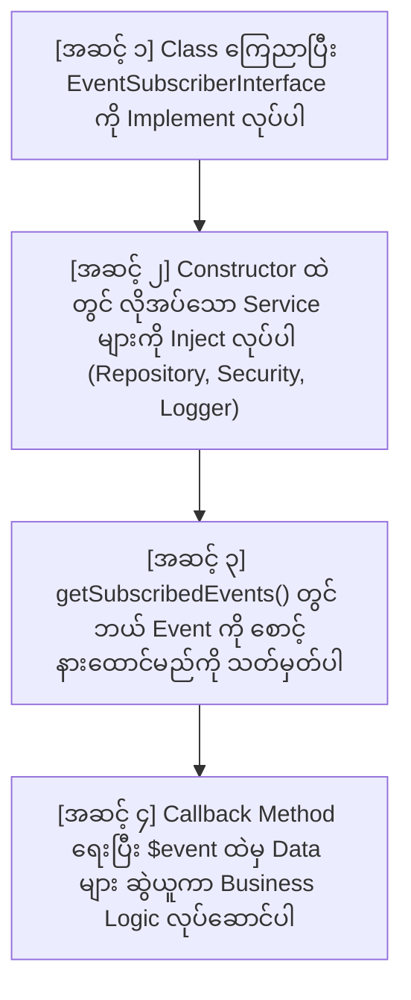
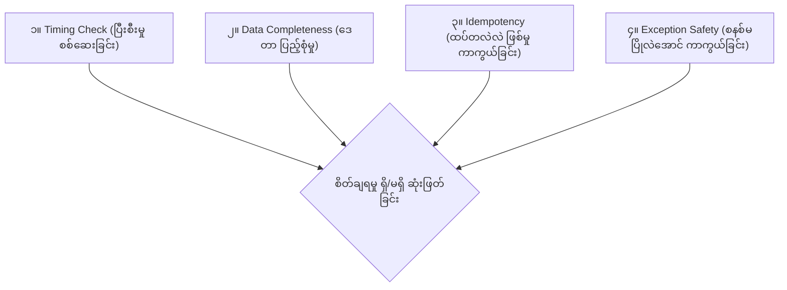

# EC-CUBE 4.3 - EventListener အစအဆုံး တည်ဆောက်နည်း၊ စစ်ဆေးနည်းနှင့် သတိထားရမည့် စည်းမျဉ်းများ မဟာလက်စွဲ
## (Master Guide: EventListener Creation from Scratch, Investigation, Pitfalls & Common Use Cases)

EC-CUBE 4.3 တွင် EventListener (Event Subscriber) တစ်ခုကို အစအဆုံး ရေးသားခြင်း၊ တခြား Event အသစ်များကို စုံစမ်းစစ်ဆေးခြင်း၊ အမှားအယွင်းမရှိ စိတ်ချရစေရန် သတိပြုရမည့် အချက်များ (Pitfalls to Care) နှင့် EC-CUBE ပရောဂျက်များတွင် အသုံးအများဆုံး EventListener အမျိုးအစားများနှင့် ၎င်းတို့၏ ဖိုင်စာရင်း (Common EventListeners & File Lists) များကို အတွေ့အကြုံ (၆) လခန့်ရှိသော Junior Developer များ အလွယ်တကူ လိုက်ပါလုပ်ဆောင်နိုင်စေရန် **မြန်မာဘာသာ** ဖြင့် အပြည့်စုံဆုံး ရေးသားထားသော လက်စွဲစာအုပ် ဖြစ်ပါသည်။

---

## မာတိကာ (Table of Contents)
1. [အပိုင်း (၁) - EventListener ကို အစအဆုံး စတင်တည်ဆောက်ပုံ (From Scratch to Complete)](#၁-အပိုင်း-၁---eventlistener-ကို-အစအဆုံး-စတင်တည်ဆောက်ပုံ)
2. [အပိုင်း (၂) - တခြား Event အသစ်များကို စုံစမ်းစစ်ဆေးနည်း (How to Investigate Any Event)](#၂-အပိုင်း-၂---တခြား-event-အသစ်များကို-စုံစမ်းစစ်ဆေးနည်း)
3. [အပိုင်း (၃) - "ဒီ Event ကို သုံးတာ အဆင်ပြေ/စိတ်ချရရဲ့လား" အကဲဖြတ်နည်း (The 4 Verification Checks)](#၃-အပိုင်း-၃---ဒီ-event-ကို-သုံးတာ-အဆင်ပြေစိတ်ချရရဲ့လား-အကဲဖြတ်နည်း)
4. [အပိုင်း (၄) - အခြား မတူညီသော Event များ ဖန်တီးရာတွင် မဖြစ်မနေ သတိထားရမည့် အချက်များ (What to Care)](#၄-အပိုင်း-၄---မဖြစ်မနေ-သတိထားရမည့်-အချက်များ-what-to-care)
5. [အပိုင်း (၅) - EC-CUBE တွင် အသုံးအများဆုံး EventListener ၅ မျိုးနှင့် လိုအပ်သော ဖိုင်စာရင်းများ (Top 5 Most Common EventListeners & File Lists)](#၅-အပိုင်း-၅---အသုံးအများဆုံး-eventlistener-၅-မျိုးနှင့်-ဖိုင်စာရင်းများ)

---

# ၁. အပိုင်း (၁) - EventListener ကို အစအဆုံး စတင်တည်ဆောက်ပုံ

EC-CUBE တွင် EventListener တစ်ခု တည်ဆောက်ရန်အတွက် အောက်ပါ အဆင့် (၄) ဆင့် အတိုင်း အစဉ်လိုက် ရေးသားရပါသည်:



### လက်တွေ့ ကုဒ်တည်ဆောက်ပုံ အပြည့်အစုံ:
📁 **ဖိုင်တည်နေရာ:** `app/Customize/EventListener/FavoriteEventListener.php`

```php
<?php

namespace Customize\EventListener;

use Customize\Entity\CustomerFavoriteProductHistory;
use Customize\Repository\CustomerFavoriteProductHistoryRepository;
use Eccube\Event\EccubeEvents;
use Eccube\Event\EventArgs;
use Psr\Log\LoggerInterface;
use Symfony\Component\EventDispatcher\EventSubscriberInterface;
use Symfony\Component\Security\Core\Security;

/**
 * အဆင့် ၁: Symfony EventSubscriberInterface ကို မဖြစ်မနေ implement လုပ်ရမည်
 */
class FavoriteEventListener implements EventSubscriberInterface
{
    /** @var LoggerInterface */
    private $logger;

    /** @var CustomerFavoriteProductHistoryRepository */
    private $historyRepository;

    /** @var Security */
    private $security;

    /**
     * အဆင့် ၂: လိုအပ်သော Service များကို Constructor Injection ဖြင့် တောင်းယူပါ
     */
    public function __construct(
        LoggerInterface $logger,
        CustomerFavoriteProductHistoryRepository $historyRepository,
        Security $security
    ) {
        $this->logger = $logger;
        $this->historyRepository = $historyRepository;
        $this->security = $security;
    }

    /**
     * အဆင့် ၃: ဘယ် Event ဖြစ်ပေါ်လာပါက ဘယ် Method ကို ခေါ်ယူရမည်ကို သတ်မှတ်ပါ
     *
     * @return array [Event အမည် => Method အမည်]
     */
    public static function getSubscribedEvents(): array
    {
        return [
            EccubeEvents::FRONT_PRODUCT_FAVORITE_ADD_COMPLETE => 'onFavoriteAddComplete',
            EccubeEvents::FRONT_MYPAGE_MYPAGE_DELETE_COMPLETE => 'onMypageDeleteComplete',
        ];
    }

    /**
     * အဆင့် ၄: Favorite Add (ON) ဖြစ်ချိန်တွင် အလုပ်လုပ်မည့် Function
     *
     * @param EventArgs $event
     */
    public function onFavoriteAddComplete(EventArgs $event): void
    {
        try {
            // (က) EventArgs ပါဆယ်ထုပ်ထဲမှ Product object ကို ရယူပါ
            $Product = $event->getArgument('Product');

            // (ခ) Security မှတစ်ဆင့် လက်ရှိ Login ဝင်ထားသော Customer ကို ရယူပါ
            $Customer = $this->security->getUser();

            // (ဂ) Defensive Check: ဒေတာ နှစ်ခုစလုံး ရှိမှသာ ရှေ့ဆက်ပါ
            if ($Product && $Customer) {
                // Repository သို့ လှမ်းခေါ်ပြီး History သိမ်းဆည်းပါ
                $this->historyRepository->addHistory(
                    $Customer,
                    $Product,
                    CustomerFavoriteProductHistory::ACTION_REGISTER
                );

                $this->logger->info('Favorite Add History recorded.', [
                    'product_id' => $Product->getId(),
                    'customer_id' => $Customer->getId(),
                ]);
            }
        } catch (\Throwable $e) {
            // မတော်တဆ Error တက်ခဲ့လျှင်ပင် User ၏ မျက်နှာပြင် မပြိုလဲစေရန် Error Log သာ မှတ်ပါမည်
            $this->logger->error('Failed to record favorite add history.', [
                'exception' => $e,
            ]);
        }
    }

    /**
     * အဆင့် ၄ (ဆက်လက်): Mypage မှ Favorite Delete (OFF) ဖြစ်ချိန်တွင် အလုပ်လုပ်မည့် Function
     *
     * @param EventArgs $event
     */
    public function onMypageDeleteComplete(EventArgs $event): void
    {
        try {
            // Mypage Delete Event တွင် Event ထဲ၌ Customer နှင့် CustomerFavoriteProduct တိုက်ရိုက် ပါဝင်သည်
            $Customer = $event->getArgument('Customer');
            $CustomerFavoriteProduct = $event->getArgument('CustomerFavoriteProduct');

            if ($Customer && $CustomerFavoriteProduct) {
                // မူရင်း Favorite Entity ထဲမှ Product ကို ဆွဲထုတ်ယူပါ
                $Product = $CustomerFavoriteProduct->getProduct();

                // History Table ထဲသို့ 'remove' Action ဖြင့် row အသစ် သွင်းပါ
                $this->historyRepository->addHistory(
                    $Customer,
                    $Product,
                    CustomerFavoriteProductHistory::ACTION_REMOVE
                );

                $this->logger->info('Favorite Remove History recorded.', [
                    'product_id' => $Product->getId(),
                    'customer_id' => $Customer->getId(),
                ]);
            }
        } catch (\Throwable $e) {
            $this->logger->error('Failed to record favorite remove history.', [
                'exception' => $e,
            ]);
        }
    }
}
```

---

# ၂. အပိုင်း (၂) - တခြား Event အသစ်များကို စုံစမ်းစစ်ဆေးနည်း (How to Investigate Any Event)

နောင်တွင် အခြား မတူညီသော Feature တစ်ခုခုအတွက် Event အသစ်များကို စုံစမ်းလိုပါက အောက်ပါ နည်းလမ်း (၂) မျိုးဖြင့် စစ်ဆေးနိုင်ပါသည်:

### နည်းလမ်း (၁): Core File ထဲရှိ `new EventArgs([...])` ကို တိုက်ရိုက် ကြည့်ရှုခြင်း
Controller ဖိုင်ထဲတွင် `dispatch()` မတိုင်မီ ဘယ် Arguments တွေ ထည့်ပေးလိုက်သလဲ ဆိုသည်ကို ကြည့်ရုံဖြင့် ချက်ချင်း သိရှိနိုင်ပါသည်:

```php
// ဥပမာ: CartController ထဲတွင် အောက်ပါအတိုင်း တွေ့ရမည်:
$event = new EventArgs(
    [
        'Item' => $Item,         // <-- 'Item' ဟူသော key ဖြင့် argument ပေးထားသည်
        'Product' => $Product,   // <-- 'Product' ဟူသော key ဖြင့် argument ပေးထားသည်
    ],
    $request
);
$this->eventDispatcher->dispatch($event, EccubeEvents::FRONT_CART_ADD_COMPLETE);
```
➔ ထို့ကြောင့် မိမိ၏ Listener ထဲတွင် `$event->getArgument('Product')` ဟု တောင်းယူနိုင်ကြောင်း ချက်ချင်း သိနိုင်ပါသည်။

### နည်းလမ်း (၂): Debugging အနေဖြင့် `$event->getArguments()` ကို Log ထုတ်ကြည့်ခြင်း
Argument ထဲ ဘာတွေ ပါလာသည်ကို မသေချာပါက Listener ထဲတွင် အောက်ပါအတိုင်း ယာယီ Log ထုတ်ကြည့်နိုင်ပါသည်:

```php
public function onAnyEvent(EventArgs $event): void
{
    // Event ထဲ ပါလာသော Argument အားလုံး၏ Key များကို Log ထုတ်ကြည့်ခြင်း
    $keys = array_keys($event->getArguments());
    $this->logger->debug('Dispatched Event Arguments:', ['keys' => $keys]);
}
```
ထို့နောက် `var/log/dev/site.log` ကို ဖွင့်ကြည့်ပါက ဘာ Argument Keys တွေ ပါလာသည်ကို မျက်မြင်ကိုယ်တွေ့ တွေ့ရမည် ဖြစ်ပါသည်။

---

# ၃. အပိုင်း (၃) - "ဒီ Event ကို သုံးတာ အဆင်ပြေ/စိတ်ချရရဲ့လား" အကဲဖြတ်နည်း (The 4 Verification Checks)

Event တစ်ခုကို ရွေးချယ်ပြီးပါက စိတ်ချရမှု ရှိ/မရှိ (Production-ready ဖြစ်/မဖြစ်) ကို အောက်ပါ စစ်ဆေးချက် ၄ ချက်ဖြင့် အကဲဖြတ်ရပါသည်:



| စစ်ဆေးချက် | ဘာကို စစ်ဆေးရမလဲ? | ဘာကြောင့် စစ်ရသလဲ? |
| :--- | :--- | :--- |
| **၁။ Timing Check** | Database အလုပ် ပြီးစီးပြီးမှ ခေါ်သော `_COMPLETE` ဖြစ်သလား? | `_INITIALIZE` ကို သုံးပါက Error တက်ပြီး မအောင်မြင်သော်လည်း Log မှားယွင်းစွာ ဝင်သွားနိုင်သောကြောင့် ဖြစ်သည်။ |
| **၂။ Data Completeness** | မိမိ လိုအပ်သော အချက်အလက်များ (`Product`, `Customer`, `Order`) ပါသလား? | Event ထဲတွင် Data မပါပါက နောက်ထပ် Query တွေ အများကြီး ထပ်ခေါ်ရပြီး စနစ် နှေးကွေးသွားနိုင်သောကြောင့် ဖြစ်သည်။ |
| **၃။ Idempotency Check** | User က Refresh နှိပ်လိုက်တိုင်း ၂ ခါ ၃ ခါ ထပ်မဖြစ်အောင် ကာကွယ်ထားသလား? | Controller က `return $this->redirect(...)` (PRG Pattern) သုံးထားမှသာ Refresh နှိပ်သော်လည်း Event ထပ်မဖြစ်ဘဲ စိတ်ချရပါသည်။ |
| **၄။ Exception Safety** | Listener ကုဒ်တစ်ခုလုံးကို `try-catch (\Throwable $e)` အုပ်ထားသလား? | Listener ထဲတွင် Error တက်သွားသော်လည်း ဝယ်ယူသူ၏ မူရင်း ဈေးဝယ်ခလုတ် မပျက်စီးစေရန် ဖြစ်သည်။ |

---

# ၄. အပိုင်း (၄) - မဖြစ်မနေ သတိထားရမည့် အချက်များ (What to Care)

မတူညီသော EventListener အသစ်များ ရေးသားသည့်အခါ အောက်ပါ အချက် (၆) ချက်ကို **မဖြစ်မနေ အထူးဂရုပြုရပါမည်**:

### ၁။ စွမ်းဆောင်ရည် နှေးကွေးမှု မဖြစ်စေရန် (Performance Overhead):
- `KernelEvents::REQUEST` သို့မဟုတ် ပုံမှန် စာမျက်နှာကြည့်တိုင်း အလုပ်လုပ်သော Event များတွင် **Database Query အကြီးကြီးများ** သို့မဟုတ် **ပြင်ပ External API ခေါ်ယူမှုများ** လုံးဝ မလုပ်ရပါ။ စာမျက်နှာ ဖွင့်တိုင်း စက္ကန့်နှင့်ချီ ကြာမြင့်သွားတတ်ပါသည်။

### ၂။ Event Priorities (ဦးစားပေး အဆင့်သတ်မှတ်ချက်):
- Event တစ်ခုတည်းကို Listener အများအပြားက နားထောင်နေနိုင်ပါသည်။ မိမိ၏ Listener ကို အခြားသူများထက် အရင်ဆုံး အလုပ်လုပ်စေချင်ပါက Priority တန်ဖိုးကို အပေါင်း (ဥပမာ- `100`, `10`) ပေးရပြီး၊ အခြားသူများပြီးမှ နောက်ဆုံးမှ လုပ်စေချင်ပါက အနှုတ် (ဥပမာ- `-10`, `-100`) ပေးရပါသည်:
  ```php
  public static function getSubscribedEvents(): array
  {
      return [
          EccubeEvents::FRONT_SHOPPING_COMPLETE_INITIALIZE => ['onOrderComplete', 10], // Priority 10
      ];
  }
  ```

### ၃။ Database Flush နေရာ အမှားအယွင်း (Flush In Loop):
- Loop ပတ်ပြီး Data တွေ သိမ်းဆည်းသည့်အခါ `foreach` ထဲတွင် `$em->flush()` ကို ထည့်မခေါ်ရပါ။ Loop အပြင်ဘက်ရောက်မှ တစ်ကြိမ်တည်း `flush()` ခေါ်ရပါမည်:
  ```php
  // မှားယွင်းသော နည်းလမ်း (အလွန်နှေးသည်):
  foreach ($items as $item) { $em->persist($item); $em->flush(); }

  // မှန်ကန်သော Standard နည်းလမ်း:
  foreach ($items as $item) { $em->persist($item); }
  $em->flush(); // အပြင်ဘက်မှ တစ်ခါတည်း flush လုပ်ပါ
  ```

### ၄။ Front-end နှင့် Admin ခွဲခြားသတိပြုခြင်း (Context Awareness):
- ဝယ်ယူသူဘက်လား (`isFront()`)၊ Admin စီမံခန့်ခွဲသူဘက်လား (`isAdmin()`) စစ်ဆေးရပါမည်။ ဥပမာ - Admin သမား ကုန်ပစ္စည်း ပြင်ဆင်သည့် Action ကို Front-end Customer စာရင်းထဲ မှားယွင်း မထည့်မိစေရန် သတိထားရပါမည်။

### ၅။ Cache မရှင်းလစ်ဘဲ စမ်းသပ်မိခြင်း:
- EventListener ဖိုင်အသစ် ရေးသားပြီးတိုင်း သို့မဟုတ် `getSubscribedEvents()` ကို ပြင်ဆင်ပြီးတိုင်း Symfony Container မှ အသိအမှတ်ပြုစေရန် Cache အမြဲ ရှင်းပေးရပါမည်:
  ```bash
  bin/console cache:clear --no-warmup
  ```

---

# ၅. အပိုင်း (၅) - အသုံးအများဆုံး EventListener ၅ မျိုးနှင့် ဖိုင်စာရင်းများ

EC-CUBE Enterprise စနစ်များတွင် လက်တွေ့ အသုံးအများဆုံး EventListener (၅) မျိုးနှင့် ၎င်းတို့ တည်ဆောက်ရာတွင် လိုအပ်သော ဖိုင်စာရင်းများ ဖြစ်ပါသည်:

---

### အမျိုးအစား (၁) - Order Complete & Notification Listener (အော်ဒါအောင်မြင်ချိန် အီးမေးလ်/SMS ပို့ခြင်း)
ဝယ်ယူသူ ငွေချေပြီး အော်ဒါ အောင်မြင်သွားချိန်တွင် စာရင်းကို POS စနစ် သို့မဟုတ် Admin ထံသို့ အသိပေးချက် ပို့ပေးသော စနစ်။
- **အသုံးပြုသော Event:** `EccubeEvents::FRONT_SHOPPING_COMPLETE_INITIALIZE`
- **ဖိုင်စာရင်းများ (File List):**
  1. `app/Customize/EventListener/OrderNotificationListener.php` (Listener ဖိုင်)
  2. `app/Customize/Service/MailService.php` (အီးမေးလ် ပေးပို့သော Service)
  3. `app/template/default/Mail/order_notification.twig` (Email Template)

---

### အမျိုးအစား (၂) - Customer Login & Security Audit Listener (လုံခြုံရေး ဝင်ရောက်မှု မှတ်တမ်း)
Customer သို့မဟုတ် Admin အကောင့် ဝင်ရောက်မှု အောင်မြင်ခြင်း/ကျရှုံးခြင်းများကို စောင့်ကြည့်ပြီး သံသယဖြစ်ဖွယ် IP များကို ရှာဖွေခြင်း။
- **အသုံးပြုသော Events:** 
  - `SecurityEvents::INTERACTIVE_LOGIN` (Login အောင်မြင်ချိန်)
  - `AuthenticationEvents::AUTHENTICATION_FAILURE` (Password မှားယွင်းချိန်)
- **ဖိုင်စာရင်းများ (File List):**
  1. `app/Customize/Entity/LoginAuditHistory.php` (Entity)
  2. `app/Customize/Repository/LoginAuditHistoryRepository.php` (Repository)
  3. `app/Customize/EventListener/SecurityAuditListener.php` (Listener ဖိုင်)

---

### အမျိုးအစား (၃) - Cart Stock Validation Listener (ပစ္စည်းလက်ကျန် စစ်ဆေးခြင်း)
Customer က ခြင်းတောင်း (Cart) ထဲ ပစ္စည်းထည့်လိုက်သည့်အခါ သို့မဟုတ် Cart မျက်နှာပြင်သို့ သွားသည့်အခါ Stock လက်ကျန် ရှိ/မရှိ ချက်ချင်း စစ်ဆေးပြီး အသိပေးခြင်း။
- **အသုံးပြုသော Events:** `EccubeEvents::FRONT_CART_ADD_COMPLETE`, `EccubeEvents::FRONT_CART_CART_INITIALIZE`
- **ဖိုင်စာရင်းများ (File List):**
  1. `app/Customize/EventListener/CartStockCheckListener.php` (Listener ဖိုင်)
  2. `app/Customize/Service/StockValidationService.php` (Stock စစ်ဆေးသော Service)

---

### အမျိုးအစား (၄) - Product Favorite History Listener (လက်ရှိ တည်ဆောက်ခဲ့သော အကြိုက်ဆုံး မှတ်တမ်း)
Customer က Favorite ခလုတ် Add (ON) လုပ်ခြင်းနှင့် Mypage မှ Delete (OFF) လုပ်ခြင်းကို မှတ်တမ်းတင်ခြင်း။
- **အသုံးပြုသော Events:** `FRONT_PRODUCT_FAVORITE_ADD_COMPLETE`, `FRONT_MYPAGE_MYPAGE_DELETE_COMPLETE`
- **ဖိုင်စာရင်းများ (File List):**
  1. `app/Customize/Entity/CustomerFavoriteProductHistory.php` (Entity)
  2. `app/Customize/Repository/CustomerFavoriteProductHistoryRepository.php` (Repository)
  3. `app/Customize/EventListener/FavoriteEventListener.php` (Listener ဖိုင်)
  4. `app/Customize/Controller/Admin/Product/FavouriteProductHistoryController.php` (Admin View Controller)
  5. `app/template/admin/Product/product_favourite_history.twig` (Admin View Twig UI)

---

### အမျိုးအစား (၅) - Admin Template Hook Point Injection Listener (UI ပေါ်တွင် ဒေတာ အလိုအလျောက် ထိုးထည့်ခြင်း)
Core Twig ဖိုင်များကို တိုက်ရိုက် မပြင်ဘဲ Admin Order Detail သို့မဟုတ် Product List ပေါ်တွင် မိမိတို့၏ Custom Button သို့မဟုတ် Input Field များကို Template Event ဖြင့် ထိုးထည့်ခြင်း။
- **အသုံးပြုသော Event:** `EccubeEvents::ADMIN_ORDER_EDIT_INDEX_COMPLETE` သို့မဟုတ် Template Render Events
- **ဖိုင်စာရင်းများ (File List):**
  1. `app/Customize/EventListener/AdminOrderCustomFieldListener.php` (Listener ဖိုင်)
  2. `app/template/admin/Order/custom_order_snippet.twig` (အလိုအလျောက် ဝင်ရောက်သွားမည့် Twig အပိုင်းအစ)
