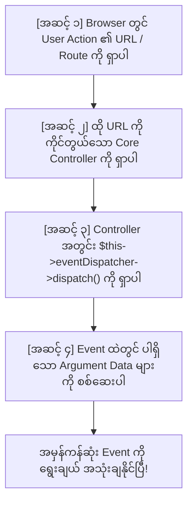

# EC-CUBE 4.3 - EccubeEvents ရှာဖွေရွေးချယ်နည်းနှင့် တွေးခေါ်စဉ်းစားနည်း လက်စွဲလမ်းညွှန်
## (How to Discover, Think & Select EccubeEvents in EC-CUBE Standard)

EC-CUBE တွင် Feature သစ်များ ထည့်သွင်းခြင်း၊ User လှုပ်ရှားမှုများကို ခြေရာခံခြင်း သို့မဟုတ် Business Logic များ ချိတ်ဆက်ရာတွင် Core Files များကို တိုက်ရိုက် မပြင်ဘဲ **Event Hook Points** များကို အသုံးပြုရပါသည်။ ဤလက်စွဲစာအုပ်သည် **"မိမိ လိုအပ်သော လုပ်ဆောင်ချက်အတွက် ဘယ် Event ကို သုံးရမလဲ"**၊ **"ဘယ်လို တွေးခေါ်စဉ်းစားပြီး ရှာဖွေရမလဲ (Thinking Process)"** နှင့် **"EC-CUBE တွင် ပါရှိသော အခြား Events များကို မည်သို့ အသုံးချရမလဲ"** တို့ကို အတွေ့အကြုံ (၆) လခန့်ရှိသော Junior Developer များ အလွယ်တကူ လိုက်ပါနားလည်နိုင်စေရန် **မြန်မာဘာသာ** ဖြင့် ပြည့်စုံစွာ လမ်းညွှန်ထားခြင်း ဖြစ်ပါသည်။

---

## မာတိကာ (Table of Contents)
1. [ပြဿနာနှင့် အဓိက မေးခွန်းများ (Core Questions)](#၁-ပြဿနာနှင့်-အဓိက-မေးခွန်းများ)
2. [ဘယ်လို တွေးခေါ်စဉ်းစားပြီး ရှာရမလဲ? အဆင့် ၄ ဆင့် စဉ်းစားပုံ (The 4-Step Thinking Flow)](#၂-ဘယ်လို-တွေးခေါ်စဉ်းစားပြီး-ရှာရမလဲ-အဆင့်-၄-ဆင့်-စဉ်းစားပုံ)
3. [လက်တွေ့ သာဓက လေ့လာမှု (Case Study: Favorite Add & Remove Events)](#၃-လက်တွေ့-သာဓက-လေ့လာမှု-case-study)
4. [ဘာကြောင့် `_INITIALIZE` ကို မသုံးဘဲ `_COMPLETE` ကို သုံးရသလဲ? (Timing Decision)](#၄-ဘာကြောင့်-_initialize-ကို-မသုံးဘဲ-_complete-ကို-သုံးရသလဲ)
5. [EC-CUBE Events Naming Convention (အမည်ပေးပုံ စည်းမျဉ်း)](#၅-eccube-events-naming-convention-အမည်ပေးပုံ-စည်းမျဉ်း)
6. [တခြား EccubeEvents များကို ဘယ်မှာ ရှာတွေ့နိုင်သလဲ? (The Source of Truth)](#၆-တခြား-eccubeevents-များကို-ဘယ်မှာ-ရှာတွေ့နိုင်သလဲ)
7. [မကြာခဏ အသုံးများသော EccubeEvents စာရင်းချုပ်](#၇-မကြာခဏ-အသုံးများသော-eccubeevents-စာရင်းချုပ်)
8. [Terminal မှတစ်ဆင့် Events များကို အမြန် ရှာဖွေနည်း (Quick CLI Search Tricks)](#၈-terminal-မှတစ်ဆင့်-events-များကို-အမြန်-ရှာဖွေနည်း)

---

## ၁. ပြဿနာနှင့် အဓိက မေးခွန်းများ

ဥပမာအားဖြင့် Customer တစ်ဦး ကုန်ပစ္စည်းကို Favorite ခလုတ်နှိပ်သည့်အခါ (ON) နှင့် ပြန်ဖြုတ်သည့်အခါ (OFF) ကို အလိုအလျောက် သမိုင်းမှတ်တမ်း (History) သိမ်းချင်သည် ဆိုပါစို့-
- `EccubeEvents::FRONT_PRODUCT_FAVORITE_ADD_COMPLETE`
- `EccubeEvents::FRONT_MYPAGE_MYPAGE_DELETE_COMPLETE`

ဤ Event များကို ဘယ်လိုသိနိုင်မလဲ? နောင်တွင် အခြား Feature တစ်ခုခု (ဥပမာ - Add to Cart, Register, Checkout) လုပ်လိုပါက ဘယ် Event သုံးရမည်ကို မည်သို့ စဉ်းစားတွေးခေါ် ရှာဖွေရမည်နည်း?

---

## ၂. ဘယ်လို တွေးခေါ်စဉ်းစားပြီး ရှာရမလဲ? အဆင့် ၄ ဆင့် စဉ်းစားပုံ

Junior Developer တစ်ယောက် အနေဖြင့် Feature တစ်ခုကို Event Hook လုပ်ချင်သည့်အခါ အလွတ်ကျက်စရာမလိုဘဲ အောက်ပါ **အဆင့် (၄) ဆင့် Flow** အတိုင်း စနစ်တကျ လိုက်ရှာရပါသည်:



---

## ၃. လက်တွေ့ သာဓက လေ့လာမှု (Case Study)

### အဆင့် (၁) - Browser တွင် User Action ၏ URL ကို ရှာပါ
1. Browser တွင် ကုန်ပစ္စည်း Detail စာမျက်နှာကို ဖွင့်ပြီး **F12 (DevTools) -> Network Tab** ကို ဖွင့်ထားပါ။
2. **"Favorite (お気に入りに追加)"** ခလုတ်ကို နှိပ်လိုက်သည့်အခါ ခေါ်ယူသွားသော URL လမ်းကြောင်းကို ကြည့်ပါ:
   - ➔ URL: `/products/add_favorite/{id}`
3. Mypage ရှိ Favorites စာရင်းတွင် **"Delete (削除)"** ခလုတ်ကို နှိပ်လိုက်သည့်အခါ ခေါ်ယူသွားသော URL လမ်းကြောင်းကို ကြည့်ပါ:
   - ➔ URL: `/mypage/favorite/{id}/delete`

### အဆင့် (၂) - ထို URL ကို ကိုင်တွယ်သော Core Controller ကို ရှာပါ
EC-CUBE Core Controllers များသည် `src/Eccube/Controller/` အောက်တွင် ရှိသည်:
- `/products/add_favorite/{id}` ➔ [src/Eccube/Controller/ProductController.php](file:///Users/kyawwaiyan/Documents/my-Home-tech/eccube-4.3.1/src/Eccube/Controller/ProductController.php) ၏ `addFavorite()` method
- `/mypage/favorite/{id}/delete` ➔ [src/Eccube/Controller/Mypage/MypageController.php](file:///Users/kyawwaiyan/Documents/my-Home-tech/eccube-4.3.1/src/Eccube/Controller/Mypage/MypageController.php) ၏ `delete()` method

### အဆင့် (၃) - Controller ထဲတွင် `dispatch()` ခေါ်ထားသော နေရာကို ကြည့်ပါ
အဆိုပါ Controller method များထဲတွင် `eventDispatcher->dispatch(...)` ဟု ရေးထားသော နေရာကို ရှာဖွေပါ:

#### (က) `ProductController.php` (Line 277 - 286):
```php
// 1. Database ထဲ Favorite အမှန်တကယ် Add သည့် Logic
$this->customerFavoriteProductRepository->addFavorite($Customer, $Product);

// 2. Add ပြီးဆုံးသွားချိန်တွင် Dispatch လုပ်ပေးလိုက်သော Event
$event = new EventArgs(
    [
        'Product' => $Product,
    ],
    $request
);
$this->eventDispatcher->dispatch($event, EccubeEvents::FRONT_PRODUCT_FAVORITE_ADD_COMPLETE);
```

#### (ခ) `MypageController.php` (Line 365 - 376):
```php
// 1. Database ထဲမှ Favorite ကို အမှန်တကယ် ဖျက်ထုတ်သည့် Logic
$this->customerFavoriteProductRepository->delete($CustomerFavoriteProduct);

// 2. Delete ပြီးဆုံးသွားချိန်တွင် Dispatch လုပ်ပေးလိုက်သော Event
$event = new EventArgs(
    [
        'Customer' => $Customer,
        'CustomerFavoriteProduct' => $CustomerFavoriteProduct,
    ], 
    $request
);
$this->eventDispatcher->dispatch($event, EccubeEvents::FRONT_MYPAGE_MYPAGE_DELETE_COMPLETE);
```

### အဆင့် (၄) - Event ထဲတွင် ပါရှိသော Argument Data များကို စစ်ဆေးပါ
Event Dispatch လုပ်ရာတွင် ပေးပို့လိုက်သော array arguments များကို ကြည့်ပါ:
- `FRONT_PRODUCT_FAVORITE_ADD_COMPLETE` ➔ `$event->getArgument('Product')` ရရှိနိုင်ပြီး Login ဝင်ထားသော Customer ကို `$this->security->getUser()` ဖြင့် ရယူနိုင်ပါသည်။
- `FRONT_MYPAGE_MYPAGE_DELETE_COMPLETE` ➔ `$event->getArgument('Customer')` နှင့် `$event->getArgument('CustomerFavoriteProduct')` တို့ အပြည့်အစုံ ပါဝင်ပါသည်။

ထို့ကြောင့် ဤ Event နှစ်ခုကို ဖမ်းယူခြင်းဖြင့် Favorite Register နှင့် Remove သမိုင်းမှတ်တမ်း (History) ကို အပြည့်အဝ တည်ဆောက်နိုင်မည် ဖြစ်ကြောင်း သေချာသိရှိနိုင်ပါသည်။

---

## ၄. ဘာကြောင့် `_INITIALIZE` ကို မသုံးဘဲ `_COMPLETE` ကို သုံးရသလဲ?

Controller တိုင်းတွင် ပုံမှန်အားဖြင့် Event (၂) မျိုး dispatch လုပ်လေ့ရှိပါသည်:

| Timing | ဥပမာ Event အမည် | ခေါ်ယူသည့် အချိန်ကာလ | သုံးသင့်/မသုံးသင့် သုံးသပ်ချက် |
| :--- | :--- | :--- | :--- |
| **`_INITIALIZE`** | `FRONT_PRODUCT_FAVORITE_ADD_INITIALIZE` | Database ထဲသို့ မသိမ်းဆည်းမီ၊ စစ်ဆေးမှုများ မစတင်မီ ခေါ်ခြင်း | **History မှတ်တမ်းအတွက် မသုံးသင့်ပါ။** အဘယ်ကြောင့်ဆိုသော် Customer က Login မဝင်ရသေးပါက သို့မဟုတ် Error တက်သွားပါက Database ထဲ Favorite မဝင်ဘဲ ကျန်နေမည်ဖြစ်ပြီး၊ History ထဲတွင် မှားယွင်းသော ဒေတာ (False Record) ဝင်သွားနိုင်သောကြောင့် ဖြစ်သည်။ |
| **`_COMPLETE`** | `FRONT_PRODUCT_FAVORITE_ADD_COMPLETE` | Database ထဲသို့ Data အမှန်တကယ် သိမ်းဆည်းပြီးမှ ခေါ်ခြင်း | **History မှတ်တမ်းအတွက် မဖြစ်မနေ သုံးရပါမည်။** လုပ်ဆောင်ချက် အမှန်တကယ် အောင်မြင်ပြီးစီးမှသာ ခေါ်ယူသောကြောင့် ၁၀၀% တိကျခိုင်မာသော သမိုင်းမှတ်တမ်း ဖြစ်စေသည်။ |

---

## ၅. EC-CUBE Events Naming Convention (အမည်ပေးပုံ စည်းမျဉ်း)

EC-CUBE ၏ Event Constant များအားလုံးသည် အောက်ပါ စံသတ်မှတ်ချက်အတိုင်း အမည်ပေးထားပါသည်-

$$\mathbf{EccubeEvents::[AREA]\_[CONTROLLER]\_[ACTION]\_[TIMING]}$$

```
ဥပမာ: FRONT_PRODUCT_FAVORITE_ADD_COMPLETE
      ├── FRONT_      -> Area (Customer Storefront ဘက်)
      ├── PRODUCT_    -> Controller (ProductController)
      ├── FAVORITE_ADD_ -> Action (အကြိုက်ဆုံး ထည့်သွင်းခြင်း)
      └── COMPLETE    -> Timing (အောင်မြင်စွာ ပြီးဆုံးချိန်)
```

### အဓိက အစိတ်အပိုင်းများ ရှင်းလင်းချက်:
1. **`[AREA]` (ဧရိယာ):**
   - `FRONT_` : Customer များ အသုံးပြုသော မျက်နှာပြင်များ
   - `ADMIN_` : Back-Office စီမံခန့်ခွဲသူများ အသုံးပြုသော မျက်နှာပြင်များ
2. **`[CONTROLLER]` (သက်ဆိုင်ရာ Controller):**
   - `PRODUCT_`, `SHOPPING_`, `CART_`, `MYPAGE_`, `ORDER_`, `CUSTOMER_`, `ENTRY_` စသည်
3. **`[ACTION]` (လုပ်ဆောင်ချက်):**
   - `INDEX_`, `EDIT_`, `DELETE_`, `ADD_`, `CONFIRM_`, `LOGIN_` စသည်
4. **`[TIMING]` (အချိန်ကာလ အခြေအနေ):**
   - `INITIALIZE` : စတင်မလုပ်ဆောင်မီ (Pre-processing / Validation)
   - `COMPLETE` : အောင်မြင်စွာ ပြီးဆုံးပြီးချိန် (Post-processing / Logging / Audit)
   - `EXCEPTION` : အမှားအယွင်း ဖြစ်ပေါ်ချိန်

---

## ၆. တခြား EccubeEvents များကို ဘယ်မှာ ရှာတွေ့နိုင်သလဲ?

EC-CUBE တွင် အသုံးပြုနိုင်သော Event Constant ပေါင်း ရာနှင့်ချီကို အောက်ပါ **ပင်မဖိုင်တစ်ခုတည်း** တွင် စုစည်းပြဌာန်းထားပါသည်-

📁 **ဖိုင်တည်နေရာ:** [src/Eccube/Event/EccubeEvents.php](file:///Users/kyawwaiyan/Documents/my-Home-tech/eccube-4.3.1/src/Eccube/Event/EccubeEvents.php)

ဤဖိုင်ကို IDE တွင် ဖွင့်ကြည့်ပါက Controller အလိုက်၊ လုပ်ဆောင်ချက်အလိုက် အောက်ပါအတိုင်း စနစ်တကျ အုပ်စုဖွဲ့ထားသည်ကို တွေ့မြင်နိုင်ပါသည်။

---

## ၇. မကြာခဏ အသုံးများသော EccubeEvents စာရင်းချုပ်

Junior Developer များ နေ့စဉ် လုပ်ငန်းခွင်တွင် အသုံးအများဆုံး EC-CUBE Events များကို အောက်ပါအတိုင်း စုစည်းဖော်ပြပေးထားပါသည်:

### ၇.၁ ဈေးဝယ်ယူမှုနှင့် Cart ဆိုင်ရာ Events (Shopping & Cart)
```php
// Cart ထဲ ကုန်ပစ္စည်း ထည့်ပြီးချိန်
EccubeEvents::FRONT_CART_ADD_COMPLETE

// Cart ထဲမှ ကုန်ပစ္စည်း တစ်ခုခု ဖျက်ထုတ်လိုက်ချိန်
EccubeEvents::FRONT_CART_CART_DELETE_COMPLETE

// Checkout (Order Confirm) စာမျက်နှာ မပြသမီ
EccubeEvents::FRONT_SHOPPING_CONFIRM_INITIALIZE

// ဝယ်ယူသူ ငွေချေပြီး အော်ဒါ အောင်မြင်စွာ တင်ပြီးချိန် (အရောင်းအဝယ် အပြီးသတ်)
EccubeEvents::FRONT_SHOPPING_COMPLETE_INITIALIZE
```

### ၇.၂ အသင်းဝင် စာရင်းသွင်းခြင်းနှင့် အကောင့်ဆိုင်ရာ Events (Customer & Auth)
```php
// ဝယ်ယူသူ အသစ် စာရင်းသွင်း (Sign up) ပြီးချိန်
EccubeEvents::FRONT_ENTRY_COMPLETE

// အသင်းဝင် Login စတင် ဝင်ရောက်ချိန်
EccubeEvents::FRONT_MYPAGE_LOGIN_INITIALIZE

// အသင်းဝင် မိမိ Profile အချက်အလက်များ ပြင်ဆင်ပြီးချိန်
EccubeEvents::FRONT_MYPAGE_CHANGE_COMPLETE

// အသင်းဝင် မိမိ အကောင့်ကို ဖျက်သိမ်း (Withdraw) သွားချိန်
EccubeEvents::FRONT_MYPAGE_WITHDRAW_COMPLETE
```

### ၇.၃ Admin Panel စီမံခန့်ခွဲမှုဆိုင်ရာ Events (Admin Operations)
```php
// Admin စီမံခန့်ခွဲသူ Login အောင်မြင်သွားချိန်
EccubeEvents::ADMIN_ADMIM_LOGIN_INITIALIZE

// Admin က ကုန်ပစ္စည်း အသစ်ထည့်ခြင်း သို့မဟုတ် ပြင်ဆင်ခြင်း ပြီးဆုံးချိန်
EccubeEvents::ADMIN_PRODUCT_EDIT_COMPLETE

// Admin က ကုန်ပစ္စည်း ဖျက်ထုတ်လိုက်ချိန်
EccubeEvents::ADMIN_PRODUCT_DELETE_COMPLETE

// Admin က အော်ဒါအချက်အလက် (Status, Payment, Shipping) ပြင်ဆင်ပြီးချိန်
EccubeEvents::ADMIN_ORDER_EDIT_COMPLETE

// Admin က ဝယ်ယူသူ အချက်အလက်များ ပြင်ဆင်ပြီးချိန်
EccubeEvents::ADMIN_CUSTOMER_EDIT_COMPLETE
```

---

## ၈. Terminal မှတစ်ဆင့် Events များကို အမြန် ရှာဖွေနည်း

မိမိ လိုအပ်သော လုပ်ဆောင်ချက်နှင့် ပတ်သက်သည့် Event Constant များကို Terminal တွင် `grep` အသုံးပြု၍ စက္ကန့်ပိုင်းအတွင်း ရှာဖွေနိုင်ပါသည်:

```bash
# ၁။ Cart နှင့် ပတ်သက်သော COMPLETE Events အားလုံးကို ရှာဖွေခြင်း
grep -i "CART.*COMPLETE" src/Eccube/Event/EccubeEvents.php

# ၂။ Order / Shopping နှင့် ပတ်သက်သော Events များကို ရှာဖွေခြင်း
grep -i "SHOPPING.*COMPLETE" src/Eccube/Event/EccubeEvents.php

# ၃။ Customer / Entry နှင့် ပတ်သက်သော Events များကို ရှာဖွေခြင်း
grep -i "ENTRY.*COMPLETE" src/Eccube/Event/EccubeEvents.php

# ၄။ Admin Product Edit နှင့် ပတ်သက်သော Events များကို ရှာဖွေခြင်း
grep -i "ADMIN_PRODUCT.*COMPLETE" src/Eccube/Event/EccubeEvents.php
```

---

## ၉. အနှစ်ချုပ် သတိပြုရန် အချက် (Key Takeaway)

> [!TIP]
> နောင်တွင် မည်သည့် Feature အသစ်မဆို ရေးသားလိုသည့်အခါ Core ဖိုင်များကို ပြင်ဆင်ရန် မကြိုးစားပါနှင့်။
> အမြဲတမ်း **(၁) Browser Route ရှာမည် ➔ (၂) Controller ကို စစ်ဆေးမည် ➔ (၃) dispatch() ခေါ်ထားသော COMPLETE Event ကို ရွေးချယ်မည် ➔ (၄) EventSubscriber တွင် Hook လုပ်ပြီး မိမိ Custom Logic ကို ရေးသားမည်** ဟူသော Standard လမ်းစဉ်အတိုင်းသာ တည်ဆောက်သွားရမည် ဖြစ်ပါသည်။
