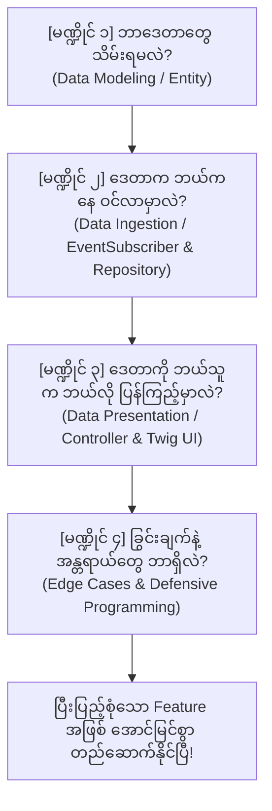

# EC-CUBE 4.3 - Feature တစ်ခု စတင်တည်ဆောက်ရာတွင် တွေးခေါ်စဉ်းစားနည်းနှင့် ချဉ်းကပ်ပုံ လက်စွဲလမ်းညွှန်
## (The Mental Model & Architecture Thinking Guide for EC-CUBE Feature Development)

Feature တစ်ခုခု သို့မဟုတ် Business Logic အသစ်တစ်ခုခုကို ရေးသားတော့မည်ဆိုပါက Code တန်းမရေးမီ **"ဘယ်လို စတင်စဉ်းစားရမလဲ" (How to Think First)**၊ **"ဒေတာနှင့် လုပ်ဆောင်ချက်များကို ဘယ်လို ချိတ်ဆက်တွေးခေါ်ရမလဲ"** ဆိုသည့် Mental Model သည် Developer တစ်ဦးအတွက် အရေးအကြီးဆုံး အခြေခံအုတ်မြစ် ဖြစ်ပါသည်။ 

ဤလက်စွဲစာအုပ်သည် အတွေ့အကြုံ (၆) လခန့်ရှိသော Junior Developer များအနေဖြင့် မည်သည့် Feature ကိုမဆို စနစ်တကျ ခွဲခြမ်းစိတ်ဖြာပြီး Enterprise Standard အတိုင်း တည်ဆောက်နိုင်စေရန် **မြန်မာဘာသာ** ဖြင့် ပြည့်စုံစွာ လမ်းညွှန်ထားခြင်း ဖြစ်ပါသည်။

---

## မာတိကာ (Table of Contents)
1. [Developer တစ်ဦး၏ အခြေခံ တွေးခေါ်စဉ်းစားနည်း မဏ္ဍိုင်ကြီး ၄ ခု (The 4 Mental Pillars)](#၁-developer-တစ်ဦး၏-အခြေခံ-တွေးခေါ်စဉ်းစားနည်း-မဏ္ဍိုင်ကြီး-၄-ခု)
2. [မဏ္ဍိုင် (၁) - Data Modeling (5W1H နည်းလမ်းဖြင့် ဘာဒေတာတွေ သိမ်းမလဲ စဉ်းစားခြင်း)](#၂-မဏ္ဍိုင်-၁---data-modeling-5w1h-နည်းလမ်း)
3. [မဏ္ဍိုင် (၂) - Data Ingestion (ဒေတာက ဘယ်နေရာ၊ ဘယ်အချိန်မှာ စတင်ဝင်ရောက်လာမှာလဲ?)](#၃-မဏ္ဍိုင်-၂---data-ingestion-ဒေတာဝင်ရောက်လာသည့်-အခြေအနေ)
4. [မဏ္ဍိုင် (၃) - Data Presentation (ဒေတာကို ဘယ်သူက ဘယ်လို ပြန်လည်ကြည့်ရှုမှာလဲ?)](#၄-မဏ္ဍိုင်-၃---data-presentation-ဒေတာပြသခြင်း)
5. [မဏ္ဍိုင် (၄) - Edge Cases & Safety (မထင်မှတ်ထားသော ပြဿနာများနှင့် ကာကွယ်မှု)](#၅-မဏ္ဍိုင်-၄---edge-cases--safety)
6. [လက်တွေ့ ဥပမာ သာဓကများ နှိုင်းယှဉ်ချက် (Comparative Case Studies)](#၆-လက်တွေ့-ဥပမာ-သာဓကများ-နှိုင်းယှဉ်ချက်)
7. [Feature တစ်ခု ဖန်တီးတိုင်း အသုံးပြုရမည့် အဆင့်ဆင့် Checklist](#၇-feature-တစ်ခု-ဖန်တီးတိုင်း-အသုံးပြုရမည့်-အဆင့်ဆင့်-checklist)

---

## ၁. Developer တစ်ဦး၏ အခြေခံ တွေးခေါ်စဉ်းစားနည်း မဏ္ဍိုင်ကြီး ၄ ခု

မည်သည့် Feature ကိုမဆို စတင်ချဉ်းကပ်သည့်အခါ အောက်ပါ မဏ္ဍိုင်ကြီး (၄) ခု အတိုင်း အစဉ်လိုက် စဉ်းစားတွေးခေါ်ရပါသည်:

---

## ၂. မဏ္ဍိုင် (၁) - Data Modeling (5W1H နည်းလမ်း)

ပထမဆုံး စတင်မေးမြန်းရမည့် မေးခွန်းမှာ **"ဒီ Feature အလုပ်လုပ်ဖို့ စနစ်ထဲမှာ ဘယ်အချက်အလက် (Data) တွေ မဖြစ်မနေ သိမ်းထားရမလဲ?"** ဖြစ်ပါသည်။

ဤနေရာတွင် ဂျာနယ်လစ်များနှင့် စုံစမ်းစစ်ဆေးသူများ အသုံးပြုသော **5W1H မူဘောင်** ဖြင့် မေးခွန်းထုတ်ရပါသည်:

| မေးခွန်း (Question) | စဉ်းစားပုံ (Mental Thought) | Favorite History သာဓက | Database Column / Mapping |
| :--- | :--- | :--- | :--- |
| **Who (ဘယ်သူလဲ?)** | မည်သူက ဤလုပ်ဆောင်ချက်ကို ပြုလုပ်ခဲ့သနည်း? | Login ဝင်ထားသော ဝယ်ယူသူ (Customer) | `customer_id` (ManyToOne to `Customer`) |
| **What (ဘာပစ္စည်းလဲ?)** | မည်သည့် အရာဝတ္ထု/ပစ္စည်းပေါ်တွင် ပြုလုပ်သနည်း? | အကြိုက်ဆုံး ထည့်ခံရသော ကုန်ပစ္စည်း (Product) | `product_id` (ManyToOne to `Product`) |
| **How (ဘာလုပ်တာလဲ?)** | မည်သည့် Action အမျိုးအစား ဖြစ်ပေါ်ခဲ့သနည်း? | ထည့်သွင်းခြင်း (Add) လား၊ ဖျက်ထုတ်ခြင်း (Remove) လား? | `action` (string: `'register'` / `'remove'`) |
| **When (ဘယ်အချိန်လဲ?)** | မည်သည့် ရက်စွဲနှင့် အချိန်တွင် ဖြစ်ပွားခဲ့သနည်း? | နှိပ်လိုက်သည့် တိကျသော အချိန် | `create_date` (datetime) |
| **Primary Key** | ဒေတာ record တစ်ခုချင်းစီကို မည်သို့ ခွဲခြားမလဲ? | Auto-increment ID နံပါတ် | `id` (integer, unsigned, Primary Key) |

> 💡 **ရရှိလာသော အဖြေ (Outcome):**  
> ဤမေးခွန်းများကို ဖြေဆိုပြီးသည်နှင့် Doctrine ORM Entity Model အသစ် ဖြစ်သော `CustomerFavoriteProductHistory.php` ၏ ဖွဲ့စည်းပုံတစ်ခုလုံး အဆင်သင့် ထွက်ပေါ်လာပါသည်။

---

## ၃. မဏ္ဍိုင် (၂) - Data Ingestion (ဒေတာဝင်ရောက်လာသည့် အခြေအနေ)

ဒုတိယ စဉ်းစားရမည့် မေးခွန်းမှာ **"အထက်ပါ ဒေတာတွေကို ဘယ်နေရာ၊ ဘယ်အချိန်မှာ စနစ်က ဖမ်းယူပြီး Database ထဲ ဘယ်လို သိမ်းမလဲ?"** ဖြစ်ပါသည်။

### ၃.၁ ဒေတာ စတင်ဖြစ်ပေါ်သည့် Trigger Point ကို စဉ်းစားခြင်း:
- User က Browser ပေါ်တွင် ခလုတ်တစ်ခုခု နှိပ်လိုက်တာလား? ➔ **Event / Controller Action**
- Form တစ်ခုခု ဖြည့်စွက်ပြီး Submit လုပ်လိုက်တာလား? ➔ **Form Extension / Controller**
- လူမပါဘဲ စနစ်က အချိန်မှန် အလိုအလျောက် အလုပ်လုပ်တာလား? ➔ **Cron Job / Console Command**

### ၃.၂ EC-CUBE Standard Law ဖြင့် ချိန်ထိုးခြင်း:
- **မေးခွန်း:** *"Core Controller (ဥပမာ- ProductController) ကို သွားပြင်လို့ ရမလား?"*
- **အဖြေ:** **လုံးဝ မရပါ (Never Modify Core Files Directly)**။
- **အဖြေရှာပုံ:** Core ဖိုင်က ပေးထားသော မူရင်း Event Hook Point ဘာရှိသလဲ?
  - Favorite Add ပြီးချိန် ➔ `EccubeEvents::FRONT_PRODUCT_FAVORITE_ADD_COMPLETE`
  - Favorite Remove ပြီးချိန် ➔ `EccubeEvents::FRONT_MYPAGE_MYPAGE_DELETE_COMPLETE`

### ၃.၃ Database ထဲ ထည့်သွင်းမည့် ယန္တရား (Repository Logic):
- Event ဖမ်းမိသည့်အခါ ဒေတာကို Database ထဲသို့ `persist()` နှင့် `flush()` လုပ်ပေးနိုင်ရန် သီးသန့် **Custom Repository Method (`addHistory()`)** လိုအပ်မည်ဟု ချိတ်ဆက်တွေးခေါ်ရသည်။

> 💡 **ရရှိလာသော အဖြေ (Outcome):**  
> `FavoriteEventListener.php` (Event Subscriber) + `CustomerFavoriteProductHistoryRepository.php` (Data Access Layer) အပိုင်း ထွက်ပေါ်လာပါသည်။

---

## ၄. မဏ္ဍိုင် (၃) - Data Presentation (ဒေတာပြသခြင်း)

တတိယ စဉ်းစားရမည့် မေးခွန်းမှာ **"Database ထဲ သိမ်းထားတဲ့ ဒေတာတွေကို ဘယ်နေရာမှာ၊ ဘယ်သူ့ကို၊ ဘယ်လို UI Design နဲ့ ပြန်လည်ပြသပေးမှာလဲ?"** ဖြစ်ပါသည်။

### ၄.၁ ဘယ်သူ ကြည့်ရှုခွင့်ရှိသလဲ? (Target Audience & Security):
- စီမံခန့်ခွဲသူ (Admin) သာ ကြည့်ရမည်လား? သို့မဟုတ် ဝယ်ယူသူ (Customer) ကိုယ်တိုင် ကြည့်ရမည်လား?
- လက်ရှိ လိုအပ်ချက်အရ Admin Panel တွင် ကြည့်ရှုရန် ဖြစ်သည်။

### ၄.၂ ဝင်ရောက်ကြည့်ရှုမည့် လမ်းကြောင်း (Navigation Flow):
- Admin သည် ကုန်ပစ္စည်းတစ်ခုချင်းစီ၏ Favorite အပြောင်းအလဲ မှတ်တမ်းကို ကြည့်လိုသဖြင့် ရှိပြီးသား Favorites Management စာရင်း (`/admin/product/favourite`) ထဲတွင် **"履歴 (History)"** ခလုတ် link ထည့်သွင်းပေးရမည်။
- နှိပ်လိုက်ပါက စာမျက်နှာအသစ် (New Page) ဖြင့် ဖွင့်ပေးမည်-
  - Route: `/admin/product/favourite/{id}/history`

### ၄.၃ UI / UX ဒီဇိုင်း စဉ်းစားခြင်း:
- အချက်အလက် များပြားလာနိုင်သဖြင့် **Pagination (စာမျက်နှာခွဲခြားခြင်း)** မဖြစ်မနေ လိုအပ်မည်။
- Action ကို စာသားရိုးရိုး မပြဘဲ အမြင်ရှင်းစေရန် Bootstrap Badge များ သုံးမည်:
  - `register` ➔ Badge အစိမ်းရောင် `[ 登録 ]`
  - `remove` ➔ Badge အနီရောင် `[ 解除 ]`
- ရက်စွဲကို အသစ်ဆုံးမှ အဟောင်းသို့ `DESC` စီတန်းပြသမည်။

> 💡 **ရရှိလာသော အဖြေ (Outcome):**  
> Admin Controller (`FavouriteProductHistoryController.php`) + Twig UI Template (`product_favourite_history.twig`) အပိုင်း ထွက်ပေါ်လာပါသည်။

---

## ၅. မဏ္ဍိုင် (၄) - Edge Cases & Safety

Developer ကောင်းတစ်ဦးသည် ပုံမှန်အဆင်ပြေနေသော အခြေအနေ (Happy Path) သာမက **မထင်မှတ်ထားသော ပြဿနာများ (Edge Cases)** ကိုပါ ကြိုတင်ကာကွယ် ထည့်သွင်းစဉ်းစားရပါသည်:

1. **"အကယ်၍ Customer က နောင်တစ်ချိန် အကောင့်ဖျက်သိမ်း (Delete/Withdraw) သွားပါက အဘယ်သို့ ဖြစ်မည်နည်း?"**
   - **အန္တရာယ်:** Database တွင် Foreign Key Constraint Error တက်နိုင်သည် သို့မဟုတ် History ပျက်သွားနိုင်သည်။
   - **ဖြေရှင်းချက်:** `@ORM\JoinColumn(name="customer_id", onDelete="SET NULL")` သတ်မှတ်ခြင်းဖြင့် Customer ပျက်သွားသော်လည်း History Record မပျက်ဘဲ `customer_id` သာ null ဖြစ်ကျန်ရစ်စေသည်။
2. **"Customer က Login မဝင်ဘဲ Favorite နှိပ်မိပါက အဘယ်သို့ ဖြစ်မည်နည်း?"**
   - **အဖြေ:** EC-CUBE မူရင်း Controller သည် Login မဝင်ရသေးပါက Login Screen သို့ redirect လုပ်ပြီးသား ဖြစ်သဖြင့် `_COMPLETE` event သည် Login ဝင်ပြီးမှသာ trigger ဖြစ်မည်။ ထို့ကြောင့် False Data မဝင်ရောက်နိုင်ပါ။
3. **"သန်းနှင့်ချီသော Data များ ဖြစ်လာပါက Query နှေးကွေးသွားနိုင်သလား?"**
   - **ဖြေရှင်းချက်:** Product အလိုက် ရှာဖွေမှု အမြဲပြုလုပ်မည် ဖြစ်သောကြောင့် `product_id` နှင့် `create_date` တို့ကို Index ထည့်သွင်းစဉ်းစားရမည်။

---

## ၆. လက်တွေ့ ဥပမာ သာဓကများ နှိုင်းယှဉ်ချက် (Comparative Case Studies)

အထက်ပါ မဏ္ဍိုင် ၄ ခုအတိုင်း တွေးခေါ်ပါက အခြား Feature များကိုလည်း လွယ်ကူစွာ ဒီဇိုင်းဆွဲနိုင်ပါသည်:

| အဆင့် | Favorite History (အကြိုက်ဆုံး မှတ်တမ်း) | Login History (လော့ဂ်အင် မှတ်တမ်း) | Cart Abandonment (လှည်းကျန် မှတ်တမ်း) |
| :---: | :--- | :--- | :--- |
| **Data (ဘာသိမ်းမလဲ?)** | Customer, Product, Action, Date | User Name, IP Address, Status, Date | Customer, Product, Quantity, Date |
| **Trigger (ဘယ်ကဝင်မလဲ?)** | Favorite Add / Delete | Login Success / Login Failure | Cart Add ပြုလုပ်ပြီး Order မချေမီ |
| **Hook Point (ဘယ် Event သုံးမလဲ?)** | `FRONT_PRODUCT_FAVORITE_ADD_COMPLETE` `FRONT_MYPAGE_MYPAGE_DELETE_COMPLETE` | `SecurityEvents::INTERACTIVE_LOGIN` `AuthenticationEvents::AUTHENTICATION_FAILURE` | `FRONT_CART_ADD_COMPLETE` |
| **Storage (ဘယ်မှာသိမ်းမလဲ?)** | `CustomerFavoriteProductHistoryRepository` | `LoginHistoryRepository` | `CartHistoryRepository` |
| **Presentation (ဘယ်မှာပြမလဲ?)** | Admin Product Favorites Page | Admin Member Detail / Security Logs | Admin Marketing / Cart Analysis Page |

---

## ၇. Feature တစ်ခု ဖန်တီးတိုင်း အသုံးပြုရမည့် အဆင့်ဆင့် Checklist

နောင်တွင် Feature တစ်ခုခု ရေးသားတော့မည်ဆိုပါက အောက်ပါ Checklist ကို တစ်ဆင့်ပြီးတစ်ဆင့် အမှန်ခြစ်၍ လုပ်ဆောင်သွားနိုင်ပါသည်:

- [ ] **Step 1 (Entity):** 5W1H ဖြင့် Data field များကို ဆုံးဖြတ်ပြီး Entity Model တည်ဆောက်ပါ။
- [ ] **Step 2 (Repository):** ဒေတာ save မည့် `add...()` method နှင့် ဆွဲထုတ်မည့် QueryBuilder ကို ရေးပါ။
- [ ] **Step 3 (Database Update):** `bin/console eccube:generate:proxies` နှင့် `doctrine:schema:update --force` command များ run ပါ။
- [ ] **Step 4 (Event Interception):** Browser Route ကို ရှာပြီး Core Controller ထဲမှ သက်ဆိုင်ရာ `COMPLETE` Event ကို EventSubscriber ဖြင့် ဖမ်းယူပါ။
- [ ] **Step 5 (Admin Controller):** Request လက်ခံပြီး Paginator ဖြင့် Data ဆွဲထုတ်မည့် Controller တည်ဆောက်ပါ။
- [ ] **Step 6 (Twig UI Template):** စာရင်းကို ရှင်းလင်းလှပစွာ ပြသနိုင်သော View Template ဖန်တီးပါ။
- [ ] **Step 7 (Clear Cache & Test):** `bin/console cache:clear --no-warmup` run ပြီး Front Store နှင့် Admin Panel တို့တွင် စမ်းသပ်စစ်ဆေးပါ။
