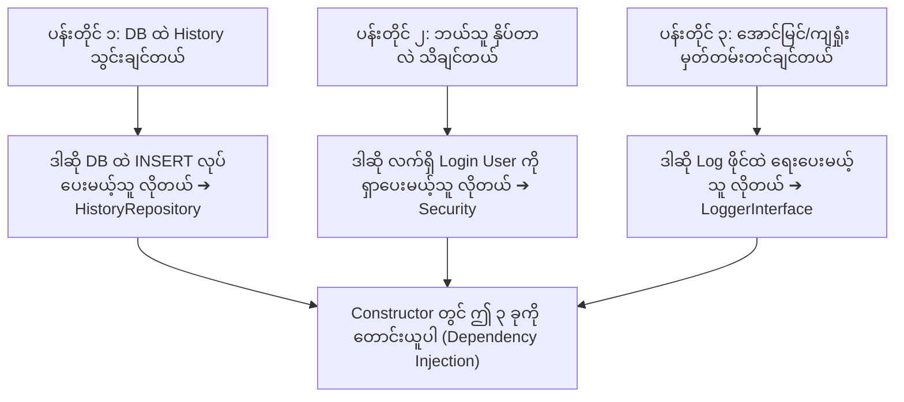
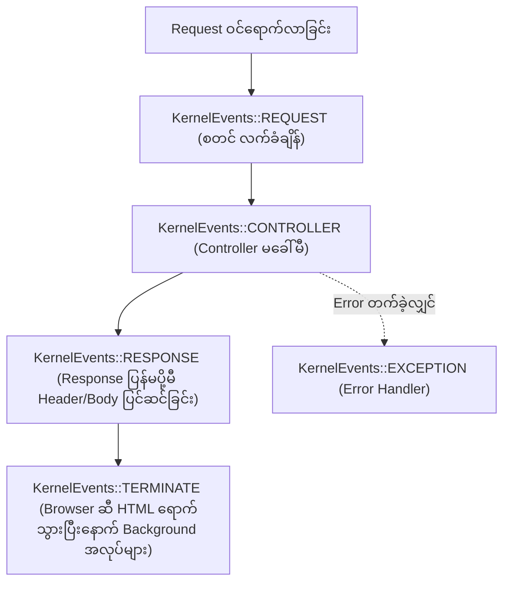

# EC-CUBE 4.3 - EventArgs, Dependency Injection နှင့် Listener Logic အတွင်းကျကျ ရှင်းလင်းချက်
## (EventArgs, Dependencies Thinking & EventListener Execution Logic Deep Dive)

EventListener တစ်ခုကို ရေးသားသည့်အခါ **"Constructor တွင် `Repository`, `Security`, `Logger` များကို အဘယ်ကြောင့် မဖြစ်မနေ ထည့်သွင်းရသလဲ"**၊ **"ထိုသို့ လိုအပ်မှန်း မည်သို့ စတင်တွေးခေါ်ရသလဲ"**၊ **"`EventArgs $event` ဆိုသည်မှာ အဘယ်နည်း"** နှင့် **"အကြိုက်ဆုံး ထည့်သွင်းခြင်း/ဖျက်ထုတ်ခြင်း Logic များ တစ်ကြောင်းချင်းစီ အလုပ်လုပ်ပုံ"** တို့ကို အတွေ့အကြုံ (၆) လခန့်ရှိသော Junior Developer များ ရှင်းလင်းပြတ်သားစွာ နားလည်စေရန် **မြန်မာဘာသာ** ဖြင့် အသေးစိတ် ရေးသားထားသော လက်စွဲစာအုပ် ဖြစ်ပါသည်။

---

## မာတိကာ (Table of Contents)
1. [`EventArgs $event` ဆိုတာ ဘာလဲ? ဘာအတွက် သုံးတာလဲ? (What is EventArgs?)](#၁-eventargs-event-ဆိုတာ-ဘာလဲ)
2. [Constructor တွင် `Repository`, `Security`, `Logger` အဘယ်ကြောင့် လိုအပ်မှန်း စဉ်းစားပုံ (How to Think to Get Dependencies)](#၂-constructor-တွင်-repository-security-logger-အဘယ်ကြောင့်-လိုအပ်မှန်း-စဉ်းစားပုံ)
3. [Favorite Add (အကြိုက်ဆုံး ထည့်သွင်းခြင်း) Logic တစ်ကြောင်းချင်း အသေးစိတ် ရှင်းလင်းချက်](#၃-favorite-add-logic-တစ်ကြောင်းချင်း-အသေးစိတ်-ရှင်းလင်းချက်)
4. [Favorite Remove (အကြိုက်ဆုံး ဖျက်ထုတ်ခြင်း) Logic တစ်ကြောင်းချင်း အသေးစိတ် ရှင်းလင်းချက်](#၄-favorite-remove-logic-တစ်ကြောင်းချင်း-အသေးစိတ်-ရှင်းလင်းချက်)
5. [အဘယ်ကြောင့် `try-catch (\Throwable $e)` ကို မဖြစ်မနေ သုံးရသလဲ? (Defensive Architecture)](#၅-အဘယ်ကြောင့်-try-catch-throwable-e-ကို-မဖြစ်မနေ-သုံးရသလဲ)
6. [`['onOrderComplete', 10]` အဓိပ္ပာယ်နှင့် Event Priorities (ဦးစားပေး အဆင့်သတ်မှတ်ချက်)](#၆-onordercomplete-10-အဓိပ္ပာယ်နှင့်-event-priorities)
7. [Symfony Kernel Events (`KernelEvents`) နှင့် အသုံးအများဆုံး Feature များ](#၇-symfony-kernel-events-kernelevents-နှင့်-အသုံးအများဆုံး-feature-များ)
8. [Performance Overhead (စနစ် နှေးကွေးမှု) ကို ကာကွယ်ခြင်းနှင့် Background Task ဖြေရှင်းနည်းများ](#၈-performance-overhead-ကို-ကာကွယ်ခြင်းနှင့်-background-task-ဖြေရှင်းနည်းများ)
9. [Constructor တွင် လိုအပ်သော Service များကို မည်သို့ နားလည်သဘောပေါက်ပြီး ရွေးချယ်ရမလဲ? (Comprehensive Dependency Mapping)](#၉-constructor-တွင်-လိုအပ်သော-service-များကို-မည်သို့-နားလည်သဘောပေါက်ပြီး-ရွေးချယ်ရမလဲ)

---

## ၁. `EventArgs $event` ဆိုတာ ဘာလဲ?

### ဥပမာ ပုံဆောင်ချက် (The Delivery Parcel Analogy)
`EventArgs` ကို **"ချောပို့ ပါဆယ်ထုပ် (Delivery Package / Envelope)"** ဟု မြင်ယောင်ကြည့်ပါ။

1. **ပို့သူ (Sender):** Core Controller (ဥပမာ- `ProductController`) က လုပ်ဆောင်ချက်တစ်ခု ပြီးသွားသည့်အခါ EventDispatcher ထံသို့ `FRONT_PRODUCT_FAVORITE_ADD_COMPLETE` ဟူသော အချက်ပြခေါင်းလောင်း ထိုးလိုက်သည်။
2. **ထည့်ပေးလိုက်သော ပစ္စည်းများ (Payload):** ထိုအခါ Controller က လက်ဗလာဖြင့် ခေါင်းလောင်းထိုးရုံသာ မဟုတ်ဘဲ နားထောင်နေမည့်သူများ (Listeners) အသုံးပြုနိုင်ရန် သက်ဆိုင်ရာ Data များကို ပါဆယ်ထုပ် (`EventArgs`) ထဲ ထည့်ပေးလိုက်ပါသည်:
   ```php
   // Core Controller ထဲတွင် ပါဆယ်ထုတ်ပိုးပုံ:
   $event = new EventArgs(
       [
           'Product' => $Product, // Product object ကို ထည့်ပေးလိုက်သည်
       ],
       $request // HTTP Request ကိုပါ ထည့်ပေးလိုက်သည်
   );
   ```
3. **လက်ခံသူ (Receiver):** သင်၏ Listener method က `public function onFavoriteAddComplete(EventArgs $event)` ဟု ကြေညာထားသောအခါ Symfony စနစ်က အဆိုပါ ပါဆယ်ထုပ် `$event` ကို သင့်လက်ထဲသို့ အလိုအလျောက် အရောက်ပို့ပေးပါသည်။

### ပါဆယ်ထုပ်ထဲမှ ဒေတာများ ထုတ်ယူနည်း (How to open the parcel):
- `$event->getArgument('Product')` ➔ `'Product'` အမည်ဖြင့် ထည့်ပေးထားသော `Eccube\Entity\Product` object ကို ရယူသည်။
- `$event->getRequest()` ➔ Client ဘက်မှ လာသော `Request` object (IP, URL, Header) ကို ရယူသည်။
- `$event->hasArgument('Customer')` ➔ ထို ပါဆယ်ထဲတွင် `'Customer'` ပါ/မပါ `true/false` စစ်ဆေးသည်။

---

## ၂. Constructor တွင် `Repository`, `Security`, `Logger` အဘယ်ကြောင့် လိုအပ်မှန်း စဉ်းစားပုံ

Junior Developer တစ်ယောက် အနေဖြင့် *"ဒီ Listener ထဲမှာ ဘာ Service တွေ Inject လုပ်ရမလဲ"* ဆိုသည်ကို **မိမိ လိုချင်သော ပန်းတိုင် (Goals) မှ နောက်ပြန် (Thinking Backwards)** စဉ်းစားရပါသည်:



### ကိရိယာသေတ္တာ (Toolbox) အခြေခံ စဉ်းစားချက် ၃ ခု:

#### ၁။ အဘယ်ကြောင့် `CustomerFavoriteProductHistoryRepository` လိုအပ်သနည်း?
- **စဉ်းစားပုံ:** *"ငါ History Record အသစ်တစ်ခုကို `dtb_customer_favorite_product_history` ဇယားထဲ သိမ်းချင်တယ်။ Database ထဲကို `persist()` နဲ့ `flush()` လုပ်ပေးနိုင်တဲ့ ကိရိယာ ဘယ်သူလဲ?"*
- **အဖြေ:** ထို Table အတွက် သီးသန့် ဖန်တီးထားသော **`CustomerFavoriteProductHistoryRepository`** ဖြစ်ပါသည်။ ထို့ကြောင့် ၎င်းကို Inject လုပ်ရသည်။

#### ၂။ အဘယ်ကြောင့် Symfony `Security` လိုအပ်သနည်း?
- **စဉ်းစားပုံ:** *"Core Controller က ထုတ်ပေးတဲ့ Add Event ထဲမှာ `$event->getArgument('Product')` ပဲ ပါတယ်။ အဲ့ဒီ ကုန်ပစ္စည်းကို Favorite နှိပ်လိုက်တဲ့ ဝယ်ယူသူ (Customer) က ဘယ်သူလဲဆိုတာ ငါ ဘယ်လို သိနိုင်မလဲ?"*
- **အဖြေ:** Symfony တွင် လက်ရှိ Browser Session ထဲ Login ဝင်ထားသော အသုံးပြုသူကို သိရှိနိုင်သည့် အဓိက စနစ်မှာ **`Symfony\Component\Security\Core\Security`** ဖြစ်သည်။
- ၎င်းဆီမှ `$this->security->getUser()` ဟု ခေါ်ယူလိုက်ပါက လက်ရှိ Login ဝင်ထားသော `Customer` entity object ကို ချက်ချင်း ပေးစွမ်းနိုင်သောကြောင့် Security ကို Inject လုပ်ရခြင်း ဖြစ်သည်။

#### ၃။ အဘယ်ကြောင့် `LoggerInterface` လိုအပ်သနည်း?
- **စဉ်းစားပုံ:** *"ငါ့ကုဒ်က History အမှန်တကယ် သွင်းလိုက်နိုင်သလား? သို့မဟုတ် Database ပြည့်နေလို့ Error တက်သွားသလား? အဲ့ဒါကို မျက်စိနဲ့ ဘယ်လို စောင့်ကြည့်မလဲ?"*
- **အဖြေ:** စနစ်၏ `var/log/dev/site.log` ထဲသို့ သတင်းပို့ ရေးသားပေးနိုင်သည့် စံကိရိယာမှာ **`Psr\Log\LoggerInterface`** ဖြစ်ပါသည်။ အောင်မြင်လျှင် `info()` ရေးမည်၊ ကျရှုံးလျှင် `error()` ရေးမည် ဖြစ်သောကြောင့် Logger ကို Inject လုပ်ရခြင်း ဖြစ်သည်။

---

## ၃. Favorite Add Logic တစ်ကြောင်းချင်း အသေးစိတ် ရှင်းလင်းချက်

```php
if ($Product && $Customer) {
    // (ဂ) Repository သို့ လှမ်းခေါ်ပြီး History သိမ်းဆည်းပါ
    $this->historyRepository->addHistory(
        $Customer,
        $Product,
        CustomerFavoriteProductHistory::ACTION_REGISTER
    );

    $this->logger->info('Favorite Add History recorded.', [
        'product_id' => $Product->getId(),
        'customer_id' => $Customer->getId(),
    ]);
}
```

### ကုဒ် တစ်ကြောင်းချင်းစီ၏ အဓိပ္ပာယ်:

1. **`if ($Product && $Customer)`:**
   - **အဓိပ္ပာယ်:** ကုန်ပစ္စည်း (`$Product`) ကော၊ ဝယ်ယူသူ (`$Customer`) ကော နှစ်ခုစလုံး တကယ် ရှိနေမှသာ (`null` မဟုတ်မှသာ) ဆက်လက် အလုပ်လုပ်ပါ ဟု စစ်ဆေးခြင်း ဖြစ်သည်။
   - **အဘယ်ကြောင့် စစ်ရသနည်း (Defensive Check):** အကယ်၍ ဝယ်ယူသူက Login မဝင်ထားဘဲ တစ်နည်းနည်းဖြင့် ရောက်လာပါက `$Customer` သည် `null` ဖြစ်နေမည်။ စစ်မထားပါက Database တွင် `customer_id` သို့မဟုတ် `$Customer->getId()` ခေါ်သည့်အခါ **PHP Fatal Error (Call to a member function getId() on null)** ဖြစ်သွားမည်ကို ၁၀၀% ကြိုတင်ကာကွယ်ထားခြင်း ဖြစ်သည်။

2. **`$this->historyRepository->addHistory($Customer, $Product, ...::ACTION_REGISTER);`:**
   - **အဓိပ္ပာယ်:** Repository ထဲရှိ `addHistory` function ထံသို့ အချက်အလက် (၃) ခု ပေးပို့ပြီး Database ထဲ Record အသစ် ထည့်ခိုင်းခြင်း ဖြစ်သည်။
   - `$Customer`: မည်သည့် ဝယ်ယူသူက ပြုလုပ်ခဲ့သနည်း။
   - `$Product`: မည်သည့် ကုန်ပစ္စည်းကို ပြုလုပ်ခဲ့သနည်း။
   - `...::ACTION_REGISTER`: လုပ်ဆောင်ချက် အမျိုးအစားသည် **"အကြိုက်ဆုံး ထည့်သွင်းခြင်း (Add - ON)"** ဖြစ်သည်ဟု သတ်မှတ်ပေးလိုက်ခြင်း ဖြစ်သည်။

3. **`$this->logger->info('Favorite Add History recorded.', [...]);`:**
   - **အဓိပ္ပာယ်:** Database ထဲ အောင်မြင်စွာ သိမ်းဆည်းပြီးကြောင်း `site.log` ဖိုင်ထဲသို့ မှတ်တမ်းရေးချခြင်း ဖြစ်သည်။
   - Developer သည် Terminal တွင် `tail -f var/log/dev/site.log` ဖွင့်ကြည့်ပါက ဘယ် Customer က ဘယ် Product ကို Favorite လုပ်သွားသည်ကို မျက်မြင်ကိုယ်တွေ့ စောင့်ကြည့်နိုင်စေပါသည်။

---

## ၄. Favorite Remove Logic တစ်ကြောင်းချင်း အသေးစိတ် ရှင်းလင်းချက်

```php
if ($Customer && $CustomerFavoriteProduct) {
    $Product = $CustomerFavoriteProduct->getProduct();

    $this->historyRepository->addHistory(
        $Customer,
        $Product,
        CustomerFavoriteProductHistory::ACTION_REMOVE
    );

    $this->logger->info('Favorite Remove History recorded.', [
        'product_id' => $Product->getId(),
        'customer_id' => $Customer->getId(),
    ]);
}
```

### ကုဒ် တစ်ကြောင်းချင်းစီ၏ အဓိပ္ပာယ်:

1. **`if ($Customer && $CustomerFavoriteProduct)`:**
   - Mypage Favorite ဖျက်သည့်အခါ Core Controller သည် Event ထဲသို့ `$Customer` နှင့် မူရင်း Favorite Entity (`$CustomerFavoriteProduct`) ကို ထည့်ပေးလိုက်သည်။ ထိုနှစ်ခုစလုံး ရှိ/မရှိ စစ်ဆေးခြင်း ဖြစ်သည်။

2. **`$Product = $CustomerFavoriteProduct->getProduct();`:**
   - **အဓိပ္ပာယ်:** Core ၏ Favorite Entity (`dtb_customer_favorite_product`) ထဲမှ ဖျက်ပစ်တော့မည့် သက်ဆိုင်ရာ **ကုန်ပစ္စည်း (`Product` entity)** ကို ဆွဲထုတ်ရယူခြင်း ဖြစ်သည်။
   - ကျွန်ုပ်တို့၏ History table တွင် မည်သည့် ကုန်ပစ္စည်းကို Remove လုပ်ခဲ့သည်ဆိုသော `product_id` မဖြစ်မနေ လိုအပ်သောကြောင့် ဤအဆင့်ကို လုပ်ဆောင်ရခြင်း ဖြစ်သည်။

3. **`$this->historyRepository->addHistory(..., ACTION_REMOVE);`:**
   - **အဓိပ္ပာယ်:** မူရင်း Core Table ထဲမှ Record ပျက်သွားသော်လည်း၊ ကျွန်ုပ်တို့၏ History Table ထဲတွင်မူ **`remove` (အကြိုက်ဆုံးမှ ဖျက်ထုတ်ခြင်း - OFF)** ဟူသော Action ဖြင့် သမိုင်းမှတ်တမ်း Row အသစ်တစ်ခု အဖြစ် သိမ်းဆည်းလိုက်ခြင်း ဖြစ်သည်။

---

## ၅. အဘယ်ကြောင့် `try-catch (\Throwable $e)` ကို မဖြစ်မနေ သုံးရသလဲ?

```php
try {
    // History သိမ်းဆည်းသည့် အပိုင်း
} catch (\Throwable $e) {
    $this->logger->error('Failed to record favorite add history.', [
        'exception' => $e,
    ]);
}
```

ဤအချက်သည် **Junior မှ Senior သို့ တက်လှမ်းမည့် Developer တိုင်း လိုက်နာရမည့် အရေးကြီးဆုံး စည်းမျဉ်း (Golden Rule)** ဖြစ်ပါသည်:

### ၁။ အဓိက အန္တရာယ် (The Fatal Risk):
အကယ်၍ သင်သည် `try-catch` မသုံးထားဘဲ History Table တွင် Column တစ်ခုခု အမှားဖြစ်နေခြင်း သို့မဟုတ် Database ပြည့်နေခြင်းကြောင့် History Save သည့်အခါ Database Error တက်သွားသည် ဆိုပါစို့။
- **`try-catch` မပါလျှင်:** Website ကြီး **White Screen of Death (HTTP 500 Error)** တက်သွားမည်ဖြစ်ပြီး၊ Customer သည် ကုန်ပစ္စည်းကို Favorite လုပ်မရတော့ဘဲ စတိုးဆိုင်ကြီး တစ်ခုလုံး Error ဖြစ်သွားပါမည်။

### ၂။ `try-catch` ဖြင့် ကာကွယ်ထားခြင်း (Graceful Degradation):
- History မှတ်တမ်းတင်ခြင်းသည် နောက်ကွယ် လုပ်ငန်းစဉ် (Secondary Background Task) သာ ဖြစ်သည်။ ဝယ်ယူသူ၏ မူရင်း ဈေးဝယ်မှု (Primary Shopping Flow) ကို မည်သည့်အခါမျှ မထိခိုက်စေရပါ။
- `try-catch` အုပ်ထားခြင်းဖြင့် မတော်တဆ History သိမ်းမရလျှင်ပင် Customer မျက်နှာပြင်တွင် Error မပြဘဲ ပုံမှန် Favorite အောင်မြင်စွာ ဆက်လက် အလုပ်လုပ်သွားမည် ဖြစ်သည်။
- Developer အတွက်မူ `$this->logger->error(...)` က Stack trace အပြည့်အစုံကို Log ဖိုင်ထဲ မှတ်ပေးထားသဖြင့် နောက်မှ အေးဆေးစွာ ဝင်ရောက် ပြုပြင်နိုင်မည် ဖြစ်ပါသည်။

---

## ၆. `['onOrderComplete', 10]` အဓိပ္ပာယ်နှင့် Event Priorities

Symfony နှင့် EC-CUBE တွင် `getSubscribedEvents()` ကို ရေးသားသည့်အခါ Method အမည်နောက်တွင် နံပါတ်တစ်ခု ထည့်သွင်းထားသည်ကို တွေ့ရတတ်ပါသည်:

```php
public static function getSubscribedEvents(): array
{
    return [
        // ['ခေါ်ယူမည့် function အမည်', Priority ဦးစားပေး နံပါတ်]
        EccubeEvents::FRONT_SHOPPING_COMPLETE_INITIALIZE => ['onOrderComplete', 10],
    ];
}
```

### ၆.၁ Priority (ဦးစားပေး နံပါတ်) ဆိုတာ ဘာလဲ?
စနစ်တစ်ခုတွင် Event တစ်ခုတည်း (ဥပမာ- `FRONT_SHOPPING_COMPLETE_INITIALIZE`) ကို Listener ပေါင်း (၅) ခု သို့မဟုတ် (၁၀) ခုက တစ်ပြိုင်နက် နားထောင်နေနိုင်ပါသည်။
- ဥပမာ- Listener A က အီးမေးလ်ပို့ချင်သည်၊ Listener B က စာရင်းကို POS သို့ ပို့ချင်သည်၊ Listener C က Point ပေးချင်သည်၊ Listener D က သမိုင်းမှတ်တမ်း ရေးချင်သည်။
- ထိုအခါ **"ဘယ်သူ့ကို အရင် လုပ်ခိုင်းမလဲ၊ ဘယ်သူ့ကို နောက်ဆုံးမှ လုပ်ခိုင်းမလဲ"** ဆိုသည့် အစဉ်လိုက် စီတန်းမှုကို **Priority နံပါတ်** ဖြင့် ဆုံးဖြတ်ခြင်း ဖြစ်ပါသည်။

### ၆.၂ Priority နံပါတ် အလုပ်လုပ်ပုံ စည်းမျဉ်း (Order of Execution):
- **နံပါတ် ကြီးလေ အရင် အလုပ်လုပ်လေ (Higher number = Runs First)**:
  - Priority `100` သည် Priority `10` ထက် အရင် အလုပ်လုပ်သည်။
  - Priority `10` သည် Priority `0` ထက် အရင် အလုပ်လုပ်သည်။
- **Default Priority (နံပါတ် မထည့်ထားလျှင်)**:
  - အကယ်၍ နံပါတ်မထည့်ဘဲ `'onOrderComplete'` ဟုသာ ရေးပါက Default တန်ဖိုးသည် **`0`** ဖြစ်သည်။
- **အနှုတ်တန်ဖိုးများ (Negative Priorities = Runs Last)**:
  - Priority `-10`, `-100` စသည့် အနှုတ်တန်ဖိုးများသည် အခြား Listener အားလုံး ပြီးဆုံးသွားပြီးမှသာ နောက်ဆုံးမှ အလုပ်လုပ်သည်။

### ၆.၃ ဘယ်အချိန်မှာ Priority အပေါင်း / အနှုတ် သုံးရမလဲ?

| အခြေအနေ | အသုံးပြုသင့်သော Priority | အကြောင်းရင်း ရှင်းလင်းချက် |
| :--- | :---: | :--- |
| **Data မွမ်းမံခြင်း (Pre-processing)** | **`10` သို့မဟုတ် `100`** (အပေါင်း) | အခြားသူများ အီးမေးလ်မပို့မီ သို့မဟုတ် စာရင်းမသိမ်းမီ မိမိဘက်မှ Data ကို အရင်ဆုံး တွက်ချက်ထည့်သွင်းပေးလိုသည့်အခါ သုံးသည်။ |
| **ပုံမှန် သာမန် လုပ်ဆောင်ချက်များ** | **`0`** (Default) | အထူး ဦးစားပေးရန် မလိုသော သာမန် သမိုင်းမှတ်တမ်း ရေးသားခြင်းများတွင် သုံးသည်။ |
| **နောက်ဆုံး စာရင်းရှင်းတမ်း (Post-processing / Audit)** | **`-10` သို့မဟုတ် `-100`** (အနှုတ်) | အခြား စနစ်အားလုံး (ငွေချေမှု၊ အီးမေးလ်ပို့မှု) ၁၀၀% အောင်မြင်စွာ ပြီးဆုံးသွားသည်ကို သေချာမှ နောက်ဆုံးမှ စာရင်းချုပ်လိုသည့်အခါ သုံးသည်။ |

---

## ၇. Symfony Kernel Events (`KernelEvents`) နှင့် အသုံးအများဆုံး Feature များ

EC-CUBE မူရင်း `EccubeEvents` အပြင် Symfony Framework ၏ ဘဝစက်ဝန်း (HTTP Lifecycle) အဆင့်ဆင့်တွင် အလုပ်လုပ်သော **`KernelEvents`** များလည်း ရှိပါသည်။



### အသုံးအများဆုံး `KernelEvents` ၅ မျိုး:
1. **`KernelEvents::REQUEST`**:
   - အသုံးပြုပုံ: Request တစ်ခု စတင်ရောက်ရှိလာချိန် (Routing မတိုင်မီ)။ ဥပမာ - Maintenance Mode စစ်ဆေးခြင်း၊ IP Blacklist စစ်ဆေးခြင်း။
2. **`KernelEvents::CONTROLLER`**:
   - အသုံးပြုပုံ: သက်ဆိုင်ရာ Controller စတင် မအလုပ်လုပ်မီ။ ဥပမာ - User တွင် ခွင့်ပြုချက် (Permission) ရှိ/မရှိ စစ်ဆေးခြင်း။
3. **`KernelEvents::RESPONSE`**:
   - အသုံးပြုပုံ: Browser ဆီသို့ HTML မပို့မီ Response Header များ (ဥပမာ- Security Headers, Cache Headers) ထည့်သွင်းခြင်း။
4. **`KernelEvents::TERMINATE` (အလွန် အသုံးဝင်သော Event)**:
   - **အလုပ်လုပ်ပုံ:** Browser ဆီသို့ HTML Response အရောက် ပို့ပြီးသွားပြီးနောက်မှ Web Server နောက်ကွယ်တွင် တိတ်တဆိတ် အလုပ်ဆက်လုပ်ပေးသည်။
   - **အသုံးပြုပုံ:** အချိန်ကြာမြင့်သော ပြင်ပ API ခေါ်ယူမှုများ၊ ကြီးမားသော Log များ ချရေးခြင်း၊ အီးမေးလ်ပို့ခြင်းများကို User အား စောင့်ဆိုင်းစေခြင်း မရှိဘဲ ဤနေရာတွင် လုပ်ဆောင်နိုင်သည်။
5. **`KernelEvents::EXCEPTION`**:
   - အသုံးပြုပုံ: System တစ်ခုလုံးတွင် မည်သည့် Controller ကမဆို Error / Exception တက်ခဲ့ပါက ဗဟိုမှ ဖမ်းယူ၍ Custom Error Page ပြသခြင်း သို့မဟုတ် Error Log မှတ်သားခြင်း။

---

## ၈. Performance Overhead (စနစ် နှေးကွေးမှု) ကို ကာကွယ်ခြင်းနှင့် Background Task ဖြေရှင်းနည်းများ

Junior Developer များ အဓိက သတိပြုရမည့် အချက်မှာ **"Synchronous Execution vs User Experience"** ဖြစ်ပါသည်။

### ၈.၁ အဓိက ပြဿနာ (The Blocking Problem):
အကယ်၍ သင်သည် EventListener တစ်ခုထဲတွင် ပြင်ပ API (ဥပမာ- LINE Notification, SMS Gateway, CRM Sync) တစ်ခုခုကို Synchronous (တိုက်ရိုက်) လှမ်းခေါ်ထားသည် ဆိုပါစို့:
- အကယ်၍ ထို ပြင်ပ API Server သည် တုံ့ပြန်ရန် **၃ စက္ကန့်** ကြာမြင့်နေပါက...
- ဝယ်ယူသူ၏ Browser တွင် စာမျက်နှာသည် **၃ စက္ကန့်လုံးလုံး White Screen ဖြင့် လည်နေမည် (Loading ဖြစ်နေမည်)** ဖြစ်သည်။
- အကယ်၍ အဆိုပါ API Timeout ဖြစ်သွားပါက ဝယ်ယူသူပါ အတူတကွ Error တက်သွားမည် ဖြစ်သည်။

### ၈.၂ ဖြေရှင်းနည်း (၃) မျိုး (The 3 Professional Solutions):

#### ဖြေရှင်းနည်း (က) - `KernelEvents::TERMINATE` ကို အသုံးပြုခြင်း (အလွယ်ကူဆုံး နည်းလမ်း)
Response ကို ဝယ်ယူသူထံသို့ ချက်ချင်း ပြန်ပေးလိုက်ပြီးနောက်မှ ဤ Event ထဲတွင် လေးလံသော အလုပ်များကို လုပ်စေခြင်း:
```php
public static function getSubscribedEvents(): array
{
    return [
        KernelEvents::TERMINATE => 'onTerminateBackgroundWork',
    ];
}

public function onTerminateBackgroundWork(TerminateEvent $event): void
{
    // ဝယ်ယူသူဘက်တွင် စာမျက်နှာ ပွင့်သွားပြီးပြီ ဖြစ်၍ စက္ကန့်ပိုင်း ကြာမြင့်သော API များကို ဤနေရာတွင် အေးဆေးစွာ ခေါ်နိုင်ပါသည်
    $this->externalCrmService->syncData();
}
```

#### ဖြေရှင်းနည်း (ခ) - Database သို့မဟုတ် Queue တွင် အမှတ်အသားသာ ထည့်ပြီး Cron ဖြင့် ပို့ခြင်း
Listener ထဲတွင် API တိုက်ရိုက် မခေါ်ဘဲ Database table တစ်ခုထဲသို့ Status `pending` ဖြင့် အမြန် save ခဲ့ပြီး၊ ညဘက် သို့မဟုတ် မိနစ်ပိုင်းခြား Console Command (Cron Job) ဖြင့် သီးသန့် ပို့ဆောင်ခြင်း။

#### ဖြေရှင်းနည်း (ဂ) - Lightweight Logging သာ လုပ်ဆောင်ခြင်း
စာမျက်နှာ ဖွင့်တိုင်း (Page View တိုင်း) တွင် Database ထဲသို့ query အကြီးကြီးများ မပစ်ဘဲ Monolog Logger သို့မဟုတ် Redis Cache ကိုသာ အသုံးပြုခြင်း။

---

## ၉. Constructor တွင် လိုအပ်သော Service များကို မည်သို့ နားလည်သဘောပေါက်ပြီး ရွေးချယ်ရမလဲ?

Junior Developer များ အနေဖြင့် မိမိ ရေးသားမည့် Feature အတွက် Constructor ထဲတွင် မည်သည့် Class / Interface များကို Inject လုပ်ရမည်ကို အောက်ပါ **"လိုအပ်ချက် ➔ Service ရွေးချယ်မှု ဇယား (Dependency Mapping Table)"** အတိုင်း အလွယ်တကူ ဆုံးဖြတ်နိုင်ပါသည်:

| မိမိ ပြုလုပ်လိုသော လိုအပ်ချက် (Feature Requirement) | Constructor တွင် ထည့်သွင်းရမည့် Type-Hint | အသုံးပြုပုံ ဥပမာ ကုဒ် |
| :--- | :--- | :--- |
| **Database ထဲ ဒေတာ ရှာဖွေခြင်း / အသစ်ထည့်ခြင်း** | သက်ဆိုင်ရာ Entity ၏ `Repository`<br>သို့မဟုတ် `EntityManagerInterface $em` | `$this->productRepository->find($id);`<br>`$this->em->flush();` |
| **လက်ရှိ Login ဝင်ထားသော User ကို စစ်ဆေးခြင်း** | `Symfony\Component\Security\Core\Security $security` | `$user = $this->security->getUser();` |
| **ဖြစ်စဉ်များ၊ အမှားများကို Log ဖိုင်ထဲ ရေးချခြင်း** | `Psr\Log\LoggerInterface $logger` | `$this->logger->info('Message');`<br>`$this->logger->error('Error');` |
| **အီးမေးလ် ပေးပို့လိုခြင်း** | `Eccube\Service\MailService $mailService`<br>သို့မဟုတ် `Symfony\Component\Mailer\MailerInterface` | `$this->mailService->sendOrderMail($Order);` |
| **URL လမ်းကြောင်း ပြောင်းလဲခြင်း (Redirect)** | `Symfony\Component\Routing\Generator\UrlGeneratorInterface $router` | `$url = $this->router->generate('homepage');` |
| **Session ထဲ Data သွင်းခြင်း / Flash Message ပြသခြင်း** | `Symfony\Component\HttpFoundation\RequestStack $requestStack` | `$this->requestStack->getSession()->getFlashBag()->add('success', 'Done');` |
| **EC-CUBE ၏ စနစ် Settings (ဥပမာ- Admin Route အမည်) ရယူခြင်း** | `Eccube\Common\EccubeConfig $eccubeConfig` | `$adminRoute = $this->eccubeConfig->get('eccube_admin_route');` |

### Symfony Autowiring စနစ်၏ အလုပ်လုပ်ပုံ:
- သင်သည် Constructor တွင် အထက်ပါ Type-Hint (ဥပမာ- `Security $security`, `LoggerInterface $logger`) ကို ကြေညာရေးသားလိုက်သည်နှင့် Symfony Dependency Injection Container က သက်ဆိုင်ရာ Service Object ကို **အလိုအလျောက် (Automatically)** ချိတ်ဆက်ပေးသွားမည် ဖြစ်ပါသည်။
- သင်ကိုယ်တိုင် `new Security()` ဟု ရေးသားစရာ လုံးဝ မလိုအပ်ပါ။
