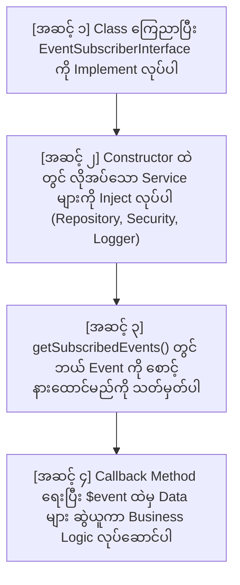
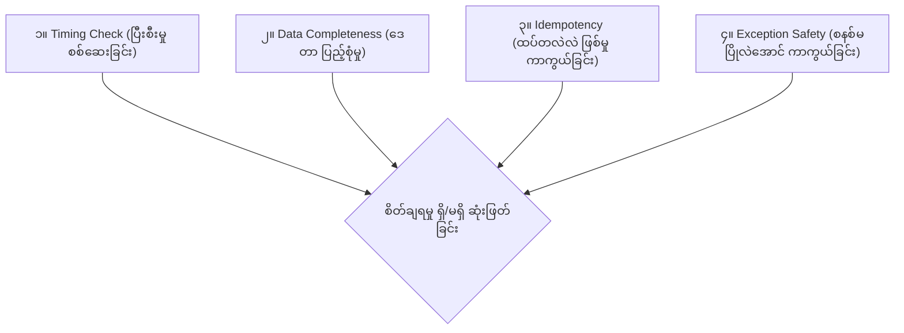

# EC-CUBE 4.3 - EventListener အစအဆုံး တည်ဆောက်နည်း၊ စစ်ဆေးနည်းနှင့် သတိထားရမည့် အချက်များ လက်စွဲ
## (How to Create, Investigate, Verify & Care EventListeners in EC-CUBE 4.3)

ဤလက်စွဲစာအုပ်သည် EC-CUBE 4.3 တွင် EventListener တစ်ခုကို အစအဆုံး စတင်တည်ဆောက်ပုံ၊ `EventArgs $event` ၏ အလုပ်လုပ်ပုံ၊ Constructor တွင် လိုအပ်သော Service များကို ချိတ်ဆက်တွေးခေါ်ပုံ၊ ကုဒ်တစ်ကြောင်းချင်းစီ၏ အသေးစိတ် အဓိပ္ပာယ်၊ တခြား Event အသစ်များကို စုံစမ်းစစ်ဆေးနည်း၊ စိတ်ချရမှု အကဲဖြတ်နည်း၊ မဖြစ်မနေ သတိထားရမည့် အချက်များနှင့် အသုံးအများဆုံး EventListener ၅ မျိုးတို့၏ ဖိုင်စာရင်းများကို အတွေ့အကြုံ (၆) လခန့်ရှိသော Junior Developer များ အလွယ်တကူ လိုက်ပါလုပ်ဆောင်နိုင်စေရန် သီးသန့် ပြည့်စုံစွာ ရေးသားထားသော လမ်းညွှန်ဖြစ်ပါသည်။

---

## မာတိကာ (Table of Contents)
1. [အပိုင်း (၁) - EventListener ကို အစအဆုံး စတင်တည်ဆောက်ပုံ (From Scratch to Complete)](#အပိုင်း-၁---eventlistener-ကို-အစအဆုံး-စတင်တည်ဆောက်ပုံ)
2. [အပိုင်း (၂) - `EventArgs $event` ဆိုတာ ဘာလဲ? ဘာအတွက် သုံးတာလဲ?](#အပိုင်း-၂---eventargs-event-ဆိုတာ-ဘာလဲ)
3. [အပိုင်း (၃) - Constructor တွင် `Repository`, `Security`, `Logger` အဘယ်ကြောင့် လိုအပ်မှန်း စဉ်းစားပုံ](#အပိုင်း-၃---constructor-တွင်-repository-security-logger-အဘယ်ကြောင့်-လိုအပ်မှန်း-စဉ်းစားပုံ)
4. [အပိုင်း (၄) - Favorite Add (ON) နှင့် Remove (OFF) Logic ကုဒ်များ တစ်ကြောင်းချင်း အသေးစိတ် ရှင်းလင်းချက်](#အပိုင်း-၄---favorite-add-နှင့်-remove-logic-ကုဒ်များ-အသေးစိတ်-ရှင်းလင်းချက်)
5. [အပိုင်း (၅) - အဘယ်ကြောင့် `try-catch (\Throwable $e)` ကို မဖြစ်မနေ သုံးရသလဲ?](#အပိုင်း-၅---အဘယ်ကြောင့်-try-catch-throwable-e-ကို-မဖြစ်မနေ-သုံးရသလဲ)
6. [အပိုင်း (၆) - တခြား Event အသစ်များကို စုံစမ်းစစ်ဆေးနည်း (How to Investigate Any Event)](#အပိုင်း-၆---တခြား-event-အသစ်များကို-စုံစမ်းစစ်ဆေးနည်း)
7. [အပိုင်း (၇) - "ဒီ Event ကို သုံးတာ အဆင်ပြေ/စိတ်ချရရဲ့လား" အကဲဖြတ်နည်း (The 4 Verification Checks)](#အပိုင်း-၇---ဒီ-event-ကို-သုံးတာ-အဆင်ပြေစိတ်ချရရဲ့လား-အကဲဖြတ်နည်း)
8. [အပိုင်း (၈) - တခြား Event အသစ်များ ဖန်တီးရာတွင် မဖြစ်မနေ သတိထားရမည့် အချက်များ (What to Care)](#အပိုင်း-၈---မဖြစ်မနေ-သတိထားရမည့်-အချက်များ-what-to-care)
9. [အပိုင်း (၉) - EC-CUBE တွင် အသုံးအများဆုံး EventListener ၅ မျိုးနှင့် လိုအပ်သော ဖိုင်စာရင်းများ](#အပိုင်း-၉---အသုံးအများဆုံး-eventlistener-၅-မျိုးနှင့်-ဖိုင်စာရင်းများ)

---

# အပိုင်း (၁) - EventListener ကို အစအဆုံး စတင်တည်ဆောက်ပုံ

EC-CUBE တွင် EventListener (Event Subscriber) တစ်ခု တည်ဆောက်ရန်အတွက် အောက်ပါ အဆင့် (၄) ဆင့် အတိုင်း အစဉ်လိုက် ရေးသားရပါသည်:



### လက်တွေ့ ကုဒ်တည်ဆောက်ပုံ အပြည့်အစုံ:
📁 **ဖိုင်တည်နေရာ:** [app/Customize/EventListener/FavoriteEventListener.php](file:///Users/kyawwaiyan/Documents/my-Home-tech/eccube-4.3.1/app/Customize/EventListener/FavoriteEventListener.php)

```php
<?php

namespace Customize\EventListener;

use Customize\Entity\CustomerFavoriteProductHistory;
use Customize\Repository\CustomerFavoriteProductHistoryRepository;
use Eccube\Event\EccubeEvents;
use Eccube\Event\EventArgs;
use Psr\Log\LoggerInterface;
use Symfony\Component\EventDispatcher\EventSubscriberInterface;
use Symfony\Component\Security\Core\Security;

// အဆင့် ၁: EventSubscriberInterface ကို မဖြစ်မနေ implement လုပ်ရမည်
class FavoriteEventListener implements EventSubscriberInterface
{
    private $logger;
    private $historyRepository;
    private $security;

    // အဆင့် ၂: လိုအပ်သော Service များကို Constructor တွင် တောင်းယူပါ
    public function __construct(
        LoggerInterface $logger,
        CustomerFavoriteProductHistoryRepository $historyRepository,
        Security $security
    ) {
        $this->logger = $logger;
        $this->historyRepository = $historyRepository;
        $this->security = $security;
    }

    // အဆင့် ၃: ဘယ် Event ဖြစ်လာရင် ဘယ် Method ကို ခေါ်မလဲ လမ်းညွှန်ပေးပါ
    public static function getSubscribedEvents(): array
    {
        return [
            // [Event Constant အမည်] => '[ခေါ်ယူမည့် function အမည်]'
            EccubeEvents::FRONT_PRODUCT_FAVORITE_ADD_COMPLETE => 'onFavoriteAddComplete',
            EccubeEvents::FRONT_MYPAGE_MYPAGE_DELETE_COMPLETE => 'onMypageDeleteComplete',
        ];
    }

    // အဆင့် ၄: Favorite Add (ON) ဖြစ်ချိန်တွင် အလုပ်လုပ်မည့် Function
    public function onFavoriteAddComplete(EventArgs $event): void
    {
        try {
            // (က) Event ထဲမှ ပေးပို့လိုက်သော Product ကို ဆွဲယူပါ
            $Product = $event->getArgument('Product');

            // (ခ) လက်ရှိ Login ဝင်ထားသော Customer ကို Security မှ ရယူပါ
            $Customer = $this->security->getUser();

            if ($Product && $Customer) {
                // (ဂ) Repository သို့ လှမ်းခေါ်ပြီး History သိမ်းဆည်းပါ
                $this->historyRepository->addHistory(
                    $Customer,
                    $Product,
                    CustomerFavoriteProductHistory::ACTION_REGISTER
                );

                $this->logger->info('Favorite Add History recorded.', [
                    'product_id' => $Product->getId(),
                    'customer_id' => $Customer->getId(),
                ]);
            }
        } catch (\Throwable $e) {
            // မတော်တဆ Error တက်ခဲ့လျှင်ပင် User ၏ မျက်နှာပြင် မပြိုလဲစေရန် Error Log သာ မှတ်ပါမည်
            $this->logger->error('Failed to record favorite add history.', [
                'exception' => $e,
            ]);
        }
    }

    // အဆင့် ၄ (ဆက်လက်): Mypage မှ Favorite Delete (OFF) ဖြစ်ချိန်တွင် အလုပ်လုပ်မည့် Function
    public function onMypageDeleteComplete(EventArgs $event): void
    {
        try {
            // Delete Event တွင် Event ထဲ၌ Customer နှင့် Product တိုက်ရိုက် ပါဝင်သည်
            $Customer = $event->getArgument('Customer');
            $CustomerFavoriteProduct = $event->getArgument('CustomerFavoriteProduct');

            if ($Customer && $CustomerFavoriteProduct) {
                $Product = $CustomerFavoriteProduct->getProduct();

                $this->historyRepository->addHistory(
                    $Customer,
                    $Product,
                    CustomerFavoriteProductHistory::ACTION_REMOVE
                );

                $this->logger->info('Favorite Remove History recorded.', [
                    'product_id' => $Product->getId(),
                    'customer_id' => $Customer->getId(),
                ]);
            }
        } catch (\Throwable $e) {
            $this->logger->error('Failed to record favorite remove history.', [
                'exception' => $e,
            ]);
        }
    }
}
```

---

# အပိုင်း (၂) - `EventArgs $event` ဆိုတာ ဘာလဲ?

### ပုံဆောင်ချက် (The Delivery Parcel Analogy):
`EventArgs` ကို **"ချောပို့ ပါဆယ်ထုပ် (Delivery Package / Parcel)"** ဟု မြင်ယောင်ကြည့်ပါ-

1. **ပို့သူ (Core Controller):** `ProductController` က ကုန်ပစ္စည်းကို Favorite အဖြစ် ထည့်သွင်းပြီးသွားသည့်အခါ EventDispatcher ထံသို့ `FRONT_PRODUCT_FAVORITE_ADD_COMPLETE` ဟူသော အချက်ပြခေါင်းလောင်း ထိုးလိုက်သည်။
2. **ထည့်ပေးလိုက်သော ပစ္စည်းများ (Payload):** Controller က လက်ဗလာဖြင့် ခေါင်းလောင်းထိုးရုံသာ မဟုတ်ဘဲ နားထောင်နေမည့် Listener များ အသုံးပြုနိုင်ရန် သက်ဆိုင်ရာ ကုန်ပစ္စည်းအချက်အလက်များကို ပါဆယ်ထုပ် (`EventArgs`) ထဲ ထည့်ပေးလိုက်ပါသည်:
   ```php
   // Core Controller ထဲတွင် ပါဆယ်ထုတ်ပိုးပုံ:
   $event = new EventArgs(
       [
           'Product' => $Product, // Product object ကို ထည့်ပေးလိုက်သည်
       ],
       $request // HTTP Request ကိုပါ ထည့်ပေးလိုက်သည်
   );
   ```
3. **လက်ခံသူ (သင်၏ Listener):** သင်၏ Listener method က `public function onFavoriteAddComplete(EventArgs $event)` ဟု ကြေညာထားသောအခါ Symfony စနစ်က အဆိုပါ ပါဆယ်ထုပ် `$event` ကို သင့် function ထဲသို့ အလိုအလျောက် ပို့ဆောင်ပေးပါသည်။

### ပါဆယ်ထုပ် ဖွင့်ဖောက်နည်း (How to open the parcel):
- `$event->getArgument('Product')` ➔ ပါဆယ်ထဲမှ `Product` entity object ကို ဆွဲထုတ်ယူခြင်း ဖြစ်သည်။
- `$event->getRequest()` ➔ Client ဘက်မှ လာသော `Request` object (IP, URL, Header) ကို ရယူသည်။
- `$event->hasArgument('Customer')` ➔ ထို ပါဆယ်ထဲတွင် `'Customer'` ပါ/မပါ `true/false` စစ်ဆေးသည်။

---

# အပိုင်း (၃) - Constructor တွင် `Repository`, `Security`, `Logger` အဘယ်ကြောင့် လိုအပ်မှန်း စဉ်းစားပုံ

Junior Developer တစ်ယောက် အနေဖြင့် *"ဒီ Listener ထဲမှာ ဘာ Service တွေ Inject လုပ်ရမလဲ"* ဆိုသည်ကို **မိမိ လိုချင်သော ပန်းတိုင် (Goals) မှ နောက်ပြန် (Thinking Backwards)** စဉ်းစားရပါသည်:

```
[ပန်းတိုင် ၁] DB ထဲ History သွင်းချင်တယ်
   ➔ ဒါဆို DB ထဲ INSERT လုပ်ပေးမယ့် ကိရိယာလိုတယ် ➔ HistoryRepository လိုအပ်မှန်း သိရသည်။

[ပန်းတိုင် ၂] ဘယ်သူ နှိပ်တာလဲ သိချင်တယ်
   ➔ ဒါဆို လက်ရှိ Login ဝင်ထားတဲ့ Customer ကို ရှာပေးမယ့်သူ လိုတယ် ➔ Security လိုအပ်မှန်း သိရသည်။

[ပန်းတိုင် ၃] အောင်မြင်/ကျရှုံး မှတ်တမ်းတင်ချင်တယ်
   ➔ ဒါဆို site.log ထဲ ချရေးပေးမယ့် ကိရိယာ လိုတယ် ➔ LoggerInterface လိုအပ်မှန်း သိရသည်။
```

> **ကိရိယာသေတ္တာ သဘောတရား:** လက်သမားတစ်ယောက် အလုပ်စလုပ်ရန် တူ (Repository)၊ မျက်မှန် (Security) နှင့် မှတ်စုစာအုပ် (Logger) လိုအပ်သကဲ့သို့၊ Listener အလုပ်လုပ်နိုင်ရန် ဤ Service (၃) ခုကို Constructor မှတစ်ဆင့် တောင်းယူ (Inject လုပ်) ရခြင်း ဖြစ်ပါသည်။

---

# အပိုင်း (၄) - Favorite Add နှင့် Remove Logic ကုဒ်များ အသေးစိတ် ရှင်းလင်းချက်

### (က) Favorite Add (ON) Logic:
```php
if ($Product && $Customer) {
    // (၁) Repository သို့ လှမ်းခေါ်ပြီး History သိမ်းဆည်းပါ
    $this->historyRepository->addHistory(
        $Customer,
        $Product,
        CustomerFavoriteProductHistory::ACTION_REGISTER
    );

    // (၂) အောင်မြင်ကြောင်း Log မှတ်တမ်းတင်ပါ
    $this->logger->info('Favorite Add History recorded.', [
        'product_id' => $Product->getId(),
        'customer_id' => $Customer->getId(),
    ]);
}
```
- **`if ($Product && $Customer)`:** ကုန်ပစ္စည်းကော ဝယ်ယူသူပါ နှစ်ခုစလုံး တကယ် ရှိမှသာ (`null` မဟုတ်မှသာ) ဆက်လုပ်ရန် စစ်ဆေးခြင်း ဖြစ်သည်။ မတော်တဆ Customer မရှိဘဲ `$Customer->getId()` ခေါ်မိပါက Fatal Error တက်သွားမည်ကို ကြိုတင်ကာကွယ်ထားခြင်း (Defensive Check) ဖြစ်သည်။
- **`addHistory($Customer, $Product, ...::ACTION_REGISTER)`:** Repository ထံသို့ Customer၊ Product နှင့် Action အမျိုးအစား `'register'` (အကြိုက်ဆုံး ထည့်သွင်းခြင်း - ON) ဟု ပေးပို့ပြီး Database ထဲ row အသစ် ထည့်သွင်းခိုင်းခြင်း ဖြစ်သည်။
- **`$this->logger->info(...)`:** Database ထဲ အောင်မြင်စွာ ရောက်သွားကြောင်း `site.log` ထဲ မှတ်တမ်းရေးချလိုက်ခြင်း ဖြစ်သည်။ Developer သည် `tail -f var/log/dev/site.log` တွင် ချက်ချင်း စောင့်ကြည့်နိုင်ပါသည်။

---

### (ခ) Favorite Remove (OFF) Logic:
```php
if ($Customer && $CustomerFavoriteProduct) {
    // (၁) မူရင်း Favorite ထဲမှ Product ကို ဆွဲထုတ်ပါ
    $Product = $CustomerFavoriteProduct->getProduct();

    // (၂) History ထဲသို့ 'remove' Action ဖြင့် row အသစ် ထည့်ပါ
    $this->historyRepository->addHistory(
        $Customer,
        $Product,
        CustomerFavoriteProductHistory::ACTION_REMOVE
    );

    // (၃) Log မှတ်တမ်းတင်ပါ
    $this->logger->info('Favorite Remove History recorded.', [
        'product_id' => $Product->getId(),
        'customer_id' => $Customer->getId(),
    ]);
}
```
- **`$Product = $CustomerFavoriteProduct->getProduct();`:** Mypage Delete Event တွင် မူရင်း Favorite Entity (`$CustomerFavoriteProduct`) ပါလာသည်။ ကျွန်ုပ်တို့၏ History table တွင် မည်သည့် ကုန်ပစ္စည်းကို ဖျက်လိုက်သလဲ ဆိုသော `product_id` မဖြစ်မနေ လိုအပ်သောကြောင့် ၎င်းထဲမှ `getProduct()` ဖြင့် ကုန်ပစ္စည်းကို ဆွဲထုတ်ရယူခြင်း ဖြစ်သည်။
- **အလွန်အရေးကြီးသော သဘောတရား:** မူရင်း Core Table (`dtb_customer_favorite_product`) ထဲမှ Record ပျက်သွားသော်လည်း၊ ကျွန်ုပ်တို့၏ History Table ထဲတွင်မူ **`remove` (ဖျက်ထုတ်ခြင်း - OFF)** ဟူသော Action ဖြင့် **Row အသစ် (New Row)** တစ်ခု တိုးသွားခြင်း ဖြစ်ပါသည်။ သို့မှသာ သမိုင်းမှတ်တမ်း အပြည့်အစုံ ကျန်ရစ်မည် ဖြစ်သည်။

---

# အပိုင်း (၅) - အဘယ်ကြောင့် `try-catch (\Throwable $e)` ကို မဖြစ်မနေ သုံးရသလဲ?

```php
try {
    // History သိမ်းဆည်းသည့် အပိုင်း
} catch (\Throwable $e) {
    $this->logger->error('Failed to record favorite add history.', [
        'exception' => $e,
    ]);
}
```

1. **အဓိက အန္တရာယ်:** အကယ်၍ `try-catch` မသုံးထားဘဲ Database ပြည့်နေခြင်း သို့မဟုတ် History Table Error တက်ပါက၊ ဝယ်ယူသူ၏ Website မျက်နှာပြင်တွင် **White Screen of Death (HTTP 500 Error)** တက်သွားပြီး စတိုးဆိုင်ကြီးတစ်ခုလုံး ပျက်စီးသွားပါမည်။
2. **အကျိုးကျေးဇူး (Graceful Degradation):** History မှတ်တမ်းတင်ခြင်းသည် နောက်ကွယ် အရန်လုပ်ငန်း (Secondary Task) သာ ဖြစ်သည်။ မတော်တဆ History သိမ်းမရခဲ့လျှင်ပင် ဝယ်ယူသူ၏ မူရင်း Favorite နှိပ်သည့် လုပ်ဆောင်ချက်ကို မရပ်တန့်သွားစေဘဲ ပုံမှန်အတိုင်း အဆင်ပြေပြေ ဆက်လက် အလုပ်လုပ်စေရန်နှင့် Developer ဘက်တွင် စစ်ဆေးနိုင်အောင် `logger->error()` ထဲ Error Stack Trace မှတ်ပေးရန်အတွက် `try-catch` ကို မဖြစ်မနေ သုံးရခြင်း ဖြစ်ပါသည်။

---

# အပိုင်း (၆) - တခြား Event အသစ်များကို စုံစမ်းစစ်ဆေးနည်း (How to Investigate Any Event)

နောင်တွင် အခြား Feature တစ်ခုခုအတွက် Event အသစ်တစ်ခုကို စုံစမ်းလိုပါက အောက်ပါ နည်းလမ်း ၂ မျိုးဖြင့် စစ်ဆေးနိုင်ပါသည်:

### နည်းလမ်း (၁): Core File ထဲရှိ `new EventArgs([...])` ကို တိုက်ရိုက် ကြည့်ရှုခြင်း
Controller ဖိုင်ထဲတွင် `dispatch()` မတိုင်မီ ဘယ် Arguments တွေ ထည့်ပေးလိုက်သလဲ ဆိုသည်ကို ကြည့်ရုံဖြင့် ချက်ချင်း သိရှိနိုင်ပါသည်:

```php
// ဥပမာ: CartController ထဲတွင် အောက်ပါအတိုင်း တွေ့ရမည်:
$event = new EventArgs(
    [
        'Item' => $Item,         // <-- 'Item' ဟူသော key ဖြင့် argument ပေးထားသည်
        'Product' => $Product,   // <-- 'Product' ဟူသော key ဖြင့် argument ပေးထားသည်
    ],
    $request
);
$this->eventDispatcher->dispatch($event, EccubeEvents::FRONT_CART_ADD_COMPLETE);
```
➔ ထို့ကြောင့် မိမိ၏ Listener ထဲတွင် `$event->getArgument('Product')` ဟု တောင်းယူနိုင်ကြောင်း ချက်ချင်း သိနိုင်ပါသည်။

### နည်းလမ်း (၂): Debugging အနေဖြင့် `$event->getArguments()` ကို Log ထုတ်ကြည့်ခြင်း
အကယ်၍ Argument ထဲ ဘာတွေ ပါလာသည်ကို မသေချာပါက Listener ထဲတွင် ယာယီ Log ထုတ်ကြည့်နိုင်ပါသည်:

```php
public function onAnyEvent(EventArgs $event): void
{
    // Event ထဲ ပါလာသော Argument အားလုံး၏ Key များကို Log ထုတ်ကြည့်ခြင်း
    $keys = array_keys($event->getArguments());
    $this->logger->debug('Dispatched Event Arguments:', ['keys' => $keys]);
}
```
ထို့နောက် `var/log/dev/site.log` ကို ဖွင့်ကြည့်ပါက ဘာတွေ ပါလာသည်ကို မျက်မြင်ကိုယ်တွေ့ တွေ့ရမည် ဖြစ်ပါသည်။

---

# အပိုင်း (၇) - "ဒီ Event ကို သုံးတာ အဆင်ပြေ/စိတ်ချရရဲ့လား" အကဲဖြတ်နည်း (The 4 Verification Checks)

Event တစ်ခုကို ရွေးချယ်ပြီးပါက ထို Event သည် စိတ်ချရမှု ရှိ/မရှိ (Production-ready ဖြစ်/မဖြစ်) ကို အောက်ပါ စစ်ဆေးချက် ၄ ချက်ဖြင့် အကဲဖြတ်ရပါသည်:



1. **စစ်ဆေးချက် (၁): Timing Check (အလုပ်ပြီးစီးပြီးမှ ခေါ်တာ သေချာသလား?)**
   - စည်းမျဉ်း: Database ထဲတွင် Data မသိမ်းမီ ခေါ်သော `_INITIALIZE` ကို History အတွက် မသုံးရပါ။
   - စစ်ဆေးပုံ: Event သည် Controller ၏ အောင်မြင်သော Return/Redirect မတိုင်မီ **အဆုံးသတ် (`_COMPLETE`)** တွင် dispatch လုပ်ထားမှသာ စိတ်ချရပါသည်။
2. **စစ်ဆေးချက် (၂): Data Completeness (မိမိ လိုအပ်သော ဒေတာ အားလုံး ပါဝင်သလား?)**
   - စစ်ဆေးပုံ: History မှတ်တမ်းအတွက် အဓိက လိုအပ်သော `Product ID` နှင့် `Customer ID` ကို ရယူနိုင်ခြင်း ရှိ/မရှိ စစ်ဆေးပါ။
3. **စစ်ဆေးချက် (၃): Idempotency Check (မလိုလားအပ်ဘဲ ၂ ခါ ၃ ခါ ထပ်မဖြစ်စေရန်)**
   - စစ်ဆေးပုံ: အသုံးပြုသူက Browser Refresh နှိပ်လိုက်တိုင်း Log အသစ်တွေ ထပ်မံ မဝင်လာစေရပါ။ Controller များသည် Action ပြီးဆုံးပါက `return $this->redirect(...)` (PRG Pattern) သုံးထားမှသာ Refresh နှိပ်သော်လည်း Event ထပ်မဖြစ်ဘဲ စိတ်ချရပါသည်။
4. **စစ်ဆေးချက် (၄): Exception Safety (Defensive Programming)**
   - စစ်ဆေးပုံ: Listener method တစ်ခုလုံးကို အမြဲတမ်း `try-catch (\Throwable $e)` ဖြင့် အုပ်ထားပြီး Error တက်ပါက `logger->error()` သာ ရေးသားထားရပါမည်။

---

# အပိုင်း (၈) - တခြား Event အသစ်များ ဖန်တီးရာတွင် မဖြစ်မနေ သတိထားရမည့် အချက်များ (What to Care)

Junior Developer တစ်ယောက် အနေဖြင့် မည်သည့် EventListener အသစ်မဆို ရေးသားသည့်အခါ အောက်ပါ အချက် (၆) ချက်ကို **မဖြစ်မနေ သတိပြုစစ်ဆေးရပါမည်**:

### (၁) Performance Overhead (စနစ် နှေးကွေးမသွားစေရန် သတိပြုခြင်း)
- စာမျက်နှာ ဖွင့်တိုင်း အလုပ်လုပ်သော Event များ ထဲတွင် **အကြီးစား Database Query များ** သို့မဟုတ် **ကြာမြင့်သော ပြင်ပ API ခေါ်ယူမှုများ** ကို Synchronous (တိုက်ရိုက်) မလုပ်ရပါ။

### (၂) Event Priorities (ဦးစားပေး အဆင့် သတ်မှတ်ချက်)
- Event တစ်ခုတည်းကို Listener အများအပြားက နားထောင်နေနိုင်ပါသည်။ မိမိ၏ ကုဒ်ကို အရင်ဆုံး အလုပ်လုပ်စေချင်ပါက အပေါင်းဂဏန်း (ဥပမာ- `['onOrderComplete', 10]`) ပေးရပြီး၊ အခြားသူများပြီးမှ နောက်ဆုံးမှ လုပ်စေချင်ပါက အနှုတ်ဂဏန်း (ဥပမာ- `['onOrderComplete', -10]`) ပေးရပါသည်:
  ```php
  public static function getSubscribedEvents(): array
  {
      return [
          EccubeEvents::FRONT_SHOPPING_COMPLETE_INITIALIZE => ['onOrderComplete', 10],
      ];
  }
  ```

### (၃) Database Flush In Loop အမှား
- Loop ပတ်ပြီး ဒေတာများစွာ သိမ်းသည့်အခါ `foreach` ထဲတွင် `$em->flush()` ကို မခေါ်ရပါ။ Loop အပြင်ဘက်ရောက်မှ တစ်ကြိမ်တည်း `flush()` ခေါ်ရပါမည်:
  ```php
  // မှန်ကန်သော Standard နည်းလမ်း:
  foreach ($items as $item) { $em->persist($item); }
  $em->flush(); // Loop အပြင်ဘက်ရောက်မှ တစ်ကြိမ်တည်း flush လုပ်ပါ
  ```

### (၄) Front Store နှင့် Admin Panel ခွဲခြားသတိပြုခြင်း (Context Awareness)
- Admin စီမံခန့်ခွဲသူ ပြင်ဆင်သည့် Action ကို Front-end Customer စာရင်းထဲ မှားယွင်း မထည့်မိစေရန် Event အမည် (`FRONT_` vs `ADMIN_`) ကို သေချာ ခွဲခြားရပါမည်။

### (၅) Cache Clear မဖြစ်မနေ ပြုလုပ်ခြင်း
- EventListener ဖိုင်အသစ် ရေးသားပြီးတိုင်း သို့မဟုတ် `getSubscribedEvents()` ကို ပြင်ဆင်ပြီးတိုင်း Symfony Service Container မှ အသိအမှတ်ပြုစေရန် Cache အမြဲ ရှင်းပေးရပါမည်:
  ```bash
  bin/console cache:clear --no-warmup
  ```

---

# အပိုင်း (၉) - EC-CUBE တွင် အသုံးအများဆုံး EventListener ၅ မျိုးနှင့် လိုအပ်သော ဖိုင်စာရင်းများ

EC-CUBE Enterprise ပရောဂျက်များတွင် အများဆုံး ရေးသားလေ့ရှိသော EventListener (၅) မျိုးနှင့် ၎င်းတို့အတွက် တည်ဆောက်ရမည့် ဖိုင်စာရင်းများ ဖြစ်ပါသည်:

---

### ၁။ Order Notification & External Sync Listener (အော်ဒါအောင်မြင်ချိန် အီးမေးလ်/LINE/POS ပို့ခြင်း)
ဝယ်ယူသူ ငွေချေပြီး အော်ဒါ အောင်မြင်စွာ တင်သွားချိန်တွင် စာရင်းကို အပြင် POS စနစ် သို့မဟုတ် Admin ထံသို့ အသိပေးချက် ပေးပို့ခြင်း။
- **အသုံးပြုသော Event:** `EccubeEvents::FRONT_SHOPPING_COMPLETE_INITIALIZE`
- **ဖန်တီးရမည့် ဖိုင်စာရင်းများ:**
  1. `app/Customize/EventListener/OrderNotificationListener.php` (Listener ဖိုင်)
  2. `app/Customize/Service/ExternalOrderSyncService.php` (ပြင်ပ POS / API နှင့် ချိတ်ဆက်သော Service)
  3. `app/template/default/Mail/order_notification.twig` (Email Template)

---

### ၂။ Customer Login & Security Audit Listener (လုံခြုံရေး ဝင်ရောက်မှု မှတ်တမ်းတင်ခြင်း)
Customer သို့မဟုတ် Admin အကောင့် ဝင်ရောက်မှု အောင်မြင်ခြင်း/ကျရှုံးခြင်းများကို စောင့်ကြည့်ပြီး သံသယဖြစ်ဖွယ် အကောင့်များကို ဖမ်းယူခြင်း။
- **အသုံးပြုသော Events:**
  - `SecurityEvents::INTERACTIVE_LOGIN` (Login အောင်မြင်ချိန်)
  - `AuthenticationEvents::AUTHENTICATION_FAILURE` (Password မှားယွင်းချိန်)
- **ဖန်တီးရမည့် ဖိုင်စာရင်းများ:**
  1. `app/Customize/Entity/LoginAuditHistory.php` (Entity)
  2. `app/Customize/Repository/LoginAuditHistoryRepository.php` (Repository)
  3. `app/Customize/EventListener/SecurityAuditListener.php` (Listener ဖိုင်)

---

### ၃။ Cart Stock Validation Listener (ခြင်းတောင်းထဲ ပစ္စည်းထည့်ချိန် လက်ကျန် စစ်ဆေးခြင်း)
ဝယ်ယူသူက ကုန်ပစ္စည်းကို Cart ထဲ ထည့်လိုက်ချိန်တွင် စတော့လက်ကျန် အမှန်တကယ် လုံလောက်မှု ရှိ/မရှိ ချက်ချင်း စစ်ဆေးပြီး အသိပေးခြင်း။
- **အသုံးပြုသော Events:** `EccubeEvents::FRONT_CART_ADD_COMPLETE`, `EccubeEvents::FRONT_CART_CART_INITIALIZE`
- **ဖန်တီးရမည့် ဖိုင်စာရင်းများ:**
  1. `app/Customize/EventListener/CartStockCheckListener.php` (Listener ဖိုင်)
  2. `app/Customize/Service/StockCheckService.php` (Stock စစ်ဆေးသော Service)

---

### ၄။ Product Favorite History Listener (လက်ရှိ တည်ဆောက်ခဲ့သော အကြိုက်ဆုံး မှတ်တမ်း)
ဝယ်ယူသူ ကုန်ပစ္စည်းကို Favorite Add (ON) လုပ်ခြင်းနှင့် Mypage မှ Delete (OFF) လုပ်ခြင်းကို မှတ်တမ်းတင်ပြီး Admin တွင် New Page ဖြင့် ပြသခြင်း။
- **အသုံးပြုသော Events:** `FRONT_PRODUCT_FAVORITE_ADD_COMPLETE`, `FRONT_MYPAGE_MYPAGE_DELETE_COMPLETE`
- **ဖန်တီးရမည့် ဖိုင်စာရင်းများ:**
  1. `app/Customize/Entity/CustomerFavoriteProductHistory.php` (Entity)
  2. `app/Customize/Repository/CustomerFavoriteProductHistoryRepository.php` (Repository)
  3. `app/Customize/EventListener/FavoriteEventListener.php` (Listener ဖိုင်)
  4. `app/Customize/Controller/Admin/Product/FavouriteProductHistoryController.php` (Admin View Controller)
  5. `app/template/admin/Product/product_favourite_history.twig` (Admin View Twig UI)

---

### ၅။ Admin Template Hook Point Injection Listener (UI ပေါ်တွင် ဒေတာ အလိုအလျောက် ထိုးထည့်ခြင်း)
Core Twig ဖိုင်များကို တိုက်ရိုက် မပြင်ဘဲ Admin Order Detail သို့မဟုတ် Product List ပေါ်တွင် မိမိတို့၏ Custom Button သို့မဟုတ် Input Field များကို Event ဖြင့် အလိုအလျောက် ထိုးထည့်ပေးခြင်း။
- **အသုံးပြုသော Event:** `EccubeEvents::ADMIN_ORDER_EDIT_INDEX_COMPLETE` သို့မဟုတ် Template Render Hook Points
- **ဖန်တီးရမည့် ဖိုင်စာရင်းများ:**
  1. `app/Customize/EventListener/AdminOrderCustomFieldListener.php` (Listener ဖိုင်)
  2. `app/template/admin/Order/custom_order_snippet.twig` (UI အပိုင်းအစ Twig ဖိုင်)
