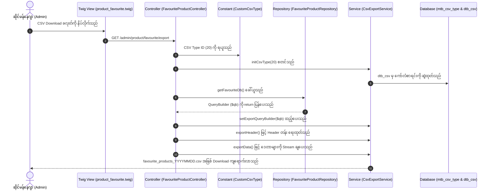
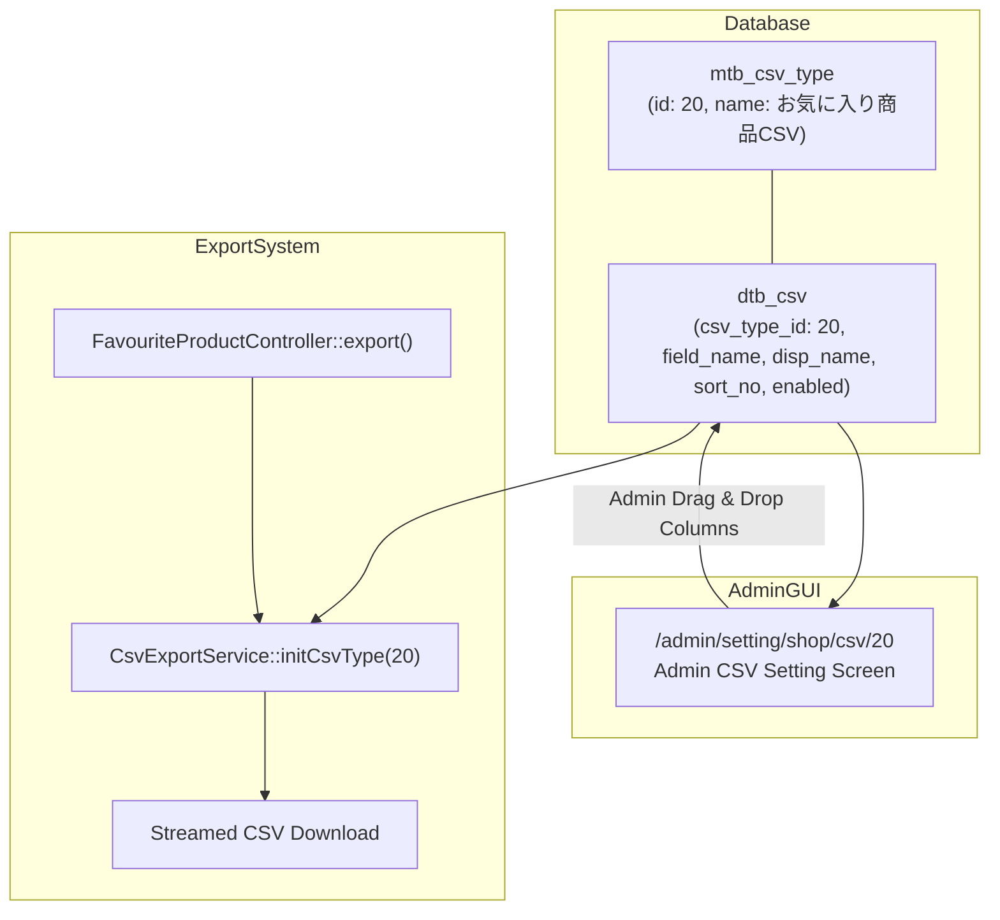

# EC-CUBE 4.3.1 - Favourite Products CSV Export & CSV Type Architecture အဆင့်ဆင့် လမ်းညွှန်
## (Admin Favourite Products CSV Export & CSV Type Step-by-Step Implementation Guide)

ဤလက်စွဲစာအုပ်သည် EC-CUBE 4.3.1 ၏ Admin Panel ရှိ **Favourite Products စာရင်း (`http://localhost:8080/admin/product/favourite`)** တွင် ဝယ်ယူသူများ အကြိုက်ဆုံး မှတ်သားထားသော ကုန်ပစ္စည်းဒေတာများကို **CSV ဖိုင်အဖြစ် Download ရယူနိုင်သော စနစ် (CSV Export Feature)** ထည့်သွင်းခြင်းနှင့် EC-CUBE ၏ စံနှုန်းဖြစ်သော **CSV Type Architecture (`mtb_csv_type`, `dtb_csv`, Shop CSV Setting)** ချိတ်ဆက်ခြင်းတို့ကို လုပ်ငန်းအတွေ့အကြုံ (၆) လခန့်ရှိသော Junior Developer များ အလွယ်တကူ လိုက်လုပ်နိုင်စေရန် **မြန်မာဘာသာ** ဖြင့် အစအဆုံး အသေးစိတ် ရေးသားထားသော လမ်းညွှန်ဖြစ်ပါသည်။

---

## မာတိကာ (Table of Contents)

1. [ဤ Feature / Function ၏ စီးပွားရေးနှင့် နည်းပညာဆိုင်ရာ အကျိုးကျေးဇူးများ (Advantages of this Feature)](#၁-ဤ-feature--function-၏-စီးပွားရေးနှင့်-နည်းပညာဆိုင်ရာ-အကျိုးကျေးဇူးများ-advantages-of-this-feature)
   - [(က) စီးပွားရေးနှင့် စီမံခန့်ခွဲမှုဆိုင်ရာ အကျိုးကျေးဇူးများ (Business Advantages)](#က-စီးပွားရေးနှင့်-စီမံခန့်ခွဲမှုဆိုင်ရာ-အကျိုးကျေးဇူးများ-business-advantages)
   - [(ခ) နည်းပညာနှင့် စနစ်စွမ်းဆောင်ရည်ဆိုင်ရာ အကျိုးကျေးဇူးများ (Technical Advantages)](#ခ-နည်းပညာနှင့်-စနစ်စွမ်းဆောင်ရည်ဆိုင်ရာ-အကျိုးကျေးဇူးများ-technical-advantages)
2. [ဖိုင်တည်ဆောက်ပုံ ဇယားနှင့် ဖိုင်များ စာရင်း (File List & Directory Structure)](#၂-ဖိုင်တည်ဆောက်ပုံ-ဇယားနှင့်-ဖိုင်များ-စာရင်း-file-list--directory-structure)
   - [ဖိုင်အမျိုးအစား တစ်ခုချင်းစီ၏ အသေးစိတ် သဘောတရား (Why Each File Kind is Required)](#ဖိုင်အမျိုးအစား-တစ်ခုချင်းစီ၏-အသေးစိတ်-သဘောတရားနှင့်-မပါမဖြစ်-လိုအပ်သည့်-အကြောင်းရင်း-why-each-file-kind-is-required)
   - [အဘယ်ကြောင့် FormType နှင့် Repository အသစ် မလိုအပ်သနည်း?](#အဘယ်ကြောင့်-formtype-နှင့်-repository-အသစ်-ဖန်တီးရန်-မလိုအပ်သနည်း-why-formtype--new-repository-are-not-required)
   - [မည်သည့် Custom CSV Feature မဆို လိုအပ်သော "ဒေါက်တိုင် (၄) ခု" စံပုံသေနည်း](#ec-cube-တွင်-မည်သည့်-custom-csv-feature-မဆို-တည်ဆောက်ရာတွင်-လိုအပ်သော-ဒေါက်တိုင်-၄-ခု-စံပုံသေနည်း)
3. [EC-CUBE ၏ CSV Type စနစ် အလုပ်လုပ်ပုံ သဘောတရား (CSV Type Architecture Deep-Dive)](#၃-ec-cube-၏-csv-type-စနစ်-အလုပ်လုပ်ပုံ-သဘောတရား-csv-type-architecture-deep-dive)
   - [အဘယ်ကြောင့် CSV Type ကို အသုံးပြုရသနည်း? (Database-Driven CSV vs Hardcoded CSV)](#အဘယ်ကြောင့်-csv-type-ကို-အသုံးပြုရသနည်း-database-driven-csv-vs-hardcoded-csv)
   - [`mtb_csv_type` နှင့် `dtb_csv` တို့၏ ဆက်စပ်ဖွဲ့စည်းပုံ](#mtb_csv_type-နှင့်-dtb_csv-တို့၏-ဆက်စပ်ဖွဲ့စည်းပုံ)
   - [အဘယ်ကြောင့် ID: 20 ကို သတ်မှတ်ရသနည်း?](#အဘယ်ကြောင့်-id-20-ကို-သတ်မှတ်ရသနည်း)
4. [အဆင့်ဆင့် ရေးသားတည်ဆောက်ပုံ (Step-by-Step Implementation Guide)](#၄-အဆင့်ဆင့်-ရေးသားတည်ဆောက်ပုံ-step-by-step-implementation-guide)
   - [အဆင့် (၁) - CSV Type Constant သတ်မှတ်ခြင်း (`CustomCsvType.php`)](#အဆင့်-၁---csv-type-constant-သတ်မှတ်ခြင်း-customcsvtypephp)
   - [အဆင့် (၂) - Doctrine Migration ဖြင့် CSV Type နှင့် Columns ထည့်သွင်းခြင်း (`Version...php`)](#အဆင့်-၂---doctrine-migration-ဖြင့်-csv-type-နှင့်-columns-ထည့်သွင်းခြင်း-versionphp)
   - [အဆင့် (၃) - Admin Controller တွင် Export Action ရေးသားခြင်း (`FavouriteProductController.php`)](#အဆင့်-၃---admin-controller-တွင်-export-action-ရေးသားခြင်း-favouriteproductcontrollerphp)
   - [အဆင့် (၄) - Admin Twig View တွင် CSV ခလုတ်များ ချိတ်ဆက်ခြင်း (`product_favourite.twig`)](#အဆင့်-၄---admin-twig-view-တွင်-csv-ခလုတ်များ-ချိတ်ဆက်ခြင်း-product_favouritetwig)
5. [Terminal Commands များ အဆင့်ဆင့် Run ခြင်း (Terminal Checklist)](#၅-terminal-commands-များ-အဆင့်ဆင့်-run-ခြင်း-terminal-checklist)
6. [စနစ်စမ်းသပ် စစ်ဆေးခြင်းနှင့် အတည်ပြုခြင်း (Verification & Testing Guide)](#၆-စနစ်စမ်းသပ်-စစ်ဆေးခြင်းနှင့်-အတည်ပြုခြင်း-verification--testing-guide)
7. [Junior Developer များအတွက် သိကောင်းစရာ အလေ့အကျင့်ကောင်းများ (Best Practices)](#၇-junior-developer-များအတွက်-သိကောင်းစရာ-အလေ့အကျင့်ကောင်းများ-best-practices)

---

## ၁။ ဤ Feature / Function ၏ စီးပွားရေးနှင့် နည်းပညာဆိုင်ရာ အကျိုးကျေးဇူးများ (Advantages of this Feature)

Admin Favourite Product CSV Export feature သည် သာမန်ဒေတာထုတ်ယူခြင်း သက်သက်မဟုတ်ဘဲ E-Commerce လုပ်ငန်းလည်ပတ်မှုအတွက် မရှိမဖြစ် အရေးပါသော အကျိုးကျေးဇူးများစွာကို ပေးစွမ်းနိုင်ပါသည်။

### (က) စီးပွားရေးနှင့် စီမံခန့်ခွဲမှုဆိုင်ရာ အကျိုးကျေးဇူးများ (Business Advantages)

```
        ┌────────────────────────────────────────────────────────┐
        │       Favourite Products CSV Export စနစ်၏             │
        │          စီးပွားရေးဆိုင်ရာ အကျိုးကျေးဇူးများ            │
        └──────────────────────────┬─────────────────────────────┘
                                   │
         ┌─────────────────────────┼─────────────────────────┐
         ▼                         ▼                         ▼
┌──────────────────┐      ┌──────────────────┐      ┌──────────────────┐
│ ၁။ Trend Analysis│      │ ၂။ Marketing     │      │ ၃။ Stock Planning│
│ ဝယ်ယူသူများ အကြိုက်│      │ Flash Sales &    │      │ ပစ္စည်းမပြတ်စေရန် │
│ ဆုံး ခေတ်ရေစီးကြောင်း│      │ Email Promotions │      │ ကြိုတင် ခန့်မှန်းခြင်း│
└──────────────────┘      └──────────────────┘      └──────────────────┘
```

1. **Customer Trend Analysis (ဝယ်ယူသူများ၏ စိတ်ဝင်စားမှု ခေတ်ရေစီးကြောင်းကို တိကျစွာ ခွဲခြမ်းစိတ်ဖြာနိုင်ခြင်း):**
   * ဝယ်ယူသူများသည် ပစ္စည်းတစ်ခုကို ချက်ချင်းမဝယ်သေးဘဲ နောက်မှ ဝယ်ယူရန် Favorite (Wishlist) အဖြစ် မှတ်သားထားလေ့ရှိကြသည်။
   * မည်သည့် ပစ္စည်းများသည် လူကြိုက်အများဆုံး ဖြစ်နေသည်ကို CSV ထုတ်ယူပြီး Excel သို့မဟုတ် Google Sheets တွင် Pivot Table ပြုလုပ်ကာ တိကျသော ကိန်းဂဏန်းများဖြင့် ခွဲခြမ်းစိတ်ဖြာနိုင်ပါသည်။
2. **Targeted Marketing Campaigns (ထိရောက်သော အရောင်းမြှင့်တင်ရေး စီမံချက်များ ဆွဲနိုင်ခြင်း):**
   * Favorite အများဆုံး ရရှိထားသော ပစ္စည်းများကို အခြေခံ၍ **"Most Popular Items Promotion"**၊ **"Weekend Flash Sale"** သို့မဟုတ် **Email Newsletter** များတွင် အထူးအသားပေး ကြော်ငြာနိုင်ပါသည်။
3. **Inventory Forecasting & Stock Replenishment (ပစ္စည်းပြတ်လပ်မှု ကာကွယ်ခြင်းနှင့် စတော့ကြိုတင်မှာယူခြင်း):**
   * ဝယ်ယူလိုစိတ် အလွန်မြင့်မားနေသော (High Favorite Count) ပစ္စည်းများသည် နောင်တွင် ရုတ်တရက် အရောင်းသွက်ပြီး Out of Stock (ပစ္စည်းပြတ်လပ်မှု) ဖြစ်နိုင်ခြေ အလွန်များပါသည်။
   * ဆိုင်မန်နေဂျာများသည် ဤ CSV ဒေတာကို ကြည့်၍ ကုန်ပစ္စည်းစတော့များကို ကြိုတင် မှာယူဖြည့်တင်းထားနိုင်ပါသည်။
4. **Data Portability & Reporting (ဌာနတွင်း အစီရင်ခံစာများ တင်ပြနိုင်ခြင်း):**
   * လုပ်ငန်းအစည်းအဝေးများ၊ စာရင်းအင်းဌာန သို့မဟုတ် Management Board သို့ အချိန်နှင့်တစ်ပြေးညီ ပရော်ဖက်ရှင်နယ် အစီရင်ခံစာများ အလွယ်တကူ တင်ပြနိုင်ပါသည်။

---

### (ခ) နည်းပညာနှင့် စနစ်စွမ်းဆောင်ရည်ဆိုင်ရာ အကျိုးကျေးဇူးများ (Technical Advantages)

1. **Memory Exhaustion ကာကွယ်ပေးသော Streamed Export (High Performance Streaming):**
   * သမားရိုးကျ CSV Export များသည် ကုန်ပစ္စည်း အစောင်ထောင်သောင်းချီ ရှိပါက အားလုံးကို PHP Memory ထဲသို့ Array အဖြစ် ဆွဲတင်သဖြင့် `Fatal error: Allowed memory size of xxx bytes exhausted` ဖြစ်ပြီး ဆာဗာပြုတ်ကျသွားလေ့ရှိသည်။
   * Symfony ၏ **`StreamedResponse`** နှင့် EC-CUBE ၏ **`CsvExportService`** တို့ ပူးပေါင်းထားသဖြင့် ဒေတာများကို တစ်သုတ်စီ (Chunks of 100 records) ဆွဲထုတ်ပြီး Browser သို့ အချိန်နှင့်တစ်ပြေးညီ Stream လုပ်ပေးသောကြောင့် Memory အလွန်နည်းပါးစွာ သုံးစွဲပြီး Record သန်းချီရှိသော်လည်း ချောမွေ့စွာ Download ဆွဲနိုင်ပါသည်။
2. **Database-Driven Architecture (Admin GUI မှ စိတ်ကြိုက် ပြင်ဆင်နိုင်ခြင်း):**
   * CSV ကော်လံခေါင်းစဉ်များ၊ ကော်လံ အစီအစဉ် (Sort Order) နှင့် လိုချင်/မလိုချင်သော အကွက်များကို PHP Code ထဲတွင် Hardcode ရေးသားမထားပါ။
   * ဆိုင်ပိုင်ရှင် Admin သည် Developer အကူအညီမပါဘဲ Admin Panel ရှိ **Settings -> Shop Settings -> CSV Settings (`/admin/setting/shop/csv/20`)** မှနေ၍ Drag & Drop ပြုလုပ်ကာ မိမိစိတ်ကြိုက် ချက်ချင်း ပြင်ဆင်နိုင်ပါသည်။
3. **Zero Core Modification (100% EC-CUBE Law & Best Practices):**
   * EC-CUBE ၏ Core ဖိုင်များ (`src/Eccube/`) ကို တစ်လုံးတစ်ပါဒမျှ မထိခိုက်ဘဲ `app/Customize/` နှင့် Doctrine Migrations တို့ဖြင့်သာ စံနှုန်းအပြည့် ချဲ့ထွင်ထားသဖြင့် အနာဂတ်တွင် EC-CUBE Version အသစ်များသို့ Upgrade ပြုလုပ်ရာတွင်လည်း ပျက်စီးသွားခြင်း မရှိပါ။

---

## ၂။ ဖိုင်တည်ဆောက်ပုံ ဇယားနှင့် ဖိုင်များ စာရင်း (File List & Directory Structure)

ဤ Feature အတွက် ဖန်တီး/ပြင်ဆင်ထားသော ဖိုင်များ စာရင်းမှာ အောက်ပါအတိုင်း ဖြစ်ပါသည်:

| အမှတ် | ဖိုင်အမျိုးအစား (File Kind) | ဖိုင်လမ်းကြောင်း (File Path) | အဓိက တာဝန် (Role & Responsibility) |
| :---: | :---: | :--- | :--- |
| **၁** | **Constant Class** | `app/Customize/Constant/CustomCsvType.php` | Custom CSV Type ID (ID: 20) အား ဗဟိုပြု သတ်မှတ်ပေးခြင်း (Single Source of Truth)။ |
| **၂** | **Database Migration** | `app/DoctrineMigrations/Version20260923141333.php` | `mtb_csv_type` နှင့် `dtb_csv` ဇယားများထဲသို့ ID: 20 နှင့် Default Columns (၈) ခု အား SQL ဖြင့် သွင်းပေးခြင်း။ |
| **၃** | **Repository Class** | `app/Customize/Repository/FavouriteProductRepository.php` | Favorite ကုန်ပစ္စည်းများ စာရင်းအတွက် QueryBuilder တည်ဆောက်ပေးခြင်း (Separation of Concerns & Memory Chunking)။ |
| **၄** | **Controller Class** | `app/Customize/Controller/Admin/Product/FavouriteProductController.php` | HTTP Request လက်ခံခြင်း၊ `CsvExportService` ခေါ်ယူခြင်းနှင့် `StreamedResponse` ဖြင့် CSV ဖိုင် Download ထုတ်ပေးခြင်း။ |
| **၅** | **Twig View Template** | `app/template/admin/Product/product_favourite.twig` | UI တွင် CSV Download ခလုတ် နှင့် Shop CSV Setting သို့ သွားမည့် ဂီယာခလုတ်တို့အား ချိတ်ဆက်ပြသပေးခြင်း။ |
| **၆** | **Task List / Documentation** | `My-Task-List-Folder/.../favourite_product_csv_export_step_by_step_guide.md` | နည်းပညာ ဗဟုသုတ လက်ဆင့်ကမ်းခြင်း၊ ပြင်ဆင်ထိန်းသိမ်းမှု လွယ်ကူစေခြင်းနှင့် လမ်းညွှန်ချက် မှတ်တမ်းတင်ခြင်း။ |

```
eccube-4.3.1/
├── app/
│   ├── Customize/
│   │   ├── Constant/
│   │   │   └── CustomCsvType.php                        <-- [NEW] Constant (ID: 20)
│   │   ├── Controller/
│   │   │   └── Admin/
│   │   │       └── Product/
│   │   │           └── FavouriteProductController.php   <-- [MODIFY] Added export() method
│   │   └── Repository/
│   │       └── FavouriteProductRepository.php           <-- [EXISTING] QueryBuilder
│   ├── DoctrineMigrations/
│   │   └── Version20260923141333.php                    <-- [NEW] Database Seeder
│   └── template/
│       └── admin/
│           └── Product/
│               └── product_favourite.twig               <-- [MODIFY] Added CSV Buttons
└── My-Task-List-Folder/
    ├── favourite_product_csv_export_step_by_step_guide.md       <-- [NEW] Root Guide
    └── Favourite-Product-List/
        └── favourite_product_csv_export_step_by_step_guide.md   <-- [NEW] Guide Copy
```

---

### ဖိုင်အမျိုးအစား တစ်ခုချင်းစီ၏ အသေးစိတ် သဘောတရားနှင့် မပါမဖြစ် လိုအပ်သည့် အကြောင်းရင်း (Why Each File Kind is Required)

Junior Developer များ မျက်စိထဲ ကွက်ကွက်ကွင်းကွင်း မြင်သာစေရန် အဘယ်ကြောင့် ဤဖိုင်အမျိုးအစား (၆) မျိုးစလုံး လိုအပ်သည်ကို အသေးစိတ် ခွဲခြမ်းစိတ်ဖြာ ရှင်းပြထားပါသည်:

#### ၁။ Constant File (`CustomCsvType.php`)
* **ဖိုင်အမျိုးအစား:** PHP Class with Class Constants
* **တာဝန် (Role):** CSV Type ID နံပါတ် (ဥပမာ- `20`) ကို ကုဒ်နေရာအနှံ့တွင် Hardcode "Magic Number" အဖြစ် မရေးဘဲ Class တစ်ခုထဲတွင် ဗဟိုပြု စီမံထိန်းသိမ်းခြင်း ဖြစ်သည်။
* **အဘယ်ကြောင့် မဖြစ်မနေ လိုအပ်သနည်း (Why Required?):**
  * Migration ဖိုင်၊ Controller ဖိုင် နှင့် Twig Template ဖိုင် (၃) နေရာစလုံးတွင် အဆိုပါ ID `20` ကို လှမ်းခေါ် သုံးစွဲရပါသည်။
  * အကယ်၍ Constant မသုံးဘဲ `20` ဟု လက်ဖြင့် လိုက်ရိုက်ပါက နောင်တစ်ချိန်တွင် ID ပြောင်းလဲလိုသည့်အခါ ဖိုင်အားလုံး လိုက်ရှာပြင်ရပြီး Typo အမှားဖြစ်နိုင်ခြေ အလွန်များပါသည်။ Constant သုံးထားပါက ဤဖိုင်တစ်ခုတည်းတွင် ပြင်လိုက်ရုံဖြင့် တစ်စနစ်လုံး အလိုအလျောက် ပြောင်းလဲသွားမည် ဖြစ်ပါသည်။
* **အကယ်၍ ဤဖိုင် မပါရှိပါက ဘာဖြစ်မည်နည်း (Impact if missing):** Code smells (Magic Numbers) ဖြစ်ပေါ်ပြီး Maintainability အလွန်ညံ့ဖျင်းသွားမည် ဖြစ်ပါသည်။

#### ၂။ Database Migration File (`Version...php`)
* **ဖိုင်အမျိုးအစား:** Doctrine DBAL Migration Class (`extends AbstractMigration`)
* **တာဝန် (Role):** Database ၏ `mtb_csv_type` (Master Table) နှင့် `dtb_csv` (Column Settings Table) ထဲသို့ လိုအပ်သော ဒေတာများကို SQL Command ဖြင့် စနစ်တကျ ထည့်သွင်း/ဖျက်ပစ်ပေးခြင်း ဖြစ်သည်။
* **အဘယ်ကြောင့် မဖြစ်မနေ လိုအပ်သနည်း (Why Required?):**
  * EC-CUBE ၏ CSV စနစ်သည် Database-Driven Architecture ဖြစ်သဖြင့် ဤဇယားများထဲတွင် Data မရှိပါက `CsvExportService` သည် မည်သည့်ကော်လံများ ထုတ်ပေးရမည်ကို လုံးဝ မသိရှိနိုင်ပါ။
  * ထို့အပြင် Local စက်၊ Staging Server နှင့် Production Server စသည့် Environment အားလုံးတွင် `bin/console doctrine:migrations:migrate` တစ်ချက် run ရုံဖြင့် Database Schema နှင့် Data များ အတိအကျ တူညီစွာ ရောက်ရှိသွားစေရန် အာမခံပေးပါသည်။
* **အကယ်၍ ဤဖိုင် မပါရှိပါက ဘာဖြစ်မည်နည်း (Impact if missing):** Database ထဲတွင် CSV Type ID မရှိသဖြင့် Admin Panel ရှိ Shop CSV Setting စာမျက်နှာတွင် အကြိုက်ဆုံး ကုန်ပစ္စည်း CSV Dropdown မပေါ်လာနိုင်သလို CSV Export လုပ်သည့်အခါ ကော်လံများ ထွက်ပေါ်လာမည် မဟုတ်ပါ။

#### ၃။ Repository File (`FavouriteProductRepository.php`)
* **ဖိုင်အမျိုးအစား:** Doctrine ORM Entity Repository (`extends AbstractRepository`)
* **တာဝန် (Role):** Database ဆီမှ ဒေတာများကို DQL / SQL QueryBuilder ဖြင့် ရှာဖွေစစ်ထုတ် စုစည်းပေးခြင်း (Separation of Concerns)။
* **အဘယ်ကြောင့် မဖြစ်မနေ လိုအပ်သနည်း (Why Required?):**
  * Controller ထဲတွင် ရှုပ်ထွေးသော Database Query များကို မရေးရဟူသော MVC Architecture စံနှုန်းကို လိုက်နာရန် ဖြစ်သည်။
  * အထူးသဖြင့် Memory Exhaustion (ဆာဗာ RAM ပြည့်ကျခြင်း) ကို ကာကွယ်ရန် Repository သည် Array ဒေတာကို မပေးဘဲ **`QueryBuilder ($qb)` ကိုသာ return ပေးရပါသည်**။ ၎င်း `$qb` ကြောင့် `CsvExportService` သည် ဒေတာများကို အစောင် ၁၀၀ စီ ခွဲယူပြီး Stream လုပ်နိုင်ခြင်း ဖြစ်ပါသည်။
* **အကယ်၍ ဤဖိုင် မပါရှိပါက ဘာဖြစ်မည်နည်း (Impact if missing):** Controller ထဲတွင် SQL query များ ရောပြွန်းသွားပြီး Code ပြန်လည်အသုံးပြုနိုင်မှု (Reusability) ဆုံးရှုံးသွားမည်။

#### ၄။ Controller File (`FavouriteProductController.php`)
* **ဖိုင်အမျိုးအစား:** Symfony HTTP Controller (`extends AbstractController`)
* **တာဝန် (Role):** User ၏ Browser ဆီမှ Request (URL: `/admin/product/favourite/export`) ကို လက်ခံခြင်း၊ Repository မှ QueryBuilder ကို ခေါ်ယူခြင်း၊ `CsvExportService` ဖြင့် CSV Rows များကို တည်ဆောက်ခြင်း၊ Plugin Hook Point (`EventArgs`) များ dispatch လုပ်ခြင်းနှင့် `StreamedResponse` ဖြင့် Browser သို့ CSV ဖိုင် အဖြစ် ပြန်ပို့ပေးခြင်း။
* **အဘယ်ကြောင့် မဖြစ်မနေ လိုအပ်သနည်း (Why Required?):**
  * HTTP Request နှင့် Response ကို ကြားခံ ချိတ်ဆက်ပေးသော "ဦးနှောက် (Brain)" ဖြစ်သောကြောင့် Controller မရှိပါက CSV Download ဆွဲမည့် URL လမ်းကြောင်း (Route) တည်ရှိနိုင်မည် မဟုတ်ပါ။
* **အကယ်၍ ဤဖိုင် မပါရှိပါက ဘာဖြစ်မည်နည်း (Impact if missing):** `404 Not Found` Route Error တက်မည်ဖြစ်ပြီး CSV ဖိုင် Download ပြုလုပ်၍ မရနိုင်ပါ။

#### ၅။ Twig View Template File (`product_favourite.twig`)
* **ဖိုင်အမျိုးအစား:** Twig HTML Template Engine
* **တာဝန် (Role):** Admin စီမံခန့်ခွဲသူ မြင်တွေ့ရမည့် မျက်နှာပြင် (UI) ကို တည်ဆောက်ပေးခြင်း။ ခေါင်းစဉ်ဘေးတွင် "CSVダウンロード" ခလုတ် နှင့် "CSV設定" ဂီယာခလုတ်တို့ကို လှပသပ်ရပ်စွာ ထည့်သွင်းပေးခြင်း။
* **အဘယ်ကြောင့် မဖြစ်မနေ လိုအပ်သနည်း (Why Required?):**
  * Admin သည် URL ကို လက်ဖြင့် ရိုက်ထည့်ဒေါင်းလုဒ်ဆွဲမည့်အစား ခလုတ်တစ်ချက် နှိပ်ရုံဖြင့် ဒေါင်းလုဒ်ဆွဲနိုင်စေရန်နှင့် ကော်လံပြင်ဆင်လိုပါက Setting စာမျက်နှာသို့ တစ်ချက်တည်းဖြင့် သွားရောက်နိုင်စေရန် Graphical User Interface (GUI) အဖြစ် ဖန်တီးပေးခြင်း ဖြစ်ပါသည်။
* **အကယ်၍ ဤဖိုင် မပါရှိပါက ဘာဖြစ်မည်နည်း (Impact if missing):** Admin သည် စာမျက်နှာပေါ်တွင် CSV ခလုတ်များကို မတွေ့ရတော့သဖြင့် စနစ်ကို အသုံးပြုရ အလွန်ခက်ခဲသွားမည် ဖြစ်ပါသည်။

#### ၆။ Task List & Documentation File (`favourite_product_csv_export_step_by_step_guide.md`)
* **ဖိုင်အမျိုးအစား:** Markdown Documentation (`.md`)
* **တာဝန် (Role):** Feature တစ်ခုလုံး၏ Architecture၊ စီးပွားရေးဆိုင်ရာ အကျိုးကျေးဇူးများ၊ ဖိုင်တည်ဆောက်ပုံ၊ Code တစ်ကြောင်းချင်း ရှင်းလင်းချက်များနှင့် Terminal Commands များကို အသေးစိတ် မှတ်တမ်းတင်ထားခြင်း။
* **အဘယ်ကြောင့် မဖြစ်မနေ လိုအပ်သနည်း (Why Required?):**
  * Developer အဖွဲ့အစည်းများတွင် "Code without documentation is technical debt" (မှတ်တမ်းမရှိသော ကုဒ်သည် အကြွေးတင်ခြင်းနှင့် တူသည်) ဟု ဆိုကြသည်။
  * အတွေ့အကြုံ (၆) လရှိ Junior Developer များ အလွယ်တကူ လိုက်လုပ်နိုင်ရန်၊ နောင်တစ်ချိန်တွင် အခြား Developer များ ဝင်ရောက်ထိန်းသိမ်းရာတွင် အခက်အခဲ မရှိစေရန်နှင့် စနစ်၏ ဖွဲ့စည်းပုံကို မြန်မာဘာသာဖြင့် ရှင်းလင်းစွာ နားလည်စေရန် မရှိမဖြစ် လိုအပ်ပါသည်။
* **အကယ်၍ ဤဖိုင် မပါရှိပါက ဘာဖြစ်မည်နည်း (Impact if missing):** နောင်တွင် Feature ကို ပြုပြင်ထိန်းသိမ်းလိုပါက မည်သည့်ဖိုင်ကို မည်သို့ ရေးသားထားသည်ကို မသိရှိနိုင်ဘဲ အချိန်ကုန် လူပင်ပန်းစေပါသည်။

---

### ဖိုင်များ အချင်းချင်း အပြန်အလှန် ချိတ်ဆက် အလုပ်လုပ်ပုံ ပြကွက် (Component Interaction Flow)



---

### အဘယ်ကြောင့် FormType နှင့် Repository အသစ် ဖန်တီးရန် မလိုအပ်သနည်း? (Why FormType & New Repository are NOT required)

Junior Developer များ မကြာခဏ မေးလေ့ရှိသော မေးခွန်းမှာ *"EC-CUBE တွင် CSV Export လုပ်သည့်အခါ `SearchFormType` လိုအပ်ပါသလား? Repository ဖိုင်အသစ် ထပ်မံ ဖန်တီးရန် လိုအပ်ပါသလား?"* ဟူသောအချက် ဖြစ်ပါသည်။ အဖြေမှာ **၂ ခုစလုံး လုံးဝ (လုံးဝ) မလိုအပ်ပါ**။ အကြောင်းရင်းများကို အောက်တွင် ရှင်းလင်းစွာ လေ့လာနိုင်ပါသည်:

```
┌────────────────────────────────────────────────────────────────────────┐
│                   FormType & New Repository မလိုအပ်ရခြင်း               │
└───────────────────────────────────┬────────────────────────────────────┘
                                    │
         ┌──────────────────────────┴──────────────────────────┐
         ▼                                                     ▼
┌───────────────────────────────────┐ ┌───────────────────────────────────┐
│     ၁။ FormType မလိုအပ်ရခြင်း       │ │   ၂။ New Repository မလိုအပ်ရခြင်း   │
│ • User ဆီမှ Search Filter မယူပါ    │ │ • FavouriteProductRepository ရှိပြီး│
│ • Favorite စာရင်း အားလုံးကို တိုက်ရိုက်│ │ • getFavouriteDb() QueryBuilder ကို│
│   Export လုပ်ရန်သာ ဖြစ်သည်         │ │   UI ရော CSV ပါ အတူတူ သုံးနိုင်သည် │
└───────────────────────────────────┘ └───────────────────────────────────┘
```

#### (က) အဘယ်ကြောင့် `FormType` (Search Form) လုံးဝ မလိုအပ်သနည်း?
1. **User Input မရှိခြင်း (No Form Input Submission):**
   * EC-CUBE Core ၏ Product List သို့မဟုတ် Order List များတွင် Admin က ကုန်ပစ္စည်းအမည်၊ Category၊ ဈေးနှုန်း၊ ရက်စွဲ စသည့် Keyword များ ရိုက်ထည့်၍ ရှာဖွေနိုင်စေရန် `SearchProductType` သို့မဟုတ် `SearchOrderType` ကဲ့သို့သော FormType များကို အသုံးပြုရပါသည်။
   * သို့သော် ကျွန်ုပ်တို့၏ **Favourite Products စာရင်း** သည် မည်သည့် Search Filter မှ ရိုက်ထည့်ရန် မလိုဘဲ ဝယ်ယူသူများ အကြိုက်ဆုံး မှတ်သားထားသော ကုန်ပစ္စည်း စာရင်းတစ်ခုလုံးကို **တိုက်ရိုက် ပြသပြီး တိုက်ရိုက် CSV Download ရယူရန်သာ** ဖြစ်ပါသည်။
2. **FormType ၏ အဓိက တာဝန်နှင့် လွဲချော်နေခြင်း:**
   * Symfony တွင် FormType ၏ တာဝန်မှာ User ရိုက်ထည့်လိုက်သော HTML Form Data များကို PHP Array/Object အဖြစ် ပြောင်းပေးခြင်းနှင့် Validation စစ်ဆေးခြင်း ဖြစ်သည်။
   * မည်သည့် User Input မျှ မရှိသော နေရာတွင် FormType တစ်ခု သွားရောက် တည်ဆောက်ခြင်းသည် **မလိုအပ်သော ကုဒ်များ ရှုပ်ထွေးသွားခြင်း (Over-Engineering)** နှင့် စနစ်ကို အလဟဿ Memory ပိုမို အသုံးပြုစေခြင်းသာ ဖြစ်ပါသည်။
   * ထို့ကြောင့် ဤ Feature တွင် FormType လုံးဝ မလိုအပ်ဘဲ Controller က တိုက်ရိုက် CSV Export ပြုလုပ်ပေးခြင်း ဖြစ်ပါသည်။

#### (ခ) အဘယ်ကြောင့် Repository ဖိုင်အသစ် ထပ်မံ ဖန်တီးရန် မလိုအပ်သနည်း?
1. **ကုဒ်ကို ပြန်လည် အသုံးပြုနိုင်ခြင်း (Code Reusability - DRY Principle):**
   * CSV Feature အတွက် `FavouriteProductCsvRepository.php` ဟူသော ဖိုင်အသစ် သီးသန့် ထပ်ဆောက်ရန် မလိုအပ်ပါ။
   * အဘယ်ကြောင့်ဆိုသော် မူလ စာရင်းပြသရန် ဖန်တီးထားပြီးဖြစ်သော [FavouriteProductRepository.php](file:///Users/kyawwaiyan/Documents/my-Home-tech/eccube-4.3.1/app/Customize/Repository/FavouriteProductRepository.php) ထဲရှိ **`getFavouriteDb()`** method သည် လိုအပ်သော ဒေတာ QueryBuilder ကို တည်ဆောက်ပေးပြီးသား ဖြစ်သောကြောင့် ဖြစ်ပါသည်။
2. **QueryBuilder တစ်ခုတည်းဖြင့် UI ရော CSV ပါ ၂ မျိုးစလုံး အလုပ်လုပ်နိုင်ခြင်း:**
   * `FavouriteProductRepository::getFavouriteDb()` သည် Database မှ Entity Object များကို Array ဖြင့် တန်းမပေးဘဲ **Doctrine `QueryBuilder ($qb)`** အနေဖြင့် return ပြန်ပေးပါသည်။
   * ဤ QueryBuilder တစ်ခုတည်းကိုပင်:
     * `index()` action တွင် Admin Panel ဇယားကွက်ပြရန် **KnpPaginator** ဆီသို့ ထည့်ပေးနိုင်သည်:
       ```php
       $pagination = $this->paginator->paginate($qb, $page_no, $page_count);
       ```
     * `export()` action တွင်လည်း CSV ဖိုင် ထုတ်ပေးရန် **`CsvExportService`** ဆီသို့ ထည့်ပေးနိုင်ပါသည်:
       ```php
       $this->csvExportService->setExportQueryBuilder($qb);
       ```
3. **နိဂုံးချုပ်:**
   * QueryBuilder တစ်ခုတည်းကို မျှဝေသုံးစွဲခြင်း (Reusing) ဖြင့် ကုဒ်ထပ်နေခြင်း (Code Duplication) ကို ရှောင်ရှားနိုင်ပြီး Repository ဖိုင်အသစ် ထပ်မံ ဖန်တီးစရာ မလိုဘဲ အသန့်ရှင်းဆုံး ပြီးမြောက်နိုင်ခြင်း ဖြစ်ပါသည်။

---

### EC-CUBE တွင် မည်သည့် Custom CSV Feature မဆို တည်ဆောက်ရာတွင် လိုအပ်သော "ဒေါက်တိုင် (၄) ခု" စံပုံသေနည်း
#### (The 4-Pillar Universal Formula for Any CSV Feature in EC-CUBE)

> **အရေးကြီးသော မေးခွန်း:**  
> *"ဒါဆိုရင် EC-CUBE မှာ Custom CSV Feature အသစ်တစ်ခု တည်ဆောက်တိုင်း FormType နဲ့ Repository အသစ်တွေ မလိုတော့ဘဲ Constant၊ Migration၊ Controller Export Action နဲ့ Twig ခလုတ် (၄) ခုတည်းနဲ့ အရာအားလုံး ပြီးပြည့်စုံနိုင်ပါသလား?"*
>
> **အဖြေ:**  
> **ဟုတ်ပါသည်၊ အတိအကျ မှန်ကန်ပါသည်! (Yes, exactly 100% correct!)**  
> ဤသည်မှာ EC-CUBE ၏ အဆင့်မြင့်ပြီး သန့်ရှင်းလှပသော **Database-Driven CSV Architecture** ၏ အဓိက အနှစ်သာရ ဖြစ်ပါသည်။

```
┌────────────────────────────────────────────────────────────────────────────┐
│         EC-CUBE တွင် Custom CSV Feature တိုင်းအတွက် "ဒေါက်တိုင် ၄ ခု"        │
└─────────────────────────────────────┬──────────────────────────────────────┘
                                      │
         ┌────────────────────────────┼────────────────────────────┐
         ▼                            ▼                            ▼
┌──────────────────┐         ┌──────────────────┐         ┌──────────────────┐
│ ၁။ Constant      │         │ ၂။ DB Migration  │         │ ၃။ Controller    │
│ Custom CSV ID: 20│ ──────> │ mtb_csv_type &   │ ──────> │ export() method  │
│ (CustomCsvType)  │         │ dtb_csv Seeder   │         │ (CsvExportService│
└──────────────────┘         └──────────────────┘         └─────────┬────────┘
                                                                    │
                                                                    ▼
                                                          ┌──────────────────┐
                                                          │ ၄။ Twig Template │
                                                          │ CSV Download &   │
                                                          │ CSV Setting Button│
                                                          └──────────────────┘
```

#### ဒေါက်တိုင် (၄) ခု၏ တာဝန် ခွဲဝေမှု (The 4 Core Pillars):
1. **ဒေါက်တိုင် (၁) - Constant (`CustomCsvType.php`):**
   * မည်သည့် CSV Type ID ကို သုံးမည်နည်းဟူသော Unique ID (ဥပမာ- `20`) ကို ဗဟိုပြု သတ်မှတ်ပေးခြင်း။
2. **ဒေါက်တိုင် (၂) - Database Migration (`Version...php`):**
   * `mtb_csv_type` ထဲသို့ နာမည် ('お気に入り商品CSV') ထည့်ပေးခြင်း (Admin Dropdown တွင် ပေါ်လာမည်)။
   * `dtb_csv` ထဲသို့ ထုတ်ပေးမည့် Default Columns စာရင်း ထည့်ပေးခြင်း (Admin GUI မှ စိတ်ကြိုက် ပြင်ဆင်နိုင်မည်)။
3. **ဒေါက်တိုင် (၃) - Controller (`export()` Action):**
   * EC-CUBE ၏ `CsvExportService` အား အဆိုပါ ID (20) ဖြင့် စတင်ခေါ်ယူပြီး ရှိပြီးသား Repository QueryBuilder ကို ထည့်ပေးကာ `StreamedResponse` ဖြင့် CSV ဖိုင် Download ထုတ်ပေးခြင်း။
4. **ဒေါက်တိုင် (၄) - Twig View Template (`product_favourite.twig`):**
   * Admin က နှိပ်နိုင်မည့် **CSV Download ခလုတ်** (`url('admin_..._export')`) နှင့် Shop CSV Setting သို့ သွားမည့် **ဂီယာခလုတ်** (`url('admin_setting_shop_csv', {id: 20})`) တို့ကို တပ်ဆင်ပေးခြင်း။

---

#### စဉ်းစားစရာ ခြွင်းချက် အခြေအနေ (၂) ရပ် (When would FormType or Repository ever be needed?):

Junior Developer မှ Senior Developer အဆင့်သို့ တက်လှမ်းနိုင်ရန် အောက်ပါ ခြွင်းချက် (၂) ခုကိုပါ တွဲဖက် သိရှိထားရပါမည်:

| မေးခွန်း | အဖြေ | ရှင်းလင်းချက် (Rule of Thumb) |
| :--- | :---: | :--- |
| **FormType ကို ဘယ်အချိန်မှာ သုံးရမလဲ?** | **Filter လိုအပ်မှသာ** | Admin သည် စာရင်းတစ်ခုလုံး မဟုတ်ဘဲ *"၂၀၂၆ ခုနှစ်အတွင်း အကြိုက်ဆုံး မှတ်သားခံရသော ပစ္စည်းများ"* သို့မဟုတ် *"အမျိုးအစား (A) ထဲမှ အကြိုက်ဆုံး ပစ္စည်းများ"* စသည်ဖြင့် **ရက်စွဲ/အမျိုးအစား စစ်ထုတ်၍ Download ဆွဲလိုသည့် အခြေအနေမျိုး** ပေါ်ပေါက်လာမှသာ User Input လက်ခံရန် `SearchFormType` ကို အသုံးပြုရပါမည်။ သာမန် List/Full Export အတွက် လုံးဝ မလိုအပ်ပါ။ |
| **Repository ကို ဘယ်အချိန်မှာ ထပ်ရေးရမလဲ?** | **Query အသစ် လိုအပ်မှသာ** | Repository ဖိုင်အသစ် ထပ်ဆောက်ရန် ဘယ်တော့မှ မလိုအပ်ပါ။ ရှိပြီးသား QueryBuilder က မိမိ CSV ထုတ်လိုသော ဒေတာနှင့် မကိုက်ညီပါက (ဥပမာ- JOINs သို့မဟုတ် Custom GROUP BY အသစ် လိုအပ်ပါက) သက်ဆိုင်ရာ Repository Class ထဲတွင် method အသစ် တစ်ခု (ဥပမာ- `getCsvQueryBuilder()`) ထပ်တိုး ရေးပေးရုံသာ ဖြစ်ပါသည်။ ယခု Feature တွင်မူ `getFavouriteDb()` က လိုအပ်ချက် အားလုံးနှင့် ကိုက်ညီပြီးသား ဖြစ်သဖြင့် နည်းနည်းလေးမျှပင် ထပ်ရေးစရာ မလိုဘဲ တိုက်ရိုက် ပြန်လည် အသုံးပြုနိုင်ခဲ့ခြင်း ဖြစ်ပါသည်။ |

---

## ၃။ EC-CUBE ၏ CSV Type စနစ် အလုပ်လုပ်ပုံ သဘောတရား (CSV Type Architecture Deep-Dive)

### အဘယ်ကြောင့် CSV Type ကို အသုံးပြုရသနည်း? (Database-Driven CSV vs Hardcoded CSV)

အတွေ့အကြုံနုနယ်သော Junior Developer အများစုသည် Controller ထဲတွင် Header နာမည်များနှင့် Data Field များကို အောက်ပါအတိုင်း Hardcode ရေးလေ့ရှိကြသည်:

```php
// မကောင်းသော ရေးသားပုံ (Hardcoded CSV Approach):
$headers = ['ID', 'Product Name', 'Price', 'Count']; // <-- Hardcode!
fputcsv($fp, $headers);
```

**အဘယ်ကြောင့် ထိုသို့ မရေးသင့်သနည်း?**  
ဆိုင်ရှင်က "Price မလိုချင်တော့ဘူး၊ Product Code ကို အရှေ့ရွှေ့ပေးပါ" ဟု ပြောလာပါက Developer က Code ကို လိုက်ပြင်၊ Git Commit တင်၊ ဆာဗာတွင် Deploy လုပ်၊ Cache ရှင်း စသဖြင့် အချိန်ကုန် လူပင်ပန်းစေပါသည်။

**EC-CUBE ၏ Database-Driven Architecture:**  
EC-CUBE တွင် CSV Columns များကို Database ဇယားများထဲတွင် သိမ်းဆည်းထားပြီး Admin Screen မှ တိုက်ရိုက် စီမံခန့်ခွဲနိုင်အောင် ပြုလုပ်ထားပါသည်။



---

### `mtb_csv_type` နှင့် `dtb_csv` တို့၏ ဆက်စပ်ဖွဲ့စည်းပုံ

1. **`mtb_csv_type` (Master Table):**
   * CSV အမျိုးအစားများကို သိမ်းဆည်းသော Master Table ဖြစ်သည်။
   * EC-CUBE Core တွင် အောက်ပါ ID များ ပါရှိပြီးသား ဖြစ်သည်:
     * `1`: Product CSV (商品CSV)
     * `2`: Customer CSV (会員CSV)
     * `3`: Order CSV (受注CSV)
     * `4`: Shipping CSV (配送CSV)
     * `5`: Category CSV (カテゴリCSV)
     * `6`: Class Name CSV (規格CSV)
     * `7`: Class Category CSV (規格分類CSV)
2. **`dtb_csv` (Column Settings Table):**
   * `csv_type_id` တစ်ခုချင်းစီအတွက် မည်သည့် Columns များကို CSV တွင် ထုတ်ပေးမည်နည်းဟူသော အချက်အလက်များကို သိမ်းဆည်းသည်။
   * အရေးကြီးသော ကော်လံများ:
     * `entity_name`: မည်သည့် Entity ထဲမှ Data ဆွဲထုတ်မည်နည်း (ဥပမာ- `'Eccube\Entity\Product'`)
     * `field_name`: Entity ၏ Property အမည် (ဥပမာ- `'id'`, `'name'`, `'price02_min'`, `'Status'`)
     * `reference_field_name`: ဆက်စပ်နေသော Object မှ မည်သည့် Property ကို ယူမည်နည်း (ဥပမာ- `Status` entity အတွက် `'name'` ဟု ပေးပါက "公開" ဟူသော စာသားကို အလိုအလျောက် ရရှိမည်)
     * `disp_name`: CSV Header တန်းတွင် ဖော်ပြမည့် ဂျပန်အမည် (ဥပမာ- `'商品ID'`, `'商品名'`)
     * `sort_no`: CSV တွင် ဘယ်ဘက်မှ ညာဘက်သို့ ပေါ်မည့် ကော်လံအစဉ်အတိုင်း (1, 2, 3, ...)
     * `enabled`: ၁ ဖြစ်လျှင် CSV တွင် ပါဝင်မည်၊ ၀ ဖြစ်လျှင် CSV ထဲ မထည့်ဘဲ ဖျောက်ထားမည်။

---

### အဘယ်ကြောင့် ID: 20 ကို သတ်မှတ်ရသနည်း?

* EC-CUBE မူရင်း Core Types များသည် ID: 1 မှ 7 အထိ ယူထားပြီး ဖြစ်ပါသည်။
* EC-CUBE Core အသစ်များ ထပ်မံထွက်ရှိလာပါက ID: 8, 9 စသည်တို့ဖြင့် တိုးချဲ့လာနိုင်သောကြောင့် မိမိတို့ Custom ရေးသားသည့် Feature များအတွက် **ID: 20** ကဲ့သို့ ကင်းလွတ်သော ID နံပါတ်ကို ပေးခြင်းသည် စနစ်များ မငြိစွန်းစေရန် အကောင်းဆုံးနည်းလမ်း ဖြစ်ပါသည်။

---

## ၄။ အဆင့်ဆင့် ရေးသားတည်ဆောက်ပုံ (Step-by-Step Implementation Guide)

### အဆင့် (၁) - CSV Type Constant သတ်မှတ်ခြင်း (`CustomCsvType.php`)

နံပါတ် `20` ကို ကုဒ်နေရာအနှံ့တွင် Hardcode မရေးဘဲ Constant အဖြစ် ဗဟိုပြု သတ်မှတ်ပေးပါမည်။

📁 **ဖိုင်တည်နေရာ:** [app/Customize/Constant/CustomCsvType.php](file:///Users/kyawwaiyan/Documents/my-Home-tech/eccube-4.3.1/app/Customize/Constant/CustomCsvType.php)

```php
<?php

/*
 * This file is part of EC-CUBE
 *
 * Copyright(c) EC-CUBE CO.,LTD. All Rights Reserved.
 *
 * http://www.ec-cube.co.jp/
 *
 * For the full copyright and license information, please view the LICENSE
 * file that was distributed with this source code.
 */

namespace Customize\Constant;

/**
 * Class CustomCsvType
 *
 * Custom CSV Type Constants for EC-CUBE 4.3
 */
class CustomCsvType
{
    /**
     * mtb_csv_type တွင် အသုံးပြုမည့် အကြိုက်ဆုံး ကုန်ပစ္စည်းများ CSV Type ID
     */
    public const CSV_TYPE_FAVOURITE_PRODUCT = 20;
}
```

---

### အဆင့် (၂) - Doctrine Migration ဖြင့် CSV Type နှင့် Columns ထည့်သွင်းခြင်း (`Version...php`)

Terminal တွင် `bin/console doctrine:migrations:generate` ဖြင့် ဖိုင်အသစ် တည်ဆောက်ပြီး `mtb_csv_type` နှင့် `dtb_csv` ထဲသို့ Default Columns (၈) ခုကို SQL ဖြင့် သွင်းပေးပါမည်။

📁 **ဖိုင်တည်နေရာ:** [app/DoctrineMigrations/Version20260923141333.php](file:///Users/kyawwaiyan/Documents/my-Home-tech/eccube-4.3.1/app/DoctrineMigrations/Version20260923141333.php)

```php
<?php

declare(strict_types=1);

namespace DoctrineMigrations;

use Customize\Constant\CustomCsvType;
use Doctrine\DBAL\Schema\Schema;
use Doctrine\Migrations\AbstractMigration;

/**
 * Migration to add Favorite Products CSV Type (ID: 20) and default columns to mtb_csv_type and dtb_csv
 */
final class Version20260923141333 extends AbstractMigration
{
    public function getDescription(): string
    {
        return 'Add Favorite Products CSV Type (ID: 20) to mtb_csv_type and default columns to dtb_csv';
    }

    public function up(Schema $schema): void
    {
        $csvTypeId = CustomCsvType::CSV_TYPE_FAVOURITE_PRODUCT;

        // ၁။ mtb_csv_type တွင် Custom CSV Type (ID: 20) ထည့်သွင်းခြင်း
        if ($schema->hasTable('mtb_csv_type')) {
            $typeExists = (int) $this->connection->fetchOne(
                'SELECT COUNT(*) FROM mtb_csv_type WHERE id = ?',
                [$csvTypeId]
            );

            if ($typeExists === 0) {
                $this->addSql(
                    "INSERT INTO mtb_csv_type (id, name, sort_no, discriminator_type) VALUES (?, 'お気に入り商品CSV', 20, 'csvtype')",
                    [$csvTypeId]
                );
            }
        }

        // ၂။ dtb_csv တွင် Favorite Products အတွက် Default Columns များ ထည့်သွင်းခြင်း
        if ($schema->hasTable('dtb_csv')) {
            $colsExists = (int) $this->connection->fetchOne(
                'SELECT COUNT(*) FROM dtb_csv WHERE csv_type_id = ?',
                [$csvTypeId]
            );

            if ($colsExists === 0) {
                // [fieldName, referenceFieldName, dispName, sortNo]
                $items = [
                    ['id',             null,   '商品ID',            1],
                    ['name',           null,   '商品名',            2],
                    ['code_min',       null,   '商品コード(下限)',  3],
                    ['code_max',       null,   '商品コード(上限)',  4],
                    ['price02_min',    null,   '販売価格(下限)',    5],
                    ['price02_max',    null,   '販売価格(上限)',    6],
                    ['Status',         'name', '公開ステータス',    7],
                    ['favorite_count', null,   'お気に入り数',      8],
                ];

                foreach ($items as [$fieldName, $referenceFieldName, $dispName, $sortNo]) {
                    $this->addSql(
                        "INSERT INTO dtb_csv (csv_type_id, entity_name, field_name, reference_field_name, disp_name, sort_no, enabled, create_date, update_date, discriminator_type) VALUES (?, 'Eccube\\\\Entity\\\\Product', ?, ?, ?, ?, 1, CURRENT_TIMESTAMP, CURRENT_TIMESTAMP, 'csv')",
                        [$csvTypeId, $fieldName, $referenceFieldName, $dispName, $sortNo]
                    );
                }
            }
        }
    }

    public function down(Schema $schema): void
    {
        $csvTypeId = CustomCsvType::CSV_TYPE_FAVOURITE_PRODUCT;

        if ($schema->hasTable('dtb_csv')) {
            $this->addSql('DELETE FROM dtb_csv WHERE csv_type_id = ?', [$csvTypeId]);
        }

        if ($schema->hasTable('mtb_csv_type')) {
            $this->addSql('DELETE FROM mtb_csv_type WHERE id = ?', [$csvTypeId]);
        }
    }
}
```

#### Migration ကုဒ် အဓိက အချက်များ ရှင်းလင်းချက်:
* **`fetchOne(...) === 0`:** ဤစစ်ဆေးချက်ကြောင့် Migration ကို ထပ်ခါတလဲလဲ run မိသော်လည်း Duplicate Key Error မတက်ဘဲ အမြဲ Safe ဖြစ်စေပါသည်။
* **`referenceFieldName = 'name'` for `Status`:** ProductStatus Object ထဲမှ 'name' (公開/非公開) ကို အလိုအလျောက် ယူပေးရန် သတ်မှတ်ခြင်း ဖြစ်သည်။
* **`down()` Method:** အကယ်၍ နောင်တွင် Migration ကို rollback ပြန်လုပ်လိုပါက Database ကို သန့်ရှင်းစွာ နဂိုအတိုင်း ပြန်ဖြစ်စေပါသည်။

---

### အဆင့် (၃) - Admin Controller တွင် Export Action ရေးသားခြင်း (`FavouriteProductController.php`)

Controller တွင် `CsvExportService` ကို Dependency Injection ဖြင့် ခေါ်ယူပြီး Memory အကုန်သက်သာစေသော `StreamedResponse` ဖြင့် `export()` method ကို တည်ဆောက်ပါမည်။

📁 **ဖိုင်တည်နေရာ:** [app/Customize/Controller/Admin/Product/FavouriteProductController.php](file:///Users/kyawwaiyan/Documents/my-Home-tech/eccube-4.3.1/app/Customize/Controller/Admin/Product/FavouriteProductController.php)

```php
<?php

/*
 * This file is part of EC-CUBE
 *
 * Copyright(c) EC-CUBE CO.,LTD. All Rights Reserved.
 *
 * http://www.ec-cube.co.jp/
 *
 * For the full copyright and license information, please view the LICENSE
 * file that was distributed with this source code.
 */

namespace Customize\Controller\Admin\Product;

use Customize\Constant\CustomCsvType;
use Customize\Repository\FavouriteProductRepository;
use Eccube\Controller\AbstractController;
use Eccube\Entity\ExportCsvRow;
use Eccube\Entity\Product;
use Eccube\Event\EventArgs;
use Eccube\Service\CsvExportService;
use Knp\Component\Pager\PaginatorInterface;
use Sensio\Bundle\FrameworkExtraBundle\Configuration\Template;
use Symfony\Component\HttpFoundation\Request;
use Symfony\Component\HttpFoundation\StreamedResponse;
use Symfony\Component\Routing\Annotation\Route;

/**
 * Class FavouriteProductController
 *
 * Admin Panel တွင် ဝယ်ယူသူများ၏ အကြိုက်ဆုံး ကုန်ပစ္စည်းများ စာရင်းနှင့် CSV Export ကို စီမံသော Controller ဖြစ်ပါသည်။
 */
class FavouriteProductController extends AbstractController
{
    /**
     * @var FavouriteProductRepository
     */
    protected $favouriteProductRepository;

    /**
     * @var PaginatorInterface
     */
    protected $paginator;

    /**
     * @var CsvExportService
     */
    protected $csvExportService;

    /**
     * FavouriteProductController constructor.
     *
     * @param FavouriteProductRepository $favouriteProductRepository
     * @param PaginatorInterface $paginator
     * @param CsvExportService $csvExportService
     */
    public function __construct(
        FavouriteProductRepository $favouriteProductRepository,
        PaginatorInterface $paginator,
        CsvExportService $csvExportService
    ) {
        $this->favouriteProductRepository = $favouriteProductRepository;
        $this->paginator = $paginator;
        $this->csvExportService = $csvExportService;
    }

    /**
     * Admin အကြိုက်ဆုံး ကုန်ပစ္စည်းများ စာရင်း ပြသခြင်း
     * (EC-CUBE Standard Routing: Base List URL and Pagination URL)
     *
     * @Route("/%eccube_admin_route%/product/favourite", name="admin_product_favourite", methods={"GET"})
     * @Route("/%eccube_admin_route%/product/favourite/page/{page_no}", requirements={"page_no" = "\d+"}, name="admin_product_favourite_page", methods={"GET"})
     * @Template("@admin/Product/product_favourite.twig")
     *
     * @param Request $request
     * @param int|null $page_no
     * @return array
     */
    public function index(Request $request, $page_no = null): array
    {
        if (null !== $page_no) {
            $this->session->set('eccube.admin.product.favourite.page_no', (int) $page_no);
        } else {
            $page_no = $this->session->get('eccube.admin.product.favourite.page_no', 1);
        }

        $page_count = $this->eccubeConfig->get('eccube_default_page_count');

        // Favorite ကုန်ပစ္စည်းများ QueryBuilder ရယူခြင်း
        $qb = $this->favouriteProductRepository->getFavouriteDb();

        // KnpPaginator ဖြင့် Pagination ပြုလုပ်ခြင်း
        $pagination = $this->paginator->paginate($qb, $page_no, $page_count, ['wrap-queries' => true]);

        return [
            'pagination' => $pagination,
            'page_no' => $page_no,
        ];
    }

    /**
     * အကြိုက်ဆုံး ကုန်ပစ္စည်းများ CSV ဖိုင် ထုတ်ယူခြင်း (Streamed Export)
     *
     * @Route("/%eccube_admin_route%/product/favourite/export", name="admin_product_favourite_export", methods={"GET"})
     *
     * @param Request $request
     * @return StreamedResponse
     */
    public function export(Request $request): StreamedResponse
    {
        // အချိန်ကြာမြင့်စွာ run နိုင်ရန် Execution timeout ကို ပိတ်ထားခြင်း
        set_time_limit(0);

        // Memory အကုန်သက်သာစေရန် SQL Logger ကို ပိတ်ထားခြင်း
        $this->entityManager->getConfiguration()->setSQLLogger(null);

        $response = new StreamedResponse();
        $response->setCallback(function () use ($request) {
            // CSV Type ID: 20 ဖြင့် CsvExportService အား စတင်ခြင်း
            $this->csvExportService->initCsvType(CustomCsvType::CSV_TYPE_FAVOURITE_PRODUCT);

            // Favorite ကုန်ပစ္စည်းများအတွက် QueryBuilder ရယူခြင်း
            $qb = $this->favouriteProductRepository->getFavouriteDb();

            // Header (ခေါင်းစဉ်တန်း) ထုတ်ပေးခြင်း
            $this->csvExportService->exportHeader();

            // Data Rows များကို QueryBuilder အသုံးပြု၍ Stream အဖြစ် ထုတ်ပေးခြင်း
            $this->csvExportService->setExportQueryBuilder($qb);
            $this->csvExportService->exportData(function (Product $Product, CsvExportService $csvService) use ($request) {
                $Csvs = $csvService->getCsvs();
                $ExportCsvRow = new ExportCsvRow();

                foreach ($Csvs as $Csv) {
                    $fieldName = $Csv->getFieldName();

                    if ($fieldName === 'favorite_count') {
                        // ဝယ်ယူသူများ အကြိုက်ဆုံး မှတ်သားထားသည့် စုစုပေါင်း အရေအတွက်
                        $count = count($Product->getCustomerFavoriteProducts());
                        $ExportCsvRow->setData((string) $count);
                    } elseif ($fieldName === 'price02_min') {
                        $ExportCsvRow->setData($Product->getPrice02Min());
                    } elseif ($fieldName === 'price02_max') {
                        $ExportCsvRow->setData($Product->getPrice02Max());
                    } elseif ($fieldName === 'code_min') {
                        $ExportCsvRow->setData($Product->getCodeMin());
                    } elseif ($fieldName === 'code_max') {
                        $ExportCsvRow->setData($Product->getCodeMax());
                    } else {
                        $ExportCsvRow->setData($csvService->getData($Csv, $Product));
                        if ($ExportCsvRow->isDataNull() && $fieldName === 'Status') {
                            $ExportCsvRow->setData($Product->getStatus() ? $Product->getStatus()->getName() : '');
                        }
                    }

                    // Hook point: Listener များမှ CSV Row ဒေတာ ပြင်ဆင်နိုင်ရန် Event dispatch ပြုလုပ်ခြင်း
                    $event = new EventArgs(
                        [
                            'csvService' => $csvService,
                            'Csv' => $Csv,
                            'Product' => $Product,
                            'ExportCsvRow' => $ExportCsvRow,
                        ],
                        $request
                    );
                    $this->eventDispatcher->dispatch($event, 'admin.product.favourite.csv.export');

                    $ExportCsvRow->pushData();
                }

                $csvService->fputcsv($ExportCsvRow->getRow());
            });
        });

        $now = new \DateTime();
        $filename = 'favourite_products_' . $now->format('YmdHis') . '.csv';
        $response->headers->set('Content-Type', 'application/octet-stream');
        $response->headers->set('Content-Disposition', 'attachment; filename=' . $filename);

        log_info('お気に入り商品CSV出力ファイル名', [$filename]);

        return $response;
    }
}
```

#### Controller ကုဒ် တစ်ကြောင်းချင်း အသေးစိတ် ရှင်းလင်းချက်:
* **`set_time_limit(0);`:** ဒေတာ များပြားသည့်အခါ PHP ၏ Default Execution Time (30 seconds) ကြောင့် ရပ်တန့်မသွားစေရန် Timeout ကို ပိတ်လိုက်ခြင်း ဖြစ်သည်။
* **`$this->entityManager->getConfiguration()->setSQLLogger(null);`:** Doctrine သည် SQL run သမျှကို Debug Log အနေဖြင့် Memory ထဲ သိမ်းလေ့ရှိရာ ထို Logging ကို ပိတ်ထားခြင်းဖြင့် Memory မပြည့်စေရန် ကာကွယ်ပေးသည်။
* **`$this->csvExportService->initCsvType(20);`:** Database ၏ `dtb_csv` ထဲမှ ID: 20 တွင် `enabled = 1` ဖြစ်ပြီး စီထားသော ကော်လံများကို ဆွဲယူပေးသည်။
* **`$this->csvExportService->exportHeader();`:** ဂျပန်အမည် ခေါင်းစဉ်တန်း (ဥပမာ- `商品ID, 商品名, ...`) ကို CSV ပထမဆုံး စာကြောင်းအဖြစ် ရေးပေးသည်။
* **`exportData(...) Closure`:** ဒေတာများကို တစ်သုတ်စီ Chunk လုပ်ပြီး `fputcsv()` ဖြင့် Browser သို့ တစ်တန်းချင်း ရေးချပေးသည်။
* **`Content-Type: application/octet-stream`:** EC-CUBE ၏ စံချိန်စံညွှန်းအတိုင်း ဖိုင် Download အဖြစ် Browser က အလိုအလျောက် သတ်မှတ်လက်ခံစေရန် Headers ပေးပို့ခြင်း ဖြစ်သည်။

---

### အဆင့် (၄) - Admin Twig View တွင် CSV ခလုတ်များ ချိတ်ဆက်ခြင်း (`product_favourite.twig`)

Admin Favourite Products စာမျက်နှာ ထိပ်ဆုံး Header Action Bar တွင် **CSV Download ခလုတ်** နှင့် **CSV Setting ဂီယာခလုတ်** (၂) ခုကို ထည့်သွင်းပေးပါမည်။

📁 **ဖိုင်တည်နေရာ:** [app/template/admin/Product/product_favourite.twig](file:///Users/kyawwaiyan/Documents/my-Home-tech/eccube-4.3.1/app/template/admin/Product/product_favourite.twig) (Lines 47-64)

```twig
                <!-- Header Action & Title Bar -->
                <div class="d-flex justify-content-between align-items-center mb-4">
                    <div>
                        <h4 class="mb-1 fw-bold text-dark">
                            <i class="fa fa-heart text-danger me-2"></i>{{ 'admin.favorite.favorite_products'|trans }}
                        </h4>
                        <p class="text-muted small mb-0">{{ 'admin.product.favorite_management'|trans }}</p>
                    </div>
                    <!-- Actions: CSV Download & CSV Setting -->
                    <div class="btn-group" role="group">
                        <a href="{{ url('admin_product_favourite_export') }}" class="btn btn-ec-regular shadow-sm">
                            <i class="fa fa-cloud-download me-1 text-secondary"></i><span>{{ 'admin.common.csv_download'|trans }}</span>
                        </a>
                        <a href="{{ url('admin_setting_shop_csv', { id: constant('\\Customize\\Constant\\CustomCsvType::CSV_TYPE_FAVOURITE_PRODUCT') }) }}" class="btn btn-ec-regular shadow-sm" title="{{ 'admin.setting.shop.csv_setting'|trans }}">
                            <i class="fa fa-cog me-1 text-secondary"></i><span>{{ 'admin.setting.shop.csv_setting'|trans }}</span>
                        </a>
                    </div>
                </div>
```

#### Twig ကုဒ် အရေးကြီး အချက်များ:
* **`{{ url('admin_product_favourite_export') }}`:** ကျွန်ုပ်တို့ ဖန်တီးထားသော Controller ၏ Export Route သို့ တိုက်ရိုက် ချိတ်ဆက်ပေးသည်။
* **`{{ url('admin_setting_shop_csv', { id: constant('\\Customize\\Constant\\CustomCsvType::CSV_TYPE_FAVOURITE_PRODUCT') }) }}`:**  
  EC-CUBE ၏ Standard Shop CSV Settings စာမျက်နှာရှိ ကျွန်ုပ်တို့၏ Custom CSV Type (ID: 20) စာမျက်နှာသို့ တစ်ချက်နှိပ်ရုံဖြင့် တိုက်ရိုက် ရောက်ရှိသွားစေပါသည်။

---

## ၅။ Terminal Commands များ အဆင့်ဆင့် Run ခြင်း (Terminal Checklist)

ဖိုင်များကို ဖန်တီး/ပြင်ဆင်ပြီးပါက Terminal (သို့မဟုတ် Docker) တွင် အောက်ပါ command များကို အစဉ်လိုက် run ပေးရပါမည်:

```bash
# ၁။ Database သို့ CSV Type (ID: 20) နှင့် Columns များ သွင်းရန် Migration Run ခြင်း
docker compose exec -T ec-cube php bin/console doctrine:migrations:migrate --no-interaction

# ၂။ Symfony Cache အား ရှင်းလင်းခြင်း (Cache မရှင်းပါက Route အသစ် မတွေ့နိုင်ပါ)
docker compose exec -T -u root ec-cube chown -R www-data:www-data var/cache var/log
docker compose exec -T -u root ec-cube chmod -R 777 var/cache var/log
docker compose exec -T -u www-data ec-cube php bin/console cache:clear --no-warmup

# ၃။ Proxy Classes များကို ပြန်လည် Generate ပြုလုပ်ခြင်း
docker compose exec -T -u root ec-cube php bin/console eccube:generate:proxies

# ၄။ File Permissions များ မှန်ကန်စေရန် သတ်မှတ်ခြင်း
docker compose exec -T -u root ec-cube chown -R www-data:www-data var/cache var/log
docker compose exec -T -u root ec-cube chmod -R 777 var/cache var/log
```

---

## ၆။ စနစ်စမ်းသပ် စစ်ဆေးခြင်းနှင့် အတည်ပြုခြင်း (Verification & Testing Guide)

လုပ်ဆောင်ချက်များ အောင်မြင်စွာ ပြီးမြောက်ကြောင်း အောက်ပါ အဆင့် (၃) ဆင့်ဖြင့် စမ်းသပ်စစ်ဆေးနိုင်ပါသည်:

### ၁။ Favourite Products စာရင်း စာမျက်နှာ စစ်ဆေးခြင်း
1. Browser တွင် `http://localhost:8080/admin/product/favourite` သို့ ဝင်ရောက်ပါ။
2. ခေါင်းစဉ်ညာဘက်တွင် **`CSVダウンロード (CSV Download)`** ခလုတ် နှင့် **`CSV設定 (CSV Setting)`** ဂီယာခလုတ်တို့ လှပသပ်ရပ်စွာ ပေါ်နေရပါမည်။

### ၂။ CSV Download စမ်းသပ်ခြင်း
1. **`CSVダウンロード`** ခလုတ်ကို နှိပ်ပါ။ (သို့မဟုတ် URL: `http://localhost:8080/admin/product/favourite/export` သို့ ဝင်ပါ)
2. `favourite_products_YYYYMMDDHHIISS.csv` ဟူသော ဖိုင်တစ်ခု Browser တွင် ချက်ချင်း ဒေါင်းလုဒ် ဆွဲလာပါမည်။
3. ထို CSV ဖိုင်ကို ဖွင့်ကြည့်ပါက အောက်ပါအတိုင်း Header နှင့် ကုန်ပစ္စည်း Favorite ဒေတာများ တိကျစွာ ပါရှိနေမည် ဖြစ်ပါသည်:
   ```csv
   商品ID,商品名,商品コード(下限),商品コード(上限),販売価格(下限),販売価格(上限),公開ステータス,お気に入り数
   1,彩のジェラートCUBE,cube-01,cube-09,5000.00,110000.00,公開,2
   2,チェリーアイスサンド,sand-01,sand-01,2800.00,2800.00,公開,1
   ```

### ၃။ CSV Output Setting စာမျက်နှာ စစ်ဆေးခြင်း
1. ဂီယာအိုင်ကွန်ပါသော **`CSV設定`** ခလုတ်ကို နှိပ်ပါ (သို့မဟုတ် URL: `http://localhost:8080/admin/setting/shop/csv/20` သို့ ဝင်ပါ)။
2. အပေါ်ဘက် Dropdown တွင် **`お気に入り商品CSV`** ဟု ရွေးချယ်ပြီးသား ဖြစ်နေသည်ကို တွေ့ရပါမည်။
3. အောက်တွင် ကော်လံ (၈) ခု ပေါ်နေပြီး ဆိုင်ရှင်သည် ကော်လံများကို မျက်စိမှိတ်ပိတ်ခြင်း၊ အစီအစဉ် ပြောင်းလဲခြင်းတို့ကို Code ပြင်စရာမလိုဘဲ စိတ်ကြိုက် ပြုလုပ်နိုင်သွားမည် ဖြစ်ပါသည်။

---

## ၇။ Junior Developer များအတွက် သိကောင်းစရာ အလေ့အကျင့်ကောင်းများ (Best Practices)

1. **`StreamedResponse` ကိုသာ အမြဲ ဦးစားပေးသုံးပါ:**  
   ဒေတာ အရေအတွက် မည်မျှပင် များပြားစေကာမူ Server Memory ပြည့်မသွားစေရန် CSV Export တိုင်းတွင် `StreamedResponse` ကို မဖြစ်မနေ အသုံးပြုသင့်ပါသည်။
2. **`initCsvType` မခေါ်မီ Entity Property များကို စစ်ဆေးပါ:**  
   `dtb_csv` ထဲတွင် ထည့်သွင်းမည့် `field_name` များသည် သက်ဆိုင်ရာ Entity (ဥပမာ- `Product`) ၏ Property သို့မဟုတ် Getter Method နှင့် အတိအကျ ကိုက်ညီရပါမည်။
3. **Cache Permissions သတိပြုပါ:**  
   Docker သို့မဟုတ် Linux Server များတွင် Console Command များကို `root` ဖြင့် run ပြီးပါက Apache/Nginx Web Server (`www-data`) သည် cache ဖိုင်များကို ဖတ်မရ၊ ရေးမရ ဖြစ်တတ်သဖြင့် `chmod -R 777 var/cache` နှင့် `chown -R www-data:www-data` ကို ပြုလုပ်ပေးရန် မမေ့ပါနှင့်။
