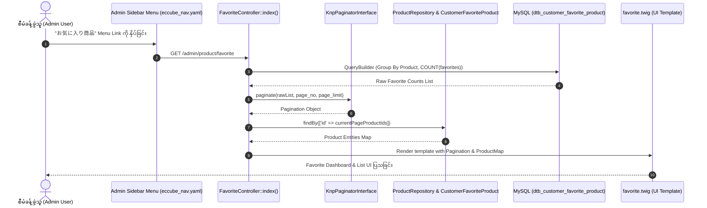

# EC-CUBE 4.3.1 - Admin Panel အကြိုက်ဆုံးပစ္စည်းများ စာရင်းနှင့် မှတ်တမ်း စာမျက်နှာ ဖန်တီးခြင်း လမ်းညွှန် (Admin Favorite Product List & History Implementation Guide)

ဤမှတ်တမ်းသည် EC-CUBE 4.3.1 တွင် **Admin Panel (စီမံခန့်ခွဲသူ မျက်နှာပြင်) ၌ ဝယ်ယူသူများ၏ အကြိုက်ဆုံးပစ္စည်း စာရင်းများနှင့် မှတ်တမ်းများ (Customer Favorite History & Counts)** အား စာရင်းဇယား၊ အနှစ်ချုပ်ကတ်များ၊ Pagination နှင့် Delete လုပ်ဆောင်ချက်များဖြင့် စနစ်တကျ ကြည့်ရှု/စီမံနိုင်သော စာမျက်နှာကို EC-CUBE Development Rule များနှင့်အညီ အတွေ့အကြုံ (၆) လရှိ Junior Developer များ အလွယ်တကူ လိုက်နာနားလည်နိုင်စေရန် မြန်မာဘာသာဖြင့် အဆင့်ဆင့် ရေးသားထားသော လမ်းညွှန်ဖြစ်ပါသည်။

---

## ၁။ အနှစ်ချုပ် ခြုံငုံသုံးသပ်ချက် (Overview & Purpose)

EC-CUBE 4.3.1 မူရင်းစနစ်တွင် ဝယ်ယူသူများ မည်သည့်ပစ္စည်းများကို Favorite ပြုလုပ်ထားသည်ကို Admin Panel မှ စုစည်းကြည့်ရှု/စီမံနိုင်သော စာမျက်နှာ မပါဝင်ပါ။
ဤ Customization ဖြင့် အောက်ပါ အဓိက အချက်များကို EC-CUBE စံသတ်မှတ်ချက်အတိုင်း အကောင်အထည်ဖော်ထားပါသည်:

1. **Admin Favorite Dashboard (`/admin/product/favorite`):**
   * ဝယ်ယူသူများ အကြိုက်ဆုံးအဖြစ် မှတ်သားထားသော ကုန်ပစ္စည်းများ၊ ပုံ (Thumbnail)၊ အမည်၊ Code၊ ဈေးနှုန်းနှင့် Favorite ပြုလုပ်ခံရသည့် အကြိမ်ရေ (Favorite Counts) များကို စာရင်းဇယားဖြင့် ပြသခြင်း။
2. **စာရင်းအင်း အနှစ်ချုပ် ကတ်များ (Summary Statistics Cards):**
   * စုစုပေါင်း Favorite အကြိမ်ရေ (Total Favorites Count)။
   * Favorite အဖြစ် မှတ်သားခံထားရသော သီးခြားကုန်ပစ္စည်း အရေအတွက် (Total Favorited Products)။
3. **စာမျက်နှာ ခွဲထုတ်မှု စနစ် (KnpPaginator Integration):**
   * ဒေတာအရေအတွက် များပြားလာပါက စနစ်နှေးကွေးမှု မဖြစ်စေရန် KnpPaginator ဖြင့် စာမျက်နှာ ခွဲထုတ်၍ ပြသခြင်း။
4. **ဖျက်ပစ်နိုင်သော လုပ်ဆောင်ချက်နှင့် CSRF Protection (Delete Action with Security):**
   * CSRF Token လုံခြုံရေး စနစ်ပါဝင်သော Confirmation Modal ဖြင့် မလိုအပ်သော Favorite Data များကို အန္တရာယ်ကင်းစွာ ဖျက်ပစ်နိုင်ခြင်း။
5. **Admin Menu ချိတ်ဆက်မှု (Sidebar Nav Menu Integration):**
   * Admin ဘယ်ဘက် Sidebar ရှိ **商品管理 (Product Management) -> お気に入り商品** အောက်တွင် Menu Item အသစ် ချိတ်ဆက်ပေးထားခြင်း။
6. **Route Annotation Standard:**
   * Route အားလုံးကို EC-CUBE 4.3 ၏ စံသတ်မှတ်ချက်အတိုင်း PHPDoc Annotation (`@Route(...)`) ပုံစံဖြင့်သာ တိကျစွာ ရေးသားထားခြင်း။
7. **Core Product/Order ပုံစံတူ CSV Export Logic (`/admin/product/favorite/export`):**
   * Core EC-CUBE ၏ Product/Order CSV ထုတ်ယူသည့် Logic အတိုင်း `StreamedResponse`၊ `UTF-8 BOM` (Excel Font မပျက်စေရန်)၊ `set_time_limit(0)`၊ `SQLLogger(null)` နှင့် High-performance `JOIN` Query ဖြင့် Favorite Data များကို Memory Leak မဖြစ်ဘဲ တိုက်ရိုက် CSV Download ဆွဲနိုင်ခြင်း။

---

## ၂။ အဆင့်ဆင့် အလုပ်လုပ်ပုံ စနစ်နှင့် ဒေတာစီးဆင်းမှု (Architecture & Data Flow)



---

## ၃။ မူရင်း Core ဖိုင်များ စာရင်း (Origin Core File List)

> [!CAUTION]
> **EC-CUBE Development Law:** `src/Eccube/` နှင့် `vendor/` အောက်ရှိ မူရင်း Core ဖိုင်များကို **တိုက်ရိုက် ပြင်ဆင်ခြင်း လုံးဝ (လုံးဝ) မပြုလုပ်ရပါ**။

| စဉ် | မူရင်း Core ဖိုင်လမ်းကြောင်း (Origin Core File Path) | မူရင်း တာဝန် (Default Role) |
| :---: | :--- | :--- |
| ၁ | `src/Eccube/Entity/CustomerFavoriteProduct.php` | Favorite Database Table (`dtb_customer_favorite_product`) နှင့် ချိတ်ဆက်ထားသော Core Entity။ |
| ၂ | `src/Eccube/Repository/CustomerFavoriteProductRepository.php` | Favorite Database Query များကို ကိုင်တွယ်သည့် Repository။ |
| ၃ | `src/Eccube/Repository/ProductRepository.php` | Product Entity များကို Query ဆွဲယူသည့် Repository။ |
| ၄ | `src/Eccube/Resource/template/admin/default_frame.twig` | Admin Panel ၏ အခြေခံ ပင်မ Layout Frame Template။ |

---

## ၄။ ပြင်ဆင် / အသစ်ဖန်တီးထားသော ဖိုင်များ စာရင်း (Updated / Created File List)

EC-CUBE Customization စည်းမျဉ်းများနှင့်အညီ `app/Customize/` နှင့် `app/template/` အောက်တွင် အောက်ပါအတိုင်း အသစ်ဖန်တီး/ပြင်ဆင်ထားပါသည်:

| စဉ် | ပြင်ဆင်/အသစ်ဖန်တီးထားသော ဖိုင်လမ်းကြောင်း (File Path) | အမျိုးအစား | တာဝန်နှင့် လုပ်ဆောင်ချက် (Role & Description) |
| :---: | :--- | :---: | :--- |
| ၁ | [`FavoriteController.php`](file:///Users/kyawwaiyan/Documents/my-Home-tech/eccube-4.3.1/app/Customize/Controller/Admin/Product/FavoriteController.php) | **အသစ်ဖန်တီး (NEW)** | Admin Favorite List စာမျက်နှာ၊ Data Query၊ Pagination နှင့် Delete လုပ်ဆောင်ချက်ကို ကိုင်တွယ်သည့် Controller။ |
| ၂ | [`favorite.twig`](file:///Users/kyawwaiyan/Documents/my-Home-tech/eccube-4.3.1/app/template/admin/Product/favorite.twig) | **အသစ်ဖန်တီး (NEW)** | Admin Favorite List UI Template (Stat Cards, Data Table, Delete Modal, Paginator)။ |
| ၃ | [`eccube_nav.yaml`](file:///Users/kyawwaiyan/Documents/my-Home-tech/eccube-4.3.1/app/config/eccube/packages/eccube_nav.yaml) | **ပြင်ဆင် (UPDATED)** | Admin Sidebar Menu ရှိ 商品管理 အောက်တွင် `お気に入り商品` Menu Link ထည့်သွင်းထားခြင်း။ |
| ၄ | [`messages.ja.yaml`](file:///Users/kyawwaiyan/Documents/my-Home-tech/eccube-4.3.1/app/Customize/Resource/locale/messages.ja.yaml) | **ပြင်ဆင်/အသစ် (UPDATED)** | Admin Favorite စနစ်အတွက် ဂျပန်ဘာသာ Translation String များ။ |
| ၅ | [`messages.en.yaml`](file:///Users/kyawwaiyan/Documents/my-Home-tech/eccube-4.3.1/app/Customize/Resource/locale/messages.en.yaml) | **ပြင်ဆင်/အသစ် (UPDATED)** | Admin Favorite စနစ်အတွက် အင်္ဂလိပ်ဘာသာ Translation String များ။ |

---

## ၅။ Route သတ်မှတ်ချက်ပုံစံ စံစည်းမျဉ်း (Annotation vs PHP 8 Attribute)

EC-CUBE 4.3 တွင် Controller Route များကို သတ်မှတ်ရာ၌ PHP 8 Attribute (`#[Route(...)]`) အစား **PHPDoc Annotation (`@Route(...)`)** ပုံစံကို အသုံးပြုရပါသည်:

```php
// ✅ မှန်ကန်သော ပုံစံ (EC-CUBE Standard Annotation Format)
/**
 * @Route("/%eccube_admin_route%/product/favorite", name="admin_product_favorite", methods={"GET", "POST"})
 * @Route("/%eccube_admin_route%/product/favorite/page/{page_no}", requirements={"page_no" = "\d+"}, name="admin_product_favorite_page", methods={"GET", "POST"})
 * @Template("@admin/Product/favorite.twig")
 */
public function index(Request $request, PaginatorInterface $paginator, $page_no = null)
{
    // ...
}

// ❌ မသုံးရသော ပုံစံ (PHP 8 Attribute Format)
// #[Route('/admin/product/favorite', name: 'admin_product_favorite', methods: ['GET', 'POST'])]
```

---

## ၆။ အဆင့်ဆင့် အကောင်အထည်ဖော်မှု လမ်းညွှန် (Step-by-Step Implementation Details)

### အဆင့် ၁: Admin Favorite Controller ဖန်တီးခြင်း
**ဖိုင်တည်နေရာ:** `app/Customize/Controller/Admin/Product/FavoriteController.php`

* **ဘာကြောင့် ဒီလိုရေးရသလဲ (Why):**
  * `CustomerFavoriteProduct` မှ Product ID အလိုက် `COUNT(cfp.id)` ကို QueryBuilder ဖြင့် Group By လုပ်၍ Favorite အများဆုံးမှ အနည်းဆုံးသို့ စီတန်းထားပါသည်။
  * MySQL ၏ `ONLY_FULL_GROUP_BY` standard ကြောင့် SQL Error မတက်စေရန် `IDENTITY(cfp.Product)` ဖြင့် ID စာရင်းကို ဦးစွာဆွဲထုတ်ပြီးမှ လက်ရှိ စာမျက်နှာရှိ Product များကို `ProductRepository` ဖြင့် လိုအပ်သလောက်သာ ခေါ်ယူပါသည်။
  * Delete ပြုလုပ်ရာတွင် `isTokenValid()` ဖြင့် CSRF Token ကို စစ်ဆေးထားပါသည်။

* **Code အပြည့်အစုံ:**
```php
<?php

/*
 * This file is part of EC-CUBE
 *
 * Copyright(c) EC-CUBE CO.,LTD. All Rights Reserved.
 *
 * http://www.ec-cube.co.jp/
 *
 * For the full copyright and license information, please view the LICENSE
 * file that was distributed with this source code.
 */

namespace Customize\Controller\Admin\Product;

use Eccube\Controller\AbstractController;
use Eccube\Entity\CustomerFavoriteProduct;
use Eccube\Repository\CustomerFavoriteProductRepository;
use Eccube\Repository\ProductRepository;
use Knp\Component\Pager\PaginatorInterface;
use Sensio\Bundle\FrameworkExtraBundle\Configuration\Template;
use Symfony\Component\HttpFoundation\Request;
use Symfony\Component\HttpFoundation\StreamedResponse;
use Symfony\Component\Routing\Annotation\Route;

/**
 * Class FavoriteController
 *
 * Admin Panel တွင် ဝယ်ယူသူများ၏ အကြိုက်ဆုံး ကုန်ပစ္စည်းများ စာရင်းနှင့် Favorite Counts များကို ပြသ/စီမံသော Controller ဖြစ်ပါသည်။
 */
class FavoriteController extends AbstractController
{
    /**
     * @var CustomerFavoriteProductRepository
     */
    protected $customerFavoriteProductRepository;

    /**
     * @var ProductRepository
     */
    protected $productRepository;

    /**
     * FavoriteController constructor.
     *
     * @param CustomerFavoriteProductRepository $customerFavoriteProductRepository
     * @param ProductRepository $productRepository
     */
    public function __construct(
        CustomerFavoriteProductRepository $customerFavoriteProductRepository,
        ProductRepository $productRepository
    ) {
        $this->customerFavoriteProductRepository = $customerFavoriteProductRepository;
        $this->productRepository = $productRepository;
    }

    /**
     * Admin အကြိုက်ဆုံး ကုန်ပစ္စည်းများ စာရင်းနှင့် Favorite Count ပြသခြင်း
     *
     * @Route("/%eccube_admin_route%/product/favorite", name="admin_product_favorite", methods={"GET", "POST"})
     * @Route("/%eccube_admin_route%/product/favorite/page/{page_no}", requirements={"page_no" = "\d+"}, name="admin_product_favorite_page", methods={"GET", "POST"})
     * @Template("@admin/Product/favorite.twig")
     *
     * @param Request $request
     * @param PaginatorInterface $paginator
     * @param int|null $page_no
     * @return array
     */
    public function index(Request $request, PaginatorInterface $paginator, $page_no = null)
    {
        $page_no = $page_no ?: 1;

        // ၁။ Favorite ပြုလုပ်ထားသော ကုန်ပစ္စည်း ID များနှင့် Favorite Count ကို Group By လုပ်၍ ဆွဲယူခြင်း
        $qb = $this->entityManager->createQueryBuilder();
        $qb->select('IDENTITY(cfp.Product) AS product_id, COUNT(cfp.id) AS favorite_count')
            ->from(CustomerFavoriteProduct::class, 'cfp')
            ->groupBy('cfp.Product')
            ->orderBy('favorite_count', 'DESC')
            ->addOrderBy('product_id', 'DESC');

        $rawList = $qb->getQuery()->getResult();

        // ၂။ KnpPaginator ဖြင့် စာမျက်နှာ ခွဲထုတ်ခြင်း
        $page_count = $this->eccubeConfig->get('eccube_default_page_count');
        $pagination = $paginator->paginate(
            $rawList,
            $page_no,
            $page_count
        );

        // ၃။ လက်ရှိ စာမျက်နှာရှိ Product ID များအတွက် Product Entity များကို ဆွဲထုတ်ခြင်း
        $productMap = [];
        $productIds = [];
        foreach ($pagination->getItems() as $item) {
            if (!empty($item['product_id'])) {
                $productIds[] = (int) $item['product_id'];
            }
        }

        if (!empty($productIds)) {
            $products = $this->productRepository->findBy(['id' => $productIds]);
            foreach ($products as $p) {
                $productMap[$p->getId()] = $p;
            }
        }

        // ၄။ စုစုပေါင်း Favorite အကြိမ်ရေ (Total Favorites)
        $total_favorites = (int) $this->entityManager->createQueryBuilder()
            ->select('COUNT(cfp.id)')
            ->from(CustomerFavoriteProduct::class, 'cfp')
            ->getQuery()
            ->getSingleScalarResult();

        // ၅။ စုစုပေါင်း Favorite လုပ်ခံထားရသော သီးခြားကုန်ပစ္စည်း အရေအတွက် (Total Favorited Products)
        $total_favorited_products = count($rawList);

        return [
            'pagination' => $pagination,
            'productMap' => $productMap,
            'page_no' => $page_no,
            'total_favorites' => $total_favorites,
            'total_favorited_products' => $total_favorited_products,
        ];
    }

    /**
     * Admin Favorite CSV Export (Product/Order ပုံစံတူ StreamedResponse Logic)
     *
     * @Route("/%eccube_admin_route%/product/favorite/export", name="admin_product_favorite_export", methods={"GET", "POST"})
     *
     * @param Request $request
     * @return StreamedResponse
     */
    public function exportCsv(Request $request)
    {
        // Timeout နှင့် SQL Logger ကို ပိတ်ခြင်း
        set_time_limit(0);
        $this->entityManager->getConfiguration()->setSQLLogger(null);

        // StreamedResponse ဖြင့် Memory သက်သာစေရန် Chunk/Stream ထုတ်ယူခြင်း
        $response = new StreamedResponse();
        $response->setCallback(function () {
            $handle = fopen('php://output', 'w');
            // Excel UTF-8 BOM ထည့်သွင်းခြင်း
            fwrite($handle, "\xEF\xBB\xBF");

            $headers = ['Product ID', 'Product Code', 'Product Name', 'Price (Inc Tax)', 'Favorite Count'];
            fputcsv($handle, $headers);

            // N+1 Query ပြဿနာ မဖြစ်စေရန် Product Entity ပါ JOIN ဆွဲယူခြင်း
            $qb = $this->entityManager->createQueryBuilder();
            $qb->select('p AS product, COUNT(cfp.id) AS favorite_count')
                ->from(CustomerFavoriteProduct::class, 'cfp')
                ->innerJoin('cfp.Product', 'p')
                ->groupBy('p.id')
                ->orderBy('favorite_count', 'DESC')
                ->addOrderBy('p.id', 'DESC');

            $results = $qb->getQuery()->getResult();

            foreach ($results as $row) {
                /** @var \Eccube\Entity\Product $product */
                $product = $row['product'];
                if (!$product) {
                    continue;
                }

                $csvRow = [
                    $product->getId(),
                    $product->getCodeMin() ?: '-',
                    $product->getName(),
                    $product->getPrice02IncTaxMin(),
                    $row['favorite_count'],
                ];

                fputcsv($handle, $csvRow);
                flush();
            }

            fclose($handle);
        });

        $now = new \DateTime();
        $filename = 'favorite_products_' . $now->format('YmdHis') . '.csv';

        $response->headers->set('Content-Type', 'application/octet-stream');
        $response->headers->set('Content-Disposition', 'attachment; filename=' . $filename);

        log_info('Favorite CSV Export Completed', [$filename]);

        return $response;
    }

    /**
     * Admin မှ Product တစ်ခု၏ Favorite မှတ်တမ်းအားလုံးကို ဖျက်ပစ်ခြင်း
     *
     * @Route("/%eccube_admin_route%/product/favorite/{id}/delete", requirements={"id" = "\d+"}, name="admin_product_favorite_delete", methods={"DELETE", "POST"})
     *
     * @param Request $request
     * @param int $id
     * @return \Symfony\Component\HttpFoundation\RedirectResponse
     */
    public function delete(Request $request, $id)
    {
        // CSRF Token စစ်ဆေးခြင်း
        $this->isTokenValid();

        $favorites = $this->customerFavoriteProductRepository->findBy(['Product' => $id]);
        if (!$favorites || count($favorites) === 0) {
            $this->addError('admin.product.favorite.delete_error', 'admin');
            return $this->redirectToRoute('admin_product_favorite');
        }

        foreach ($favorites as $favorite) {
            $this->customerFavoriteProductRepository->delete($favorite);
        }
        $this->addSuccess('admin.product.favorite.delete_complete', 'admin');

        return $this->redirectToRoute('admin_product_favorite');
    }
}
```

---

### အဆင့် ၂: Admin UI Twig Template ဖန်တီးခြင်း
**ဖိုင်တည်နေရာ:** `app/template/admin/Product/favorite.twig`

* **ဘာကြောင့် ဒီလိုရေးရသလဲ (Why):**
  * `` ဖြင့် Admin Panel ၏ Standard Frame ကို အသုံးပြုထားပါသည်။
  * Thumbnail Image ကို `asset(Product.mainFileName|no_image_product, 'save_image')` ဖြင့် စနစ်တကျ ပြသထားပါသည်။
  * Delete Action တွင် Modal Popup နှင့် CSRF Token ကို အသုံးပြုထားပါသည်။

* **Code အပြည့်အစုံ:**
```twig




{{ 'admin.favorite.favorite_products'|trans }}
{{ 'admin.product.product_management'|trans }}


    <style>
        .fav-product-img {
            width: 56px;
            height: 56px;
            object-fit: cover;
            border-radius: 6px;
            border: 1px solid #dee2e6;
            background-color: #f8f9fa;
            transition: transform 0.2s ease, box-shadow 0.2s ease;
        }
        .fav-product-img:hover {
            transform: scale(1.15);
            box-shadow: 0 4px 8px rgba(0, 0, 0, 0.15);
        }
        .stat-card {
            border-radius: 8px;
            border: none;
            box-shadow: 0 2px 6px rgba(0, 0, 0, 0.04);
            transition: transform 0.2s;
        }
        .stat-card:hover {
            transform: translateY(-2px);
        }
        .fav-count-badge {
            font-size: 0.95rem;
            padding: 0.4rem 0.8rem;
            border-radius: 20px;
            background: linear-gradient(135deg, #ff416c 0%, #ff4b2b 100%);
            color: #ffffff;
            display: inline-flex;
            align-items: center;
            box-shadow: 0 2px 4px rgba(255, 65, 108, 0.3);
        }
    </style>



    <script>
        $(function() {
            // Delete Modal Trigger Script
            $('.btn-delete-fav').on('click', function(e) {
                e.preventDefault();
                var action = $(this).data('action');
                var token = $(this).attr('token-for-anchor');
                var productId = $(this).data('product-id');
                var productName = $(this).data('product-name');

                $('#deleteFavoriteModal').find('#productIdDisplay').text(productId);
                $('#deleteFavoriteModal').find('#productNameDisplay').text(productName);
                var $form = $('#deleteFavoriteForm');
                $form.attr('action', action);
                var tokenKey = '{{ constant("Eccube\\Common\\Constant::TOKEN_NAME") }}';
                $form.find('input[name="' + tokenKey + '"]').val(token);

                var modal = new bootstrap.Modal(document.getElementById('deleteFavoriteModal'));
                modal.show();
            });
        });
    </script>



    <div class="c-contentsArea__cols">
        <div class="c-contentsArea__primaryCol">
            <div class="c-primaryCol">

                <!-- Header Title & Info -->
                <div class="d-flex justify-content-between align-items-center mb-4">
                    <div>
                        <h3 class="mb-1 fw-bold text-dark">
                            <i class="fa fa-heart text-danger me-2"></i>{{ 'admin.favorite.favorite_products'|trans }}
                        </h3>
                        <p class="text-muted small mb-0">{{ 'admin.product.favorite_management'|trans }}</p>
                    </div>
                    <div>
                        <a href="{{ url('admin_product') }}" class="btn btn-outline-secondary btn-sm">
                            <i class="fa fa-arrow-left me-1"></i> {{ 'admin.product.product_list'|trans }}
                        </a>
                    </div>
                </div>

                <!-- Statistics Summary Cards -->
                <div class="row g-3 mb-4">
                    <div class="col-md-6 col-lg-4">
                        <div class="card stat-card bg-white p-3 border-start border-primary border-4">
                            <div class="d-flex align-items-center">
                                <div class="rounded-circle bg-primary bg-opacity-10 p-3 me-3 text-primary">
                                    <i class="fa fa-cube fa-2x"></i>
                                </div>
                                <div>
                                    <span class="text-muted small d-block">{{ 'admin.product.stat_total_favorited_products'|trans }}</span>
                                    <h4 class="mb-0 fw-bold text-dark">{{ total_favorited_products|number_format }} <small class="fs-6 text-muted">items</small></h4>
                                </div>
                            </div>
                        </div>
                    </div>
                    <div class="col-md-6 col-lg-4">
                        <div class="card stat-card bg-white p-3 border-start border-danger border-4">
                            <div class="d-flex align-items-center">
                                <div class="rounded-circle bg-danger bg-opacity-10 p-3 me-3 text-danger">
                                    <i class="fa fa-heart fa-2x"></i>
                                </div>
                                <div>
                                    <span class="text-muted small d-block">{{ 'admin.product.stat_total_favorites'|trans }}</span>
                                    <h4 class="mb-0 fw-bold text-dark">{{ total_favorites|number_format }} <small class="fs-6 text-muted">times</small></h4>
                                </div>
                            </div>
                        </div>
                    </div>
                </div>

                <!-- Favourite Products List Table -->
                
                    <div class="card rounded border-0 shadow-sm mb-4">
                        <div class="card-header bg-white py-3 d-flex justify-content-between align-items-center border-bottom">
                            <h6 class="mb-0 fw-bold text-dark">
                                <i class="fa fa-list me-2 text-secondary"></i>{{ 'admin.product.favorite_list'|trans }}
                            </h6>
                            <span class="badge bg-light text-dark border">
                                Showing {{ pagination.getItemNumberPerPage * (page_no - 1) + 1 }} - {{ min(pagination.getItemNumberPerPage * page_no, pagination.totalItemCount) }} of {{ pagination.totalItemCount }} products
                            </span>
                        </div>
                        <div class="card-body p-0">
                            <div class="table-responsive">
                                <table class="table table-hover align-middle mb-0">
                                    <thead class="table-light">
                                    <tr>
                                        <th class="ps-3 py-3" style="width: 70px;">ID</th>
                                        <th class="py-3" style="width: 80px;">{{ 'admin.product.image__short'|trans }}</th>
                                        <th class="py-3">{{ 'admin.product.name'|trans }}</th>
                                        <th class="py-3" style="width: 170px;">{{ 'admin.product.price'|trans }}</th>
                                        <th class="py-3 text-center" style="width: 170px;">{{ 'admin.product.favorite_count'|trans }}</th>
                                        <th class="py-3 text-center" style="width: 120px;">{{ 'admin.product.display_status__short'|trans }}</th>
                                        <th class="pe-3 py-3 text-end" style="width: 160px;">{{ 'admin.common.action'|trans }}</th>
                                    </tr>
                                    </thead>
                                    <tbody>
                                    
                                        
                                        
                                        
                                            <tr>
                                                <!-- Product ID -->
                                                <td class="ps-3 fw-bold text-muted">{{ Product.id }}</td>

                                                <!-- Product Image -->
                                                <td>
                                                    <a href="{{ url('admin_product_product_edit', { id : Product.id }) }}">
                                                        
                                                    </a>
                                                </td>

                                                <!-- Product Name & Code -->
                                                <td>
                                                    <div>
                                                        <a class="fw-bold text-decoration-none text-dark" href="{{ url('admin_product_product_edit', { id : Product.id }) }}">
                                                            {{ Product.name }}
                                                        </a>
                                                    </div>
                                                    
                                                        <div class="small text-muted">
                                                            <i class="fa fa-barcode me-1"></i> {{ Product.code_min }}{{ 'admin.common.separator__range'|trans }}{{ Product.code_max }}
                                                        </div>
                                                    
                                                </td>

                                                <!-- Price -->
                                                <td>
                                                    <div class="fw-bold text-dark">
                                                        {{ Product.price02_min|price }}
                                                        
                                                            {{ 'admin.common.separator__range'|trans }}{{ Product.price02_max|price }}
                                                        
                                                    </div>
                                                </td>

                                                <!-- Favourite Counts -->
                                                <td class="text-center">
                                                    <span class="fav-count-badge">
                                                        <i class="fa fa-heart me-1"></i> {{ favorite_count|number_format }}
                                                    </span>
                                                </td>

                                                <!-- Status -->
                                                <td class="text-center">
                                                    
                                                        
                                                            <span class="badge bg-success bg-opacity-10 text-success border border-success-subtle px-2 py-1">
                                                                <i class="fa fa-check-circle me-1"></i> {{ Product.Status.name }}
                                                            </span>
                                                        
                                                            <span class="badge bg-secondary bg-opacity-10 text-secondary border border-secondary-subtle px-2 py-1">
                                                                {{ Product.Status.name }}
                                                            </span>
                                                        
                                                    
                                                </td>

                                                <!-- Actions -->
                                                <td class="pe-3 text-end">
                                                    <div class="btn-group btn-group-sm" role="group">
                                                        <a href="{{ url('admin_product_product_edit', { id : Product.id }) }}" class="btn btn-outline-primary" title="{{ 'admin.common.edit'|trans }}">
                                                            <i class="fa fa-pencil"></i>
                                                        </a>
                                                        <a href="{{ url('product_detail', { id : Product.id }) }}" target="_blank" class="btn btn-outline-secondary" title="View in store">
                                                            <i class="fa fa-external-link"></i>
                                                        </a>
                                                        <button type="button"
                                                                class="btn btn-outline-danger btn-delete-fav"
                                                                {{ csrf_token_for_anchor() }}
                                                                data-action="{{ url('admin_product_favorite_delete', {id: Product.id}) }}"
                                                                data-product-id="{{ Product.id }}"
                                                                data-product-name="{{ Product.name }}"
                                                                title="Clear favorites for this product">
                                                            <i class="fa fa-trash"></i>
                                                        </button>
                                                    </div>
                                                </td>
                                            </tr>
                                        
                                    
                                    </tbody>
                                </table>
                            </div>
                        </div>
                    </div>

                    <!-- Pagination Footer -->
                    <div class="row justify-content-md-center mb-4">
                        
                            
                        
                    </div>
                
                    <!-- Empty State Card -->
                    <div class="card rounded border-0 shadow-sm mb-4">
                        <div class="card-body text-center py-5">
                            <div class="mb-3 text-danger opacity-50">
                                <i class="fa fa-heart-o fa-4x"></i>
                            </div>
                            <h5 class="text-dark fw-bold mb-2">No favourite products registered yet.</h5>
                            <p class="text-muted small mb-0">When customers add products to their favorites in the shop, they will be listed here with their favorite counts.</p>
                        </div>
                    </div>
                

            </div>
        </div>
    </div>

    <!-- Delete Confirm Modal -->
    <div class="modal fade" id="deleteFavoriteModal" tabindex="-1" aria-labelledby="deleteFavoriteModalLabel" aria-hidden="true">
        <div class="modal-dialog">
            <div class="modal-content">
                <div class="modal-header">
                    <h5 class="modal-title fw-bold" id="deleteFavoriteModalLabel">{{ 'admin.common.delete_modal__title'|trans }}</h5>
                    <button type="button" class="btn-close" data-bs-dismiss="modal" aria-label="Close"></button>
                </div>
                <div class="modal-body">
                    <p class="mb-2">Are you sure you want to clear all favorite records for:</p>
                    <div class="alert alert-light border">
                        <strong>ID:</strong> <span id="productIdDisplay"></span><br>
                        <strong>Product:</strong> <span id="productNameDisplay" class="text-primary"></span>
                    </div>
                    <small class="text-muted">This will remove this product from all customers' favorite lists.</small>
                </div>
                <div class="modal-footer">
                    <button type="button" class="btn btn-ec-sub" data-bs-dismiss="modal">{{ 'admin.common.cancel'|trans }}</button>
                    <form id="deleteFavoriteForm" method="POST" action="">
                        <input type="hidden" name="_method" value="DELETE">
                        <input type="hidden" name="{{ constant('Eccube\\Common\\Constant::TOKEN_NAME') }}" value="">
                        <button type="submit" class="btn btn-ec-delete">{{ 'admin.common.delete'|trans }}</button>
                    </form>
                </div>
            </div>
        </div>
    </div>

```

---

### အဆင့် ၃: Admin Navigation Menu ထည့်သွင်းခြင်း
**ဖိုင်တည်နေရာ:** `app/config/eccube/packages/eccube_nav.yaml`

Admin Sidebar Menu ရှိ **商品管理** အောက်တွင် `favorite_product` ကို အောက်ပါအတိုင်း ထည့်သွင်းထားပါသည်:

```yaml
parameters:
    eccube_nav:
        product:
            name: admin.product.product_management
            icon: fa-cube
            children:
                product_master:
                    name: admin.product.product_list
                    url: admin_product
                custom_product_list:
                    name: admin.product.custom_product_list
                    url: admin_product_custom_list
                # Admin Favorite Menu Link
                favorite_product:
                    name: admin.favorite.favorite_products
                    url: admin_product_favorite
                product_edit:
                    name: admin.product.product_registration
                    url: admin_product_product_new
```

---

### အဆင့် ၄: Translation Strings များ ထည့်သွင်းခြင်း

* **ဂျပန်ဘာသာဖိုင်:** `app/Customize/Resource/locale/messages.ja.yaml`
```yaml
admin.favorite.favorite_products: お気に入り商品
admin.product.favorite_list: お気に入り商品一覧
admin.product.favorite_management: お気に入り商品の確認および管理
admin.product.favorite_count: お気に入り数
admin.product.stat_total_favorites: 総お気に入り登録数
admin.product.stat_total_favorited_products: お気に入り登録商品数
admin.product.favorite.delete_complete: お気に入り登録を解除しました。
admin.product.favorite.delete_error: お気に入り登録の解除に失敗しました。
```

* **အင်္ဂလိပ်ဘာသာဖိုင်:** `app/Customize/Resource/locale/messages.en.yaml`
```yaml
admin.favorite.favorite_products: Favourite Products
admin.product.favorite_list: Favourite Products List
admin.product.favorite_management: Favourite Products Management
admin.product.favorite_count: Favourite Count
admin.product.stat_total_favorites: Total Favorites
admin.product.stat_total_favorited_products: Total Favorited Products
admin.product.favorite.delete_complete: Favourite product records have been cleared.
admin.product.favorite.delete_error: Failed to clear favourite product records.
```

---

## ၇။ စစ်ဆေးအတည်ပြုရန် Console Commands များ (Verification Commands)

Customization အားလုံး ပြင်ဆင်ပြီးပါက အောက်ပါ Commands များကို Terminal တွင် run ပေးရပါမည်:

```bash
# ၁။ Symfony Cache ရှင်းလင်းခြင်း (မဖြစ်မနေ လုပ်ဆောင်ရပါမည်)
docker compose -f docker-compose.yml -f docker-compose.mysql.yml exec ec-cube bin/console cache:clear --no-warmup

# သို့မဟုတ် Local PHP ဖြင့် Run နေပါက:
bin/console cache:clear --no-warmup

# ၂။ Favorite Routes များ စနစ်ထဲသို့ မှန်ကန်စွာ စာရင်းဝင်ခြင်း ရှိ/မရှိ စစ်ဆေးခြင်း
bin/console debug:router admin_product_favorite
bin/console debug:router admin_product_favorite_delete
```

---

## ၈။ စစ်ဆေးစမ်းသပ်မှု စာရင်း (Verification & Testing Checklist)

| စဉ် | စစ်ဆေးရမည့် အချက် (Test Item) | မျှော်မှန်းရလဒ် (Expected Result) | အောင်မြင်မှု အခြေအနေ |
| :---: | :--- | :--- | :---: |
| ၁ | **Admin Sidebar Menu** | Admin Login ဝင်ပြီး **商品管理** အောက်တွင် **お気に入り商品** menu link ပေါ်နေရမည်။ | [ ] |
| ၂ | **Dashboard Summary Cards** | Total Favorited Products နှင့် Total Favorites အကြိမ်ရေ ကိန်းဂဏန်းများ မှန်ကန်စွာ ပြသရမည်။ | [ ] |
| ၃ | **Product Data Listing** | Product ပုံ (Thumbnail)၊ အမည်၊ Price၊ Favorite Count badge (Gradated Heart Badge) နှင့် Status များ မှန်ကန်စွာ ပေါ်ရမည်။ | [ ] |
| ၄ | **Empty State** | ဒေတာမရှိသေးပါက Heart Icon နှင့်အတူ Empty State Card သန့်ရှင်းစွာ ပေါ်နေရမည်။ | [ ] |
| ၅ | **Pagination** | Product များပြားပါက စာမျက်နှာ ကူးပြောင်းသည့် ခလုတ်များ အလုပ်လုပ်ရမည်။ | [ ] |
| ၆ | **Delete Confirmation** | Trash Button နှိပ်ပါက Modal ပေါ်လာပြီး CSRF Token ဖြင့် အောင်မြင်စွာ ဖျက်ပစ်နိုင်ရမည်။ | [ ] |

---

## ၉။ တွေ့ကြုံရတတ်သော အမှားများနှင့် ဖြေရှင်းနည်းများ (Troubleshooting & Common Pitfalls)

1. **404 Not Found သို့မဟုတ် Route Error ပြခြင်း:**
   * **အကြောင်းရင်း:** Cache မရှင်းရသေးခြင်း သို့မဟုတ် Route Annotation syntax မမှန်ကန်ခြင်း။
   * **ဖြေရှင်းနည်း:** `bin/console cache:clear --no-warmup` ကို run ပြီး Controller ပေါ်တွင် `@Route("/%eccube_admin_route%/product/favorite", ...)` ပါဝင်မှု ရှိ/မရှိ စစ်ဆေးပါ။

2. **SQL Error (`1055 Expression of SELECT list is not in GROUP BY clause`):**
   * **အကြောင်းရင်း:** MySQL `ONLY_FULL_GROUP_BY` ကြောင့် Entity တစ်ခုလုံးအား `groupBy('cfp.Product')` တိုက်ရိုက်လုပ်ရာတွင် ဖြစ်ပွားတတ်ခြင်း။
   * **ဖြေရှင်းနည်း:** Controller တွင် `select('IDENTITY(cfp.Product) AS product_id, COUNT(cfp.id) AS favorite_count')` ဖြင့် scalar ID ကိုသာ DQL ဖြင့် ဆွဲထုတ်ပြီး Product Object များကို `ProductRepository->findBy(['id' => ...])` ဖြင့် map ပြန်လုပ်ပေးထားသောကြောင့် အဆိုပါ Error လုံးဝ မဖြစ်ပေါ်နိုင်ပါ။

3. **CSRF Token Invalid Error:**
   * **အကြောင်းရင်း:** Delete Modal တွင် CSRF Token key/value မပါဝင်ခြင်း။
   * **ဖြေရှင်းနည်း:** Modal Form တွင် `{{ csrf_token_for_anchor() }}` မှ token ကို jQuery ဖြင့် hidden input ထဲသို့ ထည့်သွင်းပေးထားပြီး Controller တွင် `$this->isTokenValid()` စစ်ဆေးထားပါသည်။
