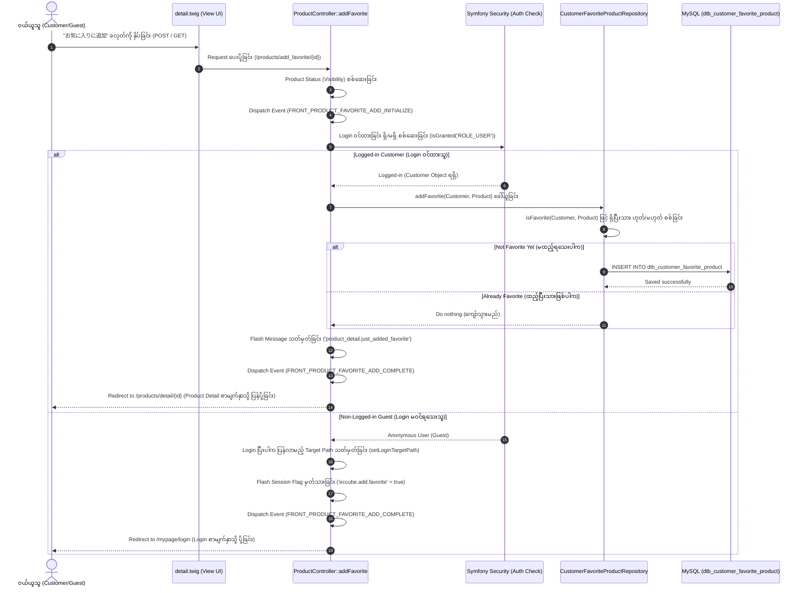

# EC-CUBE 4.3.1 - အကြိုက်ဆုံးပစ္စည်း မှတ်ပုံတင်ခြင်း လုပ်ငန်းစဉ် လေ့လာဆန်းစစ်ချက် (Favorite Product Registration Process Investigation)

ဤမှတ်တမ်းသည် EC-CUBE 4.3.1 ရှိ **အကြိုက်ဆုံးပစ္စည်း မှတ်ပုံတင်ခြင်း (Favorite / お気に入り登録 - CustomerFavoriteProduct)** စနစ်၏ မူရင်း Core ဖိုင်များ အလုပ်လုပ်ပုံ၊ Database ဇယားများ၊ Request Lifecycle နှင့် ၎င်းအား စည်းမျဉ်းနှင့်အညီ Customization ပြုလုပ်နိုင်သော ဖိုင်တည်နေရာများကို အတွေ့အကြုံ (၆) လရှိ Junior Developer များ အလွယ်တကူ လိုက်နာနားလည်နိုင်စေရန် မြန်မာဘာသာဖြင့် အသေးစိတ် ရေးသားထားသော လမ်းညွှန်ဖြစ်ပါသည်။

---

## ၁။ အနှစ်ချုပ် ခြုံငုံသုံးသပ်ချက် (Overview)

EC-CUBE တွင် Customer (ဝယ်ယူသူ) သည် မိမိစိတ်ကြိုက် နှစ်သက်သော Product (ကုန်ပစ္စည်း) များကို "Favorite / お気に入り" အဖြစ် သိမ်းဆည်းထားနိုင်ပါသည်။
- **အဓိက Entity:** `Eccube\Entity\CustomerFavoriteProduct`
- **Database Table:** `dtb_customer_favorite_product`
- **စနစ် ခွင့်ပြုချက် (Shop Setting):** Admin Panel ရှိ `BaseInfo` တွင် `option_favorite_product` setting ဖွင့်ထားမှသာ UI တွင် ခလုတ်ပေါ်မည် ဖြစ်ပါသည်။
- **အသုံးပြုနိုင်သူ:** Member (Login ဝင်ထားသူ `ROLE_USER`) သာ မှတ်ပုံတင်နိုင်ပြီး Guest (Login မဝင်ရသေးသူ) ဖြစ်ပါက Login Page သို့ Redirect ပေးပြီး Login အောင်မြင်ပါက Favorite အလိုအလျောက် ပေါင်းထည့်ပေးပါသည်။

---

## ၂။ Database Structure (ဇယားဖွဲ့စည်းပုံ)

အကြိုက်ဆုံး ပစ္စည်းများကို သိမ်းဆည်းသည့် ဇယားမှာ `dtb_customer_favorite_product` ဖြစ်ပြီး Customer နှင့် Product တို့၏ Many-to-One ဆက်သွယ်ချက် (Relational Mapping) ဖြင့် တည်ဆောက်ထားပါသည်။

| Column အမည် | Data Type | ဖော်ပြချက် (Description) | Constraint / Index |
| :--- | :--- | :--- | :--- |
| `id` | `INT (Unsigned)` | Primary Key | Auto Increment |
| `customer_id` | `INT (Unsigned)` | ဝယ်ယူသူ Customer ၏ ID | Foreign Key (`dtb_customer.id`), On Delete CASCADE |
| `product_id` | `INT (Unsigned)` | ကုန်ပစ္စည်း Product ၏ ID | Foreign Key (`dtb_product.id`) |
| `create_date` | `DATETIMETZ` | စတင်သိမ်းဆည်းသည့် အချိန် | Non-Null |
| `update_date` | `DATETIMETZ` | နောက်ဆုံးပြင်ဆင်သည့် အချိန် | Non-Null |
| `discriminator_type` | `VARCHAR(255)` | Doctrine Single Table Inheritance အတွက် Type | Non-Null |

---

## ၃။ အဆင့်ဆင့် အလုပ်လုပ်ပုံ လုပ်ငန်းစဉ် (Step-by-Step Request Lifecycle)

အောက်ပါ Mermaid Diagram သည် Product Detail စာမျက်နှာမှ Favorite ခလုတ်နှိပ်လိုက်ချိန်မှစ၍ Database ထဲသို့ ဒေတာသိမ်းဆည်းပြီး ပြီးဆုံးသည်အထိ အဆင့်ဆင့် လုပ်ဆောင်ပုံကို ပြသထားပါသည်:



### အသေးစိတ် အဆင့်များ ရှင်းလင်းချက်:

1. **Step 1 (UI Display စစ်ဆေးခြင်း):**
   - `src/Eccube/Resource/template/default/Product/detail.twig` တွင် `BaseInfo.option_favorite_product` ကို စစ်ဆေးသည်။
   - `$is_favorite == false` ဖြစ်ပါက "Add to Favorite (お気に入りに追加)" ခလုတ် ပေါ်မည်။
   - `$is_favorite == true` (ထည့်ပြီးသား) ဖြစ်ပါက "Already in Favorites (お気に入りに追加済です。)" ဟု Button Disabled ဖြင့် ပြသမည်။

2. **Step 2 (Controller Route ခေါ်ယူခြင်း):**
   - Route: `/products/add_favorite/{id}` (name: `product_add_favorite`) သို့ GET သို့မဟုတ် POST Request ရောက်ရှိလာသည်။
   - `ProductController::addFavorite(Request $request, Product $Product)` Method က လက်ခံသည်။

3. **Step 3 (Product အခြေအနေ စစ်ဆေးခြင်း - Visibility Check):**
   - `$this->checkVisibility($Product)` ဖြင့် Product သည် ပယ်ဖျက်ထားခြင်း ရှိမရှိ၊ အများမြင်သာစေရန် Display (Status=1) ဖွင့်ထားခြင်း ရှိမရှိ စစ်ဆေးသည်။ မမှန်ကန်ပါက 404 Not Found ပေးပို့သည်။

4. **Step 4 (Initialize Event Dispatch ခြင်း):**
   - `EccubeEvents::FRONT_PRODUCT_FAVORITE_ADD_INITIALIZE` event ကို dispatch လုပ်သည်။ (စိတ်ကြိုက် စစ်ဆေးလိုသော logic များ ထည့်သွင်းနိုင်သည်)။

5. **Step 5 (User Login Status စစ်ဆေးခြင်း):**
   - **Login ဝင်ထားလျှင် (`$this->isGranted('ROLE_USER')`):**
     - `$this->customerFavoriteProductRepository->addFavorite($Customer, $Product)` ကို ခေါ်သည်။
     - Database ထဲတွင် Entity အသစ် ဖန်တီး၍ `$em->persist()` နှင့် `$em->flush()` လုပ်သည်။
     - FlashBag ထဲသို့ `product_detail.just_added_favorite` ထည့်သွင်းသည်။
     - `EccubeEvents::FRONT_PRODUCT_FAVORITE_ADD_COMPLETE` event ကို dispatch လုပ်သည်။
     - `product_detail` စာမျက်နှာသို့ redirect ပြန်လုပ်သည်။
   - **Login မဝင်ရသေးလျှင် (Guest):**
     - လက်ရှိ URL (`/products/add_favorite/{id}`) အား Login ဝင်ပြီးနောက် ပြန်ရောက်လာစေရန် `setLoginTargetPath()` တွင် မှတ်သားသည်။
     - FlashBag တွင် `eccube.add.favorite` ကို `true` ပေးသည်။
     - Login စာမျက်နှာ (`mypage_login`) သို့ redirect ပေးပို့သည်။

---

## ၄။ မူရင်း Core ဖိုင်များ စာရင်း (Origin Core File List)

> [!CAUTION]
> **EC-CUBE Law Reminder:** အောက်ဖော်ပြပါ `src/Eccube/` အောက်ရှိ မူရင်း Core ဖိုင်များကို **တိုက်ရိုက် ပြင်ဆင်ခြင်း လုံးဝ မပြုလုပ်ရပါ**။

| စဉ် | မူရင်း Core ဖိုင်လမ်းကြောင်း (File Path) | တာဝန်နှင့် လုပ်ဆောင်ချက် (Role & Responsibility) |
| :---: | :--- | :--- |
| ၁ | `src/Eccube/Controller/ProductController.php` | `addFavorite()` method ဖြင့် Favorite ပေါင်းထည့်ခြင်းနှင့် `detail()` method တွင် `$is_favorite` boolean status ရှာဖွေပေးခြင်း။ |
| ၂ | `src/Eccube/Repository/CustomerFavoriteProductRepository.php` | `addFavorite()`, `isFavorite()`, `getQueryBuilderByCustomer()`, `delete()` စသည့် Database Query logic များ ပါဝင်ခြင်း။ |
| ၃ | `src/Eccube/Entity/CustomerFavoriteProduct.php` | `dtb_customer_favorite_product` ဇယားနှင့် ချိတ်ဆက်ထားသော Doctrine Entity Class ဖြစ်ခြင်း။ |
| ၄ | `src/Eccube/Entity/Customer.php` | Customer နှင့် CustomerFavoriteProduct အကြား `$CustomerFavoriteProducts` (OneToMany) ချိတ်ဆက်မှု ထိန်းသိမ်းခြင်း။ |
| ၅ | `src/Eccube/Entity/Product.php` | Product နှင့် CustomerFavoriteProduct အကြား `$CustomerFavoriteProducts` (OneToMany) ချိတ်ဆက်မှု ထိန်းသိမ်းခြင်း။ |
| ၆ | `src/Eccube/Entity/BaseInfo.php` | Favorite လုပ်ဆောင်ချက်ကို ဖွင့်/ပိတ် ထိန်းချုပ်သည့် `$option_favorite_product` setting ပါဝင်ခြင်း။ |
| ၇ | `src/Eccube/Controller/Mypage/MypageController.php` | `favorite()` method ဖြင့် ဝယ်ယူသူ၏ Favorite List ပြသခြင်းနှင့် `delete()` method ဖြင့် Favorite ဖျက်ပေးခြင်း။ |
| ၈ | `src/Eccube/Resource/template/default/Product/detail.twig` | Product Detail စာမျက်နှာရှိ "お気に入りに追加" ခလုတ် Twig UI Template။ |
| ၉ | `src/Eccube/Resource/template/default/Mypage/favorite.twig` | Mypage စာမျက်နှာရှိ အကြိုက်ဆုံးပစ္စည်းများ စာရင်းနှင့် ဖျက်ရန် ခလုတ် Twig UI Template။ |
| ၁၀ | `src/Eccube/Event/EccubeEvents.php` | Favorite နှင့် သက်ဆိုင်သော Hook Event Constants များ (`FRONT_PRODUCT_FAVORITE_ADD_INITIALIZE`, `FRONT_PRODUCT_FAVORITE_ADD_COMPLETE`, စသည်) သတ်မှတ်ထားခြင်း။ |

---

## ၅။ စိတ်ကြိုက် ပြင်ဆင်ရန် / အသစ်ဖန်တီးရမည့် ဖိုင်များ စာရင်း (Customization / Created File List)

Favorite စနစ်အား ပြင်ဆင်လိုပါက EC-CUBE Standard အတိုင်း `app/Customize/` သို့မဟုတ် `app/template/` အောက်တွင်သာ အောက်ပါအတိုင်း အသစ်ဖန်တီး/ပြင်ဆင်ရမည် ဖြစ်ပါသည်:

| စဉ် | အသစ်ဖန်တီး/ပြင်ဆင်ရမည့် ဖိုင်လမ်းကြောင်း (File Path) | အသုံးပြုသည့် ရည်ရွယ်ချက် (Customization Purpose) |
| :---: | :--- | :--- |
| ၁ | `app/template/default/Product/detail.twig` | Product Detail စာမျက်နှာရှိ Favorite ခလုတ် UI, Icon, CSS Design သို့မဟုတ် Ajax ခလုတ် အဖြစ် ပြင်ဆင်ရန် Override လုပ်သည့် Template။ |
| ၂ | `app/template/default/Product/list.twig` | ကုန်ပစ္စည်း စာရင်း (Product List / Catalog) စာမျက်နှာတွင်ပါ Favorite ခလုတ် ထည့်သွင်းလိုပါက Override လုပ်သည့် Template။ |
| ၃ | `app/template/default/Mypage/favorite.twig` | Mypage ရှိ အကြိုက်ဆုံး ပစ္စည်းများ စာရင်း UI အပြင်အဆင်ကို ပြင်ဆင်လိုပါက Override လုပ်သည့် Template။ |
| ၄ | `app/Customize/EventListener/FavoriteEventListener.php` | Favorite ထည့်လိုက်သည့်အခါ Log မှတ်ခြင်း၊ Point ပေးခြင်း၊ Email ပို့ခြင်း သို့မဟုတ် အခြား Business Logic များ တွဲဖက်လုပ်ဆောင်ရန် Event Subscriber။ |
| ၅ | `app/Customize/Controller/FavoriteAjaxController.php` | စာမျက်နှာ Reload မဖြစ်စေဘဲ နောက်ကွယ်မှ AJAX ဖြင့် Favorite အဖွင့်/အပိတ် (Toggle) ပြုလုပ်နိုင်သော API Controller အသစ် ရေးသားရန်။ |
| ၆ | `app/Customize/Entity/CustomerFavoriteProductTrait.php` | Favorite ဇယားထဲသို့ Custom Field များ (ဥပမာ- Note/Memo, Priority, Folder ID) အသစ် ထပ်တိုးလိုပါက အသုံးပြုမည့် Entity Extension Trait။ |

---

## ၆။ လက်တွေ့ အသုံးချ နမူနာများ (Practical Code Examples)

### နမူနာ ၁ - Event Listener ဖြင့် Favorite ထည့်သွင်းမှုကို ခြေရာခံခြင်း (EventListener Example)

ဖိုင်တည်နေရာ: `app/Customize/EventListener/FavoriteEventListener.php`

```php
<?php

namespace Customize\EventListener;

use Eccube\Event\EccubeEvents;
use Eccube\Event\EventArgs;
use Symfony\Component\EventDispatcher\EventSubscriberInterface;
use Psr\Log\LoggerInterface;

class FavoriteEventListener implements EventSubscriberInterface
{
    /**
     * @var LoggerInterface
     */
    private $logger;

    public function __construct(LoggerInterface $logger)
    {
        $this->logger = $logger;
    }

    public static function getSubscribedEvents()
    {
        return [
            EccubeEvents::FRONT_PRODUCT_FAVORITE_ADD_COMPLETE => 'onFavoriteAddComplete',
        ];
    }

    public function onFavoriteAddComplete(EventArgs $event)
    {
        $Product = $event->getArgument('Product');
        $this->logger->info('ကုန်ပစ္စည်းအား Favorite ထဲသို့ အောင်မြင်စွာ ထည့်သွင်းပြီးပါပြီ: Product ID = ' . $Product->getId());
        
        // ဤနေရာတွင် လိုအပ်သော Custom Logic များ (e.g. Analytics, Notification) ထည့်သွင်းနိုင်ပါသည်
    }
}
```

---

### နမူနာ ၂ - Product List စာမျက်နှာအတွက် Template Override ပြုလုပ်ခြင်း

ဖိုင်တည်နေရာ: `app/template/default/Product/list.twig`
(မူရင်း `src/Eccube/Resource/template/default/Product/list.twig` အား ကူးယူ၍ လိုအပ်သော နေရာတွင် Favorite Form ထည့်သွင်းနိုင်ပါသည်)

```twig
{# Favorite Form ထည့်သွင်းခြင်း နမူနာ #}

    <form action="{{ url('product_add_favorite', {id: Product.id}) }}" method="post" class="d-inline">
        <button type="submit" class="btn btn-outline-danger btn-sm">
            <i class="fa fa-heart"></i> အကြိုက်ဆုံးထဲထည့်မည်
        </button>
    </form>

```

---

## ၇။ ပြင်ဆင်ပြီးပါက Run ရမည့် Console Commands များ

ဖိုင်အသစ်များ ရေးသားပြီးပါက သို့မဟုတ် Template ပြင်ဆင်ပြီးပါက အောက်ပါ Command များကို Terminal / Docker တွင် Run ပေးရပါမည်:

```bash
# ၁။ Cache ရှင်းလင်းခြင်း (ဖိုင်အသစ်များနှင့် Template ပြောင်းလဲမှုများ ချက်ချင်း အကျိုးသက်ရောက်စေရန်)
bin/console cache:clear --no-warmup

# ၂။ Entity Trait ဖြင့် Field အသစ် ထည့်သွင်းထားပါက Proxy Class များ ထုတ်ယူခြင်း
bin/console eccube:generate:proxies

# ၃။ Database Schema Update ပြုလုပ်ခြင်း (Field အသစ် ထည့်ထားမှသာ လိုအပ်ပါသည်)
bin/console doctrine:schema:update --dump-sql
bin/console doctrine:schema:update --force
```

Docker Container အသုံးပြုနေပါက:
```bash
docker compose -f docker-compose.yml -f docker-compose.mysql.yml exec ec-cube bin/console cache:clear --no-warmup
```
