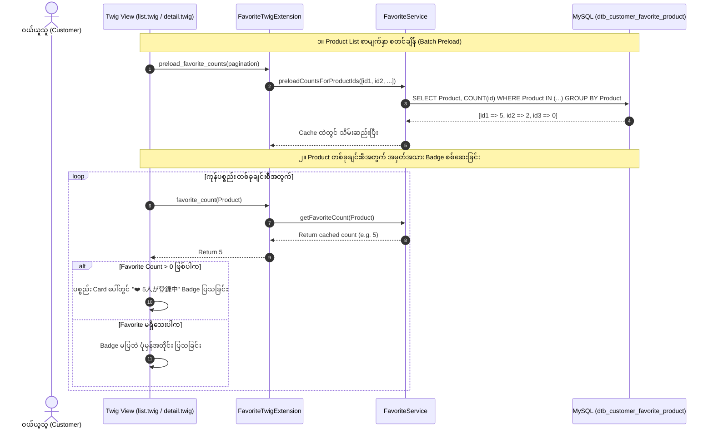

# EC-CUBE 4.3.1 - အခြား User များ အကြိုက်ဆုံးအဖြစ် မှတ်သားထားသော ပစ္စည်းများတွင် အမှတ်အသားပြသခြင်း လမ်းညွှန် (Other Users Favorite Indicator Guide)

ဤမှတ်တမ်းသည် EC-CUBE 4.3.1 တွင် **အခြားသော User များမှ Favorite (အကြိုက်ဆုံး) အဖြစ် မှတ်သားထားသော ကုန်ပစ္စည်းများအား အမှတ်အသား (Badge / Popularity Mark) ပြသပေးသည့် လုပ်ဆောင်ချက် (他のユーザーが登録しているお気に入り商品へ印を付ける)** ကို အတွေ့အကြုံ (၆) လရှိ Junior Developer များ အလွယ်တကူ လိုက်နာနားလည်နိုင်စေရန် မြန်မာဘာသာဖြင့် အသေးစိတ် ရေးသားထားသော လမ်းညွှန်ဖြစ်ပါသည်။

---

## ၁။ အနှစ်ချုပ် ခြုံငုံသုံးသပ်ချက် (Overview & Purpose)

E-commerce Platform များ (ဥပမာ- Amazon, Rakuten, Yahoo Shopping) တွင် အခြားဝယ်ယူသူများ နှစ်သက်ကြသော ပစ္စည်းများကို **Social Proof (လူကြိုက်များမှု အမှတ်အသား)** အဖြစ် ပြသပေးခြင်းဖြင့် အရောင်းမြှင့်တင်နိုင်ပါသည်။

* **Product List စာမျက်နှာ (`/products/list`):** ပစ္စည်း Thumbnail Card ပေါ်တွင် "❤️ N ယောက် မှတ်သားထားသည်" (ဥပမာ: `3人が登録中`) ဟု Badge ပြသပေးပါသည်။
* **Product Detail စာမျက်နှာ (`/products/detail/{id}`):** ခေါင်းစဉ်အောက်တွင် "❤️ N ယောက်သော ဝယ်ယူသူများ အကြိုက်ဆုံးအဖြစ် မှတ်သားထားပါသည်" ဟု အသေးစိတ် ဖော်ပြပေးပါသည်။
* **Performance အထူးပြုချက်:** ပစ္စည်းအများအပြား ပြသရသော List စာမျက်နှာတွင် SQL Query အခါခါ မပစ်ရစေရန် **Batch Preloading (`preload_favorite_counts`)** နှင့် **In-memory Caching** ဖြင့် N+1 Query ပြဿနာကို အပြည့်အဝ ဖြေရှင်းထားပါသည်။

---

## ၂။ အလုပ်လုပ်ပုံ စနစ် (Architecture & Workflow)



---

## ၃။ မူရင်း Core ဖိုင်များ စာရင်း (Origin Core File List)

> [!CAUTION]
> **EC-CUBE Core Rules:** `src/Eccube/` အောက်ရှိ မူရင်း Core ဖိုင်များကို **တိုက်ရိုက် ပြင်ဆင်ခြင်း မပြုလုပ်ရပါ**။

| စဉ် | မူရင်း Core ဖိုင်လမ်းကြောင်း (Origin Core File Path) | မူရင်း တာဝန် (Default Role) |
| :---: | :--- | :--- |
| ၁ | `src/Eccube/Entity/CustomerFavoriteProduct.php` | `dtb_customer_favorite_product` ဇယားနှင့် ဆက်စပ်နေသော Entity Class။ |
| ၂ | `src/Eccube/Repository/CustomerFavoriteProductRepository.php` | Favorite Database Query များကို ကိုင်တွယ်သည့် Repository။ |
| ၃ | `src/Eccube/Resource/template/default/Product/list.twig` | မူရင်း ကုန်ပစ္စည်း စာရင်း (Product List) Twig UI Template။ |
| ၄ | `src/Eccube/Resource/template/default/Product/detail.twig` | မူရင်း ကုန်ပစ္စည်း အသေးစိတ် (Product Detail) Twig UI Template။ |

---

## ၄။ ပြင်ဆင် / အသစ်ဖန်တီးထားသော ဖိုင်များ စာရင်း (Updated / Created File List)

| စဉ် | ပြင်ဆင်/အသစ်ဖန်တီးထားသော ဖိုင်လမ်းကြောင်း (File Path) | အမျိုးအစား | တာဝန်နှင့် လုပ်ဆောင်ချက် (Role & Description) |
| :---: | :--- | :---: | :--- |
| ၁ | [`FavoriteService.php`](file:///Users/kyawwaiyan/Documents/my-Home-tech/eccube-4.3.1/app/Customize/Service/FavoriteService.php) | **အသစ်ဖန်တီး (NEW)** | Favorite အရေအတွက် စာရင်းကောက်ယူခြင်း၊ အခြား User များ မှတ်သားမှု တွက်ချက်ခြင်းနှင့် Batch Query Preload လုပ်ပေးသည့် Service။ |
| ၂ | [`FavoriteTwigExtension.php`](file:///Users/kyawwaiyan/Documents/my-Home-tech/eccube-4.3.1/app/Customize/Twig/FavoriteTwigExtension.php) | **အသစ်ဖန်တီး/မွမ်းမံ (NEW/UPDATED)** | Twig Template ထဲတွင် `favorite_count()`, `other_favorite_count()`, `is_favorited_by_others()` စသည့် Function များကို အသုံးပြုနိုင်စေသည့် Extension။ |
| ၃ | [`list.twig`](file:///Users/kyawwaiyan/Documents/my-Home-tech/eccube-4.3.1/app/template/default/Product/list.twig) | **ပြင်ဆင်/အစားထိုး (OVERRIDE)** | Product Card တစ်ခုချင်းစီ၏ ပုံပေါ်တွင် "❤️ N人が登録中" လူကြိုက်များမှု Badge ထည့်သွင်းထားသော Product List Template။ |
| ၄ | [`detail.twig`](file:///Users/kyawwaiyan/Documents/my-Home-tech/eccube-4.3.1/app/template/default/Product/detail.twig) | **ပြင်ဆင်/အစားထိုး (OVERRIDE)** | ကုန်ပစ္စည်း အသေးစိတ် စာမျက်နှာတွင် အခြား User များ မှတ်သားထားမှု အခြေအနေ အသေးစိတ်ကို ဖော်ပြပေးသော Template။ |

---

## ၅။ အဆင့်ဆင့် အကောင်အထည်ဖော်မှု လမ်းညွှန် (Step-by-Step Walkthrough)

### အဆင့် ၁: FavoriteService ဖန်တီးခြင်း
**ဖိုင်တည်နေရာ:** `app/Customize/Service/FavoriteService.php`
* **လုပ်ဆောင်ချက်:** Database မှ Favorite Count ကို တွက်ချက်ပြီး Query အရေအတွက် မများစေရန် `$countCache` ထဲတွင် သိမ်းဆည်းသည်။
* **အဓိက Methods များ:**
  * `getFavoriteCount($product)`: ပစ္စည်းတစ်ခုလုံး၏ Favorite အရေအတွက် စုစုပေါင်း။
  * `getOtherUsersFavoriteCount($product, $customer)`: မိမိအကောင့်မှအပ အခြားသူများ၏ Favorite အရေအတွက်။
  * `preloadCountsForProductIds(array $ids)`: ပစ္စည်းအများအပြားအတွက် ၁ ကြိမ်တည်း Query ဆွဲထုတ်ခြင်း။

---

### အဆင့် ၂: FavoriteTwigExtension တွင် Twig Functions များ ချိတ်ဆက်ခြင်း
**ဖိုင်တည်နေရာ:** `app/Customize/Twig/FavoriteTwigExtension.php`
* **ရရှိနိုင်သော Twig Functions များ:**
  * `favorite_count(Product)` -> ကုန်ပစ္စည်းအား Favorite ပြုလုပ်ထားသော လူဦးရေ (Integer)
  * `other_favorite_count(Product)` -> အခြား User များ၏ Favorite ဦးရေ (Integer)
  * `is_favorited_by_others(Product)` -> အခြားသူများ မှတ်သားထားခြင်း ရှိ/မရှိ (Boolean)
  * `preload_favorite_counts(pagination)` -> Page ရှိ ပစ္စည်းအားလုံးအတွက် ကြိုတင် Preload လုပ်ခြင်း

---

### အဆင့် ၃: Product List (`list.twig`) တွင် Badge ထည့်သွင်းခြင်း
**ဖိုင်တည်နေရာ:** `app/template/default/Product/list.twig`
```twig
{# Batch Preload လုပ်ဆောင်ခြင်း #}


{# Product Card ပေါ်တွင် အမှတ်အသား Badge ပြသခြင်း #}


    <div class="ec-productCard__popularityBadge">
        <span class="badge ec-favBadge">
            <i class="fa fa-heart"></i> {{ fav_count }}人が登録中
        </span>
    </div>

```

---

### အဆင့် ၄: Product Detail (`detail.twig`) တွင် အမှတ်အသား ထည့်သွင်းခြင်း
**ဖိုင်တည်နေရာ:** `app/template/default/Product/detail.twig`
```twig



    <div class="ec-productRole__favCount mb-2">
        <span class="badge bg-light text-danger border border-danger p-2" style="font-size: 12px; border-radius: 6px;">
            <i class="fa fa-heart"></i>
            
                あなたと他 {{ other_fav_count }} 人のユーザーがお気に入りに登録しています
            
                あなたがお気に入りに登録しています
            
                {{ fav_count }} 人のユーザーがお気に入りに登録しています
            
        </span>
    </div>

```

---

## ၆။ စစ်ဆေးအတည်ပြုရန် Console Commands များ

```bash
# ၁။ Symfony Cache ရှင်းလင်းခြင်း
docker compose -f docker-compose.yml -f docker-compose.mysql.yml exec ec-cube bin/console cache:clear --no-warmup

# ၂။ Twig Functions များ စာရင်းဝင်ခြင်း ရှိ/မရှိ စစ်ဆေးခြင်း
docker compose -f docker-compose.yml -f docker-compose.mysql.yml exec ec-cube bin/console debug:twig --filter=favorite
```
