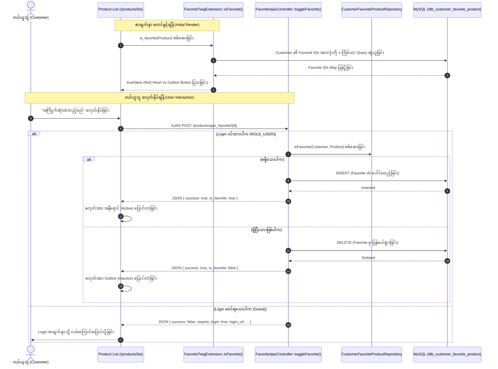

# EC-CUBE 4.3.1 - ကုန်ပစ္စည်းစာရင်းမှ Favorite ပြုလုပ်နိုင်စေခြင်း လမ်းညွှန် (Product List Favorite Feature Implementation Guide)

ဤမှတ်တမ်းသည် EC-CUBE 4.3.1 တွင် ကုန်ပစ္စည်းစာရင်း စာမျက်နှာ (**Product List / Catalog - `/products/list`**) မှနေ၍ ကုန်ပစ္စည်းများကို အသေးစိတ်စာမျက်နှာသို့ သွားရောက်ရန် မလိုဘဲ တိုက်ရိုက် **အကြိုက်ဆုံးအဖြစ် ထည့်သွင်းခြင်း/ဖယ်ရှားခြင်း (Favorite Toggle)** ပြုလုပ်နိုင်သော စနစ်ကို အတွေ့အကြုံ (၆) လရှိ Junior Developer များ အလွယ်တကူ လိုက်နာနားလည်နိုင်စေရန် မြန်မာဘာသာဖြင့် အဆင့်ဆင့် ရေးသားထားသော လမ်းညွှန်ဖြစ်ပါသည်။

---

## ၁။ အနှစ်ချုပ် ခြုံငုံသုံးသပ်ချက် (Overview)

မူရင်း EC-CUBE 4.3.1 တွင် Favorite ထည့်သွင်းသည့် ခလုတ်သည် ကုန်ပစ္စည်း အသေးစိတ် စာမျက်နှာ (`/products/detail/{id}`) တွင်သာ ပါရှိပါသည်။
ကုန်ပစ္စည်း စာရင်း စာမျက်နှာ (`/products/list`) တွင်ပါ Favorite ခလုတ် ထည့်သွင်းရာ၌ အောက်ပါ အချက်များကို ဖြေရှင်းထားပါသည်:

1. **N+1 Query Problem ကို ကာကွယ်ခြင်း:** ပစ္စည်းအခု (၂၀) စာရင်းပြသရာတွင် ပစ္စည်းတစ်ခုချင်းစီအတွက် Database Query (၂၀) ခါ မပစ်ရစေရန် ဝယ်ယူသူ၏ Favorite Product ID များကို တစ်ကြိမ်တည်းဖြင့် In-memory Cache ပြုလုပ်ပေးသည့် **Twig Extension (`is_favorite(Product)`)** ကို အသုံးပြုထားပါသည်။
2. **Page Reload မဖြစ်စေဘဲ AJAX ဖြင့် ပြောင်းလဲခြင်း:** ခလုတ်ကို နှိပ်လိုက်ပါက စာမျက်နှာ Refresh မဖြစ်ဘဲ **AJAX API Controller (`/products/ajax_favorite/{id}`)** ဖြင့် နောက်ကွယ်မှ အဖွင့်/အပိတ် ပြုလုပ်ပေးပါသည်။
3. **Guest / Member ခွဲခြားမှု စနစ်:** Login မဝင်ထားသော ဝယ်ယူသူ နှိပ်ပါက Login စာမျက်နှာသို့ အလိုအလျောက် ပို့ဆောင်ပေးပါသည်။

---

## ၂။ အဆင့်ဆင့် အလုပ်လုပ်ပုံ စနစ် (Workflow & Architecture)



---

## ၃။ မူရင်း Core ဖိုင်များ စာရင်း (Origin Core File List)

> [!CAUTION]
> **EC-CUBE Development Rule:** Core ဖိုင်များဖြစ်သော `src/Eccube/` အောက်ရှိ ဖိုင်များကို **တိုက်ရိုက် ပြင်ဆင်ခြင်း လုံးဝ မပြုလုပ်ရပါ**။

| စဉ် | မူရင်း Core ဖိုင်လမ်းကြောင်း (Origin Core File Path) | မူရင်းတာဝန် (Default Role) |
| :---: | :--- | :--- |
| ၁ | `src/Eccube/Resource/template/default/Product/list.twig` | မူရင်း ကုန်ပစ္စည်း စာရင်း (Product List) Twig View Template ဖြစ်ပြီး မူရင်းတွင် Favorite ခလုတ် မပါဝင်ပါ။ |
| ၂ | `src/Eccube/Controller/ProductController.php` | Product List (`index()`) နှင့် Detail (`detail()`) စာမျက်နှာများကို ထိန်းချုပ်သည့် Core Controller။ |
| ၃ | `src/Eccube/Repository/CustomerFavoriteProductRepository.php` | Favorite နှင့် သက်ဆိုင်သော Database Query method များ (`addFavorite`, `isFavorite`, `delete`) ပါဝင်သည့် Repository။ |
| ၄ | `src/Eccube/Entity/CustomerFavoriteProduct.php` | `dtb_customer_favorite_product` ဇယားနှင့် ဆက်စပ်နေသော Core Entity။ |
| ၅ | `src/Eccube/Entity/BaseInfo.php` | Shop Master Settings ရှိ `$option_favorite_product` setting ပါဝင်သည့် Entity။ |

---

## ၄။ ပြင်ဆင် / အသစ်ဖန်တီးထားသော ဖိုင်များ စာရင်း (Updated / Created File List)

EC-CUBE Customization စည်းမျဉ်းများနှင့်အညီ `app/Customize/` နှင့် `app/template/` အောက်တွင် အောက်ပါအတိုင်း အသစ်ဖန်တီး/ပြင်ဆင်ထားပါသည်:

| စဉ် | ပြင်ဆင်/အသစ်ဖန်တီးထားသော ဖိုင်လမ်းကြောင်း (File Path) | အမျိုးအစား | ဖိုင်၏ တာဝန်နှင့် လုပ်ဆောင်ချက် (Role & Description) |
| :---: | :--- | :---: | :--- |
| ၁ | [`FavoriteTwigExtension.php`](file:///Users/kyawwaiyan/Documents/my-Home-tech/eccube-4.3.1/app/Customize/Twig/FavoriteTwigExtension.php) | **အသစ်ဖန်တီး (NEW)** | Twig Template ထဲတွင် `is_favorite(Product)` function အား ခေါ်သုံးနိုင်စေပြီး N+1 Query မဖြစ်စေရန် In-memory Caching စနစ် ပါဝင်သော Extension။ |
| ၂ | [`FavoriteAjaxController.php`](file:///Users/kyawwaiyan/Documents/my-Home-tech/eccube-4.3.1/app/Customize/Controller/FavoriteAjaxController.php) | **အသစ်ဖန်တီး (NEW)** | Route `/products/ajax_favorite/{id}` ဖြင့် စာမျက်နှာ Reload မဖြစ်ဘဲ Favorite အား Toggle (Add/Remove) လုပ်ပေးသော JSON API Controller။ |
| ၃ | [`FavoriteEventListener.php`](file:///Users/kyawwaiyan/Documents/my-Home-tech/eccube-4.3.1/app/Customize/EventListener/FavoriteEventListener.php) | **အသစ်ဖန်တီး (NEW)** | Favorite ထည့်သွင်းခြင်း/ဖျက်ခြင်း ပြုလုပ်သည့်အခါ Log မှတ်ခြင်းနှင့် အခြား Business Logic များ တွဲဖက်လုပ်ဆောင်ရန် Event Subscriber။ |
| ၄ | [`list.twig`](file:///Users/kyawwaiyan/Documents/my-Home-tech/eccube-4.3.1/app/template/default/Product/list.twig) | **ပြင်ဆင်/အစားထိုး (OVERRIDE)** | Product Card တစ်ခုချင်းစီတွင် Favorite Button နှင့် AJAX Toggle Script ထည့်သွင်းထားသော Product List UI Template။ |
| ၅ | [`detail.twig`](file:///Users/kyawwaiyan/Documents/my-Home-tech/eccube-4.3.1/app/template/default/Product/detail.twig) | **ပြင်ဆင်/အစားထိုး (OVERRIDE)** | Product Detail စာမျက်နှာတွင်ပါ AJAX Favorite အဖွင့်/အပိတ် ပြုလုပ်နိုင်သော UI Template။ |

---

## ၅။ အဆင့်ဆင့် အကောင်အထည်ဖော်မှု လမ်းညွှန် (Step-by-Step Implementation Details)

### အဆင့် ၁: Twig Extension ဖန်တီးခြင်း (`is_favorite` Function)
**ဖိုင်တည်နေရာ:** `app/Customize/Twig/FavoriteTwigExtension.php`
* **ဘာကြောင့် လုပ်ရသလဲ:** Product List စာမျက်နှာတွင် ပစ္စည်း အခု ၂၀ ရှိပါက တစ်ခုချင်းစီအတွက် SQL Query မပစ်ဘဲ Customer ၏ Favorite ID အားလုံးကို ၁ ကြိမ်သာ query လုပ်ပြီး memory ထဲ cache လုပ်ကာ စစ်ဆေးပေးရန် ဖြစ်ပါသည်။
* **အဓိက Code:**
```php
public function isFavorite($product)
{
    $user = $this->security->getUser();
    if (!$user instanceof Customer) {
        return false;
    }
    $productId = $product instanceof Product ? $product->getId() : (int) $product;

    if ($this->favoriteProductIds === null) {
        $favorites = $this->customerFavoriteProductRepository->findBy(['Customer' => $user]);
        $this->favoriteProductIds = [];
        foreach ($favorites as $favorite) {
            if ($favorite->getProduct()) {
                $this->favoriteProductIds[$favorite->getProduct()->getId()] = true;
            }
        }
    }

    return isset($this->favoriteProductIds[$productId]);
}
```

---

### အဆင့် ၂: AJAX Toggle Controller ဖန်တီးခြင်း
**ဖိုင်တည်နေရာ:** `app/Customize/Controller/FavoriteAjaxController.php`
* **ဘာကြောင့် လုပ်ရသလဲ:** ခလုတ်နှိပ်သည့်အခါ စာမျက်နှာ refresh မဖြစ်စေဘဲ နောက်ကွယ်မှ toggle ပြုလုပ်ပေးရန် ဖြစ်ပါသည်။
* **အဓိက Code:**
```php
/**
 * @Route("/products/ajax_favorite/{id}", name="customize_product_ajax_favorite", requirements={"id" = "\d+"}, methods={"POST"})
 */
public function toggleFavorite(Request $request, Product $Product)
{
    if (!$this->isGranted('ROLE_USER')) {
        return new JsonResponse([
            'success' => false,
            'require_login' => true,
            'login_url' => $this->generateUrl('mypage_login'),
        ], 401);
    }
    
    // Toggle Logic (Add if not exists, Remove if exists)
    // ...
}
```

---

### အဆင့် ၃: Product List Template Override ပြုလုပ်ခြင်း
**ဖိုင်တည်နေရာ:** `app/template/default/Product/list.twig`
* **ဘာကြောင့် လုပ်ရသလဲ:** ကုန်ပစ္စည်း Card တစ်ခုချင်းစီ၏ အောက်ခြေတွင် Favorite Button ထည့်သွင်းပြီး AJAX Click Event ဖြင့် ချိတ်ဆက်ရန် ဖြစ်ပါသည်။
* **ခလုတ် Markup နမူနာ:**
```twig

    
    <div class="ec-productCard__favorite">
        <button type="button" 
                class="btn btn-dangerbtn-outline-danger ec-productCard__favorite-btn ec-favorite-list-btn" 
                data-product-id="{{ Product.id }}">
            <i class="fa fa-heart"></i> 
            <span class="fav-text">
                {{ 'front.product.add_favorite_alrady'|trans }}{{ 'front.product.add_favorite'|trans }}
            </span>
        </button>
    </div>

```

---

## ၆။ စစ်ဆေးအတည်ပြုရန် Console Commands များ

ဖိုင်များ ထည့်သွင်းပြီးပါက စနစ်တွင် အလုပ်လုပ်ခြင်း ရှိ/မရှိ အောက်ပါ command များဖြင့် စစ်ဆေးနိုင်ပါသည်:

```bash
# ၁။ Cache ရှင်းလင်းခြင်း
docker compose -f docker-compose.yml -f docker-compose.mysql.yml exec ec-cube bin/console cache:clear --no-warmup

# ၂။ is_favorite Twig function စာရင်းဝင်/မဝင် စစ်ဆေးခြင်း
docker compose -f docker-compose.yml -f docker-compose.mysql.yml exec ec-cube bin/console debug:twig --filter=is_favorite

# ၃။ AJAX Favorite Route စာရင်းဝင်/မဝင် စစ်ဆေးခြင်း
docker compose -f docker-compose.yml -f docker-compose.mysql.yml exec ec-cube bin/console debug:router customize_product_ajax_favorite
```
