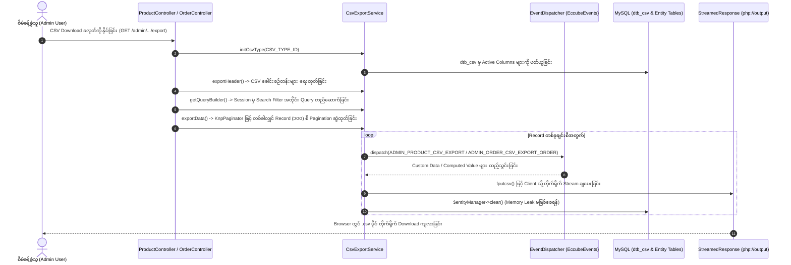

# EC-CUBE 4.3.1 - Product နှင့် Order CSV Export စနစ် အသေးစိတ် လမ်းညွှန်နှင့် စာရွက်စာတမ်း (Product & Order CSV Export Technical Guide)

ဤစာရွက်စာတမ်းသည် EC-CUBE 4.3.1 တွင် **ကုန်ပစ္စည်း (Product) နှင့် အော်ဒါ (Order) ဆိုင်ရာ CSV Data များကို ထုတ်ယူ (Export/Download) သည့် စနစ်** ၏ အလုပ်လုပ်ပုံ၊ လိုအပ်သော Core ဖိုင်များနှင့် Customization ဖိုင်များ၊ စနစ်၏ အဓိက Feature များ၊ အဆင့်ဆင့် တည်ဆောက်/ပြင်ဆင်နည်း (Step-by-Step Implementation) များကို အတွေ့အကြုံ (၆) လရှိ Junior Developer များ အလွယ်တကူ လိုက်နာနားလည်နိုင်စေရန် မြန်မာဘာသာဖြင့် အသေးစိတ် ရေးသားထားသော လမ်းညွှန်စာတမ်း ဖြစ်ပါသည်။

---

## ၁။ အနှစ်ချုပ် ခြုံငုံသုံးသပ်ချက် (Overview & Purpose)

EC-CUBE 4.3 တွင် CSV Export စနစ်သည် စီမံခန့်ခွဲသူ (Admin) များအတွက် အရောင်းအဝယ်နှင့် ပစ္စည်းစာရင်းများကို စီမံရန် အလွန်အရေးပါသော မူရင်း Core Feature ဖြစ်ပါသည်။

* **Product CSV (`/admin/product/export`):** ကုန်ပစ္စည်းအချက်အလက်များ (Product Name, Product Code, Price, Stock, Category, Description စသည်) ကို ထုတ်ယူပေးခြင်း။
* **Order CSV (`/admin/order/export/order`):** အော်ဒါ အသေးစိတ် အချက်အလက်များ (Order Number, Customer Info, Product Items, Order Status, Payment, Price စသည်) ကို ထုတ်ယူပေးခြင်း။
* **Shipping CSV (`/admin/order/export/shipping`):** ပို့ဆောင်ရေး အချက်အလက်များ (Delivery Info, Tracking Number, Address စသည်) ကို ထုတ်ယူပေးခြင်း။

---

## ၂။ အလုပ်လုပ်ပုံ နောက်ကွယ် စနစ်နှင့် Architecture (Under-the-Hood Architecture & Data Flow)

EC-CUBE ၏ CSV စနစ်သည် Memory အသုံးပြုမှု အလွန်သက်သာစေရန်နှင့် ဒေတာ အမြောက်အမြား (သောင်းနှင့်ချီသော Data) ကို အခက်အခဲမရှိ Download ဆွဲနိုင်ရန် အောက်ပါအတိုင်း ဖွဲ့စည်းထားပါသည်:



### အဓိက နည်းပညာ သဘောတရားများ (Core Concepts):

1. **`dtb_csv` Database Table Mapping:**
   * CSV တွင် မည်သည့် ကော်လံများ ပါဝင်ရမည်၊ ကော်လံအမည် မည်သို့ပြမည် (`disp_name`)၊ မည်သည့် Entity Property မှ ယူမည် (`field_name`, `reference_field_name`) ကို Admin Panel ရှိ **設定 (Settings) -> 店舗設定 (Shop Settings) -> CSV設定 (CSV Settings)** မှ စီမံနိုင်ပါသည်။
2. **Session Based Search Preservation:**
   * Admin Panel တွင် Search Filter လုပ်ထားသော အချက်အလက်များကို Session (`eccube.admin.product.search` / `eccube.admin.order.search`) မှ ပြန်လည်ယူ၍ QueryBuilder တည်ဆောက်သောကြောင့် ရှာထားသော ဒေတာများသာ CSV တွင် ပါဝင်လာပါသည်။
3. **High-Performance StreamedResponse & Memory Optimization:**
   * `set_time_limit(0)`: PHP Timeout မဖြစ်စေရန် အချိန်ကန့်သတ်ချက်ကို ပယ်ဖျက်သည်။
   * `$em->getConfiguration()->setSQLLogger(null)`: Doctrine SQL Log များ Memory ထဲ စုပုံမလာစေရန် ပိတ်ထားသည်။
   * `StreamedResponse` + `fopen('php://output')`: ဖိုင်တစ်ခုလုံးကို RAM ထဲ သိမ်းမထားဘဲ ထွက်လာသမျှ data ကို Client စက်သို့ ချက်ချင်း stream ပို့ပေးသည်။
   * `$paginator->paginate($qb, $page, 100)` & `$em->clear()`: ဒေတာ (၁၀၀) စီ ခွဲယူပြီး Doctrine Cache ကို ရှင်းလင်းပေးသဖြင့် Record သိန်းချီရှိသော်လည်း Memory အနည်းငယ်သာ သုံးစွဲသည်။
4. **Encoding Compatibility:**
   * MS Excel (Japanese/Windows) တွင် စာလုံးမပျက်စေရန် `SJIS-win` (သို့မဟုတ် UTF-8 with BOM `\xEF\xBB\xBF`) ဖြင့် Encode လုပ်ပေးသည်။

---

## ၃။ လိုအပ်သော ဖိုင်များ စာရင်း (Requirement Files List)

### (က) မူရင်း Core ဖိုင်များ (Origin Core Files - Do NOT Modify Directly)

> [!CAUTION]
> EC-CUBE Law အရ `src/Eccube/` နှင့် `vendor/` အောက်ရှိ မူရင်း Core ဖိုင်များကို **တိုက်ရိုက် ပြင်ဆင်ခြင်း လုံးဝ မပြုလုပ်ရပါ**။

| စဉ် | မူရင်း Core ဖိုင်လမ်းကြောင်း (File Path) | တာဝန်နှင့် အခန်းကဏ္ဍ (Role & Description) |
| :---: | :--- | :--- |
| ၁ | `src/Eccube/Service/CsvExportService.php` | CSV Header/Data Output၊ QueryBuilder တည်ဆောက်မှု၊ Encoding ပြောင်းလဲမှုနှင့် Stream Output ကို ကိုင်တွယ်သော Core Service။ |
| ၂ | `src/Eccube/Controller/Admin/Product/ProductController.php` | ကုန်ပစ္စည်း CSV Export Route (`/admin/product/export`) နှင့် Logic ကို စီမံသော Controller။ |
| ၃ | `src/Eccube/Controller/Admin/Order/OrderController.php` | အော်ဒါ CSV Export Route (`/admin/order/export/order` & `/export/shipping`) ကို စီမံသော Controller။ |
| ၄ | `src/Eccube/Entity/Master/CsvType.php` | CSV အမျိုးအစား သတ်မှတ်ချက် Master Entity (1: Product, 2: Customer, 3: Order, 4: Shipping, 5: Category, 6: ClassName, 7: ClassCategory)။ |
| ၅ | `src/Eccube/Entity/Csv.php` | `dtb_csv` Table Entity (CSV ကော်လံများ၏ field name, entity name, disp name, sort no များကို သိမ်းဆည်းသည့် နေရာ)။ |
| ၆ | `src/Eccube/Event/EccubeEvents.php` | CSV Export ဖြစ်ပေါ်ချိန်တွင် Hook ဖမ်းယူနိုင်သော Event Constant များ (`ADMIN_PRODUCT_CSV_EXPORT`, `ADMIN_ORDER_CSV_EXPORT_ORDER` စသည်)။ |

---

### (ခ) စိတ်ကြိုက် ပြင်ဆင်/ဖန်တီးရာတွင် လိုအပ်သော ဖိုင်များ (Customization Files)

| စဉ် | တည်နေရာ ဖိုင်လမ်းကြောင်း (File Path) | အမျိုးအစား | အသုံးပြုပုံနှင့် တာဝန် (Purpose & Usage) |
| :---: | :--- | :---: | :--- |
| ၁ | `app/Customize/EventListener/ProductCsvExportSubscriber.php` | PHP Class | မူရင်း Product CSV တွင် Column အသစ် သို့မဟုတ် Dynamic တွက်ချက်ထားသော Data များ ထည့်သွင်းရန် Event Subscriber။ |
| ၂ | `app/Customize/EventListener/OrderCsvExportSubscriber.php` | PHP Class | မူရင်း Order CSV တွင် Custom Column များ သို့မဟုတ် Additional Business Data များ ထည့်သွင်းရန် Event Subscriber။ |
| ၃ | `app/Customize/Controller/Admin/.../CustomCsvController.php` | PHP Class | Standalone သီးသန့် CSV Export (ဥပမာ- Favorite CSV သို့မဟုတ် အထူး Custom Report CSV) ရေးသားရန် Controller။ |
| ၄ | `app/template/admin/.../*.twig` | Twig Template | Admin Panel UI တွင် CSV Download ခလုတ်များ ထည့်သွင်းရန် Template။ |

---

## ၄။ အဓိက ပါဝင်သော Feature များ (Key Features)

1. **Dynamic Column Configuration (ပြောင်းလဲနိုင်သော ကော်လံ စနစ်):**
   * Admin UI (`/admin/setting/shop/csv`) မှတစ်ဆင့် Product နှင့် Order CSV များတွင် မည်သည့်ကော်လံများ ပါဝင်ရမည်၊ အစီအစဉ် (Order) မည်သို့ဖြစ်ရမည်ကို Code မရေးဘဲ ပြင်ဆင်နိုင်ခြင်း။
2. **Search Criteria Synchronized Export (ရှာဖွေမှုနှင့် ကိုက်ညီသော ဒေတာသာ ထုတ်ပေးခြင်း):**
   * စီမံခန့်ခွဲသူ ရှာဖွေထားသော သတ်မှတ်ရက်စွဲ၊ အခြေအနေ၊ ကုန်ပစ္စည်းအမျိုးအစား စသည့် စစ်ထုတ်ထားသော Record များကိုသာ CSV အဖြစ် တိကျစွာ ထုတ်ပေးခြင်း။
3. **Event Hook Point Extensibility (Event ဖြင့် လွတ်လပ်စွာ ချဲ့ထွင်နိုင်ခြင်း):**
   * Core ဖိုင်များကို ထိစရာမလိုဘဲ `EccubeEvents::ADMIN_PRODUCT_CSV_EXPORT` သို့မဟုတ် `EccubeEvents::ADMIN_ORDER_CSV_EXPORT_ORDER` ကို ဖမ်းယူ၍ Custom Data များ ဖြည့်စွက်နိုင်ခြင်း။
4. **Zero-Memory-Leak Chunking (RAM အသုံးချမှု အနည်းဆုံးဖြစ်အောင် ထိန်းညှိထားခြင်း):**
   * KnpPaginator နှင့် Doctrine `clear()` ကို ပေါင်းစပ်ထားသဖြင့် ဒေတာ သန်းချီရှိသော်လည်း Server Memory ပြည့်လျှံပြီး Crash ဖြစ်ခြင်း (Out of Memory) မဖြစ်ပေါ်ခြင်း။

---

## ၅။ အဆင့်ဆင့် ဖန်တီး/ပြင်ဆင်နည်း လမ်းညွှန် (Step-by-Step Implementation Guide)

### နည်းလမ်း (၁) - မူရင်း Product/Order CSV တွင် Custom Column အသစ် ထည့်သွင်းခြင်း (Standard EC-CUBE Way)

ဤနည်းလမ်းသည် မူရင်း Product/Order CSV Export တွင် နောက်ထပ် Column အသစ် (ဥပမာ- အထူးကုဒ်၊ Custom Trait Field၊ သို့မဟုတ် တွက်ချက်ထားသော စာရင်းအင်း) ထည့်သွင်းလိုသည့်အခါ အသုံးပြုရသော Standard နည်းလမ်း ဖြစ်ပါသည်။

#### အဆင့် ၁: `dtb_csv` Database တွင် Column အသစ် စာရင်းသွင်းခြင်း
Database သို့မဟုတ် Migration မှတစ်ဆင့် `dtb_csv` တွင် သက်ဆိုင်ရာ CSV Type အောက်၌ Column အသစ် ထည့်သွင်းပါသည်:

```sql
-- Product CSV (csv_type_id = 1) အတွက် Custom Column ထည့်သွင်းခြင်း နမူနာ
INSERT INTO dtb_csv (
    csv_type_id,
    entity_name,
    field_name,
    reference_field_name,
    disp_name,
    sort_no,
    enabled,
    create_date,
    update_date,
    discriminator_type
) VALUES (
    1,
    'Eccube\\Entity\\Product',
    'custom_calculated_field',
    NULL,
    'အထူးတွက်ချက်မှုအမှတ်အသား',
    99,
    1,
    NOW(),
    NOW(),
    'csv'
);
```

#### အဆင့် ၂: EventSubscriber ဖန်တီး၍ Custom Data ထည့်သွင်းပေးခြင်း
တည်နေရာ: `app/Customize/EventListener/ProductCsvExportSubscriber.php`

```php
<?php

namespace Customize\EventListener;

use Eccube\Event\EccubeEvents;
use Eccube\Event\EventArgs;
use Symfony\Component\EventDispatcher\EventSubscriberInterface;

class ProductCsvExportSubscriber implements EventSubscriberInterface
{
    public static function getSubscribedEvents()
    {
        return [
            EccubeEvents::ADMIN_PRODUCT_CSV_EXPORT => 'onAdminProductCsvExport',
        ];
    }

    public function onAdminProductCsvExport(EventArgs $event)
    {
        /** @var \Eccube\Service\CsvExportService $csvService */
        $csvService = $event->getArgument('csvService');
        
        /** @var \Eccube\Entity\Csv $Csv */
        $Csv = $event->getArgument('Csv');
        
        /** @var \Eccube\Entity\ProductClass $ProductClass */
        $ProductClass = $event->getArgument('ProductClass');
        
        /** @var \Eccube\Service\CsvExportService\ExportCsvRow $ExportCsvRow */
        $ExportCsvRow = $event->getArgument('ExportCsvRow');

        // မိမိထည့်သွင်းထားသော field_name နှင့် ကိုက်ညီမှုရှိမရှိ စစ်ဆေးခြင်း
        if ($Csv->getFieldName() === 'custom_calculated_field') {
            $Product = $ProductClass->getProduct();
            
            // မိမိ လိုအပ်သော Custom Logic ကို တွက်ချက်ခြင်း
            $customValue = 'PROD-' . $Product->getId() . '-CUSTOM';
            
            // CSV Row ၏ Data အဖြစ် အစားထိုးသတ်မှတ်ခြင်း
            $ExportCsvRow->setData($customValue);
        }
    }
}
```

---

### နည်းလမ်း (၂) - သီးသန့် Standalone Custom CSV Export Controller တစ်ခု ရေးသားခြင်း (Custom Feature CSV)

ဤနည်းလမ်းသည် သီးသန့် Admin Page များ (ဥပမာ- Favorite List CSV, Custom Sales Report CSV) အတွက် Memory Leak ကင်းသော High-Performance CSV Download Action ရေးသားနည်း ဖြစ်ပါသည်။

#### Controller နမူနာ:
တည်နေရာ: `app/Customize/Controller/Admin/Product/CustomReportCsvController.php`

```php
<?php

namespace Customize\Controller\Admin\Product;

use Doctrine\ORM\EntityManagerInterface;
use Eccube\Controller\AbstractController;
use Knp\Component\Pager\PaginatorInterface;
use Sensio\Bundle\FrameworkExtraBundle\Configuration\Template;
use Symfony\Component\HttpFoundation\Request;
use Symfony\Component\HttpFoundation\StreamedResponse;
use Symfony\Component\Routing\Annotation\Route;

class CustomReportCsvController extends AbstractController
{
    private EntityManagerInterface $entityManager;
    private PaginatorInterface $paginator;

    public function __construct(
        EntityManagerInterface $entityManager,
        PaginatorInterface $paginator
    ) {
        $this->entityManager = $entityManager;
        $this->paginator = $paginator;
    }

    /**
     * @Route("/%eccube_admin_route%/product/custom_report/export", name="admin_product_custom_report_export", methods={"GET"})
     */
    public function exportCsv(Request $request): StreamedResponse
    {
        // ၁။ Timeout မဖြစ်စေရန် အချိန်ကန့်သတ်ချက် ပယ်ဖျက်ခြင်း
        set_time_limit(0);

        // ၂။ Memory မပြည့်စေရန် SQLLogger ပိတ်ခြင်း
        $this->entityManager->getConfiguration()->setSQLLogger(null);

        $response = new StreamedResponse();
        $response->setCallback(function () {
            // Stream Output ဖွင့်ခြင်း
            $fp = fopen('php://output', 'w');

            // Excel တွင် မြန်မာ/ဂျပန် စာလုံးမပျက်စေရန် UTF-8 BOM ထည့်သွင်းခြင်း
            fwrite($fp, "\xEF\xBB\xBF");

            // ၃။ CSV ခေါင်းစဉ်တန်း (Header Row) သတ်မှတ်ခြင်း
            $headers = ['Product ID', 'ကုန်ပစ္စည်းအမည်', 'Product Code', 'ဈေးနှုန်း (ကျပ်)', 'လက်ကျန်အရေအတွက်'];
            fputcsv($fp, $headers);

            // ၄။ QueryBuilder တည်ဆောက်ခြင်း
            $qb = $this->entityManager->createQueryBuilder()
                ->select('p')
                ->from(\Eccube\Entity\Product::class, 'p')
                ->orderBy('p.id', 'DESC');

            // ၅။ Memory Leak ကင်းသော Chunking Pagination (၁ ခါလျှင် ၁၀၀ စီ ဆွဲထုတ်ခြင်း)
            $page = 1;
            $limit = 100;

            while ($results = $this->paginator->paginate($qb, $page, $limit)) {
                if (!$results->valid()) {
                    break;
                }

                foreach ($results as $Product) {
                    $row = [
                        $Product->getId(),
                        $Product->getName(),
                        $Product->getCodeMin() ?: 'N/A',
                        $Product->getPrice02IncTaxMin(),
                        $Product->getStockMin() !== null ? $Product->getStockMin() : 'အကန့်အသတ်မရှိ'
                    ];

                    fputcsv($fp, $row);
                    flush(); // Client သို့ ချက်ချင်း Stream ချပေးခြင်း
                }

                $this->entityManager->clear(); // Doctrine Entity Cache ရှင်းလင်းခြင်း
                $page++;
            }

            fclose($fp);
        });

        // ၆။ Response Headers သတ်မှတ်ခြင်း
        $fileName = 'custom_product_report_' . (new \DateTime())->format('YmdHis') . '.csv';
        $response->headers->set('Content-Type', 'text/csv; charset=UTF-8');
        $response->headers->set('Content-Disposition', 'attachment; filename="' . $fileName . '"');

        return $response;
    }
}
```

---

## ၆။ Console Commands နှင့် Cache ရှင်းလင်းခြင်း (Terminal Commands)

ဖိုင်အသစ်များ ရေးသားပြီးပါက သို့မဟုတ် Database Schema/Data ပြောင်းလဲပြီးပါက အောက်ပါ Command များကို Terminal တွင် အစဉ်လိုက် run ပေးရပါမည်:

```bash
# ၁။ Cache အားလုံးကို ရှင်းလင်းခြင်း (မဖြစ်မနေ လုပ်ဆောင်ရမည်)
bin/console cache:clear --no-warmup

# ၂။ Proxy Classes များ အသစ်ပြန်လည်ထုတ်လုပ်ခြင်း (Entity Extension ပြုလုပ်ထားပါက)
bin/console eccube:generate:proxies

# ၃။ Database Schema အပြောင်းအလဲ စစ်ဆေးခြင်း
bin/console doctrine:schema:update --dump-sql
```

---

## ၇။ ဖွဲ့စည်းထားသော ဖိုင်များ အနှစ်ချုပ် စာရင်း (Created / Required Files Documentation Table)

| စဉ် | ဖိုင်အမည်နှင့် လမ်းကြောင်း (File Path) | အမျိုးအစား | အဓိက တာဝန် (Primary Responsibility) |
| :---: | :--- | :---: | :--- |
| ၁ | [`CsvExportService.php`](file:///Users/kyawwaiyan/Documents/my-Home-tech/eccube-4.3.1/src/Eccube/Service/CsvExportService.php) | **Core Service** | CSV Header/Data Output၊ QueryBuilder တည်ဆောက်မှုနှင့် Streaming Service။ |
| ၂ | [`ProductController.php`](file:///Users/kyawwaiyan/Documents/my-Home-tech/eccube-4.3.1/src/Eccube/Controller/Admin/Product/ProductController.php) | **Core Controller** | Product CSV Export Action (`/admin/product/export`) ကို ကိုင်တွယ်သောနေရာ။ |
| ၃ | [`OrderController.php`](file:///Users/kyawwaiyan/Documents/my-Home-tech/eccube-4.3.1/src/Eccube/Controller/Admin/Order/OrderController.php) | **Core Controller** | Order & Shipping CSV Export Actions (`/admin/order/export/...`) ကို ကိုင်တွယ်သောနေရာ။ |
| ၄ | [`CsvType.php`](file:///Users/kyawwaiyan/Documents/my-Home-tech/eccube-4.3.1/src/Eccube/Entity/Master/CsvType.php) | **Core Entity** | CSV Type Master IDs (Product=1, Order=3, Shipping=4, Customer=2 စသည်)။ |
| ၅ | [`Csv.php`](file:///Users/kyawwaiyan/Documents/my-Home-tech/eccube-4.3.1/src/Eccube/Entity/Csv.php) | **Core Entity** | `dtb_csv` Database table mapping entity။ |
| ၆ | [`ProductCsvExportSubscriber.php`](file:///Users/kyawwaiyan/Documents/my-Home-tech/eccube-4.3.1/app/Customize/EventListener/ProductCsvExportSubscriber.php) | **Custom Listener** | Product CSV တွင် Column အသစ် ထည့်သွင်းတွက်ချက်သည့် Event Subscriber။ |
| ၇ | [`OrderCsvExportSubscriber.php`](file:///Users/kyawwaiyan/Documents/my-Home-tech/eccube-4.3.1/app/Customize/EventListener/OrderCsvExportSubscriber.php) | **Custom Listener** | Order CSV တွင် Custom Business Data ဖြည့်စွက်သည့် Event Subscriber။ |
| ၈ | [`csv_export_product_order_guide.md`](file:///Users/kyawwaiyan/Documents/my-Home-tech/eccube-4.3.1/My-Task-List-Folder/product-section/csv_export_product_order_guide.md) | **Documentation** | ဤ နည်းပညာ လမ်းညွှန် မှတ်တမ်းဖိုင်။ |
