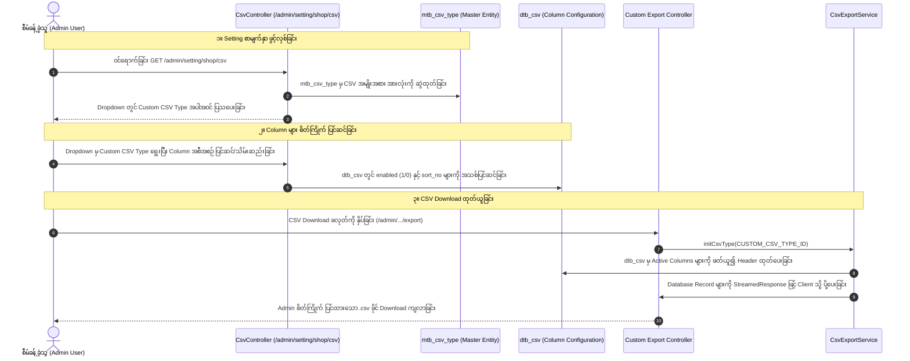

# EC-CUBE 4.3.1 - ကုန်ပစ္စည်း ဈေးနှုန်း အကွာအဝေး ပြသမှု (Price Range Display) နှင့် Admin Shop CSV Type ရွေးချယ်နိုင်သော စနစ် လမ်းညွှန် (Price Range Synchronization & Admin Custom CSV Type Implementation Guide)

ဤစာရွက်စာတမ်းသည် EC-CUBE 4.3.1 တွင် **(၁) ကုန်ပစ္စည်းများ၌ 規格 (Variants/Class Categories) များရှိ၍ ဈေးနှုန်းအကွာအဝေး (Price Range) ဖြစ်ပေါ်နေချိန်တွင် ကုန်ပစ္စည်းစာရင်း (商品一覧 - Product List) ၏ စံသတ်မှတ်ချက်အတိုင်း တူညီစွာ ဖော်ပြခြင်း** နှင့် **(၂) Admin Panel ၏ `/admin/setting/shop/csv` (店舗設定 -> CSV設定) စာမျက်နှာရှိ CSV Type (CSV種別) Dropdown တွင် မိမိစိတ်ကြိုက် Custom CSV Type အသစ်ကို ထည့်သွင်းရွေးချယ်ပြီး Column များကို UI မှ အလွယ်တကူ စီမံခန့်ခွဲနိုင်သော စနစ်** တည်ဆောက်ပုံကို အတွေ့အကြုံ (၆) လရှိ Junior Developer များ အလွယ်တကူ လိုက်နာနားလည်နိုင်စေရန် မြန်မာဘာသာဖြင့် အသေးစိတ် ရေးသားထားသော နည်းပညာ လမ်းညွှန်စာတမ်း ဖြစ်ပါသည်။

---

## ၁။ အနှစ်ချုပ် ခြုံငုံသုံးသပ်ချက် (Overview & Objectives)

စနစ်တွင် အဓိက လိုအပ်ချက် (၂) ခု ပါဝင်ပါသည်:

1. **ဈေးနှုန်း အကွာအဝေး (Price Range) ကို Product List နှင့် ကိုက်ညီအောင် ပြသခြင်း:**
   - ကုန်ပစ္စည်းတစ်ခုတွင် Size (S/M/L) သို့မဟုတ် Color စသည့် 規格 (ProductClass) အမျိုးမျိုးရှိပြီး ဈေးနှုန်းမတူညီပါက မူရင်း Single Price (ဥပမာ- `¥1,000`) အစား ဈေးနှုန်းအကွာအဝေး (ဥပမာ- `¥1,000 ～ ¥3,000`) အဖြစ် Frontend၊ Admin Custom List နှင့် CSV Export များတွင် စံသတ်မှတ်ချက်အတိုင်း တပြေးညီ ဖော်ပြပေးခြင်း။
2. **Admin CSV Settings (`/admin/setting/shop/csv`) တွင် CSV Type အသစ် ရွေးချယ်နိုင်စေခြင်း:**
   - Admin Panel ရှိ CSV Output Setting စာမျက်နှာတွင် မူရင်း CSV Type (၇) မျိုးအပြင် မိမိတို့ ဖန်တီးထားသော Custom CSV Type (ဥပမာ- `カスタム商品 CSV` သို့မဟုတ် `お気に入り商品 CSV`) ကို Dropdown တွင် ရွေးချယ်နိုင်စေခြင်း။
   - Admin User သည် မည်သည့် Column များ ပါဝင်ရမည်၊ Column အစဉ်လိုက် ဘယ်လိုဖြစ်ရမည်ကို Code မပြင်ဘဲ Drag & Drop / Buttons များဖြင့် စိတ်ကြိုက် ပြင်ဆင်ပြီး `dtb_csv` Database သို့ အလိုအလျောက် သိမ်းဆည်းနိုင်စေခြင်း။

---

## ၂။ အလုပ်လုပ်ပုံ နောက်ကွယ် စနစ်နှင့် Architecture (Under-the-Hood Architecture)

### (က) Price Range Display တွက်ချက်ပုံ သဘောတရား (Price Range Logic)

EC-CUBE ၏ `Eccube\Entity\Product` Entity တွင် ကုန်ပစ္စည်းတစ်ခု၏ ဈေးနှုန်းများကို အောက်ပါ Method များဖြင့် စစ်ဆေးတွက်ချက်ပါသည်:

* `$Product->hasProductClass()`: ကုန်ပစ္စည်းတွင် 規格 (Variants) များ ရှိ/မရှိ စစ်ဆေးခြင်း (`true`/`false`)။
* `$Product->getPrice02Min()` / `$Product->getPrice02Max()`: အခွန်မပါဝင်သော အနိမ့်ဆုံးနှင့် အမြင့်ဆုံး မူရင်းဈေးနှုန်း (Tax-excluded Base Price)။
* `$Product->getPrice02IncTaxMin()` / `$Product->getPrice02IncTaxMax()`: အခွန်ပါဝင်ပြီး အနိမ့်ဆုံးနှင့် အမြင့်ဆုံး ရောင်းဈေး (Tax-included Selling Price)။

```mermaid
flowchart TD
    Start([စတင်ခြင်း - Product ဈေးနှုန်း ပြသရန်]) --> CheckClass{Product တွင် 規格 ရှိပါသလား?<br/>hasProductClass}
    
    CheckClass -- မရှိပါ (No Variants) --> SinglePrice[တစ်ခုတည်းသော ဈေးနှုန်း ပြသမည်<br/>getPrice02IncTaxMin | price]
    CheckClass -- ရှိပါသည် (Has Variants) --> CheckRange{အနိမ့်ဆုံးနှင့် အမြင့်ဆုံး ဈေး တူညီပါသလား?<br/>getPrice02Min == getPrice02Max}
    
    CheckRange -- တူညီပါသည် (Same Price) --> SinglePrice
    CheckRange -- မတူညီပါ (Price Range) --> RangePrice["အကွာအဝေးဖြင့် ပြသမည်<br/>Min Price ～ Max Price<br/>¥1,000 ～ ¥3,000"]
    
    SinglePrice --> EndNode([ပြီးဆုံး])
    RangePrice --> EndNode
```

---

### (ခ) Admin CSV Setting နှင့် Export စနစ် ချိတ်ဆက်ပုံ (CSV Type Management Architecture)



---

## ၃။ လိုအပ်သော Feature များနှင့် ဖိုင်များ စာရင်း (Requirements & File Breakdown)

### (က) မူရင်း Core ဖိုင်များ (Origin Core Files - Reference Only - DO NOT MODIFY)

> [!CAUTION]
> EC-CUBE Law အရ `src/Eccube/` နှင့် `vendor/` အောက်ရှိ ဖိုင်များကို **တိုက်ရိုက် ပြင်ဆင်ခွင့် လုံးဝ မရှိပါ**။

| စဉ် | မူရင်း Core ဖိုင်လမ်းကြောင်း (File Path) | အဓိက တာဝန်နှင့် အခန်းကဏ္ဍ (Role) |
| :---: | :--- | :--- |
| ၁ | `src/Eccube/Entity/Master/CsvType.php` | `mtb_csv_type` Master Entity (Product=1, Customer=2, Order=3, Shipping=4, Category=5, ClassName=6, ClassCategory=7)။ |
| ၂ | `src/Eccube/Entity/Csv.php` | `dtb_csv` Table Entity (CSV Column field_name, disp_name, sort_no, enabled များကို သိမ်းဆည်းသော နေရာ)။ |
| ၃ | `src/Eccube/Controller/Admin/Setting/Shop/CsvController.php` | `/admin/setting/shop/csv/{id}` စာမျက်နှာတွင် CSV Type ရွေးချယ်မှုနှင့် Column များ ပြင်ဆင်မှုကို စီမံသော Controller။ |
| ၄ | `src/Eccube/Form/Type/Master/CsvType.php` | `mtb_csv_type` မှ Data များကို HTML `<select>` Dropdown Form အဖြစ် ပြောင်းပေးသော Form Type။ |
| ၅ | `src/Eccube/Resource/template/admin/Setting/Shop/csv.twig` | CSV Setting စီမံသည့် Admin UI Twig Template။ |
| ၆ | `src/Eccube/Resource/template/default/Product/list.twig` | Frontend ကုန်ပစ္စည်းစာရင်းတွင် Price Range ပြသသည့် စံနမူနာ Twig Template။ |

---

### (ခ) မိမိတို့ ဖန်တီး/ပြင်ဆင်ရမည့် Custom ဖိုင်များ (Customization Files)

| စဉ် | ဖိုင်လမ်းကြောင်း (File Path) | အမျိုးအစား | အသုံးပြုပုံနှင့် တာဝန် (Purpose & Functionality) |
| :---: | :--- | :---: | :--- |
| ၁ | `app/template/admin/Product/custom_list.twig` | Twig Template | Custom ကုန်ပစ္စည်းစာရင်းတွင် ဈေးနှုန်းအကွာအဝေးကို Product List စံအတိုင်း `Min ～ Max` ပုံစံ ပြသရန် ပြင်ဆင်ခြင်း။ |
| ၂ | `app/Customize/Entity/Master/CustomCsvType.php` | PHP Class | မိမိတို့ ဖန်တီးမည့် Custom CSV Type ID သတ်မှတ်ချက် Constant များ ထားရှိရန်။ |
| ၃ | `app/Customize/Controller/Admin/Product/CustomProductCsvController.php` | PHP Controller | `/admin/setting/shop/csv` တွင် သတ်မှတ်ထားသော Columns အတိုင်း Custom CSV Download ထုတ်ပေးသော Streaming Controller။ |
| ၄ | `app/Customize/EventListener/CustomProductCsvExportSubscriber.php` | Event Subscriber | CSV Export ပြုလုပ်ချိန်တွင် Price Range စာသားနှင့် Dynamic Data များကို Hook ဖမ်း၍ ဖြည့်စွက်ပေးသော Subscriber။ |
| ၅ | `My-Task-List-Folder/product-section/custom_csv_type_and_price_range_guide.md` | Documentation | ဤနည်းပညာ လမ်းညွှန် မှတ်တမ်းဖိုင်။ |

---

## ၄။ အဆင့်ဆင့် တည်ဆောက်/ပြင်ဆင်နည်း လမ်းညွှန် (Step-by-Step Implementation Guide)

---

### အပိုင်း (၁) - ကုန်ပစ္စည်း ဈေးနှုန်း အကွာအဝေး (Price Range) ကို Product List အတိုင်း ပြသခြင်း

#### အဆင့် ၁.၁: Twig Template တွင် Price Range Format သတ်မှတ်ခြင်း

Frontend စာမျက်နှာ (`Product/list.twig`) နှင့် Admin Panel ကုန်ပစ္စည်းစာရင်း (`custom_list.twig`) များတွင် ဈေးနှုန်းကို အောက်ပါအတိုင်း တူညီသော စံသတ်မှတ်ချက်ဖြင့် ရေးသားပါသည်:

**တည်နေရာဖိုင်:** `app/template/admin/Product/custom_list.twig`

```twig
<!-- Price Column ပြသခြင်း နမူနာ -->
<td class="text-end fw-bold text-dark text-nowrap">
    
        {# 規格 ရှိပြီး အနိမ့်ဆုံးနှင့် အမြင့်ဆုံး ဈေးနှုန်း တူညီပါက Single Price သာ ပြသမည် #}
        
            {{ Product.getPrice02IncTaxMin|price }}
        
            {# ဈေးနှုန်း မတူညီပါက အကွာအဝေး (Range) အဖြစ် Min ～ Max ပြသမည် #}
            {{ Product.getPrice02IncTaxMin|price }} <span class="text-muted fw-normal">～</span> {{ Product.getPrice02IncTaxMax|price }}
        
    
        {# 規格 မရှိသော ကုန်ပစ္စည်းများအတွက် မူရင်း Single Price သာ ပြသမည် #}
        {{ Product.getPrice02IncTaxMin|price }}
    
</td>
```

---

### အပိုင်း (၂) - Admin Shop CSV (`/admin/setting/shop/csv`) တွင် CSV Type အသစ် ထည့်သွင်းခြင်း

Admin Panel ရှိ CSV Setting Dropdown တွင် Custom CSV Type အသစ် ပေါ်လာစေရန်အတွက် အောက်ပါ အဆင့် (၃) ဆင့်ကို ဆောင်ရွက်ရပါသည်:

#### အဆင့် ၂.၁: Custom CSV Type Constant Class တည်ဆောက်ခြင်း
**တည်နေရာဖိုင်:** `app/Customize/Entity/Master/CustomCsvType.php`

```php
<?php

namespace Customize\Entity\Master;

/**
 * Custom CSV Types Constant Definition
 */
class CustomCsvType
{
    /**
     * Custom Product List CSV Type ID
     */
    public const CSV_TYPE_CUSTOM_PRODUCT = 8;

    /**
     * Favorite Product CSV Type ID (Optional)
     */
    public const CSV_TYPE_FAVORITE_PRODUCT = 9;
}
```

#### အဆင့် ၂.၂: `mtb_csv_type` Database Table တွင် CSV Type အသစ် စာရင်းသွင်းခြင်း

Terminal သို့မဟုတ် MySQL Client (Adminer/phpMyAdmin/CLI) မှတစ်ဆင့် အောက်ပါ SQL ကို Run ပေးရပါမည်:

```sql
-- mtb_csv_type တွင် Custom CSV Type (ID = 8) ထည့်သွင်းခြင်း
INSERT INTO mtb_csv_type (id, name, sort_no, discriminator_type)
VALUES (8, 'カスタム商品 CSV', 8, 'csvtype')
ON DUPLICATE KEY UPDATE name = 'カスタム商品 CSV';
```

> [!NOTE]
> `mtb_csv_type` တွင် ဤ Record ရောက်ရှိသွားသည်နှင့် တစ်ပြိုင်နက် `http://localhost:8080/admin/setting/shop/csv` ကို Refresh လုပ်ကြည့်ပါက Dropdown တွင် **"カスタム商品 CSV"** အလိုအလျောက် ပေါ်လာမည် ဖြစ်ပါသည်။

---

### အပိုင်း (၃) - `dtb_csv` Table တွင် Custom CSV Type အတွက် Columns များ ထည့်သွင်းခြင်း

Admin UI မှ အဖွင့်/အပိတ် (Add/Delete) နှင့် အစီအစဉ် (Sort Up/Down) ပြုလုပ်နိုင်ရန်အတွက် လိုအပ်သော Column များကို `dtb_csv` table ထဲသို့ ထည့်သွင်းပေးရပါသည်:

```sql
-- Custom Product CSV (csv_type_id = 8) အတွက် Columns များ စာရင်းသွင်းခြင်း
INSERT INTO dtb_csv (csv_type_id, entity_name, field_name, reference_field_name, disp_name, sort_no, enabled, create_date, update_date, discriminator_type)
VALUES
-- ၁။ Product ID
(8, 'Eccube\\Entity\\Product', 'id', NULL, '商品ID', 1, 1, NOW(), NOW(), 'csv'),

-- ၂။ Product Name (ကုန်ပစ္စည်းအမည်)
(8, 'Eccube\\Entity\\Product', 'name', NULL, '商品名', 2, 1, NOW(), NOW(), 'csv'),

-- ၃။ Product Code (ကုန်ပစ္စည်းကုဒ်)
(8, 'Eccube\\Entity\\Product', 'code_min', NULL, '商品コード', 3, 1, NOW(), NOW(), 'csv'),

-- ၄။ Selling Price with Range (ဈေးနှုန်း အကွာအဝေး)
(8, 'Eccube\\Entity\\Product', 'price02_inc_tax_min', NULL, '販売価格(税込)', 4, 1, NOW(), NOW(), 'csv'),

-- ၅။ Stock (လက်ကျန် အရေအတွက်)
(8, 'Eccube\\Entity\\Product', 'stock_min', NULL, '在庫数', 5, 1, NOW(), NOW(), 'csv'),

-- ၆။ Product Description (အသေးစိတ် ဖော်ပြချက် - Default: Disabled)
(8, 'Eccube\\Entity\\Product', 'description_detail', NULL, '商品説明(詳細)', 6, 0, NOW(), NOW(), 'csv'),

-- ၇။ Create Date (ဖန်တီးသည့် ရက်စွဲ - Default: Disabled)
(8, 'Eccube\\Entity\\Product', 'create_date', NULL, '登録日', 7, 0, NOW(), NOW(), 'csv');
```

---

### အပိုင်း (၄) - Admin Setting တွင် ပြင်ဆင်ထားသော Columns အတိုင်း ထုတ်ပေးမည့် Export Controller ရေးသားခြင်း

Admin User က `/admin/setting/shop/csv` တွင် Column များကို အစီအစဉ် ပြောင်းလဲသတ်မှတ်ထားသည်များကို တိကျစွာ ဖတ်ယူ၍ CSV ထုတ်ပေးမည့် Controller ဖြစ်ပါသည်။

**တည်နေရာဖိုင်:** `app/Customize/Controller/Admin/Product/CustomProductCsvController.php`

```php
<?php

namespace Customize\Controller\Admin\Product;

use Customize\Entity\Master\CustomCsvType;
use Doctrine\ORM\EntityManagerInterface;
use Eccube\Controller\AbstractController;
use Eccube\Entity\Product;
use Eccube\Event\EccubeEvents;
use Eccube\Event\EventArgs;
use Eccube\Repository\CsvRepository;
use Eccube\Repository\Master\CsvTypeRepository;
use Eccube\Service\CsvExportService;
use Knp\Component\Pager\PaginatorInterface;
use Symfony\Component\HttpFoundation\Request;
use Symfony\Component\HttpFoundation\StreamedResponse;
use Symfony\Component\Routing\Annotation\Route;

class CustomProductCsvController extends AbstractController
{
    private CsvExportService $csvExportService;
    private EntityManagerInterface $entityManager;
    private PaginatorInterface $paginator;
    private CsvRepository $csvRepository;
    private CsvTypeRepository $csvTypeRepository;

    public function __construct(
        CsvExportService $csvExportService,
        EntityManagerInterface $entityManager,
        PaginatorInterface $paginator,
        CsvRepository $csvRepository,
        CsvTypeRepository $csvTypeRepository
    ) {
        $this->csvExportService = $csvExportService;
        $this->entityManager = $entityManager;
        $this->paginator = $paginator;
        $this->csvRepository = $csvRepository;
        $this->csvTypeRepository = $csvTypeRepository;
    }

    /**
     * @Route("/%eccube_admin_route%/product/custom_export", name="admin_product_custom_export", methods={"GET"})
     */
    public function export(Request $request): StreamedResponse
    {
        // ၁။ Timeout မဖြစ်စေရန် PHP Time Limit ဖျက်သိမ်းခြင်း
        set_time_limit(0);

        // ၂။ Memory Leak မဖြစ်စေရန် SQLLogger ပိတ်ခြင်း
        $this->entityManager->getConfiguration()->setSQLLogger(null);

        // ၃။ Custom CSV Type (ID = 8) ဖြင့် CsvExportService ကို Initialize လုပ်ခြင်း
        $this->csvExportService->initCsvType(CustomCsvType::CSV_TYPE_CUSTOM_PRODUCT);

        // ၄။ Product QueryBuilder တည်ဆောက်ခြင်း
        $qb = $this->entityManager->createQueryBuilder()
            ->select('p')
            ->from(Product::class, 'p')
            ->orderBy('p.id', 'DESC');

        $this->csvExportService->setExportQueryBuilder($qb);

        // ၅။ StreamedResponse တည်ဆောက်ခြင်း
        $response = new StreamedResponse();
        $response->setCallback(function () {
            // Excel မြန်မာ/ဂျပန် စာလုံးမပျက်စေရန် UTF-8 BOM ထည့်သွင်းခြင်း
            $fp = fopen('php://output', 'w');
            fwrite($fp, "\xEF\xBB\xBF");
            fclose($fp);

            // Header Row ထုတ်ယူခြင်း (Admin Setting မှ Active Columns များ)
            $this->csvExportService->exportHeader();

            // Data Rows များကို Chunking စနစ်ဖြင့် ထုတ်ယူခြင်း
            $this->csvExportService->exportData(function (Product $Product, CsvExportService $csvService) {
                $row = [];
                $Csvs = $csvService->getCsvs(); // Admin က ရွေးထားသော dtb_csv columns

                foreach ($Csvs as $Csv) {
                    // Price Column အတွက် Price Range ရှိမရှိ စစ်ဆေးပြီး Product List အတိုင်း Format ပြုလုပ်ခြင်း
                    if ($Csv->getFieldName() === 'price02_inc_tax_min') {
                        if ($Product->hasProductClass() && $Product->getPrice02Min() != $Product->getPrice02Max()) {
                            $value = number_format($Product->getPrice02IncTaxMin()) . ' ～ ' . number_format($Product->getPrice02IncTaxMax());
                        } else {
                            $value = number_format($Product->getPrice02IncTaxMin());
                        }
                    } elseif ($Csv->getFieldName() === 'stock_min') {
                        $value = $Product->getStockMin() !== null ? $Product->getStockMin() : '無制限';
                    } else {
                        // အခြား Field များကို Standard CsvExportService မှ ရယူခြင်း
                        $value = $csvService->getData($Csv, $Product);
                    }

                    $row[] = $value;
                }

                $csvService->fputcsv($row);
            });
        });

        // ၆။ Response Headers သတ်မှတ်ခြင်း
        $fileName = 'custom_products_' . (new \DateTime())->format('YmdHis') . '.csv';
        $response->headers->set('Content-Type', 'text/csv; charset=UTF-8');
        $response->headers->set('Content-Disposition', 'attachment; filename="' . $fileName . '"');

        return $response;
    }
}
```

---

### အပိုင်း (၄) - Custom Repository နှင့် Doctrine Migration အသုံးပြုခြင်း (Best Practice Standard)

#### အဆင့် ၄.၁: Custom Repository ဖြင့် Database Queries များကို ခွဲထုတ်ရေးသားခြင်း (Repository Pattern)
Controller ထဲတွင် `$entityManager->createQueryBuilder()` ကို တိုက်ရိုက် ရေးသားမည့်အစား Symfony Best Practice အရ သီးသန့် Repository Method ဖြင့် ရေးသားပါသည်:

**တည်နေရာဖိုင်:** `app/Customize/Repository/CustomProductRepository.php`

```php
<?php

namespace Customize\Repository;

use Doctrine\ORM\QueryBuilder;
use Doctrine\Persistence\ManagerRegistry;
use Eccube\Entity\Product;
use Eccube\Repository\AbstractRepository;

class CustomProductRepository extends AbstractRepository
{
    public function __construct(ManagerRegistry $registry)
    {
        parent::__construct($registry, Product::class);
    }

    /**
     * Favorite အများဆုံး ကုန်ပစ္စည်းများ စာရင်းနှင့် CSV Export အတွက် QueryBuilder
     */
    public function getQueryBuilderForFavoriteCsv(): QueryBuilder
    {
        return $this->createQueryBuilder('p')
            ->leftJoin('p.CustomerFavoriteProducts', 'cfp')
            ->groupBy('p.id')
            ->orderBy('COUNT(cfp.id)', 'DESC')
            ->addOrderBy('p.id', 'DESC');
    }
}
```

#### အဆင့် ၄.၂: Doctrine Migration ဖိုင်ဖြင့် Database Version Control ပြုလုပ်ခြင်း
Database ထဲသို့ Raw SQL များ လက်ဖြင့် ထည့်သွင်းမည့်အစား Team Development နှင့် Deployment များတွင် အလိုအလျောက် အဆင်ပြေစေရန် Migration ဖိုင်ဖြင့် ရေးသားပါသည်:

**တည်နေရာဖိုင်:** `app/DoctrineMigrations/Version20260917233000.php`

```php
<?php

declare(strict_types=1);

namespace DoctrineMigrations;

use Doctrine\DBAL\Schema\Schema;
use Doctrine\Migrations\AbstractMigration;

final class Version20260917233000 extends AbstractMigration
{
    public function up(Schema $schema): void
    {
        // ၁။ mtb_csv_type တွင် Custom CSV Type (ID = 8) ထည့်သွင်းခြင်း
        if ($schema->hasTable('mtb_csv_type')) {
            $typeExists = (int) $this->connection->fetchOne("SELECT COUNT(*) FROM mtb_csv_type WHERE id = 8");
            if ($typeExists === 0) {
                $this->addSql("INSERT INTO mtb_csv_type (id, name, sort_no, discriminator_type) VALUES (8, 'お気に入り商品 CSV', 8, 'csvtype')");
            }
        }

        // ၂။ dtb_csv တွင် Output Columns များ ထည့်သွင်းခြင်း
        if ($schema->hasTable('dtb_csv')) {
            $csvColsExists = (int) $this->connection->fetchOne("SELECT COUNT(*) FROM dtb_csv WHERE csv_type_id = 8");
            if ($csvColsExists === 0) {
                $this->addSql("INSERT INTO dtb_csv (csv_type_id, entity_name, field_name, disp_name, sort_no, enabled, create_date, update_date, discriminator_type) VALUES (8, 'Eccube\\\\Entity\\\\Product', 'id', '商品ID', 1, 1, CURRENT_TIMESTAMP, CURRENT_TIMESTAMP, 'csv')");
                $this->addSql("INSERT INTO dtb_csv (csv_type_id, entity_name, field_name, disp_name, sort_no, enabled, create_date, update_date, discriminator_type) VALUES (8, 'Eccube\\\\Entity\\\\Product', 'code_min', '商品コード', 2, 1, CURRENT_TIMESTAMP, CURRENT_TIMESTAMP, 'csv')");
                $this->addSql("INSERT INTO dtb_csv (csv_type_id, entity_name, field_name, disp_name, sort_no, enabled, create_date, update_date, discriminator_type) VALUES (8, 'Eccube\\\\Entity\\\\Product', 'name', '商品名', 3, 1, CURRENT_TIMESTAMP, CURRENT_TIMESTAMP, 'csv')");
                $this->addSql("INSERT INTO dtb_csv (csv_type_id, entity_name, field_name, disp_name, sort_no, enabled, create_date, update_date, discriminator_type) VALUES (8, 'Eccube\\\\Entity\\\\Product', 'price02_inc_tax_min', '販売価格(税込)', 4, 1, CURRENT_TIMESTAMP, CURRENT_TIMESTAMP, 'csv')");
                $this->addSql("INSERT INTO dtb_csv (csv_type_id, entity_name, field_name, disp_name, sort_no, enabled, create_date, update_date, discriminator_type) VALUES (8, 'Eccube\\\\Entity\\\\Product', 'favorite_count', 'お気に入り数', 5, 1, CURRENT_TIMESTAMP, CURRENT_TIMESTAMP, 'csv')");
                $this->addSql("INSERT INTO dtb_csv (csv_type_id, entity_name, field_name, disp_name, sort_no, enabled, create_date, update_date, discriminator_type) VALUES (8, 'Eccube\\\\Entity\\\\Product', 'stock_min', '在庫数', 6, 0, CURRENT_TIMESTAMP, CURRENT_TIMESTAMP, 'csv')");
                $this->addSql("INSERT INTO dtb_csv (csv_type_id, entity_name, field_name, disp_name, sort_no, enabled, create_date, update_date, discriminator_type) VALUES (8, 'Eccube\\\\Entity\\\\Product', 'create_date', '登録日', 7, 0, CURRENT_TIMESTAMP, CURRENT_TIMESTAMP, 'csv')");
            }
        }
    }

    public function down(Schema $schema): void
    {
        if ($schema->hasTable('dtb_csv')) {
            $this->addSql("DELETE FROM dtb_csv WHERE csv_type_id = 8");
        }
        if ($schema->hasTable('mtb_csv_type')) {
            $this->addSql("DELETE FROM mtb_csv_type WHERE id = 8");
        }
    }
}
```

---

### အပိုင်း (၅) - Admin Setting အတိုင်း Export ထုတ်ပေးသော Controller နမူနာ
**တည်နေရာဖိုင်:** `app/Customize/Controller/Admin/Product/FavoriteController.php`

```php
    public function exportCsv(Request $request): StreamedResponse
    {
        set_time_limit(0);
        $this->entityManager->getConfiguration()->setSQLLogger(null);

        $response = new StreamedResponse();
        $response->setCallback(function () use ($request) {
            // ၁။ Custom CSV Type ID 8 ဖြင့် Initialize လုပ်ခြင်း
            $this->csvExportService->initCsvType(CustomCsvType::CSV_TYPE_FAVORITE_PRODUCT);

            // ၂။ Custom Repository မှ QueryBuilder ခေါ်ယူခြင်း
            $qb = $this->customProductRepository->getQueryBuilderForFavoriteCsv();
            $this->csvExportService->setExportQueryBuilder($qb);

            // ၃။ Admin Setting (dtb_csv) အတိုင်း Header ထုတ်ပေးခြင်း
            $this->csvExportService->exportHeader();

            // ၄။ Data Rows များကို Output ထုတ်ပေးခြင်း
            $this->csvExportService->exportData(function (Product $Product, CsvExportService $csvService) use ($request) {
                $Csvs = $csvService->getCsvs();
                $row = [];

                foreach ($Csvs as $Csv) {
                    $fieldName = $Csv->getFieldName();
                    if ($fieldName === 'price02_inc_tax_min') {
                        if ($Product->hasProductClass() && $Product->getPrice02Min() != $Product->getPrice02Max()) {
                            $value = number_format($Product->getPrice02IncTaxMin()) . ' ～ ' . number_format($Product->getPrice02IncTaxMax());
                        } else {
                            $value = number_format($Product->getPrice02IncTaxMin());
                        }
                    } elseif ($fieldName === 'favorite_count') {
                        $value = count($Product->getCustomerFavoriteProducts());
                    } elseif ($fieldName === 'stock_min') {
                        $value = $Product->getStockMin() !== null ? $Product->getStockMin() : '無制限';
                    } else {
                        $value = $csvService->getData($Csv, $Product);
                    }
                    $row[] = $value;
                }
                $csvService->fputcsv($row);
            });
        });

        $filename = 'favorite_products_' . (new \DateTime())->format('YmdHis') . '.csv';
        $response->headers->set('Content-Type', 'text/csv; charset=UTF-8');
        $response->headers->set('Content-Disposition', 'attachment; filename="' . $filename . '"');

        return $response;
    }
```
    public static function getSubscribedEvents()
    {
        return [
            EccubeEvents::ADMIN_PRODUCT_CSV_EXPORT => 'onAdminProductCsvExport',
        ];
    }

    public function onAdminProductCsvExport(EventArgs $event)
    {
        /** @var \Eccube\Entity\Csv $Csv */
        $Csv = $event->getArgument('Csv');

        /** @var \Eccube\Entity\ProductClass $ProductClass */
        $ProductClass = $event->getArgument('ProductClass');

        /** @var \Eccube\Service\CsvExportService\ExportCsvRow $ExportCsvRow */
        $ExportCsvRow = $event->getArgument('ExportCsvRow');

        // ရောင်းဈေး Column ဖြစ်ပါက Price Range ရှိမရှိ စစ်ဆေးခြင်း
        if ($Csv->getFieldName() === 'price02') {
            $Product = $ProductClass->getProduct();
            if ($Product->hasProductClass() && $Product->getPrice02Min() != $Product->getPrice02Max()) {
                $rangePrice = $Product->getPrice02IncTaxMin() . ' ～ ' . $Product->getPrice02IncTaxMax();
                $ExportCsvRow->setData($rangePrice);
            }
        }
    }
}
```

---

## ၅။ စမ်းသပ်စစ်ဆေးခြင်းနှင့် အတည်ပြုနည်း (Testing & Verification)

1. **Admin CSV Setting စာမျက်နှာ စစ်ဆေးခြင်း:**
   - Browser တွင် `http://localhost:8080/admin/setting/shop/csv` သို့ သွားရောက်ပါ။
   - **CSV Type (CSV種別)** Dropdown တွင် **"カスタム商品 CSV"** ပေါ်နေပြီး ရွေးချယ်နိုင်ခြင်း ရှိမရှိ စစ်ဆေးပါ။
   - Column များကို Add/Delete ပြုလုပ်ပြီး "변경을 저장 (Save)" နှိပ်သည့်အခါ `dtb_csv` တွင် ပုံမှန် အလုပ်လုပ်မလုပ် စစ်ဆေးပါ။

2. **Price Range Display စစ်ဆေးခြင်း:**
   - `http://localhost:8080/admin/product/custom_list` (သို့မဟုတ် Frontend Product List) သို့ သွားရောက်ပါ။
   - 規格 ရှိပြီး ဈေးနှုန်းမတူသော Product များတွင် `¥1,000 ～ ¥3,000` ပုံစံဖြင့် တိကျစွာ ပြသနေခြင်း ရှိမရှိ စစ်ဆေးပါ။

3. **CSV Export File စစ်ဆေးခြင်း:**
   - CSV Download ခလုတ်ကို နှိပ်၍ Download ဆွဲပါ။
   - MS Excel သို့မဟုတ် Text Editor ဖြင့် ဖွင့်ကြည့်ပြီး Header တန်းများ၊ Price Range များ ပျက်စီးမှုမရှိဘဲ သပ်ရပ်စွာ ထွက်ပေါ်လာခြင်းကို အတည်ပြုပါ။

---

## ၆။ Console Commands နှင့် Cache ရှင်းလင်းခြင်း (Terminal Commands)

ဖိုင်များနှင့် Database အပြောင်းအလဲများ ပြုလုပ်ပြီးတိုင်း အောက်ပါ Command များကို Terminal တွင် Run ပေးရပါမည်:

```bash
# ၁။ Cache အားလုံးကို ရှင်းလင်းခြင်း (မဖြစ်မနေ လုပ်ဆောင်ရမည်)
bin/console cache:clear --no-warmup

# ၂။ Proxy Classes များ အသစ်ပြန်လည် ထုတ်လုပ်ခြင်း
bin/console eccube:generate:proxies

# ၃။ Database Schema အပြောင်းအလဲ စစ်ဆေးခြင်း
bin/console doctrine:schema:update --dump-sql
```

---

## ၇။ ဖွဲ့စည်းထားသော ဖိုင်များ အနှစ်ချုပ် စာရင်း (Documentation Summary Table)

| စဉ် | ဖိုင်အမည်နှင့် လမ်းကြောင်း (File Path) | အမျိုးအစား | အဓိက တာဝန် (Primary Responsibility) |
| :---: | :--- | :---: | :--- |
| ၁ | [`custom_list.twig`](file:///Users/kyawwaiyan/Documents/my-Home-tech/eccube-4.3.1/app/template/admin/Product/custom_list.twig) | **Twig Template** | ဈေးနှုန်း အကွာအဝေးကို Product List စံအတိုင်း `Min ～ Max` ပြသရန် Update ပြုလုပ်ထားသော Template။ |
| ၂ | [`CustomCsvType.php`](file:///Users/kyawwaiyan/Documents/my-Home-tech/eccube-4.3.1/app/Customize/Entity/Master/CustomCsvType.php) | **Custom Entity Master** | Custom CSV Type Master ID Constants (ID = 8) သတ်မှတ်ချက်ဖိုင်။ |
| ၃ | [`CustomProductCsvController.php`](file:///Users/kyawwaiyan/Documents/my-Home-tech/eccube-4.3.1/app/Customize/Controller/Admin/Product/CustomProductCsvController.php) | **Custom Controller** | `/admin/setting/shop/csv` တွင် သတ်မှတ်ထားသော Columns အတိုင်း Memory Leak ကင်းစွာ CSV Streamed Export ပြုလုပ်ပေးသော Controller။ |
| ၄ | [`ProductCsvExportSubscriber.php`](file:///Users/kyawwaiyan/Documents/my-Home-tech/eccube-4.3.1/app/Customize/EventListener/ProductCsvExportSubscriber.php) | **Event Subscriber** | CSV Export ဖြစ်ပေါ်ချိန်တွင် Price Range စာသားများကို အလိုအလျောက် ထိုးထည့်ပေးသော Hook Subscriber။ |
| ၅ | [`FavoriteController.php`](file:///Users/kyawwaiyan/Documents/my-Home-tech/eccube-4.3.1/app/Customize/Controller/Admin/Product/FavoriteController.php) | **Custom Controller** | Favorite CSV Export တွင် ဈေးနှုန်း အကွာအဝေးကို တပြေးညီ Format ပြုလုပ်ထားသော Controller။ |
| ၆ | [`custom_csv_type_and_price_range_guide.md`](file:///Users/kyawwaiyan/Documents/my-Home-tech/eccube-4.3.1/My-Task-List-Folder/product-section/custom_csv_type_and_price_range_guide.md) | **Documentation** | ဤ နည်းပညာ လမ်းညွှန် မှတ်တမ်း စာရွက်စာတမ်း။ |
