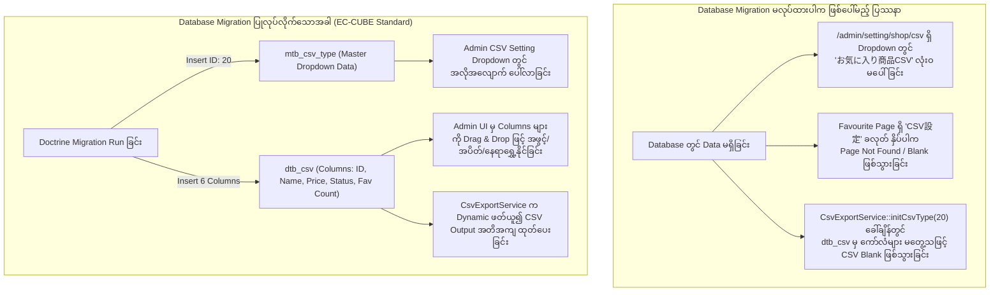

# EC-CUBE 4.3.1 - Favourite Feature & CSV Setting Output Type Easy Master Guide
## (ဝယ်ယူသူ အကြိုက်ဆုံး ကုန်ပစ္စည်း စာရင်းကို အလွယ်ကူဆုံး တည်ဆောက်နည်း၊ CSV Feature အတွက် Database Migration အဘယ်ကြောင့် လိုအပ်သနည်းနှင့် Core Standard အတိုင်း အဆင့်ဆင့် ရေးသားနည်း လမ်းညွှန်)

---

## ၁။ နိဒါန်းနှင့် မေးခွန်းများ၏ အဖြေ (Introduction & Core Questions)

ဤလမ်းညွှန်သည် EC-CUBE 4.3.1 (Symfony 5.4 Base) တွင် **(၁) ဝယ်ယူသူများ အကြိုက်တွေ့ဆုံး ကုန်ပစ္စည်းများ စာရင်း (Favourite Products) ကို အရိုးရှင်းဆုံးနှင့် အလွယ်ကူဆုံး နည်းလမ်းဖြင့် တည်ဆောက်ပုံ** နှင့် **(၂) CSV Feature နှင့် Store CSV Settings ချိတ်ဆက်ရာတွင် အဘယ်ကြောင့် Database Migration ကို မဖြစ်မနေ ပြုလုပ်ရသနည်း** ဟူသော အချက်များကို အတွေ့အကြုံ (၆) လရှိ Junior Developer များ ရှင်းလင်းစွာ နားလည်နိုင်စေရန် ရေးသားထားခြင်း ဖြစ်ပါသည်။

---

## ၂။ အရေးကြီး မေးခွန်း - CSV Feature နှင့် Setting CSV Type အတွက် Database Migration အဘယ်ကြောင့် လိုအပ်သနည်း?
### (Why is Database Migration Necessary for the CSV Feature and CSV Setting Type?)

အတွေ့အကြုံနုနယ်သော developer များ မကြာခဏ မေးလေ့ရှိသည့် မေးခွန်းမှာ:  
> *"CSV Download ဆွဲတာ PHP Controller နဲ့ Service ရေးရုံနဲ့ မပြီးဘူးလား? ဘာကြောင့် Database Migration အထိ လုပ်ပြီး Table ထဲ Data သွင်းနေရတာလဲ?"*

အဖြေမှာ **EC-CUBE ၏ မူရင်း Architecture (Core Standard) သည် Database-Driven CSV Architecture ဖြစ်နေသောကြောင့်** ဖြစ်ပါသည်။



### အသေးစိတ် အကြောင်းရင်း (၃) ချက်:

#### အချက် (၁) - EC-CUBE သည် CSV Columns များကို Code ထဲတွင် Hardcode မရေးပါ
* သာမန် PHP စနစ်များတွင် CSV တွင် မည်သည့် ကော်လံပါမည်ကို PHP Array ထဲတွင် hardcode ရေးလေ့ရှိပါသည်။
* သို့သော် EC-CUBE တွင် Shop Owner (ဆိုင်ပိုင်ရှင်) သည် Admin UI (`/admin/setting/shop/csv`) မှနေ၍ **မည်သည့်ကော်လံကို ပြမည်/ဖျောက်မည်၊ ကော်လံအမည် မည်သို့ပြမည်၊ မည်သည့်ကော်လံကို အရင်ထားမည် (Sort Order)** တို့ကို Mouse ဖြင့် Drag & Drop ဆွဲ၍ စိတ်ကြိုက် ပြင်ဆင်နိုင်ရပါမည်။
* အဆိုပါ ကော်လံ configuration များကို EC-CUBE က Database Table တစ်ခုဖြစ်သော **`dtb_csv`** ထဲတွင် သိမ်းဆည်းထားပါသည်။

#### အချက် (၂) - `mtb_csv_type` သည် Admin Dropdown ၏ အသက်ဖြစ်ပါသည်
* Admin Panel ရှိ **設定 (Settings) -> 店舗設定 (Shop Settings) -> CSV設定 (CSV Settings)** သို့ သွားသောအခါ အပေါ်ဆုံးတွင် CSV အမျိုးအစား ရွေးချယ်သည့် Dropdown ရှိပါသည်။
* ထို Dropdown ထဲရှိ စာရင်းများ (Product CSV, Order CSV, Customer CSV စသည်) သည် PHP Code ထဲမှ လာခြင်းမဟုတ်ဘဲ **`mtb_csv_type`** ဟူသော Database Master Table ထဲမှ Dynamic Query လုပ်၍ ဆွဲထုတ်ပြသခြင်း ဖြစ်ပါသည်။
* ထို့ကြောင့် ကျွန်ုပ်တို့၏ Custom CSV Type (ID: 20, 'お気に入り商品CSV') သည် `mtb_csv_type` ထဲတွင် မရှိပါက Admin Setting စာမျက်နှာတွင် လုံးဝ ပေါ်လာမည် မဟုတ်ပါ။

#### အချက် (၃) - အဘယ်ကြောင့် phpMyAdmin မှ Direct မထည့်ဘဲ Doctrine Migration သုံးရသနည်း?
* **EC-CUBE & Symfony Standard:** စနစ်တစ်ခုကို Production Server သို့ တင်သည့်အခါ သို့မဟုတ် အသင်းသား Developer များ အချင်းချင်း Git Pull ဆွဲသည့်အခါ phpMyAdmin မှ လက်ဖြင့် တစ်ယောက်ချင်း SQL ရိုက်ထည့်ခြင်းသည် အမှားအယွင်းများစေပြီး EC-CUBE Standard မဟုတ်ပါ။
* **Doctrine Migration** ရေးထားပါက `bin/console doctrine:migrations:migrate` ဟူသော Command တစ်ကြောင်းတည်းဖြင့် မည်သည့် Server/စက်တွင်မဆို Database Schema နှင့် Data များ အလိုအလျောက် တပြေးညီ ရရှိသွားမည် ဖြစ်ပါသည်။

---

## ၃။ အလွယ်ကူဆုံး Favourite Feature တည်ဆောက်ပုံ အဆင့်ဆင့် (Step-by-Step Implementation)

EC-CUBE Core တွင် ဝယ်ယူသူများ အကြိုက်မှတ်ထားသော Data များကို သိမ်းဆည်းရန် Entity အသင့် ပါရှိပြီး ဖြစ်ပါသည်:
* **Core Entity:** `Eccube\Entity\CustomerFavoriteProduct`
* **Core Table:** `dtb_customer_favorite_product` (Columns: `customer_id`, `product_id`, `create_date`)

ကျွန်ုပ်တို့ ပြုလုပ်ရမည့် တစ်ခုတည်းသော အလုပ်မှာ **အဆိုပါ Table ထဲရှိ Favorite အများဆုံး ကုန်ပစ္စည်းများကို ရေတွက်ထုတ်ယူပြီး Admin Panel တွင် UI ပြသပေးခြင်းနှင့် CSV ထုတ်ယူပေးခြင်း** သာ ဖြစ်ပါသည်။

---

### အဆင့် (၁) - Custom CSV Type Constant သတ်မှတ်ခြင်း

CSV Type ID ကို နေရာအနှံ့ နံပါတ်တိုက်ရိုက် မသုံးဘဲ Constant အဖြစ် သတ်မှတ်ပါမည်။

📁 **ဖိုင်တည်နေရာ:** `app/Customize/Constant/CustomCsvType.php`

```php
<?php

namespace Customize\Constant;

class CustomCsvType
{
    /**
     * Favorite Product CSV Type ID (mtb_csv_type ၏ ID ဖြစ်သည်)
     */
    public const CSV_TYPE_FAVOURITE_PRODUCT = 20;
    public const CSV_TYPE_FAVORITE_PRODUCT = 20;
}
```

---

### အဆင့် (၂) - Database Migration ဖြင့် CSV Type နှင့် Columns ထည့်သွင်းခြင်း

အထက်တွင် ရှင်းပြခဲ့သည့်အတိုင်း Admin CSV Setting တွင် ပေါ်လာစေရန်နှင့် CSV ထုတ်ယူနိုင်စေရန် Migration ရေးသားပါမည်။

📁 **ဖိုင်တည်နေရာ:** `app/DoctrineMigrations/Version20260917083632.php`

```php
<?php

declare(strict_types=1);

namespace DoctrineMigrations;

use Customize\Constant\CustomCsvType;
use Doctrine\DBAL\Schema\Schema;
use Doctrine\Migrations\AbstractMigration;

final class Version20260917083632 extends AbstractMigration
{
    public function getDescription(): string
    {
        return 'Add Favorite Product CSV type (ID: 20) and default columns into mtb_csv_type and dtb_csv';
    }

    public function up(Schema $schema): void
    {
        $csvTypeId = CustomCsvType::CSV_TYPE_FAVOURITE_PRODUCT;

        // ၁။ mtb_csv_type တွင် Custom CSV Type (ID: 20) ထည့်သွင်းခြင်း
        if ($schema->hasTable('mtb_csv_type')) {
            $typeExists = (int) $this->connection->fetchOne(
                "SELECT COUNT(*) FROM mtb_csv_type WHERE id = ?",
                [$csvTypeId]
            );

            if ($typeExists === 0) {
                $this->addSql(
                    "INSERT INTO mtb_csv_type (id, name, sort_no, discriminator_type) VALUES (?, 'お気に入り商品CSV', (SELECT COALESCE(MAX(t.sort_no), 0) + 1 FROM (SELECT sort_no FROM mtb_csv_type) AS t), 'csvtype')",
                    [$csvTypeId]
                );
            }
        }

        // ၂။ dtb_csv တွင် Default Output Columns (၆) ခု ထည့်သွင်းခြင်း
        if ($schema->hasTable('dtb_csv')) {
            $csvColsExists = (int) $this->connection->fetchOne(
                "SELECT COUNT(*) FROM dtb_csv WHERE csv_type_id = ?",
                [$csvTypeId]
            );

            if ($csvColsExists === 0) {
                $items = [
                    ['id',             '商品ID',         1],
                    ['name',           '商品名',         2],
                    ['price02_min',    '販売価格(下限)', 3],
                    ['price02_max',    '販売価格(上限)', 4],
                    ['Status',         '公開状態',       5],
                    ['favorite_count', 'お気に入り数',   6],
                ];

                foreach ($items as [$fieldName, $dispName, $sortNo]) {
                    $this->addSql(
                        "INSERT INTO dtb_csv (csv_type_id, entity_name, field_name, reference_field_name, disp_name, sort_no, enabled, create_date, update_date, discriminator_type) VALUES (?, 'Eccube\\\\Entity\\\\Product', ?, NULL, ?, ?, 1, CURRENT_TIMESTAMP, CURRENT_TIMESTAMP, 'csv')",
                        [$csvTypeId, $fieldName, $dispName, $sortNo]
                    );
                }
            }
        }
    }

    public function down(Schema $schema): void
    {
        $csvTypeId = CustomCsvType::CSV_TYPE_FAVOURITE_PRODUCT;

        if ($schema->hasTable('dtb_csv')) {
            $this->addSql("DELETE FROM dtb_csv WHERE csv_type_id = ?", [$csvTypeId]);
        }

        if ($schema->hasTable('mtb_csv_type')) {
            $this->addSql("DELETE FROM mtb_csv_type WHERE id = ?", [$csvTypeId]);
        }
    }
}
```

---

### အဆင့် (၃) - Search Form Type တည်ဆောက်ခြင်း

Admin ဘက်မှ Product ID၊ Product Name၊ Customer Name နှင့် Favorite Count (Min ～ Max) ဖြင့် စစ်ထုတ်ရှာဖွေနိုင်ရန် Symfony Form Type ဖန်တီးပါမည်။

📁 **ဖိုင်တည်နေရာ:** `app/Customize/Form/Type/Admin/SearchFavoriteProductType.php`

```php
<?php

namespace Customize\Form\Type\Admin;

use Symfony\Component\Form\AbstractType;
use Symfony\Component\Form\Extension\Core\Type\IntegerType;
use Symfony\Component\Form\Extension\Core\Type\TextType;
use Symfony\Component\Form\FormBuilderInterface;
use Symfony\Component\Validator\Constraints as Assert;

class SearchFavoriteProductType extends AbstractType
{
    public function buildForm(FormBuilderInterface $builder, array $options)
    {
        $builder
            ->add('id', TextType::class, [
                'label' => 'admin.product.product_id',
                'required' => false,
                'attr' => ['placeholder' => '商品ID'],
            ])
            ->add('name', TextType::class, [
                'label' => 'admin.product.name',
                'required' => false,
                'attr' => ['placeholder' => '商品名・商品コード'],
            ])
            ->add('customer_name', TextType::class, [
                'label' => 'admin.customer.name',
                'required' => false,
                'attr' => ['placeholder' => '会員名・カナ・メールアドレス'],
            ])
            ->add('favorite_count_min', IntegerType::class, [
                'label' => 'お気に入り数(下限)',
                'required' => false,
                'constraints' => [new Assert\PositiveOrZero()],
                'attr' => ['placeholder' => '0', 'min' => 0],
            ])
            ->add('favorite_count_max', IntegerType::class, [
                'label' => 'お気に入り数(上限)',
                'required' => false,
                'constraints' => [new Assert\PositiveOrZero()],
                'attr' => ['placeholder' => '999', 'min' => 0],
            ]);
    }

    public function getBlockPrefix()
    {
        return 'admin_search_favorite_product';
    }
}
```

---

### အဆင့် (၄) - Repository QueryBuilder ရေးသားခြင်း

Favorite လုပ်ထားသော ကုန်ပစ္စည်းများကို ရေတွက်ပြီး အများဆုံးမှ အနည်းဆုံးသို့ စီပေးမည့် QueryBuilder ဖြစ်ပါသည်။

📁 **ဖိုင်တည်နေရာ:** `app/Customize/Repository/FavouriteProductRepository.php`

```php
<?php

namespace Customize\Repository;

use Eccube\Entity\Product;
use Doctrine\Bundle\DoctrineBundle\Repository\ServiceEntityRepository;
use Doctrine\Persistence\ManagerRegistry;
use Doctrine\ORM\QueryBuilder;

class FavouriteProductRepository extends ServiceEntityRepository
{
    public function __construct(ManagerRegistry $registry)
    {
        parent::__construct($registry, Product::class);
    }

    public function getFavouriteDb(array $searchData = []): QueryBuilder
    {
        $qb = $this->createQueryBuilder('p')
            ->select('p')
            ->addSelect('COUNT(DISTINCT cfp.id) AS HIDDEN favorite_count')
            ->innerJoin('p.CustomerFavoriteProducts', 'cfp')
            ->groupBy('p.id');

        // ၁။ Product ID Search
        if (!empty($searchData['id'])) {
            $ids = preg_split('/[\s,]+/', $searchData['id'], -1, PREG_SPLIT_NO_EMPTY);
            $qb->andWhere($qb->expr()->in('p.id', ':ids'))
               ->setParameter('ids', $ids);
        }

        // ၂။ Product Name / Code Search
        if (!empty($searchData['name'])) {
            $qb->andWhere('p.name LIKE :name OR p.search_word LIKE :name')
               ->setParameter('name', '%' . $searchData['name'] . '%');
        }

        // ၃။ Customer Name Search
        if (!empty($searchData['customer_name'])) {
            $qb->innerJoin('cfp.Customer', 'c')
               ->andWhere('c.name01 LIKE :cname OR c.name02 LIKE :cname OR c.kana01 LIKE :cname OR c.kana02 LIKE :cname OR c.email LIKE :cname')
               ->setParameter('cname', '%' . $searchData['customer_name'] . '%');
        }

        // ၄။ Favorite Count Range Filter
        if (isset($searchData['favorite_count_min']) && $searchData['favorite_count_min'] !== null && $searchData['favorite_count_min'] !== '') {
            $qb->andHaving('COUNT(DISTINCT cfp.id) >= :fav_min')
               ->setParameter('fav_min', (int)$searchData['favorite_count_min']);
        }
        if (isset($searchData['favorite_count_max']) && $searchData['favorite_count_max'] !== null && $searchData['favorite_count_max'] !== '') {
            $qb->andHaving('COUNT(DISTINCT cfp.id) <= :fav_max')
               ->setParameter('fav_max', (int)$searchData['favorite_count_max']);
        }

        // ၅။ Sort By Favorite Count DESC
        $qb->orderBy('favorite_count', 'DESC')
           ->addOrderBy('p.id', 'DESC');

        return $qb;
    }
}
```

---

### အဆင့် (၅) - Controller တည်ဆောက်ခြင်း (List & CSV Export)

Controller တွင် အဓိက Method နှစ်ခုသာ ပါဝင်ပါသည်:
1. `index()`: စာရင်းပြသခြင်းနှင့် Pagination
2. `export()`: `CsvExportService` ဖြင့် CSV Streamed Response ထုတ်ပေးခြင်း

📁 **ဖိုင်တည်နေရာ:** `app/Customize/Controller/Admin/Product/FavouriteProductController.php`

```php
<?php

namespace Customize\Controller\Admin\Product;

use Customize\Constant\CustomCsvType;
use Customize\Form\Type\Admin\SearchFavoriteProductType;
use Customize\Repository\FavouriteProductRepository;
use Eccube\Controller\AbstractController;
use Eccube\Entity\ExportCsvRow;
use Eccube\Entity\Product;
use Eccube\Service\CsvExportService;
use Eccube\Util\FormUtil;
use Knp\Component\Pager\PaginatorInterface;
use Sensio\Bundle\FrameworkExtraBundle\Configuration\Template;
use Symfony\Component\HttpFoundation\Request;
use Symfony\Component\HttpFoundation\StreamedResponse;
use Symfony\Component\Routing\Annotation\Route;

class FavouriteProductController extends AbstractController
{
    protected $favouriteProductRepository;
    protected $csvExportService;
    protected $paginator;

    public function __construct(
        FavouriteProductRepository $favouriteProductRepository,
        CsvExportService $csvExportService,
        PaginatorInterface $paginator
    ) {
        $this->favouriteProductRepository = $favouriteProductRepository;
        $this->csvExportService = $csvExportService;
        $this->paginator = $paginator;
    }

    /**
     * Favourite Products List Page
     * @Route("/%eccube_admin_route%/product/favourite", name="admin_product_favourite", methods={"GET", "POST"})
     * @Route("/%eccube_admin_route%/product/favourite/page/{page_no}", requirements={"page_no" = "\d+"}, name="admin_product_favourite_page", methods={"GET", "POST"})
     * @Template("@admin/Product/product_favourite.twig")
     */
    public function index(Request $request, $page_no = null): array
    {
        $searchForm = $this->createForm(SearchFavoriteProductType::class);
        $searchData = [];

        if ($request->getMethod() === 'POST') {
            $searchForm->handleRequest($request);
            if ($searchForm->isSubmitted() && $searchForm->isValid()) {
                $searchData = $searchForm->getData();
                $page_no = 1;
                $this->session->set('eccube.admin.product.favourite.search', FormUtil::getViewData($searchForm));
                $this->session->set('eccube.admin.product.favourite.search.page_no', $page_no);
            }
        } else {
            $page_no = $request->get('page_no', $this->session->get('eccube.admin.product.favourite.search.page_no', 1));
            $viewData = $this->session->get('eccube.admin.product.favourite.search', []);
            $searchData = FormUtil::submitAndGetData($searchForm, $viewData);
        }

        $page_count = $this->eccubeConfig->get('eccube_default_page_count');
        $qb = $this->favouriteProductRepository->getFavouriteDb($searchData);
        $pagination = $this->paginator->paginate($qb, $page_no, $page_count, ['wrap-queries' => true]);

        return [
            'searchForm' => $searchForm->createView(),
            'pagination' => $pagination,
            'page_no' => $page_no,
        ];
    }

    /**
     * CSV Download Export
     * @Route("/%eccube_admin_route%/product/favourite/export", name="admin_product_favourite_export", methods={"GET"})
     */
    public function export(Request $request): StreamedResponse
    {
        set_time_limit(0);
        $this->entityManager->getConfiguration()->setSQLLogger(null);

        $response = new StreamedResponse();
        $response->setCallback(function () {
            // ၁။ CSV Type ID: 20 ဖြင့် CsvExportService ကို စတင်ခြင်း
            $this->csvExportService->initCsvType(CustomCsvType::CSV_TYPE_FAVOURITE_PRODUCT);

            // ၂။ လက်ရှိ ရှာဖွေထားသော Search Filter များကို ဆွဲယူခြင်း
            $searchForm = $this->createForm(SearchFavoriteProductType::class);
            $viewData = $this->session->get('eccube.admin.product.favourite.search', []);
            $searchData = FormUtil::submitAndGetData($searchForm, $viewData);

            $qb = $this->favouriteProductRepository->getFavouriteDb($searchData);
            $this->csvExportService->setExportQueryBuilder($qb);

            // ၃။ UTF-8 BOM ထည့်သွင်းခြင်း (Excel စာလုံးမပျက်စေရန်)
            $fp = fopen('php://output', 'w');
            fwrite($fp, "\xEF\xBB\xBF");
            fclose($fp);

            // ၄။ Header ခေါင်းစဉ်များ ရေးထုတ်ခြင်း
            $this->csvExportService->exportHeader();

            // ၅။ Data Rows များကို Stream ထုတ်ပေးခြင်း
            $this->csvExportService->exportData(function (Product $Product, CsvExportService $csvService) {
                $Csvs = $csvService->getCsvs();
                $ExportCsvRow = new ExportCsvRow();

                foreach ($Csvs as $Csv) {
                    $fieldName = $Csv->getFieldName();

                    if ($fieldName === 'favorite_count') {
                        $ExportCsvRow->setData(count($Product->getCustomerFavoriteProducts()));
                    } elseif ($fieldName === 'Status') {
                        $ExportCsvRow->setData($Product->getStatus() ? $Product->getStatus()->getName() : '');
                    } else {
                        $ExportCsvRow->setData($csvService->getData($Csv, $Product));
                    }
                    $ExportCsvRow->pushData();
                }

                $csvService->fputcsv($ExportCsvRow->getRow());
            });
        });

        $now = new \DateTime();
        $filename = 'favourite_products_' . $now->format('YmdHis') . '.csv';
        $response->headers->set('Content-Type', 'text/csv; charset=UTF-8');
        $response->headers->set('Content-Disposition', 'attachment; filename="' . $filename . '"');

        return $response;
    }
}
```

---

### အဆင့် (၆) - Twig UI တည်ဆောက်ခြင်း (CSV Download & Settings Buttons)

Action bar တွင် CSV Download ခလုတ် နှင့် CSV Setting သို့ သွားမည့် ခလုတ် (၂) ခုကို ထည့်သွင်းပေးပါမည်:

📁 **ဖိုင်တည်နေရာ:** `app/template/admin/Product/product_favourite.twig`

```twig




{{ 'admin.favorite.favorite_products'|trans }}
{{ 'admin.product.product_management'|trans }}


    <div class="c-contentsArea__cols">
        <div class="c-contentsArea__primaryCol">
            <div class="c-primaryCol">

                <!-- Header Actions: CSV Download & CSV Settings -->
                <div class="d-flex justify-content-between align-items-center mb-4">
                    <h4 class="mb-0 fw-bold">
                        <i class="fa fa-heart text-danger me-2"></i>お気に入り商品一覧
                    </h4>
                    <div class="btn-group" role="group">
                        <!-- CSV Download ခလုတ် -->
                        <a href="{{ url('admin_product_favourite_export') }}" class="btn btn-ec-regular">
                            <i class="fa fa-cloud-download me-1 text-secondary"></i><span>{{ 'admin.common.csv_download'|trans }}</span>
                        </a>
                        <!-- CSV Setting သို့ သွားမည့် ခလုတ် (ID: 20 ဖြင့် တိုက်ရိုက်ချိတ်ဆက်ထားသည်) -->
                        <a href="{{ url('admin_setting_shop_csv', { id: constant('\\Customize\\Constant\\CustomCsvType::CSV_TYPE_FAVOURITE_PRODUCT') }) }}" class="btn btn-ec-regular">
                            <i class="fa fa-cog me-1 text-secondary"></i><span>{{ 'admin.setting.shop.csv_setting'|trans }}</span>
                        </a>
                    </div>
                </div>

                <!-- Search Filter Card -->
                <div class="card rounded border-0 shadow-sm mb-4">
                    <div class="card-body">
                        <form name="search_form" id="search_form" method="POST" action="{{ url('admin_product_favourite') }}">
                            {{ form_widget(searchForm._token) }}
                            <div class="row g-3">
                                <div class="col-md-3">
                                    <label class="form-label small fw-bold text-muted">商品ID</label>
                                    {{ form_widget(searchForm.id, {'attr': {'class': 'form-control'}}) }}
                                </div>
                                <div class="col-md-3">
                                    <label class="form-label small fw-bold text-muted">商品名</label>
                                    {{ form_widget(searchForm.name, {'attr': {'class': 'form-control'}}) }}
                                </div>
                                <div class="col-md-3">
                                    <label class="form-label small fw-bold text-muted">会員名</label>
                                    {{ form_widget(searchForm.customer_name, {'attr': {'class': 'form-control'}}) }}
                                </div>
                                <div class="col-md-3">
                                    <label class="form-label small fw-bold text-muted">お気に入り数 (Min ～ Max)</label>
                                    <div class="input-group">
                                        {{ form_widget(searchForm.favorite_count_min, {'attr': {'class': 'form-control', 'placeholder': 'Min'}}) }}
                                        <span class="input-group-text">～</span>
                                        {{ form_widget(searchForm.favorite_count_max, {'attr': {'class': 'form-control', 'placeholder': 'Max'}}) }}
                                    </div>
                                </div>
                            </div>
                            <div class="row mt-3">
                                <div class="col-12 text-center">
                                    <button type="submit" class="btn btn-ec-conversion px-4">
                                        <i class="fa fa-search me-1"></i>検索
                                    </button>
                                </div>
                            </div>
                        </form>
                    </div>
                </div>

                <!-- Products Table -->
                <div class="card rounded border-0 shadow-sm mb-4">
                    <div class="card-body p-0">
                        
                            <table class="table table-hover align-middle mb-0">
                                <thead class="table-light">
                                    <tr>
                                        <th class="ps-3">ID</th>
                                        <th>商品名</th>
                                        <th class="text-end">価格</th>
                                        <th class="text-center">お気に入り数</th>
                                        <th class="pe-3 text-center">状態</th>
                                    </tr>
                                </thead>
                                <tbody>
                                    
                                        <tr>
                                            <td class="ps-3 fw-bold text-muted">{{ Product.id }}</td>
                                            <td>
                                                <a href="{{ url('admin_product_product_edit', { id : Product.id }) }}" class="fw-bold text-decoration-none">
                                                    {{ Product.name }}
                                                </a>
                                            </td>
                                            <td class="text-end fw-bold">
                                                {{ Product.getPrice02IncTaxMin|price }}
                                            </td>
                                            <td class="text-center">
                                                <span class="badge bg-danger rounded-pill px-3 py-2">
                                                    <i class="fa fa-heart me-1"></i> {{ Product.CustomerFavoriteProducts|length }}
                                                </span>
                                            </td>
                                            <td class="pe-3 text-center">
                                                
                                                    <span class="badge bg-success">{{ Product.Status.name }}</span>
                                                
                                            </td>
                                        </tr>
                                    
                                </tbody>
                            </table>
                        
                            <div class="text-center py-5 text-muted">
                                お気に入り登録された商品がありません
                            </div>
                        
                    </div>
                </div>

                <!-- Pagination -->
                
                    <div class="row justify-content-center mb-4">
                        
                    </div>
                

            </div>
        </div>
    </div>

```

---

### အဆင့် (၇) - Sidebar Menu ထည့်သွင်းခြင်း

📁 **ဖိုင်တည်နေရာ:** `app/config/eccube/packages/eccube_nav.yaml`

```yaml
parameters:
    eccube_nav:
        product:
            name: admin.product.product_management
            icon: fa-cube
            children:
                product_master:
                    name: admin.product.product_list
                    url: admin_product
                favorite_product:
                    name: admin.favorite.favorite_products
                    url: admin_product_favourite
```

---

## ၄။ Terminal Commands များနှင့် စစ်ဆေးနည်း (Commands & Verification)

ဖိုင်များအားလုံး အသင့်ဖြစ်ပါက Terminal တွင် အောက်ပါ command များကို အစဉ်လိုက် Run ပေးရပါမည်:

```bash
# ၁။ Migration Run ၍ mtb_csv_type (ID: 20) နှင့် dtb_csv ကော်လံများ ထည့်သွင်းခြင်း
docker compose exec -T ec-cube php bin/console doctrine:migrations:migrate --no-interaction

# ၂။ Symfony Cache အား ရှင်းလင်းခြင်း (Menu နှင့် Routing အသစ်များ ပေါ်လာစေရန်)
docker compose exec -T -u www-data ec-cube php bin/console cache:clear --no-warmup

# ၃။ Proxy Classes များ ပြန်လည် Generate လုပ်ခြင်း
docker compose exec -T -u root ec-cube php bin/console eccube:generate:proxies

# ၄။ Docker Cache & Log ဖိုင်များ Permission ဖွင့်ပေးခြင်း
docker compose exec -T -u root ec-cube chown -R www-data:www-data var/cache var/log
docker compose exec -T -u root ec-cube chmod -R 777 var/cache var/log
```

---

## ၅။ အနှစ်ချုပ် ပြန်လည်သုံးသပ်ချက် (Summary Checklist)

1. **Database Migration သည် အဘယ်ကြောင့် လိုအပ်သနည်း?**  
   EC-CUBE ၏ CSV စနစ်သည် Database-driven ဖြစ်သောကြောင့် `mtb_csv_type` (Dropdown Type) နှင့် `dtb_csv` (Column Configuration) ထဲတွင် Data ရှိနေမှသာ Admin UI တွင် စီမံနိုင်ပြီး CSV Download ကောင်းမွန်စွာ ဆွဲနိုင်မည် ဖြစ်ပါသည်။
2. **Core Files များကို ပြင်ဆင်ရန် လိုပါသလား?**  
   လုံးဝ မလိုအပ်ပါ။ Core ဖိုင်များဖြစ်သော `src/Eccube/` နှင့် `vendor/` ကို မထိခိုက်စေဘဲ `app/Customize/` နှင့် `app/template/` အောက်တွင်သာ EC-CUBE Standard အတိုင်း သန့်ရှင်းစွာ တည်ဆောက်ထားပါသည်။
