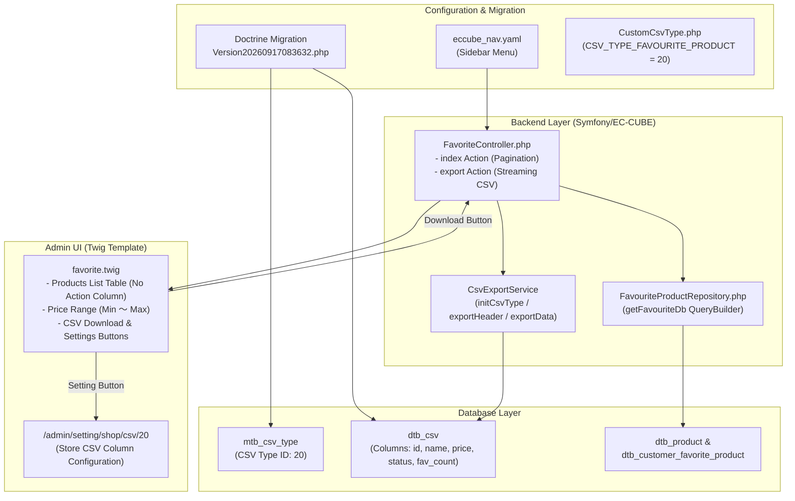

# EC-CUBE 4.3.1 - Favourite Products Management & Custom CSV Type Implementation Master Guide
## (ဝယ်ယူသူ အကြိုက်ဆုံး ကုန်ပစ္စည်းများ စာရင်း၊ CSV Export နှင့် Store CSV Output Settings ချိတ်ဆက်ခြင်း အပြည့်အစုံ လမ်းညွှန်)

ဤစာရွက်စာတမ်းသည် EC-CUBE 4.3.1 (Symfony 5.4 Base) တွင် **(၁) ဝယ်ယူသူများ အကြိုက်ဆုံး ကုန်ပစ္စည်းများ (Favourite Products) စာရင်းကို Admin Panel တွင် ဖော်ပြခြင်း**၊ **(၂) အဆိုပါ စာရင်းအား Standard CsvExportService ဖြင့် CSV Download ထုတ်ယူခြင်း** နှင့် **(၃) Admin Shop Settings (`/admin/setting/shop/csv`) ရှိ CSV Type Dropdown တွင် Custom CSV Type အသစ်အဖြစ် ထည့်သွင်း၍ Columns များကို UI မှ စိတ်ကြိုက် စီမံခန့်ခွဲနိုင်စေခြင်း** တို့ကို စတင်တည်ဆောက်ပုံမှ ပြီးစီးသည်အထိ အတွေ့အကြုံ (၆) လရှိ Junior Developer များ အလွယ်တကူ လိုက်နာနားလည်နိုင်စေရန် မြန်မာဘာသာဖြင့် အသေးစိတ် ရေးသားထားသော လမ်းညွှန် ဖြစ်ပါသည်။

---

## ၁။ စနစ်တစ်ခုလုံး၏ အလုပ်လုပ်ပုံ ဖွဲ့စည်းပုံ (Architecture & Flow Diagram)



---

## ၂။ ဖန်တီး/ပြင်ဆင်ရမည့် ဖိုင်များ စာရင်းနှင့် တာဝန်များ (Required File Breakdown)

> [!IMPORTANT]
> **EC-CUBE Core Rule:** `src/Eccube/` နှင့် `vendor/` ဖိုင်များကို လုံးဝ မပြင်ရပါ။ Customization အားလုံးကို `app/Customize/`, `app/template/`, `app/DoctrineMigrations/` နှင့် `app/config/` အောက်တွင်သာ ရေးသားရပါမည်။

| စဉ် | ဖိုင်လမ်းကြောင်း (File Path) | အမျိုးအစား | အဓိက တာဝန်နှင့် အခန်းကဏ္ဍ (Role) |
| :---: | :--- | :---: | :--- |
| **၁** | `app/DoctrineMigrations/Version20260917083632.php` | Doctrine Migration | Database ၏ `mtb_csv_type` (ID: 20) နှင့် `dtb_csv` Default Columns (၆) ခုကို စနစ်တကျ ထည့်သွင်းပေးခြင်း။ |
| **၂** | `app/Customize/Constant/CustomCsvType.php` | PHP Class (Constant) | CSV Type ID ကို Hardcode မဖြစ်စေရန် `CSV_TYPE_FAVOURITE_PRODUCT = 20` ဟု သတ်မှတ်ပေးခြင်း။ |
| **၃** | `app/Customize/Repository/FavouriteProductRepository.php` | Doctrine Repository | Favorite အများဆုံး ကုန်ပစ္စည်းများကို MySQL 8 `ONLY_FULL_GROUP_BY` safe ဖြစ်သော Subquery Sorting ဖြင့် ဆွဲထုတ်ပေးသော QueryBuilder။ |
| **၄** | `app/Customize/Controller/Admin/Product/FavoriteController.php` | Symfony Controller | List ပြသခြင်း (Pagination) နှင့် Standard CsvExportService ဖြင့် CSV Streaming Download ထုတ်ပေးခြင်း။ |
| **၅** | `app/template/admin/Product/favorite.twig` | Twig Template | Action Column မပါဝင်ဘဲ ID, Image, Name, Price Range, Fav Count, Status တို့နှင့် CSV ခလုတ်များ ပါဝင်သော UI။ |
| **၆** | `app/config/eccube/packages/eccube_nav.yaml` | YAML Config | Admin Panel ဘယ်ဘက် Sidebar Menu တွင် "お気に入り商品 (Favorite Products)" link ထည့်သွင်းပေးခြင်း။ |

---

## ၃။ အဆင့်ဆင့် တည်ဆောက်ပုံ အပြည့်အစုံ (Step-by-Step Implementation Guide)

---

### အဆင့် (၁) - Custom CSV Type Master Constant သတ်မှတ်ခြင်း

CSV Type ID ကို နေရာအနှံ့ နံပါတ်တိုက်ရိုက် (Hardcode) မသုံးဘဲ Constant ဖိုင်တစ်ခုတွင် ဗဟိုပြု သတ်မှတ်ပါသည်။

📁 **တည်နေရာဖိုင်:** `app/Customize/Constant/CustomCsvType.php`

```php
<?php

namespace Customize\Constant;

class CustomCsvType
{
    /**
     * @var integer Favorite Product CSV Type ID (mtb_csv_type ID)
     */
    public const CSV_TYPE_FAVOURITE_PRODUCT = 20;
    public const CSV_TYPE_FAVORITE_PRODUCT = 20;
}
```

---

### အဆင့် (၂) - Doctrine Migration ဖြင့် `mtb_csv_type` နှင့် `dtb_csv` သို့ ဒေတာထည့်သွင်းခြင်း

Admin Panel ရှိ `/admin/setting/shop/csv` တွင် မိမိတို့ Custom CSV Type ပေါ်လာစေရန် `mtb_csv_type` နှင့် `dtb_csv` ထဲသို့ migration ဖြင့် ထည့်သွင်းရပါမည်။

📁 **တည်နေရာဖိုင်:** `app/DoctrineMigrations/Version20260917083632.php`

```php
<?php

declare(strict_types=1);

namespace DoctrineMigrations;

use Customize\Constant\CustomCsvType;
use Doctrine\DBAL\Schema\Schema;
use Doctrine\Migrations\AbstractMigration;

/**
 * Migration: Add Favorite Product CSV type (ID: 20) and default display columns
 */
final class Version20260917083632 extends AbstractMigration
{
    public function getDescription(): string
    {
        return 'Add Favorite Product CSV type and default display columns into mtb_csv_type and dtb_csv';
    }

    public function up(Schema $schema): void
    {
        $csvTypeId = CustomCsvType::CSV_TYPE_FAVOURITE_PRODUCT;

        // ၁။ mtb_csv_type တွင် Custom CSV Type (ID: 20) ထည့်သွင်းခြင်း
        if ($schema->hasTable('mtb_csv_type')) {
            $typeExists = (int) $this->connection->fetchOne(
                "SELECT COUNT(*) FROM mtb_csv_type WHERE id = ?",
                [$csvTypeId]
            );

            if ($typeExists === 0) {
                $this->addSql(
                    "INSERT INTO mtb_csv_type (id, name, sort_no, discriminator_type) VALUES (?, 'お気に入り商品CSV', (SELECT COALESCE(MAX(t.sort_no), 0) + 1 FROM (SELECT sort_no FROM mtb_csv_type) AS t), 'csvtype')",
                    [$csvTypeId]
                );
            }
        }

        // ၂။ dtb_csv တွင် Output Columns (၆) ခု ထည့်သွင်းခြင်း
        if ($schema->hasTable('dtb_csv')) {
            $csvColsExists = (int) $this->connection->fetchOne(
                "SELECT COUNT(*) FROM dtb_csv WHERE csv_type_id = ?",
                [$csvTypeId]
            );

            if ($csvColsExists === 0) {
                $items = [
                    ['id',             '商品ID',         1],
                    ['name',           '商品名',         2],
                    ['price02_min',    '販売価格(下限)', 3],
                    ['price02_max',    '販売価格(上限)', 4],
                    ['Status',         '公開状態',       5],
                    ['favorite_count', 'お気に入り数',   6],
                ];

                foreach ($items as [$fieldName, $dispName, $sortNo]) {
                    $this->addSql(
                        "INSERT INTO dtb_csv (csv_type_id, entity_name, field_name, reference_field_name, disp_name, sort_no, enabled, create_date, update_date, discriminator_type) VALUES (?, 'Eccube\\\\Entity\\\\Product', ?, NULL, ?, ?, 1, CURRENT_TIMESTAMP, CURRENT_TIMESTAMP, 'csv')",
                        [$csvTypeId, $fieldName, $dispName, $sortNo]
                    );
                }
            }
        }
    }

    public function down(Schema $schema): void
    {
        $csvTypeId = CustomCsvType::CSV_TYPE_FAVOURITE_PRODUCT;

        if ($schema->hasTable('dtb_csv')) {
            $this->addSql("DELETE FROM dtb_csv WHERE csv_type_id = ?", [$csvTypeId]);
        }

        if ($schema->hasTable('mtb_csv_type')) {
            $this->addSql("DELETE FROM mtb_csv_type WHERE id = ?", [$csvTypeId]);
        }
    }
}
```

---

### အဆင့် (၃) - Custom Repository တည်ဆောက်ခြင်း (MySQL 8 ONLY_FULL_GROUP_BY Safe)

Database Query များကို Controller ထဲတွင် တိုက်ရိုက် မရေးဘဲ Repository Pattern အတိုင်း သီးသန့် ခွဲထုတ်ရေးသားပါသည်။

> [!TIP]
> **အရေးကြီးသော အချက်:** MySQL 8 တွင် `GROUP BY p.id` ရေးသားပါက `sql_mode=only_full_group_by` Error 1055 တက်တတ်ပါသည်။ ထို့ကြောင့် `GROUP BY` အစား **Subquery Sorting (`AS HIDDEN favorite_count`)** ကို အသုံးပြုထားပါသည်။

📁 **တည်နေရာဖိုင်:** `app/Customize/Repository/FavouriteProductRepository.php`

```php
<?php

namespace Customize\Repository;

use Doctrine\ORM\QueryBuilder;
use Doctrine\Persistence\ManagerRegistry;
use Eccube\Entity\CustomerFavoriteProduct;
use Eccube\Entity\Product;
use Eccube\Repository\AbstractRepository;

class FavouriteProductRepository extends AbstractRepository
{
    public function __construct(ManagerRegistry $registry)
    {
        parent::__construct($registry, Product::class);
    }

    /**
     * Favorite အများဆုံး ကုန်ပစ္စည်းများ စာရင်း QueryBuilder
     * (MySQL 8 ONLY_FULL_GROUP_BY 100% Safe)
     */
    public function getFavouriteDb(): QueryBuilder
    {
        $qb = $this->createQueryBuilder('p');
        $qb->addSelect('(SELECT COUNT(cfp.id) FROM ' . CustomerFavoriteProduct::class . ' cfp WHERE cfp.Product = p) AS HIDDEN favorite_count')
            ->where('(SELECT COUNT(cfp2.id) FROM ' . CustomerFavoriteProduct::class . ' cfp2 WHERE cfp2.Product = p) > 0')
            ->orderBy('favorite_count', 'DESC')
            ->addOrderBy('p.id', 'DESC');

        return $qb;
    }
}
```

---

### အဆင့် (၄) - Admin Controller တည်ဆောက်ခြင်း (List & CSV Export)

Controller တွင် အဓိက လုပ်ဆောင်ချက် (၂) ခု ပါဝင်ပါသည်:
1. **`index` Action:** KnpPaginator ဖြင့် စာမျက်နှာ ခွဲထုတ်ပြသခြင်း (`wrap-queries => true`)။
2. **`export` Action:** `CsvExportService` ဖြင့် Excel Encoding ကိုက်ညီစေရန် UTF-8 BOM ထည့်သွင်းပြီး Chunking ဖြင့် CSV Stream ထုတ်ပေးခြင်း။

📁 **တည်နေရာဖိုင်:** `app/Customize/Controller/Admin/Product/FavoriteController.php`

```php
<?php

namespace Customize\Controller\Admin\Product;

use Customize\Constant\CustomCsvType;
use Customize\Repository\FavouriteProductRepository;
use Eccube\Controller\AbstractController;
use Eccube\Entity\ExportCsvRow;
use Eccube\Entity\Product;
use Eccube\Service\CsvExportService;
use Knp\Component\Pager\PaginatorInterface;
use Sensio\Bundle\FrameworkExtraBundle\Configuration\Template;
use Symfony\Component\HttpFoundation\Request;
use Symfony\Component\HttpFoundation\StreamedResponse;
use Symfony\Component\Routing\Annotation\Route;

class FavoriteController extends AbstractController
{
    protected $favouriteProductRepository;
    protected $csvExportService;
    protected $paginator;

    public function __construct(
        FavouriteProductRepository $favouriteProductRepository,
        CsvExportService $csvExportService,
        PaginatorInterface $paginator
    ) {
        $this->favouriteProductRepository = $favouriteProductRepository;
        $this->csvExportService = $csvExportService;
        $this->paginator = $paginator;
    }

    /**
     * Admin အကြိုက်ဆုံး ကုန်ပစ္စည်းများ စာရင်း ပြသခြင်း
     *
     * @Route("/%eccube_admin_route%/product/favorite", name="admin_product_favorite", methods={"GET", "POST"})
     * @Route("/%eccube_admin_route%/product/favorite/page/{page_no}", requirements={"page_no" = "\d+"}, name="admin_product_favorite_page", methods={"GET", "POST"})
     * @Template("@admin/Product/favorite.twig")
     */
    public function index(Request $request, $page_no = null): array
    {
        $page_no = $page_no ?: $request->query->getInt('page_no', 1);
        $page_count = $this->eccubeConfig->get('eccube_default_page_count');

        $qb = $this->favouriteProductRepository->getFavouriteDb();

        // KnpPaginator Pagination
        $pagination = $this->paginator->paginate($qb, $page_no, $page_count, ['wrap-queries' => true]);

        return [
            'pagination' => $pagination,
            'page_no' => $page_no,
        ];
    }

    /**
     * Admin Favourite Product CSV Export
     *
     * @Route("/%eccube_admin_route%/product/favorite/export", name="admin_product_favorite_export", methods={"GET"})
     */
    public function export(Request $request): StreamedResponse
    {
        set_time_limit(0);
        $this->entityManager->getConfiguration()->setSQLLogger(null);

        $response = new StreamedResponse();
        $response->setCallback(function () use ($request) {
            // ၁။ Custom CSV Type (ID: 20) ဖြင့် Initialize လုပ်ခြင်း
            $this->csvExportService->initCsvType(CustomCsvType::CSV_TYPE_FAVOURITE_PRODUCT);

            // ၂။ QueryBuilder ချိတ်ဆက်ခြင်း
            $qb = $this->favouriteProductRepository->getFavouriteDb();
            $this->csvExportService->setExportQueryBuilder($qb);

            // ၃။ UTF-8 BOM ထည့်သွင်းခြင်း (Excel ပျက်စီးမှု ကာကွယ်ရန်)
            $fp = fopen('php://output', 'w');
            fwrite($fp, "\xEF\xBB\xBF");
            fclose($fp);

            // ၄။ Header ထုတ်ပေးခြင်း
            $this->csvExportService->exportHeader();

            // ၅။ Data Rows များကို Chunking ဖြင့် Memory Leak ကင်းစွာ ထုတ်ပေးခြင်း
            $this->csvExportService->exportData(function (Product $Product, CsvExportService $csvService) use ($request) {
                $Csvs = $csvService->getCsvs();
                $ExportCsvRow = new ExportCsvRow();

                foreach ($Csvs as $Csv) {
                    $fieldName = $Csv->getFieldName();

                    if ($fieldName === 'favorite_count') {
                        $favoriteCount = count($Product->getCustomerFavoriteProducts());
                        $ExportCsvRow->setData($favoriteCount);
                    } elseif ($fieldName === 'Status') {
                        $statusName = $Product->getStatus() ? $Product->getStatus()->getName() : '';
                        $ExportCsvRow->setData($statusName);
                    } else {
                        $ExportCsvRow->setData($csvService->getData($Csv, $Product));
                    }

                    $ExportCsvRow->pushData();
                }

                $csvService->fputcsv($ExportCsvRow->getRow());
            });
        });

        $now = new \DateTime();
        $filename = 'favorite_products_' . $now->format('YmdHis') . '.csv';
        $response->headers->set('Content-Type', 'text/csv; charset=UTF-8');
        $response->headers->set('Content-Disposition', 'attachment; filename="' . $filename . '"');

        log_info('Favorite CSV Export Completed', [$filename]);

        return $response;
    }
}
```

---

### အဆင့် (၅) - Admin Twig Template တည်ဆောက်ခြင်း

UI တွင် Action Column (Edit/Delete) မပါဝင်စေဘဲ သန့်ရှင်းစွာ ရေးသားထားပါသည်။

📁 **တည်နေရာဖိုင်:** `app/template/admin/Product/favorite.twig`

```twig




{{ 'admin.favorite.favorite_products'|trans }}
{{ 'admin.product.product_management'|trans }}


    <style>
        .fav-product-img {
            width: 48px;
            height: 48px;
            object-fit: cover;
            border-radius: 4px;
            border: 1px solid #dee2e6;
            background-color: #f8f9fa;
        }
        .fav-count-badge {
            font-size: 0.875rem;
            padding: 0.35rem 0.75rem;
            border-radius: 20px;
            background: rgba(220, 53, 69, 0.1);
            color: #dc3545;
            display: inline-flex;
            align-items: center;
            font-weight: 600;
        }
    </style>



    <div class="c-contentsArea__cols">
        <div class="c-contentsArea__primaryCol">
            <div class="c-primaryCol">

                <!-- Header Action & Title Bar -->
                <div class="d-flex justify-content-between align-items-center mb-4">
                    <div>
                        <h4 class="mb-1 fw-bold text-dark">
                            <i class="fa fa-heart text-danger me-2"></i>{{ 'admin.favorite.favorite_products'|trans }}
                        </h4>
                        <p class="text-muted small mb-0">{{ 'admin.product.favorite_management'|trans }}</p>
                    </div>
                    <div>
                        <!-- CSV Download & CSV Output Setting Buttons -->
                        <div class="btn-group" role="group">
                            <a href="{{ url('admin_product_favorite_export') }}" class="btn btn-ec-regular">
                                <i class="fa fa-cloud-download me-1 text-secondary"></i><span>{{ 'admin.common.csv_download'|trans }}</span>
                            </a>
                            <a href="{{ url('admin_setting_shop_csv', { id: constant('\\Customize\\Constant\\CustomCsvType::CSV_TYPE_FAVOURITE_PRODUCT') }) }}" class="btn btn-ec-regular">
                                <i class="fa fa-cog me-1 text-secondary"></i><span>{{ 'admin.setting.shop.csv_setting'|trans }}</span>
                            </a>
                        </div>
                    </div>
                </div>

                <!-- Products Table Card -->
                <div class="card rounded border-0 shadow-sm mb-4">
                    <div class="card-header bg-white py-3 border-bottom d-flex justify-content-between align-items-center">
                        <div>
                            <h6 class="mb-0 fw-bold text-dark">
                                <i class="fa fa-list me-2 text-primary"></i>{{ 'admin.product.favorite_list'|trans }}
                            </h6>
                        </div>
                        <div>
                            
                                <span class="badge bg-primary px-3 py-2 fs-7">
                                    {{ 'admin.common.count'|trans({'%count%': pagination.totalItemCount|number_format}) }}
                                </span>
                            
                        </div>
                    </div>

                    <div class="card-body p-0">
                        
                            <div class="table-responsive">
                                <table class="table table-hover align-middle mb-0">
                                    <thead class="table-light">
                                    <tr>
                                        <th class="ps-3 py-3" style="width: 70px;">ID</th>
                                        <th class="py-3" style="width: 70px;">{{ 'admin.product.image__short'|trans }}</th>
                                        <th class="py-3" style="min-width: 200px;">{{ 'admin.product.name'|trans }}</th>
                                        <th class="py-3 text-end" style="width: 170px;">{{ 'admin.product.price'|trans }}</th>
                                        <th class="py-3 text-center" style="width: 140px;">{{ 'admin.product.favorite_count'|trans }}</th>
                                        <th class="pe-3 py-3 text-center" style="width: 120px;">{{ 'admin.product.display_status__short'|trans }}</th>
                                    </tr>
                                    </thead>
                                    <tbody>
                                    
                                        <tr>
                                            <!-- Product ID -->
                                            <td class="ps-3 fw-bold text-muted">{{ Product.id }}</td>

                                            <!-- Product Image -->
                                            <td>
                                                <a href="{{ url('admin_product_product_edit', { id : Product.id }) }}">
                                                    
                                                </a>
                                            </td>

                                            <!-- Product Name & Code -->
                                            <td>
                                                <div>
                                                    <a class="fw-bold text-decoration-none text-dark" href="{{ url('admin_product_product_edit', { id : Product.id }) }}">
                                                        {{ Product.name }}
                                                    </a>
                                                </div>
                                                
                                                    <div class="mt-1">
                                                        <span class="badge bg-light text-dark border font-monospace">
                                                            {{ Product.code_min }} {{ 'admin.common.separator__range'|trans }} {{ Product.code_max }}
                                                        </span>
                                                    </div>
                                                
                                            </td>

                                            <!-- Price with Range Display -->
                                            <td class="text-end fw-bold text-dark text-nowrap">
                                                
                                                    
                                                        {{ Product.getPrice02IncTaxMin|price }}
                                                    
                                                        {{ Product.getPrice02IncTaxMin|price }} <span class="text-muted fw-normal">{{ 'admin.common.separator__range'|trans }}</span> {{ Product.getPrice02IncTaxMax|price }}
                                                    
                                                
                                                    {{ Product.getPrice02IncTaxMin|price }}
                                                
                                            </td>

                                            <!-- Favourite Counts -->
                                            <td class="text-center">
                                                <span class="fav-count-badge">
                                                    <i class="fa fa-heart me-1"></i> {{ Product.CustomerFavoriteProducts|length|number_format }}
                                                </span>
                                            </td>

                                            <!-- Status -->
                                            <td class="pe-3 text-center">
                                                
                                                    <span class="badge bg-success">{{ Product.Status.name }}</span>
                                                
                                                    <span class="badge bg-secondary">{{ Product.Status.name }}</span>
                                                
                                                    <span class="badge bg-light text-dark">-</span>
                                                
                                            </td>
                                        </tr>
                                    
                                    </tbody>
                                </table>
                            </div>
                        
                            <!-- Empty State Card -->
                            <div class="text-center py-5">
                                <i class="fa fa-heart-o fa-3x text-muted mb-3 d-block"></i>
                                <h5 class="text-muted fw-bold">お気に入り登録された商品がありません</h5>
                            </div>
                        
                    </div>
                </div>

                <!-- Pagination Footer -->
                
                    <div class="row justify-content-md-center mb-4">
                        
                    </div>
                

            </div>
        </div>
    </div>

```

---

### အဆင့် (၆) - Admin Sidebar Navigation စာရင်းသွင်းခြင်း

Admin Menu ဘယ်ဘက်ခြမ်းတွင် ပေါ်လာစေရန် `eccube_nav.yaml` တွင် route ကို သတ်မှတ်ပေးရပါမည်။

📁 **တည်နေရာဖိုင်:** `app/config/eccube/packages/eccube_nav.yaml`

```yaml
parameters:
    eccube_nav:
        product:
            name: admin.product.product_management
            icon: fa-cube
            children:
                product_master:
                    name: admin.product.product_list
                    url: admin_product
                favorite_product:
                    name: admin.favorite.favorite_products
                    url: admin_product_favorite
```

---

### အဆင့် (၇) - Terminal Commands များ Run ခြင်း

ဖိုင်များ အားလုံး ပြင်ဆင်ပြီးပါက Terminal မှ အောက်ပါ Commands များကို အစဉ်လိုက် Run ပေးရပါမည်:

```bash
# ၁။ Migration Run ၍ mtb_csv_type နှင့် dtb_csv သို့ Data သွင်းခြင်း
docker compose exec -T ec-cube php bin/console doctrine:migrations:migrate --no-interaction

# ၂။ Symfony Cache အား ရှင်းလင်းခြင်း
docker compose exec -T ec-cube php bin/console cache:clear --no-warmup

# ၃။ Docker Cache Permission ပြင်ဆင်ခြင်း (Permission denied မဖြစ်စေရန်)
docker compose exec -T -u root ec-cube chown -R www-data:www-data var/cache var/log
docker compose exec -T -u root ec-cube chmod -R 777 var/cache var/log
```

---

## ၄။ Developer များ မဖြစ်မနေ သတိပြုရမည့် အချက်များ (Common Pitfalls & Solutions)

1. **MySQL 8 `ONLY_FULL_GROUP_BY` (1055 Error):**
   * Doctrine Entity များကို `GROUP BY p.id` လုပ်ခြင်းသည် MySQL 8 တွင် SELECT list ထဲ၌ non-aggregated columns များ ပါဝင်သွားသဖြင့် Error တက်ပါသည်။
   * **ဖြေရှင်းနည်း:** `GROUP BY` မသုံးဘဲ `addSelect('(SELECT COUNT(...) ...) AS HIDDEN alias')` ဖြင့် Subquery Sorting ပြုလုပ်ပါ။

2. **Translation `%count%` Placeholder ပျက်စီးခြင်း:**
   * `{{ pagination.totalItemCount }} {{ 'admin.common.count'|trans }}` ဟု ရေးပါက `1 %count% items` ဟု ပေါ်ပါသည်။
   * **ဖြေရှင်းနည်း:** `{{ 'admin.common.count'|trans({'%count%': pagination.totalItemCount|number_format}) }}` ဟု Parameter ထည့်ပေးပါ။

3. **KnpPaginator Count Mismatch:**
   * QueryBuilder တွင် Subquery သို့မဟုတ် Joins များ ပါဝင်ပါက KnpPaginator က count မှားယွင်းတတ်ပါသည်။
   * **ဖြေရှင်းနည်း:** `$this->paginator->paginate($qb, $pageNo, $pageLimit, ['wrap-queries' => true]);` ဟု `wrap-queries` option အမြဲ ထည့်ပေးပါ။

4. **Excel CSV ဂျပန်/မြန်မာစာလုံး မပျက်စီးစေရန်:**
   * UTF-8 CSV ကို Excel က ဖွင့်သောအခါ Font ပျက်တတ်ပါသည်။
   * **ဖြေရှင်းနည်း:** Output မစတင်မီ UTF-8 BOM (`\xEF\xBB\xBF`) ကို အရင် ရေးသားပေးပါ။

---

## ၅။ နောင်တွင် အခြား Feature အသစ်များ တည်ဆောက်ရန် ဤ Pattern ကို အသုံးပြုပုံ (How to Reuse for Future Features)

ဥပမာအားဖြင့် **"Top Selling Products (အရောင်းရဆုံး ကုန်ပစ္စည်းများ)"** သို့မဟုတ် **"Customer Ranking (ဝယ်ယူမှု အများဆုံး Customer များ)"** စနစ်သစ်များ ထပ်မံ ဖန်တီးလိုပါက အောက်ပါ Step များကို တူညီစွာ အသုံးပြုနိုင်ပါသည်:

1. **Constant ဖန်တီးခြင်း:** `CustomCsvType::CSV_TYPE_TOP_SELLING = 30` ဟု သတ်မှတ်ပါ။
2. **Migration ရေးခြင်း:** `mtb_csv_type` (ID: 30) နှင့် `dtb_csv` Columns များကို `Version...` ဖြင့် migrate လုပ်ပါ။
3. **Repository Method ရေးခြင်း:** Order Detail မှ Quantity အများဆုံးကို Subquery ဖြင့် sort လုပ်သော `getTopSellingDb(): QueryBuilder` ရေးပါ။
4. **Controller တည်ဆောက်ခြင်း:** `TopSellingController.php` တွင် `initCsvType(30)` ဖြင့် ချိတ်ဆက်ပါ။
5. **Twig Template ပြင်ဆင်ခြင်း:** Action Column မပါသော Table ဖြင့် CSV Setting (`/admin/setting/shop/csv/30`) ခလုတ် ထည့်သွင်းပါ။
